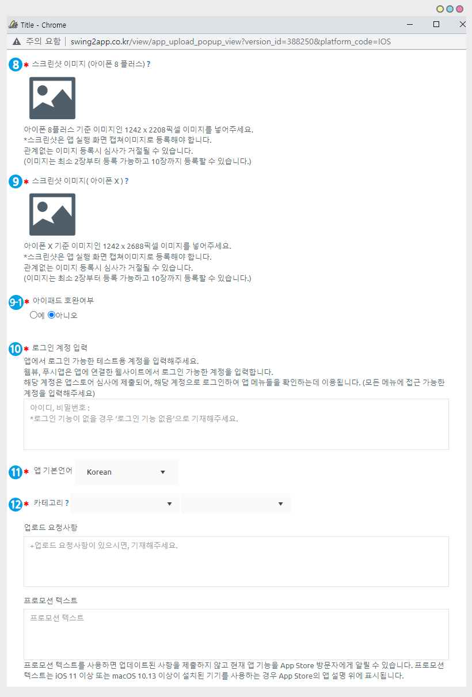

# 앱스토어 업로드 신청방법

<figure><figcaption></figcaption></figure>

**앱스토어 업로드 신청방법**

스윙투앱 앱제작 후 유료버전앱을 앱스토어에 출시하기 위해서 앱스토어 업로드 신청을 해주면 당사에서 대행에서 앱을 올려드려요.

<mark style="color:purple;">**Q. 앱스토어에 스윙투앱으로 제작한 앱을 올리고 싶으면 어떻게해야 하나요?**</mark>

​먼저, 유료앱 이용권 구매하셔서 유료전환을 해주시구요. 앱스토어 업로드티켓을 구매합니다.&#x20;

앱스토어는 사용자가 직접 등록이 불가하기 때문에 업로드티켓을 구매해서, 스윙투앱으로 업로드 신청을 해주셔야 합니다.&#x20;

[**앱운영페이지 → 결제 → 스윙 이용권, 티켓 구매 페이지**](http://www.swing2app.co.kr/view/shop\_list)에서 **스윙 유료이용권 결제와 함께 앱스토어 업로드 티켓(1회 20,000원)을 구매해주시면 됩니다.**

그러면, 앱이 마켓에 올라가겠구나… 라고 생각할 수 있지만 !

**결제만 했다고 앱이 앱이스토어에 출시되는 것이 아니에요.**

**\[앱스토어 업로드 신청]을 해주셔야만 담당자가 확인 후 해당 앱을 마켓에 등록해드릴 수 있습니다.**

****

<mark style="color:purple;">**Q. 업로드 신청은 어디서 어떻게 하는건가요?**</mark>

업로드 신청은 [**스윙 앱운영페이지 → 버전관리에 → 앱제작이력**](https://www.swing2app.co.kr/view/app\_work\_history) **페이지로 이동합니다.**

해당 페이지에서 \[앱스토어 업로드 신청]을 확인할 수 있습니다.

​해당 버튼을 누르면 신청 양식 창이 뜨구요.

**양식에 기재된 항목들을 입력 한 뒤 ‘신청’ 해주시면 해당 양식으로 담당자가 앱을 앱스토어에 올려드릴 수 있어요!**

****

<mark style="color:purple;">**Q. 업로드 신청하면, 앱이 바로 앱스토어 출시되나요?**</mark>

스윙투앱에서 대행해서 앱을 앱스토어에 업로드 진행해드리는데요.

바로 출시되는 것이 아니라 애플 앱 심사를 받게 됩니다.

**앱스토어 심사기간이 약 1주일\~2주이 소요됩니다.\*애플은 심사 기간이 긴 점 유념해주세요!**

**따라서 업로드를 한다고 해서 앱이 바로 출시되는 것이 아니구요.**

**심사 후 문제가 없으면 해당 심사 기간 후에 정상적으로 스토어에 출시가 됩니다.**

그러나 심사 거절이 될 경우도 있기 때문에 출시 되는 시간은 더 길어질 수 있습니다.

<mark style="color:purple;">**Q. 앱스토어도 구글처럼, 애플 개발자 계정을 만들어야 하나요?**</mark>

애플 개발자 계정은 선택사항입니다.

구글처럼 사용자분의 개발자 계정을 등록하셔도 되고, 없으실 경우 스윙투앱 계정으로 대리등록이 가능합니다.

\-직접 계정을 만들 경우 **애플에 개발자 등록비 1년 129,000원(1년마다 개발자 등록비 납부)**을 납부하셔야 합니다.

\-스윙투앱 계정 대리등록은 대리 등록에 대한 여러 주의사항이 있기 때문에 해당 내용을 반드시 확인하여 동의하신 뒤 진행해주시면 됩니다.

\*아래 매뉴얼 본문에 보시면 계정 등록에 대한 상세 내용 기재되어 있으니 확인해주세요.

★앱스토어 정책 및 출시 거절 사례에 관련된 스토어 이용약관을 반드시 확인해주시기 바랍니다.&#x20;



★앱스토어 심사에서 자주 거절되는 사례를 확인해주세요.&#x20;



★ 플레이스토어 업로드 신청방법은 해당 매뉴얼을 참고해주세요!!



**앱스토어 업로드 신청을 하기 위해서는!!**

먼저 앱을 다 제작한 뒤, <mark style="color:red;">앱을 유료버전으로 전환해주셔야 합니다.</mark>

<mark style="color:red;">\[결제 – 스윙 이용권,티켓 구매 페이지]에서 유료앱이용권과 앱스토어 업로드 티켓을 구매해야만! 앱스토어 업로드 신청이 가능합니다.</mark>

무료버전에서는 앱스토어업로드 티켓을 구매할 수 없고, 업로드 신청도 불가능합니다.

<figure><figcaption></figcaption></figure>

### <mark style="color:blue;"></mark> <mark style="color:blue;">****</mark> 1. 앱스토어 업로드 신청

스윙 유료앱 이용권, 앱스토어 업로드티켓을 모두 구매 완료하구요.

앱스토어 업로드티켓(1회 20,000원)은 [**\[업로드 티켓 구매페이지\]**](http://www.swing2app.co.kr/view/order\_info\_action?product\_id=3)에서 구매 가능합니다.&#x20;

**\*구매가 완료되었다면,** [**앱운영 페이지 → 버전관리 → 앱제작 이력 페이지**](http://www.swing2app.co.kr/view/app\_work\_history)**로 이동한 뒤 \[앱스토어 업로드 신청] 버튼을 눌러주세요.**

<figure><figcaption></figcaption></figure>

### <mark style="color:blue;"></mark> <mark style="color:blue;">****</mark> 2. 앱스토어 업로드 신청서 가이드

업로드 신청 버튼은 누르면, 업로드 신청서 팝업창이  뜹니다.  **** &#x20;

각 항목별로 내용을 입력해주시면 됩니다.&#x20;

<mark style="color:red;">**\* 빨간색**</mark>** 으로 표시된 항목은 필수 입력해주셔야 합니다.**&#x20;

<mark style="color:purple;">**? 물음표 아이콘**</mark>을 선택하면 가이드라인을 확인할 수 있어요!

해당 항목이 앱스토에서 어떻게 표시되는지 확인하여 기재해주세요.

<figure><figcaption></figcaption></figure>

### <mark style="color:blue;"></mark> <mark style="color:blue;">****</mark> 3. 앱스토어  업로드 신청서 작성방법

**업로드 신청서 작성 방법을 가이드라인을 통해서 설명해드리겠습니다.**

1\) 앱스토어 출시 앱 이름: 앱스토어에 출시되는 앱 이름을 기재해주세요.

<mark style="color:red;">\*제작한 앱 이름과 출시 앱이름을 다르게 기재하실 경우 앱스토어에는 출시이름으로 기재되며, 앱 다운로드를 하면 핸드폰에는 제작한 앱 이름으로 설치됩니다.</mark>

2\) 부제 : 앱 이름 아래에 표시되는 간단한 앱 소개 문구를 기재합니다. (30자 이내)

3\) 키워드 : 앱을 설명하는 키워드를 입력합니다.(100자 이내)

<mark style="color:red;">어떤 키워드를 넣는지에 따라서 검색 결과가 달라지기 때문에 잘 유념해서 입력해주시구요. 입력 가이드라인처럼< , > 로 구분해주세요.</mark>

4\) 자세한 설명: 앱을 설명하는 소개글을 작성합니다. <mark style="color:red;">\*최대한 자세히 입력해주세요 (소개가 제대로 안되어 있을시 심사가 거절되요)</mark>

5\) 업데이트 변경사항 : **기존의 앱에서 새로운 버전으로 업데이트 하는 경우 변경된 내용을 작성해주시면 됩니다.**

예) 앱이름 변경, UI 디자인 변경, 앱 버그 해결, 앱 디자인 변경, 앱 아이콘 변경….등으로 기재해주세요

<mark style="color:red;">**\*처음 앱스토어 업로드를 신청하는 분들은 ‘앱 신규 등록’ 이라고 기재해주시면 됩니다.**</mark>

**6)** 지원 URL : 운영 중인 홈페이지가 있다면 해당 URL을 입력합니다.

웹사이트가 없다면 \***스윙 홈페이지 URL** [**http://www.swing2app.co.kr/**](http://www.swing2app.co.kr/) **을 넣어주세요.**

**7) 개인정보 취급방침 : 개인정보 취급방침 URL(링크)를 입력합니다.**

개인정보 취급방침 URL은 기본 셋팅되어서 제공되나 이용정책 관련 내용은 고객님께서 직접 수정해서 사용하셔야 합니다.

개인정보 처리방침 등의 이용정책을 수정하기 위해서는 <mark style="color:purple;">**\[스윙 이용정책 수정하기]**</mark> 버튼을 눌러서 수정한 뒤, 저장해주시면 됩니다.

<mark style="color:orange;">\*사용자의 홈페이지를 그대로 앱에 적용해서 만든 푸시 or 웹뷰 버전 앱은 해당 홈페이지에서 제공하는 개인정보 처리방침 URL을 복사해서 붙여넣어주세요.</mark>

<figure><figcaption></figcaption></figure>

**8) 스크린샷 이미지 – 아이폰 8플러스 (1242X2208 픽셀 사이즈)**

**9) 스크린샷 이미지 – 아이폰 X (1242X2688 픽셀 사이즈)**


<mark style="color:blue;">스크린샷 이미지는 위의 사이즈에 맞게 이미지를 작업해서 넣어주셔야 합니다.</mark>

<mark style="color:blue;">애플은 스크린샷 이미지를 아이폰 2가지 버전으로 제출합니다.</mark>

<mark style="color:blue;">또한 앱과 관련없는 이미지를 넣을 수 없으며, 앱 실행화면을 캡쳐해야 합니다.</mark>

* 일반 프로토타입으로 앱을 제작한 분은 ‘아이폰 앱미리보기’에서 앱화면을 캡쳐해주세요.
* 웹뷰 or 푸시앱으로 제작한 분은 아이폰에서 앱 미리보기 지원이 안되요 <mark style="color:red;"></mark>&#x20;
* 아이폰에서 웹을 실행해서 캡쳐를 하거나 or 안드로이드폰으로 캡쳐한 뒤 포토샵 등을 이용하여 안드로이드 표시항목 제거 한 뒤 사이즈를 수정해주셔야 합니다.&#x20;


<mark style="color:red;"></mark>

아이폰 프레임에 맞게 이미지를 넣어주셔야 하는데요.

\*스크린샷 이미지가 적합하지 않을 경우, 앱스토어 담당자가 임의로 스크린샷 이미지 수정하여 다시 제출해드립니다.

**9-1)아이패드 호완여부 (선택사항)**

앱스토어에 아이패드용 앱 제출을 하실 경우 스크린샷 이미지를 제출해주세요.

선택사항이기 때문에 등록하지 않으실 경우 "아니오"로 체크해주시구요.

"예"로 체크할 경우 스크린샷 이미지 사이즈에 맞게 등록해주세요. \*아이패드에서 앱 실행한 화면으로 캡쳐해서 등록해주세요

\*아이패드 스크린샷 이미지 사이즈 (2048x2732 or 2732x2048)

<figure><figcaption></figcaption></figure>

10\)**로그인 계정 입력**: 앱에서 로그인 가능한 계정을 입력합니다.

앱에서 회원가입, 로그인 기능이 있을 경우 테스트 계정을 반드시 입력해주세요.

웹사이트를 연결한 웹앱(푸시, 웹뷰앱)은 해당 웹사이트에서 로그인 가능한 계정을 입력해주세요.

해당 계정은 실제 애플 연구원이 로그인하여 앱 내 메뉴를 확인하는 용도로 이용됩니다.

11\)**앱 기본언어**: 앱스토어 앱 출시 언어를 선택합니다. 해당 언어로 앱스토어에 출시가 됩니다.

\*영어로 출시한다면 모든 언어는 영어로 작성해주셔야 하며, 한글로 출시한다면 신청서의 모든 언어 한글로 기재해야 합니다.

12\)**카테고리**: 앱스토어에서 분류되는 카테고리 항목을 결정합니다. 앱의 성격에 맞는 카테고리를 선택해주세요.

**13)업로드 계정 설정**

<mark style="color:red;">**\*중요\***</mark>**앱스토어 업로드 계정을 선택해주세요.**&#x20;

<mark style="color:red;">\*애플 앱스토어는 스윙 개발자 계정을 이용하여 대리로 등록이 가능하거나, 사용자가 직접 애플 개발자 계정을 만들어서 본인의 개발자 계정으로도 등록할 수 있습니다.</mark>

<mark style="color:red;">→ 2가지 방법 중에서 한 가지를 선택해주세요.</mark>

<mark style="color:red;"></mark>

**(1)스윙 애플 앱스토어 개발자 계정 사용 -스윙투앱 계정으로 대리등록**

사용자분은 애플 개발자 계정을 만들지 않아도 되며, **‘Swing2App Co.Ltd.’스윙투앱 애플 계정으로 앱이 등록됩니다.**

**대리업로드 주의사항과, 스윙 계정으로 대리 등록이 되지 않는 경우**를 확인해주셔야 합니다.

내용 확인을 한 뒤 **“앱스토어 앱등록 이용정책에 동의해주시기 바랍니다”** 버튼을 선택해주세요.

**(2) 애플 앱스토어 개발자 계정 등록**

1. 사용자분의 애플 계정으로 올릴 경우, 애플 개발자 계정을 먼저 만들어주세요.
2. &#x20;[**\[애플 개발자 등록 사이트\]**](https://developer.apple.com/)에서 계정을 만든뒤, 개발자 이용료 **1년 129,000원**을 결제해주셔야 합니다.(애플 개발자 계정은 위의멤사이트에서 멤버십 등록을 해주야 합니다. 개인 애플 계정이 아니에요)
3. 계정 등록한 뒤 IOS 아이디, 비밀번호를 신청서에 기재해주시면 됩니다.



14\) **연락처(휴대폰번호)**

&#x20;담당자분의 핸드폰번호를 기재해주세요. 업로드 진행상황 안내, 계정 확인이 필요할 경우 연락드립니다.

15\) **앱스토어 앱등록 이용정책 동의**

해당 버튼을 눌러서 앱스토어 이용정책을 반드시 숙지한 뒤 **‘동의함’**에 체크해주세요.

16\) ** **<mark style="color:blue;">**\[신청하기]**</mark> 버튼을 누르면 앱스토어 업로드 신청이 완료됩니다.

반드시 업로드 이용정책을 확인해주세요!

주의사항을 확인하지 않아 발생되는 피해는 당사에서 책임지지 않습니다.

<figure><figcaption></figcaption></figure>

### <mark style="color:blue;"></mark> <mark style="color:blue;">****</mark> 4. 앱스토어 업로드 신청완료

**\*앱스토어 업로드 신청이 들어오면 스윙 마켓업로드 지원팀 담당자가 확인하여 앱스토어에 등록해드립니다.**

앱스토어 심사기간이 약 1주일\~2주이 소요됩니다. 심사기간이 긴 점을 분명히 숙지해주세요.

\* 업로드 신청은 업무 시간내 신청 주시면 당일 내 바로 진행해드리나, 주말 및 업무시간 외에 업로드 신청을 할 경우 당일 심사 불가하며 평일 업무시간에 순차적으로 진행됩니다.

따라서 업로드 신청시 반드시 해당 내용 유념해주세요\~^^

<figure><figcaption></figcaption></figure>


<mark style="color:orange;">**\[안내사항]**</mark>

1\. 앱스토어 업로드 티켓은 당사에서 앱을 대신 올려드리는 대행비이며, **앱스토어 업로드는 스윙투앱에서 대행으로만 등록이 가능합니다.**

(사용자가 직접 올릴 수 없습니다)

2\. 앱스토어 심사기간이 약 1주일\~2주이 소요됩니다. 심사기간이 긴 점을 분명히 숙지해주세요.

따라서 충분한 시간을 두시고 기다려주시기 바랍니다.

\*주말 및 업무시간 외에 업로드 신청을 할 경우 당일 심사 불가하며, 평일 업무시간에 순차적으로 진행되기 때문에 업로드 진행이 늦어질 수 있습니다.

3\. 앱스토어는 심사가 까다롭기 때문에 중간에 심사거절이 될 확률이 높습니다.

심사가 거절되면 거절사유와 함께 심사에 필요한 내용을 추가적으로 더 요청할 수도 있습니다.

\*사용자분은 조치사항에 대해서 당사로 메일 회신주셔야 재심사 진행이 가능하며, 일주일 내로 회신을 주지 않으면 업로드 건은 등록 보류로 처리됩니다. (등록 보류 건은 이후 다시 연락주시면 재심사 진행해드립니다)

4\. 업로드가 완료되면 앱스토어 등록 완료 메일, 카톡 알림톡을 보내드립니다. (번호가 없을시 이메일만 발송됩니다.)

5\. 대리 등록에 대한 위험, 약관을 정확히 확인하시어 불이익이 없도록 해주세요.

6\. 앱을 유료로 출시해야 할 경우 반드시 사용자분의 애플 개발자 계정을 만들어주셔야 합니다. (수익 정산 필요)

또한 애플은 유료앱 가격이 정해져 있기 때문에 가격을 어떻게 정할 것인지 업로드 신청 전 먼저 스윙투앱으로 연락주셔야 합니다.

\*앱스토어 업로드 대행은 해드리지만 유료앱 판매에 관련된 상담은 해드리지 않으니 참고해주세요.

7\. 업데이트 된 앱을 새로 앱스토어에 올려야 할 경우, 업로드 티켓을 재구매하여 업로드 신청을 다시 해주셔야 합니다.

8\. 애플 심사 중에도 유료앱 버전으로 심사가 들어가기 때문에, 앱 심사 기간 동안 이용하지 못한 이용일수에 대해서는 따로 일수를 추가해드리지 않습니다.

9\. 사용하지 않는 않은 티켓은 100% 환불 가능하지만, **업로드 신청으로 이미 사용을 했거나 심사가 거절되어 정상적으로 출시가 되지 않아도 이미 등록을 한 앱에 대해서는 티켓 환불이 어렵습니다.**

**10. 사용자분의 애플 개발자 계정을 만들어서 등록하실 경우, 애플 개발자 등록비는 매년(1년) 129,000원을 결제해주셔야 합니다.**

1년마다 갱신이 안될 경우 출시된 앱이 내려가거나, 계정이 삭제될 수 있습니다.


<mark style="color:red;">****</mark>

★앱스토어 정책 및 출시 거절 사례에 관련된 스토어 이용약관을 반드시 확인해주시기 바랍니다.&#x20;



