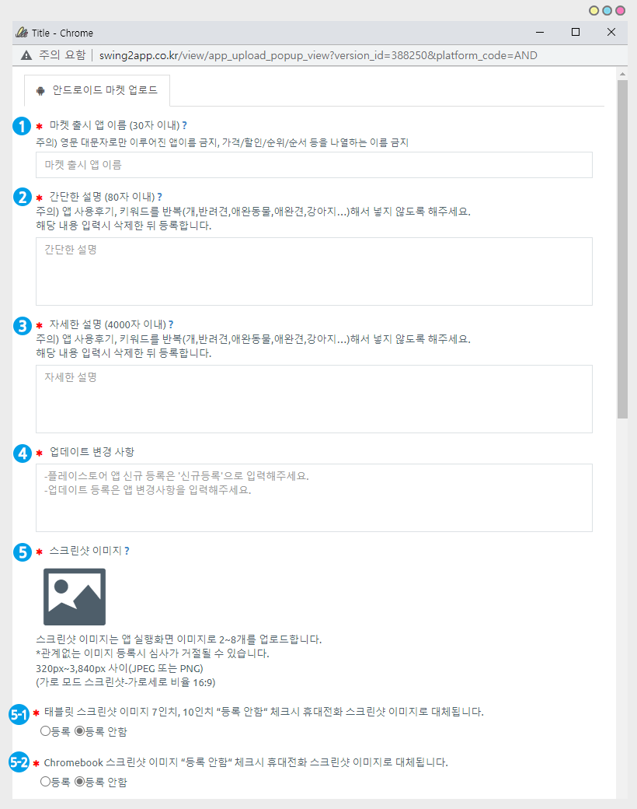
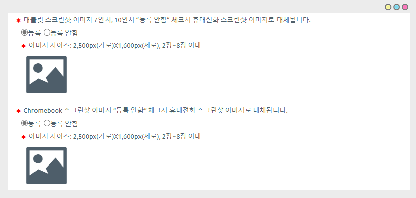
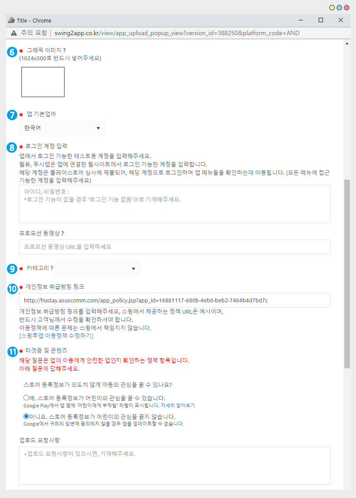

# 플레이스토어 업로드 신청방법

<figure><figcaption></figcaption></figure>

<mark style="color:blue;">**Q. 플레이스토어에 스윙으로 제작한 앱을 올리고 싶으면 어떻게해야 하나요?**</mark>

​먼저, 마켓에 앱이 올라갈 수 있도록 유료전환을 해주셔야 하는데요.

[앱운영페이지 → 결제 → 스윙 이용권, 티켓 구매 페이지](http://www.swing2app.co.kr/view/shop\_list)에서 **스윙 유료이용권 결제와 함께 플레이스토어 업로드 티켓을 구매해주시면 됩니다.**

그러면, 앱이 마켓에 올라가겠구나… 라고 생각할 수 있지만 !

**결제만 했다고 앱이 플레이스토어에 출시되는 것이 아니에요.**

**\[플레이스토어 업로드 신청]을 해주셔야만 담당자가 확인 후 해당 앱을 마켓에 등록해드릴 수 있습니다.**

<mark style="color:blue;">****</mark>

<mark style="color:blue;">**Q. 업로드 신청은 어디서 어떻게 하는건가요?**</mark>

업로드 신청은 [스윙 앱운영페이지 → 버전관리에 → 앱제작이력](http://www.swing2app.co.kr/view/app\_work\_history)으로 들어가구요.

해당 페이지에서 \[플레이스토어 업로드 신청]을 확인할 수 있습니다.

​해당 버튼을 누르면 신청 양식 창이 뜨구요.

**양식에 기재된 항목들을 입력 한 뒤  ‘신청’ 해주시면 해당 양식으로 담당자가 앱을 플레이스토어에 올려드릴 수 있어요!**

****

<mark style="color:blue;">**Q. 업로드 신청하면, 앱이 바로 플레이스토어 출시되나요?**</mark>

스윙투앱에서 대행해서 앱을 플레이스토어에 업로드 진행해드리는데요.

바로 출시되는 것이 아니라 구글 앱 심사를 받게 됩니다.

**구글 앱 심사는 최대 7일의 시간이 걸립니다. 따라서 업로드를 한다고 해서 앱이 바로 출시되는 것이 아니구요.**

**심사 후 문제가 없으면 해당 심사 기간 후에 정상적으로 스토어에 출시가 됩니다.**

그러나 심사 거절이 될 경우도 있기 때문에 출시 되는 시간은 더 길어질 수 있습니다.

<mark style="color:blue;">**Q. 플레이스토어는 업로드시 구글개발자 계정이 필요하다고 들었습니다.**</mark> &#x20;

<mark style="color:blue;">**구글 개발자 계정은 어떻게 만드나요?**</mark>

**\*플레이스토어 업로드를 신청하기전!!**  구글 개발자 계정이 있는지 확인해주세요.

<mark style="color:red;">\*중요\*플레이스토어는 사용자의 구글 개발자 계정이 있어야 등록이 가능합니다.</mark>

개발자 계정이 없으시면 [\[개발자 콘솔 사이트\]](https://play.google.com/apps/publish/)로 이용료 25$ 결제해서 만들어주세요.

☞[ \[구글 개발자 계정 만드는 법 보러가기\]](https://documentation.swing2app.co.kr/knowledgebase/playstore/google-developer)

★플레이스토어 정책 및 출시 거절 사례에 관련된 스토어 이용약관을 반드시 확인해주시기 바랍니다. <mark style="color:orange;">****</mark>&#x20;


[market-policy.md](../../../market-policy.md)


★ 앱스토어 업로드 신청방법은 해당 매뉴얼을 참고해주세요!!


[appstore-upload.md](appstore-upload.md)


<figure><figcaption></figcaption></figure>

### <mark style="color:blue;"></mark> <mark style="color:blue;">****</mark> 1. 플레이스토어 업로드 신청방법

스윙 유료앱 이용권, 플레이스토어 업로드티켓을 모두 구매 완료하구요.

플레이스토어 업로드티켓(1회 10,000원)은 [**\[이용권 티켓 구매페이지\]**](http://www.swing2app.co.kr/view/shop\_list)에서 구매 가능합니다.

\*구매가 완료되었다면, **** [**앱운영 페이지 → 버전관리 → 앱제작 이력 페이지**](http://www.swing2app.co.kr/view/app\_work\_history)로 이동한 뒤 \[플레이스토어 업로드 신청] 버튼을 눌러주세요.

<figure><figcaption></figcaption></figure>

### <mark style="color:blue;"></mark> **2. 플레이스토어 업로드 신청서**

업로드 신청 버튼은 누르면, 업로드 신청서 팝업창이  뜹니다.  **** &#x20;

항목들을 입력해주시면 되구요.

&#x20;** **<mark style="color:red;">**\* 빨간색**</mark> 으로 표시된 항목은 필수 입력해주셔야 합니다.

**‘ ? ’ 물음표** 아이콘을 선택하면 가이드라인을 확인할 수 있어요!

해당 항목이 플레이스토어에서 어떻게 표시되는지 확인하여 기재해주세요.

<figure><figcaption></figcaption></figure>

### <mark style="color:blue;"></mark> <mark style="color:blue;">****</mark> 3. 플레이스토어 업로드 신청서 작성방법

업로드 신청서 작성 방법을 가이드라인을 통해서 설명해드리겠습니다.&#x20;

<figure><figcaption></figcaption></figure>

**1) 마켓 출시 앱 이름**: 플레이스토어에 출시되는 앱 이름을 기재해주세요.(30자 이내)

<mark style="color:red;">\*제작한 앱 이름과 출시 앱이름을 다르게 기재하실 경우 플레이 스토어에는 출시이름으로 기재되며, 앱 다운로드를 하면 핸드폰에는 제작한 앱 이름으로 설치됩니다.</mark>&#x20;

<mark style="color:red;">주의) 영문 앱이름시 대문자로만 이루어진 이름 금지, 이름에 가격/할인/순서/ 순위 등을 나열하는 이름 금지</mark>

<mark style="color:red;">예시)no.1 앱제작 서비스 스윙투앱 → no.1 금지입니다.</mark>

**2) 간단한 설명:** 앱을 설명하는 소개글로, 간단하게 소개글을 입력해주세요. (80자 이내로 작성)

<mark style="color:red;">주의) 앱 사용후기, 키워드를 반복(개,반려견,애완동물,애완견,강아지…)해서 넣지 않도록 해주세요.</mark>

<mark style="color:red;">구글 정책사항이기 때문에 해당 내용 입력시 삭재한 뒤 등록합니다.</mark>

**3) 자세한 설명**: 앱에 대한 상세한 설명을 기재해주세요. (4000자 이내)

<mark style="color:red;">주의) 앱 사용후기, 키워드를 반복(개,반려견,애완동물,애완견,강아지…)해서 넣지 않도록 해주세요.</mark>

<mark style="color:red;">구글 정책사항이기 때문에 해당 내용 입력시 삭제한 뒤 등록합니다.</mark>

**4) 업데이트 변경사항:** 처음으로 앱을 등록하는 경우 ‘신규등록’ 으로 입력해주세요.

업데이트 신청은 변경된 사항을 입력해주세요.

**5) 스크린샷 이미지**: 앱 화면을 캡쳐한 이미지를 사이즈에 맞게 등록합니다.

<mark style="color:red;">스크린샷은 반드시 앱 실제 화면이 들어가야 하며, 관련 없는 이미지는 심사 거절됩니다. 신청서에 기재된 사이즈를 확인하셔서 작업해주세요.</mark>&#x20;

<mark style="color:red;">(관련 없는 이미지 등록시 업로드 담당자가 임의로 이미지 수정하여 등록합니다)</mark>

**5-1)태블릿 스크린샷 이미지 \*선택사항**

**5-2)Chromebook 스크린샷 이미지 \*선택사항**

태블릿과 크롬북 스크린샷 이미지는 필수 입력은 아니며, 선택사항입니다.

**"등록안함"으로 체크할 경우 5번에 제출한 휴대전화 스크린샷 이미지로 대체됩니다.**

제출하실 경우 "등록"을 체크해주세요.

<figure><figcaption></figcaption></figure>

"등록" 으로 체크시, 이미지를 등록할 수 있는 화면이 열리구요.

각 플랫폼별 사이즈에 맞춰 이미지를 등록해주세요.

<mark style="color:red;">스크린샷은 반드시 앱 실제 화면이 들어가야 하며, 관련 없는 이미지는 심사 거절됩니다.</mark>

<mark style="color:red;">(관련 없는 이미지 등록시 업로드 담당자가 임의로 이미지 수정하여 등록합니다)</mark>

<figure><figcaption></figcaption></figure>

**6) 그래픽 이미지**

그래픽이미지 노출 위치: **플레이스토어 스크린샷 이미지 앞에 "미리보기 동영상 표지 이미지"로 노출이 됩니다.**

이미지 참고)

<figure><figcaption></figcaption></figure>

프로모션 동영상 URL을 제출하였을 경우 맨 앞에 영상이 보여지는데, 그래픽 이미지가 영상의 표지 이미지로 사용이 됩니다.

프로모션 동영상 URL을 제출하지 않을 경우 표시될 영상이 없기 때문에 그래픽 이미지는 어디서도 노출이 되지 않습니다.&#x20;

그리고 게임 앱의 경우 미리보기 동영상 및 스크린샷을 포함하여 추천 게임 그룹을 크게 표시할 때 그래픽 이미지를 사용합니다.

**7) 앱 기본언어:** 플레이스토어에 보여질 언어를 선택합니다.

**8)로그인 계정 입력**

앱에서 로그 가능한 계정을 입력합니다.

앱에서 회원가입, 로그인 기능이 있을 경우 테스트 계정을 반드시 입력해주세요.

웹사이트를 연결한 웹앱(푸시, 웹뷰앱)은 해당 웹사이트에서 로그인 가능한 계정을 입력해주세요.

**9) 카테고리**: 플레이스토어에서 분류되는 카테고리 항목을 결정합니다. 앱의 성격에 맞는 카테고리를 선택해주세요.

**10)개인정보 취급방침 링크: 개인정보 취급방침 URL(링크)를 입력합니다.**

개인정보 취급방침 URL은 기본 셋팅되어서 제공되는데요. 이용정책 관련 내용은 고객님께서 직접 수정해서 사용하셔야 합니다.

개인정보 처리방침 등의 이용정책을 수정하기 위해서는 ** **<mark style="color:blue;">**\[스윙 이용정책 수정하기]​​**</mark> 버튼을 눌러서 수정한 뒤, 저장해주시면 됩니다.

<mark style="color:red;">\*사용자의 홈페이지를 그대로 앱에 적용해서 만든 푸시 or 웹뷰 버전 앱은 해당 홈페이지에서 제공하는 개인정보 처리방침 URL을 복사해서 붙여넣어주세요.</mark>

**11) 타켓층 및 콘텐츠**

**아동보호 구글의 정책에 따라 체크하는 항목이구요.앱이 아동에게 안전한 앱인지를 확인합니다.**

사용자분의 앱이 어린이의 관심을 끄는 입인지, 어린이에게 관심을 끌지 않는 앱인지를 선택해주세요.

최종 판단은 구글 심사에서 이루어지기 때문에 사용자가 체크한 답변이 맞지 않는 경우 심사가 거절될 수도 있습니다.

**12) 업로드 계정 설정 – “나의 구글 개발자 계정에 스윙 계정 초대하기”**&#x20;

개발자 계정 초대방법을 확인하셔서 사용자분의 계정에 스윙투앱 계정을 초대해주세요.

계정 이메일주소, 개발자 이름을 입력해주시면 초대하신 계정으로 앱 등록을 진행해드립니다.&#x20;

\*플레이스토어 앱 등록을 위해서는 먼저 [**\[구글개발자 콘솔 사이트\]**](https://play.google.com/console/developers)에서 개발자 등록을 해주셔야 합니다.

**구글에 등록비 25$(평생이용료) 결제 후 사용가능합니다.**


<mark style="color:orange;">구글 개발자 계정 초대 상세 방법은 아래 매뉴얼을 참고해주세요.</mark>&#x20;

**☞** [**\[플레이스토어 구글 개발자 계정 초대하는 방법\]**](https://documentation.swing2app.co.kr/knowledgebase/playstore/google-developer-invitation)****


개발자 초대를 해주셔야 사용자분의 계정 대시보드 접근이 가능하며, 앱 등록 작업을 해드릴 수 있습니다.

구글 개발자 콘솔사이트에서 스윙의 개발자 계정(swingapp.developer@gmail.com)을 초대해주시면, 초대 수락 후 고객님의 계정으로 앱을 등록해드릴 수 있습니다.

**13) 연락처(휴대폰 번호):** 업로드 진행상황 안내 문자메시지가 발송됩니다.&#x20;

**14)웹뷰, 푸시앱 사용자 대상 추가 서류 안내 (푸시앱, 웹뷰앱 제출 사용자 대상입니다)**

웹사이트를 연결한 웹앱- 웹뷰, 푸시로 앱을 제작한 분들은 플레이스토어에 웹사이트 소유주 확인을 진행해야 합니다.

웹 도메인 등록 확인서, 사업자등록증을 메일로 따로 보내주시기 바랍니다.

**15) 스윙투앱 스토어 출시 및 마케팅 정보 활용 동의(선택사항)**

**** ** **<mark style="color:blue;">**마케팅 정보 활용 약관이란?**</mark>

업로드 신청서에 보시면\[마케팅 정보 활용 약관 보기] 버튼이 있습니다.

해당 버튼을 선택해서, 내용을 확인해주세요.

\-‘동의’ 하실 경우 스윙투앱의 마케팅 채널에 사용자 분의 앱이 소개되며, 스윙스토어 출시가 되구요.

감사의 의미로 무료 플레이스토어 업로드 티켓이 제공됩니다.

\-마케팅 채널에 소개되는 것을 원치 않으면 ‘동의안함’에 체크해주시면 됩니다.

\* 이용권만 구매한 뒤 플레이스토어 업로드티켓을 구매하지 않으셔도, 이벤트 참여해주시면 무료로 플레이스토어 업로드를 이용할 수 있습니다.

<mark style="color:red;">**★ 주의**</mark>

마케팅 정보 활용에 동의하였는데, 이후에 마케팅 동의를 철회하신다면

**“이벤트시 제공된 쿠폰은 향후 스윙스토어 출시 및 마케팅 동의를 철회할 경우 이벤트에 제공된 상품의 비용을 지불해야 합니다.”**

**정책처럼 마케팅을 철회할 경우 제공해드린 상품을 다시 회수하게 됩니다.**

꼭 확인 부탁드립니다\~!

만약 **무료로 제공된 플레이스토어 업로드 티켓을 이미 사용하셨다면 그에 따른 비용(티켓비용:10,000원)을 지불하셔야 합니다.**

반드시 해당 내용 확인하셔서 진행해주시기 바랍니다. \~!

​

**16) 입력이 완료되면 \[신청하기] 버튼을 눌러주세요.**

<figure><figcaption></figcaption></figure>

###  <mark style="color:blue;">****</mark> 4. 업로드 신청완료

플레이스토어 업로드 신청 모든 과정이 끝났구요.

업로드 신청이 들어오면 당사 마켓업로드팀에서, 신청서 내용을 바탕으로 사용자의 플레이스토어 계정으로 앱을 등록해드립니다.

플레이스토어는 업로드 진행 후 바로 앱이 출시되는 것이 아니라 심사 시간이 있습니다.

**최소  7일 심사 기간이 있기 때문에 여유 있게 신청해주세요!**

\* 업로드 신청은 업무 시간내 신청 주시면 당일 내 바로 진행해드리나, 주말 및 업무시간 외에 업로드 신청을 할 경우 당일 심사 불가하며 평일 업무시간에 순차적으로 진행됩니다.

띠라서 업로드 신청시 반드시 해당 내용 유념해주세요\~^^

***

<figure><figcaption></figcaption></figure>

###  <mark style="color:blue;"></mark> 5. 안내사항

**1) 업로드 티켓 10,000원은 1회 비용입니다.**

출시된 앱을 업데이트해서 다시 올리거나 스토어의 앱설명, 스크린샷 이미지를 수정하실 경우 업로드 티켓 구매 후 업로드 재신청해주셔야 합니다.

\*업데이트도 심사 시간이 있으며, 앱 업데이트는 1일\~3일 정도 소요됩니다.&#x20;

**2) 구글 플레이스토어는 업로드 티켓을 구매하지 않아도, 사용자가 직접 구글 콘솔사이트로 접속하여 자유롭게 수정이 가능합니다.**

(사용자 구글 개발자 계정이기 때문에 직접 등록 가능)&#x20;

3\) 플레이스토어 심사기간은 **최대 7일이 소요**됩니다. 심사에서 문제가 없으면 해당 심사 기간 후 출시됩니다.

\-주말 및 업무시간 외에 업로드 신청을 할 경우 당일 심사 불가하며, 평일 업무시간에 순차적으로 진행됩니다.

업로드 심사 거절시, 심사거절 및 조치사항을 메일로 보내드립니다. \*재심사는 비용추가 없이 진행해드립니다.

\-메일을 받으면 조치사항에 대해서 회신주셔야 재심사를 진행해드리며, 일주일 내로 회신을 주지 않으면 업로드건은 등록 보류로 처리됩니다. (등록 보류건은 이후 다시 연락주시면 재심사 진행해드립니다)

4\) 플레이스토어 업로드 신청 전 반드시 사용자 분의 구글 개발자 계정을 미리 만들어주셔야 합니다.

(구글 개발자 등록 수수료 25달러 있습니다.)   [**\[구글 개발자 계정 콘솔\]**](https://play.google.com/apps/publish/)****

5\)구글 개발자 계정을 스윙에서 대리로 결제해드리지 않으며, 반드시 사용자분의 개별 계정으로만 이용이 가능합니다.

6\) 플레이스토어 앱 배포시 유료로 배포하는 경우 플레이스토어 업로드 대행해드리지 않습니다. (유료앱 출시 대행 불가)

스윙투앱 업로드 대행은 무료앱만 한해 출시 대행 진행해드리고 있습니다.

7\)사용하지 않는 않은 티켓은 100% 환불 가능하지만, **업로드 신청으로 이미 사용을 했거나 심사가 거절되어 정상적으로 출시가 되지 않아도 이미 등록을 한 앱에 대해서는 티켓 환불이 어렵습니다.**

**8) 플레이스토어는 앱이 정상 출시되어도, 앱 이름 검색 노출이 바로 되지 않습니다.**

무분별한 앱출시를 막기 위해 구글에서는 출시된 앱의 활성화 정도(앱설치수)를 파악한 뒤 검색 노출로 전환하고 있습니다.

따라서 앱이름으로 검색이 안되어도 문제가 있는 것은 아니고, 시간을 가지고 기다려주시기 바랍니다. (최대한 앱을 많이 설치받고 리뷰,평점 등도 남겨주세요)

★플레이스토어 정책 및 출시 거절 사례에 관련된 스토어 이용약관을 반드시 확인해주시기 바랍니다. <mark style="color:orange;">****</mark>&#x20;

**☞** [**\[스토어 이용약관 확인하기\]**](https://documentation.swing2app.co.kr/market-policy)****

