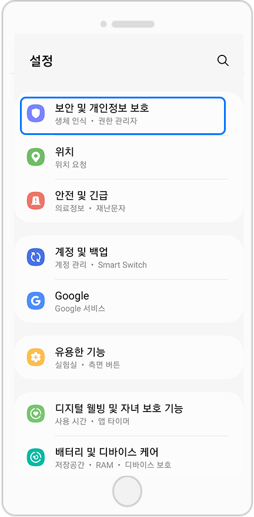
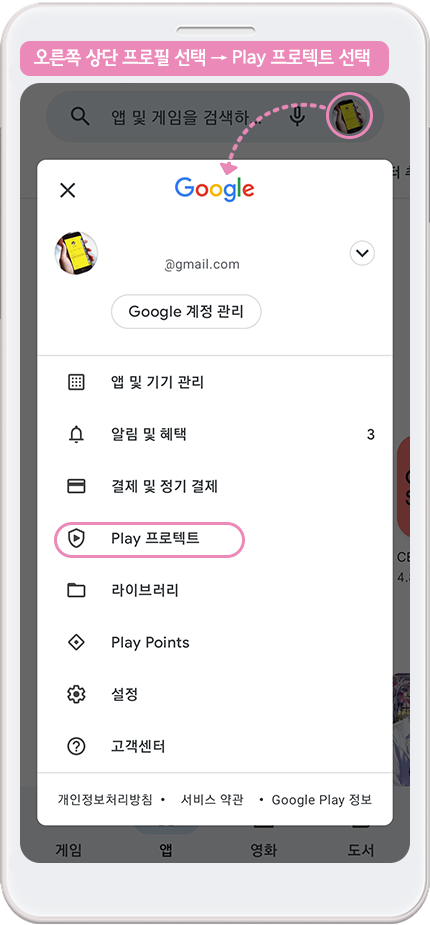
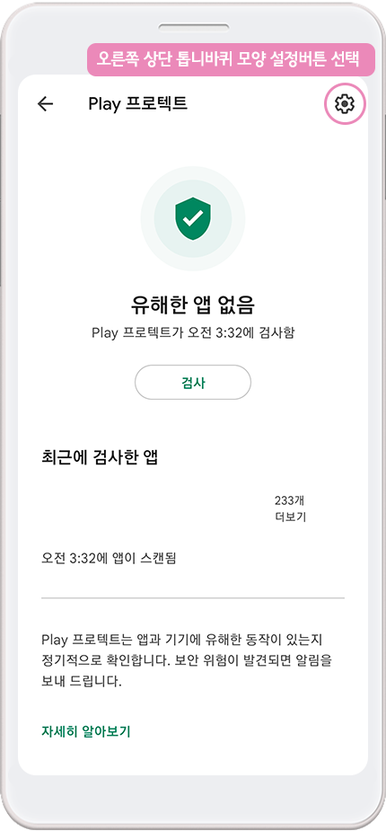
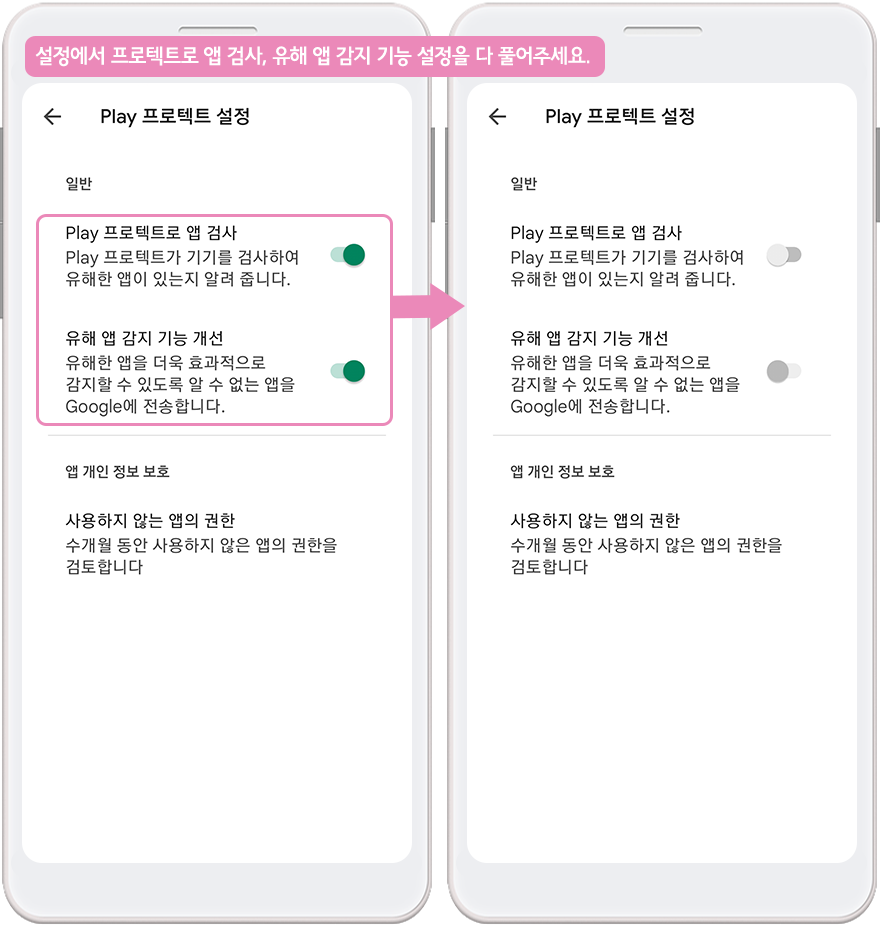
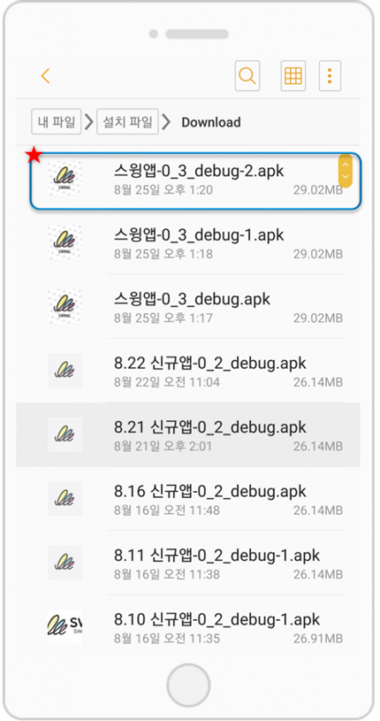
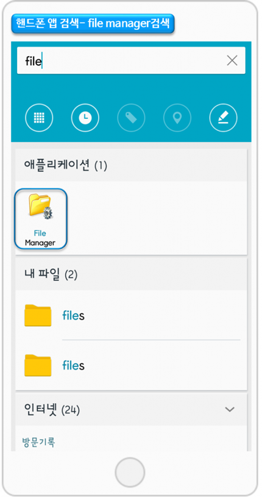

# 무료버전앱(APK파일) 설치가 안된다면 확인해주세요!

<figure><figcaption></figcaption></figure>

스윙투앱에서 제작한 무료버전앱은 안드로이드폰에 직접 설치하여 확인할 수 있도록, APK파일을 제공하고 있습니다.&#x20;

\*아이폰에서는 무료버전앱 다운이 안되며, 안드로이드폰에서만 가능해요

> <mark style="color:blue;">**\[안드로이드폰 무료버전 APK파일을 설치하는 방법]**</mark>
>
> 1\)앱 제작완료 후 사용자의 이메일로 APK파일이 발송, 해당 파일을 핸드폰에서 직접 다운받아 사용
>
> 2\)스윙 미리보기 어플을 이용하여 앱 다운로드
>
> **☞** [**설치방법 상세보기**](https://documentation.swing2app.co.kr/manual/appoperation/appinstall)****

그런데 앱 설치 방법대로 진행을 해도, 앱을 설치하는 과정에서 오류가 나거나 앱이 제대로 설치되지 않는다는 분들도 있어요.

오류가 나는 이유는 안드로이드폰마다 버전이 다르기 때문에 폰마다 설정되어 있는 보안이 달라서 생기는 문제입니다.

안드로이드폰의 공식 스토어인 구글플레이스토어, 원스토어 등을 거치지 않고 외부에서 앱을 다운 받으면 잘못된 경로로 인식하여 앱에서 설치가 되는 것을 막는 것이죠.

따라서 스윙에서 제작한 무료버전앱이 이렇게 설치가 잘 안된다면! 아래에 알려드리는 방법을 참고해서 설치를 해보시길 바랍니다.

**스윙에서 제작한 무료 버전앱이 안드로이드폰에 제대로 설치가 안된다면 해당 매뉴얼을 확인해주세요!**

<figure><figcaption></figcaption></figure>

##  **** 1. 안드로이드폰 \[설정] 메뉴에서 보안항목 체크하기

&#x20;**** 먼저 안드로이드폰 \[설정]에서 보안 항목들을 모두 체크해주세요!

<figure><figcaption></figcaption></figure>

\[설정] 메뉴 → 보안 및 개인정보 보호 메뉴로 이동합니다.

<mark style="color:red;">\*안드로이드폰 기종, 버전마다 메뉴는 조금씩 달라요! 동일한 메뉴가 없다면 설정 메뉴에서 ‘</mark><mark style="color:red;">**보안’**</mark> <mark style="color:red;"></mark><mark style="color:red;">관련 메뉴로 들어가주세요</mark>

### <mark style="color:blue;">**1) 출처를 알 수 없는 앱 설정 해제**</mark>

출처를 알 수 없는 앱 설치 “예”에 체크 합니다.

혹은 구글 플레이스토어가 아닌 다른 곳에서의 앱 설치를 허용합니다 에 체크 해주시면 됩니다.

### <mark style="color:blue;">**2) 구글 플레이 프로텍트 해제**</mark>

**Google Play 프로텍트 메뉴로 들어가주세요.**

Play 프로텍트에 체크되어 있는 항목을 모두 풀어주세요.

“기기에 보안 위협이 있는지 검색” , “유해한 앱을 감지하는 기능 보완” 2가지 항목에 체크를 풀어서 완료해주시면 됩니다.

<mark style="color:red;">그런데 만약 제 폰 설정 메뉴에는 ‘출처를 알 수 없는 앱 설치’ 메뉴 만 있고 구글 플레이 프로텍트 관련 메뉴는 없어요\~!</mark>

하시는 사용자분들은 플레이스토어 어플을 실행한 뒤 들어가서 체크해주시면 됩니다.

**플레이스토어 어플에 들어가서 직접 구글 프로텍트 보안 설정을 해제해주시면 됩니다.**

<figure><figcaption></figcaption></figure>

<figure><figcaption></figcaption></figure>

<figure><figcaption></figcaption></figure>

<mark style="color:red;">위의 방법대로 보안을 다 풀어주셨는데도! 앱 설치가 안되면 아래 방법으로 확인해주세요.</mark>

안드로이드는 버전마다 조금씩 다르지만 핸드폰에서 사용하는 모든 파일을 관리할 수 있는 앱이 설치되어 있습니다.

따라서 해당 파일관리 앱을 열어서 스윙에서 제작한 APK파일을 찾고, 수동으로 앱을 설치 할 수 있습니다.

<mark style="color:red;">**★ 모든 안드로이드폰에 내장된 앱- 파일관리자 or 파일매니저 or 내파일 앱을 열어서 실행할 수 있습니다.**</mark>

<figure><figcaption></figcaption></figure>

##  **** 2. 안드로이드폰에서 앱검색 \[내 파일]

**최신버전의 안드로이드 폰에서는 \[내파일]이 검색이 될 것입니다.**

<figure><figcaption></figcaption></figure>

\[내파일] 앱을 선택해주세요.

설치파일(APK)을 선택한 뒤, Download 메뉴를 선택해주세요.

<figure><figcaption></figcaption></figure>

해당 메뉴에서 마찬가지로 설치가 완료되지 못한 APK파일을 확인할 수 있습니다.

재설치를 할 APK를 선택하면 자동으로 해당 APK파일이 앱으로 설치됩니다.

<figure><figcaption></figcaption></figure>

##  **** 3. 안드로이드폰에서 앱검색 \[file manager]

<figure><figcaption></figcaption></figure>

안드로이드폰 버전이 조금 이전 버전이라면 핸드폰에서 \[file manager] 앱을 실행해주세요.

**해당 앱에서 \[사용된 APK파일] 메뉴를 선택해주세요.**

사용된 APK파일 메뉴에 보시면, 이미 핸드폰에 APK파일이 다운이 되었지만 설치가 되지 못한 앱 목록을 확인할 수 있어요.

여기서 재설치를 할 APK를 선택하면 자동으로 해당 APK파일이 앱으로 설치됩니다.

스토어에 출시하지 않은 유료버전 앱 설치가 안될 경우는 아래 매뉴얼을 참고해주시기 바랍니다.

&#x20;유료버전앱 설치가 안된다면 확인해주세요!

***

<mark style="color:red;">****</mark>

<mark style="color:red;">****</mark>

