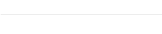

# 쇼핑몰 앱 홈화면 구성방법

쇼핑몰 앱에 구성할 수 있는 앱 홈화면 스타일을 알려드립니다.&#x20;

스윙샵을 이용하시는 분들은 아래 매뉴얼을 참고해주셔서 앱 화면을 구성해주세요.

스윙샵 이용시 기본으 제공되는 쇼핑몰 페이지로 적용 하셔도 되고, 사용자 페이지를 이용해서 다양한 방법으로 응용하실 수 있습니다.&#x20;

.PNG>)

### **1. 쇼핑몰 메인 페이지 적용**

\*쇼핑몰 메인 페이지는 가장 기본적인 쇼핑몰 디자인 UI이며, 많은 사용자들이 스윙샵 앱제작시 이용하고 있습니다.

쇼핑몰 메인 페이지 스타일과, 앱 홈화면에 적용하는 방법을 알려드릴게요.

쇼핑몰 메인 페이지를 적용한 스윙샵 앱 메인 홈화면입니다.

기본적인 쇼핑몰 UI로 제공되구요.

<mark style="color:red;">\*\* 스윙샵- 상점관리에서 등록한 기본정보, 상품관리에서 등록한 상품이 메인 페이지로 구성됩니다.</mark>

<mark style="color:red;">따라서 상점관리에서 기본 정보를 등록하고, 상품을 등록해야만 메인페이지가 완벽히 보여질 수 있습니다.</mark>

<mark style="color:blue;">****</mark>**쇼핑몰 메인 페이지 – 앱 홈화면에 적용하는 방법**

앱제작 → 페이지 메뉴 이동

1\)홈화면 선택

2\)메뉴명 입력 (상단에 노출)

3\)스윙페이지 선택

4\)링크마법사 버튼 선택

5\)’쇼핑몰 메인’ 선택 후 \[적용]버튼 선택

6\)\[적용]버튼 선택

7\) \[저장]버튼 앱 적용 완료됩니다.&#x20;

.PNG>)

### **2. 쇼핑몰 정보 페이지 적용**

\*쇼핑몰 정보 페이지는 상점의 정보: 운영시간, 상점 소개말, 아이콘 이미지, 공유하기/전화 걸기 등의 아이콘 배너가 보여지는 페이지입니다.

쇼핑몰 정보 페이지 스타일과, 앱 홈화면에 적용하는 방법을 알려드릴게요.

쇼핑몰 정보 페이지를 적용한 스윙샵 앱 메인 홈화면입니다.

<mark style="color:red;">\*\*쇼핑몰 정보페이지는 스윙샵 – 상점관리에서 등록한 기본정보가 보여지게 됩니다.</mark>

<mark style="color:red;">따라서 상점관리에서 기본정보를 등록하고, 이후 수정도 해당 메뉴에서 작업해주시면 됩니다.</mark>

**쇼핑몰 정보 페이지 – 앱 홈화면에 적용하는 방법**

앱제작 → 페이지 메뉴 이동

(1)홈화면 선택

(2)메뉴명 입력 (상단에 노출)

(3)스윙페이지 선택

(4)링크마법사 버튼 선택

(5)’쇼핑몰 정보’ 선택 후 \[적용]버튼 선택

(6)\[적용]버튼 선택

(7)\[저장]버튼 앱 적용 완료됩니다.&#x20;

.PNG>)

### **3. 사용자 페이지 이용하기**

**만약 위에서 알려드린 스윙샵 페이지 – 쇼핑몰 메인 페이지, 쇼핑몰 정보 페이지가 마음에 들지 않는다면??**

**당연히!! 홈화면은 다른 페이지로 응용해서 제작할 수 있답니다. \~!!**

스윙투앱에서 제공하는 사용자페이지 제작도구를 이용하신다면 원하는 스타일에 맞게 작업하실 수 있는데요.

사용자페이지에서는 링크마법사 기능(웹링크, 앱 메뉴 연동 등)을 제공하기 때문에 스윙샵에서 만들어놓은 메뉴로도 연동할 수 있어요.

샘플앱을 통해서 제작방법을 알려드릴게요!

<mark style="color:blue;">**1)템플릿 페이지 이용하기**</mark>

먼저 웹템플릿 페이지를 이용해서, 스윙샵에서 등록한 상품을 각 배너(버튼)마다 연동하는 방법을 알려드릴게요.

웹템플릿은 스윙에서 제공하는 사용자페이지로 다양한 업종별 디자인 템플릿을 제공하는데요.

디자인이 다 입혀져서 제공이 되기 때문에 사용자는 텍스트, 이미지, 링크만 변경해서 사용할 수 있어요.

**호텔 샘플앱에서는 웹템플릿을 홈화면 메인으로 걸고, 해당 버튼마다 예약하기 링크를 적용해서 예약상품을 구매할 수 있도록 했어요.**

**웹 템플릿 페이지-스윙샵 상품을 넣어서 제작하는 방법**

**앱제작 페이지에- 페이지 메뉴- 사용자 페이지 불러오기 선택 후 ‘웹 템플릿 기반 페이지 추가’를 선택해주세요.**

**웹 템플릿 페이지 제작도구 창이 열리면, 아래 방법대로 진행해주세요.**

1\)하단 \[새로 만들기] 버튼을 눌러주세요.

2\) 페이지 타입 선택: 호텔로 선택했구요. 다양한 업종 템플릿을 제공하오니 디자인별로 원하는 스타일로 선택해주세요.

3\) 리스트 페이지 선택 \*저는 리스트 페이지로 제작했는데요. 페이지 선택은 사용자분들께서 원하시는 스타일로 선택해주세요!

4\) 추가 버튼을 눌러주세요.

5\) 템플릿에서 링크를 적용할 버튼을 선택합니다.

6\)\[링크마법사] 버튼을 선택해주세요.

7\)링크마법사 창에서 \[스윙 기능] 을 선택하구요.

**\*판매하는 상품을 바로 연결한다면 – 상품을 선택한 뒤 상품 이름 검색하여 링크 적용하구요.**

**\*상품 카테고리를 선택하여 카테고리 자체를 연결할 수도 있습니다.**

8\)예약상품 예약하기 메뉴를 선택한 뒤

**\*샘플에서 보여드린 앱은 호텔앱으로 예약 상품을 판매하는 쇼핑몰이라서 예약상품예약하기를 선택했구요.**

**스윙샵 상품 유형에 따라서 -디지털 상품 구매하기를 선택할 수 있고, 판매되는 상품을 바로 연결할 수 있습니다.**

9\)\[반영]버튼을 누르면, 버튼에 해당 링크가 적용됩니다.

<mark style="color:red;">\*사용자페이지에서 제공하는 \[링크 마법사] 버튼을 선택하면 스윙샵 운영과 관련된 모든 메뉴들을 적용할 수 있어요.</mark>

<mark style="color:red;">스윙 기능, 상품, 상품 카테고리를 적용하면, 앱에서 버튼을 누르면 해당 링크로 이동됩니다.</mark>

<mark style="color:red;"></mark>

**템플릿 페이지 – 앱 홈화면에 적용하는 방법**

템플릿을 제작했으니, 만든 템플릿을 앱에 적용해야 하겠죠?

앱제작 → 페이지 메뉴 이동

(1)\[홈 화면]메뉴를 마우스로 클릭합니다.

(2)메뉴명: 홈화면 상단에 보여질 이름을 입력합니다.

(3)메뉴 유형에서 \[사용자 페이지]메뉴를 선택합니다.

(4) \[링크마법사] 버튼을 눌러주세요.

(5)링크 마법사 창에서 \[페이지 템플릿] 메뉴 선택

(6)홈화면에 적용할 템플릿 페이지 선택 후 \[반영] 버튼 선택

만들어놓은 페이지가 안보인다면, 새로고침을 한 번 해주세요!

(7)페이지 하단의 \[적용] 버튼을 누르고

(8)\[저장] 버튼을 누르면 완료됩니다.&#x20;

​

<mark style="color:red;">**★응용 TIP**</mark>

다른 스타일의 웹템플릿으로도 예약상품 페이지를 구성할 수 있어요.

다른 업종 템플릿의 \[정보 페이지]를 사용했구요.

이미지와 텍스트를 수정한 뒤 하단 버튼에 – 예약하기 링크를 생성해서 해당 버튼을 선택하면 예약하기 링크로 이동합니다.

이렇게 다양한 웹템플릿 디자인을 이용해서 쇼핑몰 화면을 구성할 수 있어요!

<mark style="color:blue;">**2)이미지 페이지 이용하기**</mark>

두 번째는 이미지 페이지를 이용해서, 스윙샵에서 등록한 상품을 각 배너(버튼)마다 연동하는 방법을 알려드릴게요.

이미지 페이지 역시 스윙에서 제공하는 사용자페이지로, 이미지 위에 배너를 설정하여 링크를 연결할 수 있는 기능이에요.

사용자가 직접 이미지를 만들기 때문에 툴(tool)대로만 사용하는 것이 불편하다면 자유롭게 이미지를 이용해서 구성할 수 있습니다.

**학원 샘플앱에서는 이미지 페이지를 홈화면 메인으로 걸고, 해당 배너마다 상품을 적용해서 구매할 수 있도록 했어요.**

**이미지 페이지-스윙샵 상품을 넣어서 제작하는 방법**

**앱제작 페이지에- 페이지 메뉴- 사용자 페이지 불러오기 선택 후 ‘이미지 기반 페이지 추가’를 선택해주세요.**

**이미지 페이지 제작도구 창이 열리면, 아래 방법대로 진행해주세요.**

(1)상단 \[새로 만들기] 버튼을 눌러주세요. \*만들어놓은 이미지를 첨부해주세요.

(2) 왼쪽의 툴 모양 버튼을 이용해서, 배너를 적용할 부분에 영역을 만들어주세요

\*구매하기를 눌렀을 때 상품 구매 페이지로 넘어갈 수 있게 해당 영역만 블록을 잡았어요.

(3)오른쪽 링크 액션에서 \[링크 마법사] 버튼을 선택합니다.

(4)링크 마법사 창에서 \[상품]을 선택합니다.

(5) 상품 검색에, 해당 페이지에서 보여질 상품 이름을 입력해주세요.

\*스윙샵 상품등록에서 상품을 등록해야만, 해당 메뉴에서 상품이 검색됩니다.

따라서 스윙샵 – 상품관리에서 상품 등록이 모두 완료된 후 적용해주세요.

(6)\[반영] 버튼을 눌러주세요.

(7) 상단 \[저장] 버튼을 누르면, 이미지페이지 제작이 완료됩니다.

**이미지 페이지 – 앱 홈화면에 적용하는 방법**

이미지 페이지를 제작했으니, 만든 페이지를 앱에 적용해야 하겠죠?

앱제작 → 페이지 메뉴 이동

(1)\[홈 화면]메뉴를 마우스로 클릭합니다.&#x20;

2\)메뉴명은 변경 하지 않아도 됩니다.&#x20;

\*중요\* 이미지 페이지는 이미지 페이지 제작도구에서 저장한 이름으로 홈화면 상단에 표시됩니다.

3\)메뉴 유형에서 \[사용자 페이지]메뉴를 선택합니다.

4\)연필 모양 아이콘 \[불러오기] 버튼을 눌러주세요.

5\)링크 마법사 창에서 \[이미지맵] 메뉴 선택

6\)홈화면에 적용할 이미지 페이지 선택 후 \[반영] 버튼 선택

만들어놓은 페이지가 안보인다면, 새로고침을 한 번 해주세요!

(7)페이지 하단의 \[적용] 버튼을 누르고

(8)\[저장] 버튼을 누르면 완료

<mark style="color:red;">\*이미지페이지는 페이지 제작도구에서 입력한 ‘페이지 이름’이 홈화면 이름으로 적용됩니다.</mark>

***

이상으로 스윙샵 쇼핑몰 앱에 구성할 수 있는 앱 홈화면 스타일을 알려드렸어요.

스윙샵을 이용하시는 분들은 위의 매뉴얼을 참고해주셔서 앱 화면을 구성해주세요.

기본 제공되는 쇼핑몰 페이지로 적용하셔도 되구요.

사용자페이지를 이용해서 다양한 방법으로 응용하실 수 있습니다. ^^
