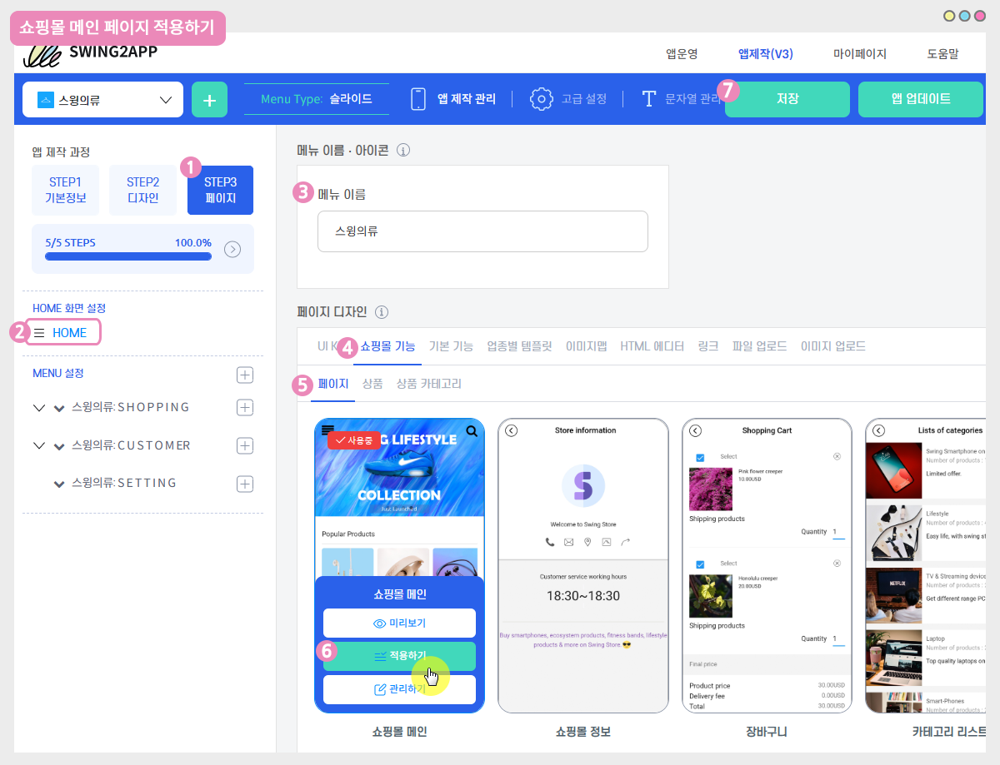
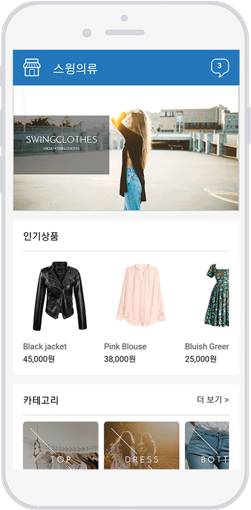

# 스윙샵-쇼핑몰 메인페이지 이미지 슬라이드

스윙샵 신청후 쇼핑몰 메인 페이지를 앱 홈화면에 적용할 수 있구요.

이때 상점관리에서 – 상점 상세 이미지를 여러 장 등록하면 자동으로 슬라이딩 되어서 보여집니다.

<figure><figcaption></figcaption></figure>

**앱 실행화면 - 상단 이미지 슬라이딩 효과**

<mark style="color:red;">**★이용방법**</mark>

1\)쇼핑몰 메인페이지 제작: [앱운영페이지 → 스윙샵 \[상점관리\] → 기본정보설정](http://www.swing2app.co.kr/view/store\_info\_basic\_setting) → 상점 상세 이미지에서 이미지 등록 → 저장

2\)앱 적용: 앱제작 페이지 → 페이지메뉴 → 홈화면 → 스윙 페이지 → 쇼핑몰메인 페이지 적용후 저장&#x20;

 (1).PNG>)

##  **1. 스윙샵 기본정보설정**

앱운영 페이지 - 스윙샵 메뉴에서&#x20;

**1)스윙샵 - 상점관리**

**2)\[기본정보설정] 메뉴로 이동합니다.** &#x20;

> <mark style="color:red;">\*스윙샵 메뉴를 이용하기 위해서는 먼저 스윙샵 서비스를 신청해야 합니다.</mark>
>
> 앱운영페이지 - 내메뉴에 보시면 스윙샵(쇼핑몰)신청 메뉴가 있습니다.&#x20;
>
> 간단한 정보만 넣어서 신청 버튼을 누르면 바로 스윙샵 메뉴가 생성이 됩니다.

**3) 상점 상세 이미지에서 슬라이드로 보여질 이미지를 첨부해주세요.**

**(메인 이미지 작업 사이즈는 가로 1000px , 세로 545px 사이즈 입니다.)**

**4)저장 버튼을 누르면 완료됩니다.**

<mark style="color:red;">\*만약 상점 상세 이미지에 한 장의 이미지만 넣으면, 슬라이드 없이 하나의 이미지만 보여집니다.</mark>

<mark style="color:red;">\* 이미지 갯수는 제한이 없기 때문에 슬라이드로 보여질 이미지를 모두 첨부해주세요.</mark>

 움짤 이미지로 보시면 더 쉽게 확인이 가능합니다.

상세 이미지 바탕을 클릭하면 이미지를 첨부할 수 있도록 파일이 열려요.

Shift키를 누르면 여러장의 이미지를 한번에 선택해서 등록할 수 있습니다.

 (1).PNG>)

##  **2. 쇼핑몰 메인 페이지 앱에 적용하기**

상점 상세 이미지 등록을 완료했다면!! 앱에 해당 페이지를 적용해볼게요

<mark style="color:blue;">**1)앱제작 V3버전 이용시**</mark>

<figure><figcaption></figcaption></figure>

1\)앱제작 화면-STEP3 페이지 단계로 이동합니다.

2\)HOME 선택

홈화면에 적용해도 되고, 메뉴로 추가해도 됩니다.

메뉴로 추가할 경우 + 모양 버튼 선택하여 새 메뉴를 먼저 만들어주세요.&#x20;

3\) 메뉴 이름 입력

4\) 페이지 디자인에서 \[쇼핑몰 기능] 선택

5\)\[페이지]를 선택해주세요.&#x20;

6\) ‘쇼핑몰 메인’ 페이지를 찾아서 \[적용하기] 버튼을 선택해주세요.&#x20;

(페이지에 마우스 커서를 가져다 대면 적용하기 버튼이 열립니다)

7\) 화면 상단 \[저장]버튼을 누르면 앱에 적용됩니다.

<mark style="color:blue;">**2)앱제작 V2버전 이용시**</mark>

앱제작 → 페이지 메뉴 이동

1\)홈화면 선택

2\)메뉴명 입력 (상단에 노출)

3\)스윙페이지 선택

4\)링크마법사 버튼 선택

5\)'쇼핑몰 메인' 선택 후 \[적용]버튼 선택

6\)\[적용]버튼 선택

7\) \[저장]버튼 앱 적용 완료됩니다.&#x20;

 (1).PNG>)

##  **3. 앱 실행화면 – 슬라이드 확인하기**

<figure><figcaption></figcaption></figure>

스윙의류 앱을 실행한 화면입니다.

쇼핑몰 메인페이지 상점 상세이미지가 슬라이드 되면서 자동 전환됩니다.

**메인페이지는 기본설정에 모든 내용이 작성되어 있어야 하구요.**

**카테고리, 인기 상품 등의 항목은 상품을 등록하면 자동으로 메인 페이지에 연동되어서 보입니다.**&#x20;


<mark style="color:green;">**안내사항**</mark>

\* 슬라이드에 보여지는 이미지 갯수는 제한 없이 올릴 수 있습니다.

\* 메인 이미지 작업 사이즈는 **가로 1000px , 세로 545px 사이즈** 입니다.

\* 각각의 이미지가 보여지는 시간은 변경할 수 없습니다.

\* 스윙샵 서비스가 신청이 되어야 이용할 수 있습니다.

\* 해당 기능 적용시 앱에 반영이 안되는 분들은 앱이 너무 오래 전에 제작되어서 그렇습니다.

(기능 업데이트 이전에 제작된 앱)

<mark style="color:green;">**앱 업데이트**</mark> 후 새 버전으로 업데이트 해주시면 정상 반영됩니다.


