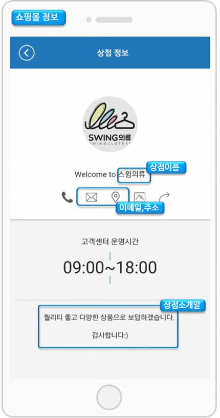
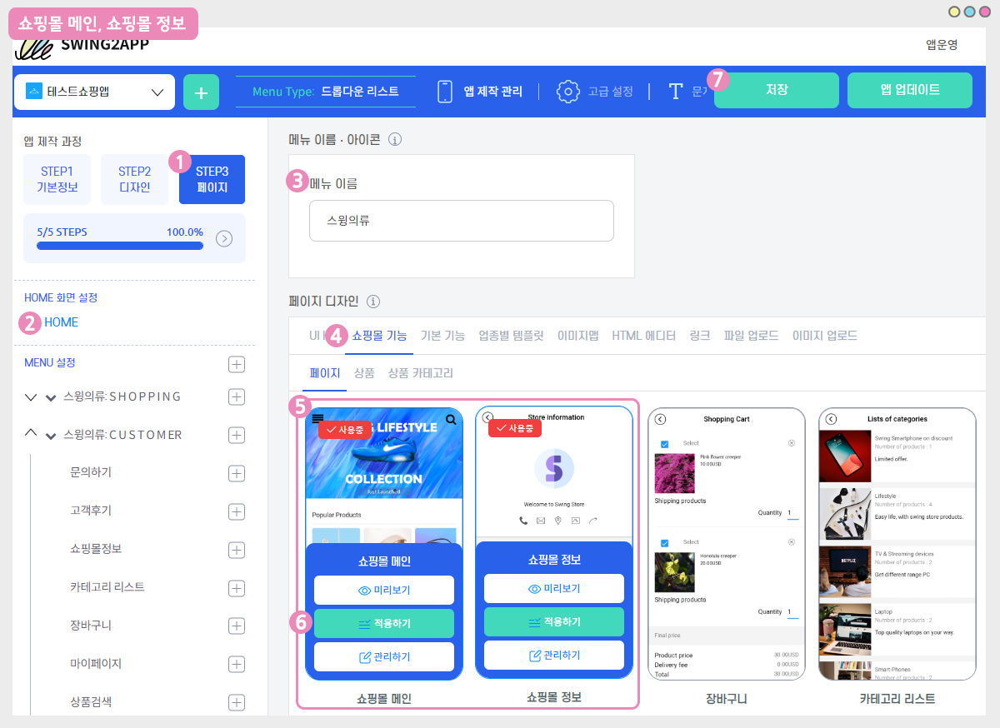

# 상점관리-기본정보설정

**스윙샵에서는 쇼핑몰 앱을 만드는데 유용하게 활용할 수 있도록  \[쇼핑몰 메인, 쇼핑몰 정보] 페이지를 제공하고 있습니다.**

해당 페이지에는 쇼핑몰을 구성하는 기본 정보들이 보여지는 페이지이구요.

상점관리-기본정보 설정 메뉴에서 해당 기본 정보 내용을 입력할 수 있습니다.

**매뉴얼에서 상점관리 – 기본정보를 입력하는 방법과 앱에서 해당 내용이 어떻게 보여지는지 알려드리겠습니다.**

 (1).PNG>)

### **STEP1. 스윙샵 – 상점관리- 기본정보 설정 페이지 이동**

**스윙샵 – 1)상점관리 메뉴에서 2)기본정보설정 메뉴로 이동합니다.**

기본정보 설정 페이지는 스윙샵에서 제공하는 쇼핑몰 메인 화면으로 보시면 되는데요.

기본정보에서 입력한 항목들이 앱- 쇼핑몰 메인 화면에서 보이게 됩니다.\

 (1).PNG>)

### **STEP2.  기본정보 내용 입력하기**

기본정보 항목들을 순서대로 입력해볼게요

1\. 상점 이름: 쇼핑몰 이름을 입력합니다.\
2\. 관리자 이메일: 관리자 이메일을 입력합니다.\
3\. 상점 인터넷 URL (쇼핑몰 주소): 사이트가 있을 경우 입력해주시고, 없을 경우 입력하지 않아도 괜찮아요.\
4\. 주소(쇼핑몰주소):  쇼핑몰 소재지(주소)를 적어주세요.\
5\. 상점 소개말: 간단하게 쇼핑몰 소개 멘트를 입력해주세요.

<mark style="color:blue;"><mark style="color:orange;">**\[앱 실행화면]**<mark style="color:orange;"></mark>

\*1번\~5번 항목에서 입력한 내용이 앱에서는 어떻게 보여지는지 확인해볼게요.

\* 상점이름, 이메일,주소, 상점 소개말은 모두 쇼핑몰정보 페이지에서 확인할 수 있습니다.&#x20;

6\. 상점 상세 이미지 : 쇼핑몰 메인 화면에 들어갈 이미지를 등록해주세요.

<mark style="color:red;">※ 쇼핑몰 메인 화면에 보여지는 이미지이며, 정보 페이지는 보여지지 않습니다.</mark>&#x20;

대표 이미지 하나만 넣어주셔도 되구요. 여러 장의 이미지를 등록할 경우 이미지가 슬라이딩 되어 보여집니다.&#x20;

**\[고객센터 정보 7\~10]**

7.전화번호: 전화번호를 입력해주세요.

<mark style="color:red;">**\*\*필수\*\***</mark> 전화번호는 반드시 입력해주셔야 합니다. 결제시 전화번호 인증을 위해 SMS를 발송하게 됨으로 발신 전화번호가 기재되어 있어야 정상 발송됩니다.

8\. 이메일: 관리자 이메일 주소를 입력해주세요

9\. 카카오톡 아이디: 카카오톡 아이디는 선택사항이구요. 없으실 경우 입력하지 않아도 됩니다.

\*카톡은 현재 스윙샵 메뉴에 연동이 안되고 있어요. 조금만 기다려주시면 추가하도록 하겠습니다\~!!

10\. 고객센터 운영시간: 고객센터 운영시간을 시간 버튼으로 설정해주세요.

<mark style="color:orange;">**\[앱 실행화면]**</mark>

**6번 상점 상세이미지, 7번\~10번 고객선터 정보를 입력한 내용이 앱에서는 어떻게 보여지는지 확인해볼게요.**

상점 상세이미지 : 쇼핑몰메인 페이지 상단에 등록된 이미지를 확인할 수 있습니다.&#x20;

\*고객센터 정보: 쇼핑몰 정보 페이지에 보시면 전화,메일 아이콘들이 보이시죠. 해당 아이콘을 선택하면 입력된 내용으로 연동됩니다.

아래에 고객센터 운영시간도 확인할 수 있습니다.

11\. 상점대표이미지: 대표이미지는 쇼핑몰 정보페이지의 메인 아이콘 이미지로 보여집니다.\
앱 아이콘과 동일한 사이즈이구요. 앱 아이콘 이미지를 넣으셔도 됩니다. (추후에 원하는 이미지로 수정하실 수 있어요)\
12\. 상점푸터: 쇼핑몰 하단에 들어가는 문구를 입력해주세요.\
13\. 모든 내용 입력이 완료된 후 \[저장]버튼을 누르면 기본정보 설정 입력이 완료됩니다.

<mark style="color:orange;">**\[앱 실행화면]**</mark>

**11번 상점 대표이미지, 12번 상점푸터를 적용한 내용이 앱에서는 어떻게 보여지는지 확인해볼게요**

\* 상점 대표이미지 : 쇼핑몰 정보 페이지 상단의 대표이미지를 확인할 수 있습니다.

\* 상점푸터: 쇼핑몰메인 페이지 하단에서 확인할 수 있습니다.

 (1).PNG>)

### STEP3. 앱에 적용하기 – 쇼핑몰 정보, 쇼핑몰메인

**+쇼핑몰정보, 쇼핑몰메인은 어디에서 적용할 수 있나요?**

앱에서 보여지는 쇼핑몰 메인 페이지, 쇼핑몰 정보 페이지는 어디서 적용할 수  있는지 알려드릴게요.

<figure><figcaption></figcaption></figure>

앱제작 화면 이동

1\)STEP3 페이지 단계로 이동합니다.

2\)HOME 선택

홈화면에 적용해도 되고, 메뉴로 추가해도 됩니다.

메뉴로 추가할 경우 + 모양 버튼 선택하여 새 메뉴를 먼저 만들어주세요.&#x20;

3\) 메뉴 이름 입력

4\) 페이지 디자인에서 \[쇼핑몰 기능] 선택

5\)\[페이지]를 선택해주세요.&#x20;

6\) ‘쇼핑몰 메인’ , '쇼핑몰 정보' 페이지를 확인할 수 있습니다.&#x20;

페이지에 마우스 커서를 가져다 대면 적용하기 버튼이 열립니다

7\) 화면 상단 \[저장]버튼을 누르면 앱에 적용됩니다.

앱제작 → 페이지 메뉴 이동

1\)홈화면 선택

2\)메뉴명 입력 (상단에 노출)

3\)스윙페이지 선택

4\)링크마법사 버튼 선택

**5)\[쇼핑몰 정보], \[쇼핑몰 메인]** 페이지를 확인할 수 있습니다. 적용 버튼 선택

6\)\[적용]버튼 선택

7\) \[저장]버튼 앱 적용 완료됩니다.&#x20;

<mark style="color:blue;">**쇼핑몰 정보 앱 실행화면**</mark>

<mark style="color:blue;">**쇼핑몰 메인 앱 실행화면**</mark>


<mark style="color:orange;">**안내사항**</mark>

스윙샵 상점관리- 기본정보 설정 메뉴에서 입력한 내용은  스윙페이지\[쇼핑몰 메인, 쇼핑몰 정보] 페이지 2개에 나눠서 정보가 입력이 됩니다.&#x20;

즉, **기본정보에 입력된 내용들은 ‘쇼핑몰 메인’과 ‘쇼핑몰 정보’ 페이지에 2개에서 보여지기 때문에 해당 페이지를 앱에서 모두 노출시켜야만 기본정보가 보여집니다.**

그러나 해당 페이지 역시 스윙에서 기본으로 제공하는 옵션이기 때문에 사용자가 직접 쇼핑몰 메인 페이지, 정보 페이지를 따로 만들어서 적용하셔도 됩니다.


