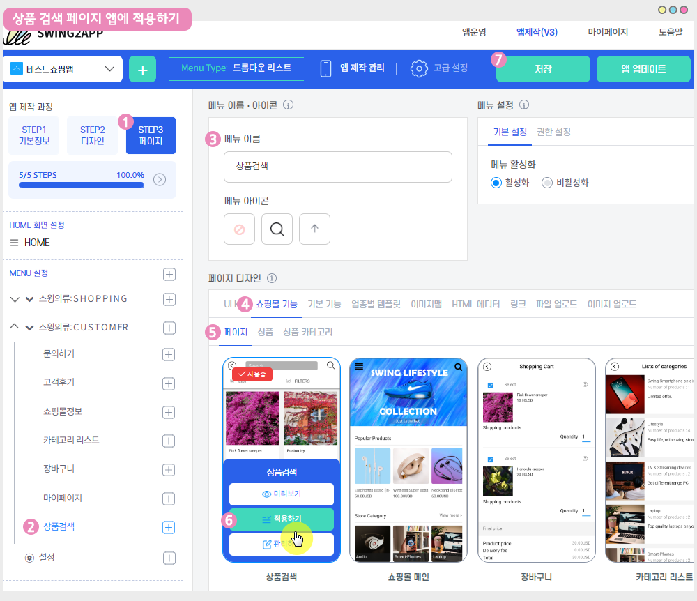

# 스윙페이지-상품검색

상품검색은 **스윙샵에 등록된 상품을 검색할 수 있는 페이지**구요.

상품 검색 외에도 등록된 모든 상품을 리스트로 보여주며, 목록&필터 기능을 이용하여 상품을 조회할 수 있습니다.&#x20;

<mark style="color:blue;">**상품검색 앱 실행화면**</mark>

 (1).PNG>)

###  **STEP1. 앱에 상품검색 메뉴 적용하기**

#### &#x20;**-앱제작 V3 버전 이용시 적용방법**

<figure><figcaption></figcaption></figure>

1\)앱제작 - STEP3 페이지 선택

2\)메뉴 선택 – 새 메뉴를 만들어주세요. (+ 모양 버튼 선택하여 메뉴 추가)

3\)메뉴 이름 입력

4\)페이지 디자인에서 \[쇼핑몰 기능] 선택

5\)\[페이지]를 선택해주세요.&#x20;

6\) 상품검색 페이지를 찾아서 \[적용하기] 버튼을 선택해주세요.&#x20;

(페이지에 마우스 커서를 가져다 대면 적용하기 버튼이 열립니다)

7\) 화면 상단 \[저장]버튼을 누르면 앱에 적용됩니다.

#### **-앱제작 V2버전 이용시 적용방법**

**앱제작  → 페이지메뉴 단계로 이동합니다.**

1\. \[카테고리 추가] 버튼을 눌러서 메뉴를 추가해주세요.&#x20;

2\. 메뉴명: 메뉴 이름을 입력합니다.

3\. 스윙페이지 메뉴 선택한 뒤

4\. \[링크마법사] 버튼을 선택합니다.

5\. 링크마법사 창에서 <mark style="color:blue;">**\[상품검색]**</mark> 메뉴 선택, \[반영]버튼 선택

6\. \[적용] 버튼 선택

7\. \[저장] 버튼 누르면 앱에 반영됩니다.

<mark style="color:red;">**\*주의사항**</mark>&#x20;

상품검색은 스윙샵에 등록된 상품이 보여지는 페이지에요.&#x20;

따라서 등록된 상품이 없다면, 상품검색 페이지를 앱에 적용해도 아무 상품이 안보이겠죠?

스윙샵에서 상품 등록을 완료한 뒤 상품검색 페이지를 앱에 적용해주시기 바랍니다.&#x20;

 (1).PNG>)

###  **STEP2. 상품검색 페이지 앱 실행화면**

상품 검색은 상품명을 검색하여 볼 수 있는 것 외에도 목록보기, 필터 기능도 제공되고 있어요!

\*목록 : 큰 목록 보기, 앨범형보기, 목록형 보기로 선택하여 볼 수 있습니다.&#x20;

\*필터 : 우선순위 , 상품 등록순(최신순), 상품가격, 인기 순으로 필터링하여 볼 수 있습니다.&#x20;

