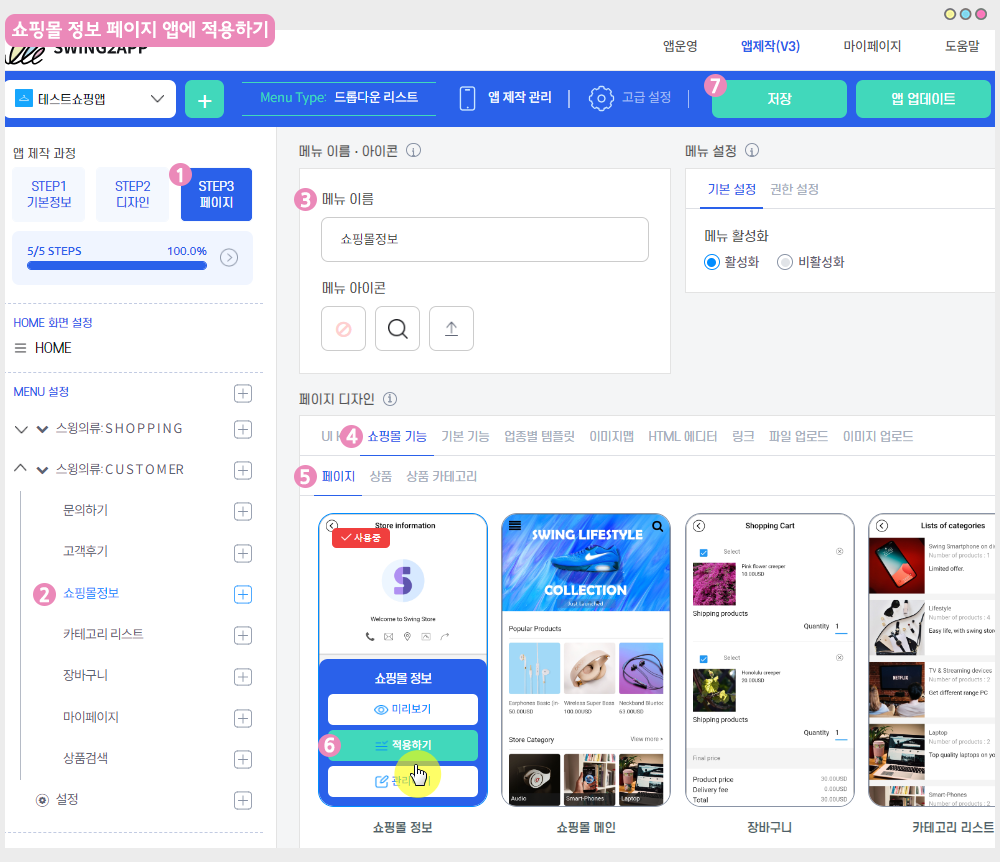

# 스윙페이지-쇼핑몰정보

스윙샵에서 제공하는 페이지 중 ‘쇼핑몰 정보’를  앱에 적용하는 방법을 알려드립니다.

쇼핑몰 정보는 상점 기본정보에서 설정한 내용이 보여지는 화면이구요.

고객센터 정보 부터 운영시간 소개멘트 등이 보여집니다.&#x20;

스윙페이지에서 이용할 수 있으며, 스윙샵 이용시 해당 페이지를 함께 적용할 수 있습니다.&#x20;

***

<mark style="color:blue;">**쇼핑몰 정보 앱 실행화면**</mark>

 (1).PNG>)

###  **STEP1.  기본정보설정**

스윙샵 [1)상점관리 메뉴 – 2)기본정보설정](http://www.swing2app.co.kr/view/store\_info\_basic\_setting) 메뉴로 이동합니다.

1\. 상점 이름: 쇼핑몰 이름을 입력합니다.

2\. 관리자 이메일: 관리자 이메일을 입력합니다.

3\. 상점 인터넷 URL (쇼핑몰 주소): 사이트가 있을 경우 입력해주시고, 없을 경우 입력하지 않아도 괜찮아요.

4\. 주소(쇼핑몰주소): 쇼핑몰 소재지(주소)를 적어주세요.

5\. 상점 소개말: 간단하게 쇼핑몰 소개 멘트를 입력해주세요.

6\. 상점 상세 이미지 : 쇼핑몰 메인 화면에 들어갈 이미지를 등록해주세요.

<mark style="color:red;">※ 쇼핑몰메인화면에 보여지는 이미지이며, 정보 페이지는 보여지지 않습니다.</mark>&#x20;

대표 이미지 하나만 넣어주셔도 되구요. **여러 장의 이미지를 등록할 경우 이미지가 슬라이딩 되어 보여집니다.**&#x20;

**\[고객센터 정보 7\~10]**

7.전화번호: 전화번호를 입력해주세요.

<mark style="color:red;">**\*\*필수\*\***</mark> 전화번호는 반드시 입력해주셔야 합니다. 결제시 전화번호 인증을 위해 SMS를 발송하게 됨으로 발신 전화번호가 기재되어 있어야 정상 발송됩니다.

8\. 이메일: 관리자 이메일 주소를 입력해주세요

9\. 카카오톡 아이디: 카카오톡 아이디는 선택사항이구요. 없으실 경우 입력하지 않아도 됩니다.

\*카톡은 현재 스윙샵 메뉴에 연동이 안되고 있어요. 조금만 기다려주시면 추가하도록 하겠습니다\~!!

10\. 고객센터 운영시간: 고객센터 운영시간을 시간 버튼으로 설정해주세요.

11\. 상점대표이미지: 대표이미지는 쇼핑몰 정보 페이지의 메인 아이콘 이미지로 보여집니다.

앱 아이콘과 동일한 사이즈이구요. 앱 아이콘 이미지를 넣으셔도 됩니다. (추후에 원하는 이미지로 수정하실 수 있어요)

12\. 상점푸터: 쇼핑몰 하단에 들어가는 문구를 입력해주세요.

13\. 모든 내용 입력이 완료된 후 \[저장]버튼을 누르면 기본정보 설정 입력이 완료됩니다.

기본정보 설정 입력이 완료되면, 앱제작 페이지로 이동합니다.&#x20;

 (1).PNG>)

###  **STEP2. 쇼핑몰 정보 메뉴 적용하기**

#### **-앱제작 V3 버전 이용시 적용방법**

<figure><figcaption></figcaption></figure>

1\)앱제작 - STEP3 페이지 선택

2\)메뉴 선택 – 새 메뉴를 만들어주세요. (+ 모양 버튼 선택하여 메뉴 추가)

3\)메뉴 이름 입력

4\)페이지 디자인에서 \[쇼핑몰 기능] 선택

5\)\[페이지]를 선택해주세요.&#x20;

6\) 쇼핑몰를정보 페이지를찾아서 \[적용하기] 버튼을 선택해주세요.&#x20;

(페이지에 마우스 커서를 가져다 대면 적용하기 버튼이 열립니다)

7\) 화면 상단 \[저장]버튼을 누르면 앱에 적용됩니다.

#### **-앱제작 V2버전 이용시 적용방법**

**앱제작  → 페이지메뉴 단계로 이동합니다.**

1\. \[카테고리 추가] 버튼을 눌러서 메뉴를 추가해주세요.&#x20;

2\. 메뉴명: 메뉴 이름을 입력합니다.

3\. 스윙페이지 메뉴 선택한 뒤

4\. \[링크마법사] 버튼을 선택합니다.

5\. 링크마법사 창에서 <mark style="color:blue;">\[쇼핑몰 정보]</mark> 메뉴 선택, \[반영]버튼 선택

6\. \[적용] 버튼 선택

7\. \[저장] 버튼 누르면 앱에 반영됩니다.

 (1).PNG>)

###  **STEP3. 앱 실행화면**

쇼핑몰 정보 페이지를 적용한 앱 실행화면입니다.

위에 기본정보설정에서 입력한 내용들이 정보 설정 화면에 보여집니다.&#x20;

상점 대표 이미지, 상점 이름, 고객센터 정보, 운영시간, 상점 소개말 등이 표시됩니다.&#x20;
