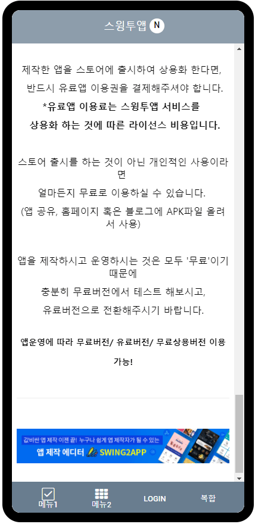

# 홈화면 GIF이미지 넣기

첨부된 이미지처럼 GIf이미지를 넣어서 홈화면을 움직이는 화면으로 제작할 수 있어요.\~!!

홈화면에 움짤 이미지를 넣는 방법을 확인해주세요.

***

###

## <mark style="color:blue;">**1. 홈화면에 움짤 이미지 넣기**</mark>

**앱제작 페이지의 페이지메뉴 단계로 이동해주세요.** &#x20;

1\) \[홈 화면]을 마우스로 살짝 클릭하시면 오른편에 \[메뉴 유형] 화면이 뜹니다.

2\) 홈 화면 상단의 메뉴 이름을 바꿀 수 있어요.(이름을 바꾸지 않으면 앱이름으로 표시됩니다.)

3\) 메뉴 설정에 있는 \[이미지] 메뉴를 선택합니다.

4\) 하단 영역에 \[불러오기] 버튼을 눌러주세요.

5\) 이미지 첨부 창이 뜨면, 원하는 이미지 파일 등록 후 \[적용] 버튼을 눌러주세요.

6\) 페이지 하단의 \[적용] 버튼을 누르고

7\) 저장을 누르면 완료!

<mark style="color:red;">**★이미지 등록 주의사항**</mark>

\*GIF이미지는 미리 만들어주셔야 앱제작시 바로 적용이 가능합니다.

\*이미지는 제작하실 때, 핸드폰 화면에 꽉 차게 제작하고 싶다면 \*가로 사이즈: 1080px, 세로는1920px\~2200px 사이즈로 작업해서 넣어주세요.

\-세로 길이는 명확하게 정해지지 않습니다. 이미지는 핸드폰의 가로화면 길이에 맞춰서 리사이징됩니다.&#x20;

따라서 동일 이미지를 넣어도 핸드폰에 따라 어떤 이미지는 길이가 길거나, 짧게 보일 수 있습니다.

세로는 앱 화면을 보고 조금씩 사이즈를 조율해주시기 바랍니다.

<mark style="color:red;">**★ GIF이미지 첨부 중요 TIP**</mark>

gif 파일은 일반 파일에서는 보이지 않아요.

따라서 파일 창 하단에 <mark style="color:red;">**‘모든 파일’**</mark> 로 설정을 변경해주셔야 gif 파일을 확인할 수 있습니다.

**모든 파일로 변경 한 뒤 미리 작업해놓은 gif파일을 선택해주세요.**

**왼쪽 핸드폰 가상머신을 보시면 이미지가 홈화면으로 적용된 것을 확인할 수 있어요.**

<mark style="color:orange;">**특이사항**</mark>

\*이미지 파일로 첨부했기 때문에 앱에서 이미지를 터치하면 가상머신에서 보는 것 처럼 이미지상세보기가 뜹니다.

앱에서 이 부분이 불편하시다면 이미지페이지로 따로 제작을 해서 넣으시길 권장드립니다.

***

## **2. 이미지 페이지에 움짤 이미지 적용하기**

이미지 페이지 제작도구에서도 움짤 이미지 적용이 가능합니다.

**이미지 페이지 제작방법 상세 방법은 아래 매뉴얼을 확인해주시기 바랍니다.**

***

## 3.HTML에디터에서 움짤 이미지 적용하기

HTML에디터 페이지에서도 제작도구 화면에 gif이미지를 넣을 수 있습니다.&#x20;

<figure><figcaption></figcaption></figure>

에디터 역시 편집 화면에서&#x20;

1\)이미지 업로드 버튼 선택

2\)파일 첨부창에서 "모든 파일" 선택

3\)등록하고자 하는 이미지 선택 후 \[열기] 버튼 선택

4\)에디터 화면에 이미지가 등록된 것을 확인할 수 있습니다.

저장 후 앱제작에서 다시 저장을 해주시면, 앱에 반영됩니다.&#x20;

### 앱 실행화면

<figure><figcaption></figcaption></figure>

하단 배너를  움짤 gif 이미지로 넣어서 화면이 전환되는 것을 확인할 수 있습니다.

<mark style="color:red;">**★ 안내사항**</mark>

1\) 움짤 이미지는 사용자가 직접 제작해주셔도 되고, 별도의  gif파일을 쓰셔도 됩니다.

2\) 홈 화면에 꽉 차게 이미지가 보이게 위해서는  \*가로 사이즈: 1080px, 세로는1920px\~2200px 사이즈로 작업해서 넣어주세요.

프로토타입을 어떤 것을 적용했는지에 따라서 세로 사이즈가 리사이징 되기 때문에, 앱에 적용된 이미지를 확인하여 세로 사이즈는 조금씩 조율해주세요

3\) 파일 용량 5MB 이내로만 업로드 가능합니다.

4\) 파일 업로드시 ‘모든 파일’ 열기로 설정하셔야 gif파일이 열립니다.
