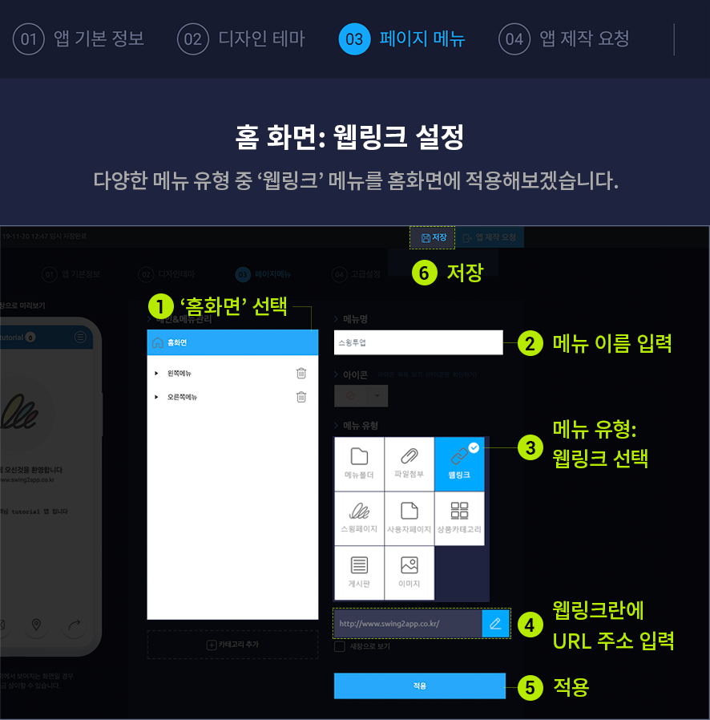

# 앱제작 방법 매뉴얼

**스윙앱제작 단계별 제작방법 매뉴얼**

스윙은 홈페이지에서 회원가입만 하면 앱을 제작할 수 있는 페이지가 열리구요.

제작 툴을 이용하여서 사용자가 직접 나만의 앱을 제작할 수 있어요.

스윙 앱제작 페이지- 앱 기본정보, 디자인테마, 페이지메뉴 총 3단계에서 앱을 제작하는 방법을 알려드릴게요.

**앱제작 페이지에서 단계별로 앱을 제작하는 방법을 매뉴얼을 통해서 확인해주세요 ^^**

***

<mark style="color:red;">**★ 앱제작 전 먼저! 앱제작 TIP을 확인해주세요!**</mark>

스윙은 앱제작 툴을 제공하고, 사용자가 직접 앱을 제작해야 하는 서비스인만큼 제작방법 매뉴얼이 잘 구축되어 있습니다.

앱제작, 앱운영 페이지의 메뉴옆에 보시면**\[ ? ]** 물음표 아이콘을 확인할 수 있어요.

**해당 물음표 아이콘을 누르면, 이용방법 혹은 제작방법이 기재된 해당 도움말 매뉴얼 사이트로 이동합니다.**

따라서 앱제작시 매뉴얼을 확인하고자 할 때는 꼭 \[ ? ]아이콘을 선택해서 매뉴얼을 확인해주시기 바랍니다.

<mark style="background-color:blue;">**▶**</mark>** **<mark style="color:orange;">**단계별 앱제작 방법 영상으로 확인하기**</mark>



###  <mark style="color:blue;">**STEP.1 앱 기본정보**</mark>

**1단계 \[앱 기본정보]는 앱작에 필요한 기본 정보를 입력하는 단계로 앱이름, 아이콘 이미지, 대기화면 이미지 등을 등록하는 단계입니다.**

앱제작페이지로 바로 들어오시면 아래와 같은 페이지가 열립니다.

<mark style="color:orange;">**\[1단계 앱기본정보 제작방법]**</mark>

1\. 앱 아이디 : 제작한 앱에 고유 아이디를 적용합니다. 입력 후 중복확인 체크!!

2\. 앱 이름: 앱 이름을 기재합니다 .

3\. 앱 아이콘: 앱 아이콘 이미지를 등록합니다.

4\. 대기화면: 앱 실행시 1\~2초 정도 보여지는 대기화면 이미지를 등록합니다.

\*앱 아이콘, 대기화면 이미지 첨부 버튼을 선택하면 이미지 편집도구 창이 뜹니다.

스윙투앱에서 제공하는 이미지편집도구를 이용해서 이미지를 원하는 사이즈에 맞게 수정해서 사용할 수 있어요.

5\. 저장

​

<mark style="color:orange;">**\[이미지 편집도구 사용]**</mark>

아이콘 이미지 버튼을 선택하면 파일첨부창이 뜨면서 이미지를 업로드 할 수 있습니다.

이때 아이콘 이미지가 기재해놓은 사이즈와 동일하다면 수정없이, 바로 \[적용]을 눌러서 완료할 수 있구요.

**사이즈가 달라서 편집이 필요할 경우 이미지편집도구 창으로 이동합니다.**

**위의 이미지가 바로 이미지편집도구 창입니다.**

이미지편집도구는 스윙에서 제공하는 자체 서비스로, 사용자가 이미지를 수정하기 어려울 경우 이미지편집도구를 이용해서 간단하게 사이즈를 수정할 수 있습니다.

사이즈 적용이 완료되면<mark style="color:blue;">**\[업로드(수정완료)]**</mark>버튼을 선택해서 적용해주시면 됩니다.

<mark style="color:orange;">**\*1단계 기본정보 항목이 모두 입력되면 \[저장] 버튼을 누르고, 다음 단계 디자인테마로 이동합니다.**</mark>

***

###  <mark style="color:blue;">**STEP.2 디자인테마**</mark>

**앱제작 2단계 \[디자인테마]는 앱의 UI디자인과 컬러 등의 전체적인 디자인 및 스타일을 결정하는 단계입니다.**

<mark style="color:orange;">**\[2단계 디자인테마 제작방법]**</mark>

**1. 프로토타입 선택: 앱 UI디자인을 결정하는 프로타입을 선택합니다.**

<mark style="color:red;">\*스윙투앱에서는 총 6가지의 프로토타입 디자인을 제공하고 있습니다.</mark>

\= 프로타입선택 ‘?’ 물음표 버튼을 누르면 프로토타입을 적용한 스타일을 모두 확인할 수 있어요.

**☞** [**프로토타입 디자인 확인하기**](broken-reference)

**2. 스킨: UI디자인의 스킨 컬러를 설정합니다.**

스킨컬러는 앱의 바탕, 메뉴, 텍스트로 3셋트로 이루어진 색상조합을 제공하고 있어요.

트렌드에 맞는 색상을 조합해놓았기 때문에 원하는 조합을 선택하시면 가상머신을 통해서

즉각적으로 색상이 바뀌는 UI를 확인할 수 있습니다.

​

**3.저장**

<mark style="color:red;">★그런데 만약 조합된 색상 중에서 마음에 드는 색상이 없다면요??</mark>

\=원하는 색상이 없을 경우 \[상세 색상 설정]에서 사용자가 직접 색상을 선택할 수 있어요.

상세색상설정에서는 고정된 색상 조합 외에, 사용자가 직접 색상을 골라서 적용할 수 있는 옵션입니다.

<mark style="color:orange;">**\*디자인테마에서 프로토타입과 스킨컬러를 모두 적용했다면 저장하신 뒤 다음단계인 페이지메뉴로 이동합니다.**</mark>

###  <mark style="color:blue;">**STEP.3 페이지메뉴**</mark>

**3단계 \[페이지메뉴]는 앞서 만들어놓은 전체적인 앱 툴에 카테고리와 메뉴를 만들어서 본격적으로 앱 내용을 구성하는 단계입니다.**

페이지메뉴는 홈화면, 메뉴를 구성하는 단계에요.

홈화면을 적용하는 방법과 메뉴를 적용하는 방법을 알려드리겠습니다.

<mark style="color:orange;">**1. 홈화면 적용 방법**</mark>

**홈화면은 앱을 실행하면 보이는 메인화면으로, 사용자가 직접 메인화면을 어떻게 보여지게 할지 구성할 수 있어요.**

**스윙투앱에서 제공하는 메뉴 – 웹링크, 스윙페이지, 사용자페이지, 게시판, 이미지 등의 메뉴를 적용할 수 있습니다.**

**\*홈화면 적용방법**

1\. 홈화면 텍스트를 선택하면 오른쪽에 메뉴설정 창이 열립니다.

2\. 메뉴이름에 홈화면 상단에 보여질 이름을 입력해주세요 .

3\. 홈화면에 어떤 메뉴를 적용할 지 선택해주세요.

**☞** [**홈화면 제작 매뉴얼 확인하기**](../pagemenu/home-menu.md)

<mark style="background-color:blue;">**▶**</mark>** **<mark style="color:orange;">**웹링크 홈화면 적용**</mark>

**홈화면에 웹링크를 적용해보겠습니다.**

**\[제작방법]**

1\) \[홈 화면]을 마우스로 살짝 클릭하시면 오른편에 메뉴설정 페이지가 뜹니다.

2\) 홈 화면 상단의 메뉴 이름을 바꿀 수 있어요.(이름을 바꾸지 않으면 앱이름으로 표시됩니다.)

3\) 메뉴 설정에 있는 \[웹링크] 메뉴를 선택합니다. (스윙 홈페이지 URL: [http://www.swing2app.co.kr](http://www.swing2app.co.kr/) 를 넣었습니다.)

4\) 하단 영역에 웹링크 URL을 입력해주세요.

5\) 적용을 누르고

6\) 저장을 누르면 완료!

<mark style="color:orange;">**\[움짤로 확인하기]**</mark>

<mark style="color:red;">**★ 주의사항**</mark>

**웹링크를 적용할 때 가끔씩 퍼가기를 금지해 놓은 사이트가 있어요.**

**\*네이버, 다음 등의 포털 사이트, 유튜브, SNS 사이트(인스타그램, 카카오톡, 페이스북) 등이 퍼가기를 금지해놓은 대표적인 사이트에요!**

**특히 자신이 운영하는 네이버 블로그 혹은 다음 카페 등은 네이버, 다음 자체에서 막아놓기 때문에 홈에 제대로 연동이 안 될 수 있어요**

**따라서 앱 홈화면 웹링크에는 – 이러한 포털사이트, SNS사이트를 피해주세요!**

**홈화면 제작의 더욱 다양하고 자세한 방법은 해당 포스팅을 확인해주세요!**

**☞** [**\[앱 홈화면 제작방법 포스팅 보러가기\]**](../pagemenu/home-menu.md)

**홈화면을 적용해보았다면 이어서 메뉴를 적용해보겠습니다.**

<mark style="color:orange;">**2. 메뉴 삭제**</mark>

**\[기본 셋팅된 메뉴들을 삭제하는 방법]**

친해지기라는 메뉴를 삭제할 경우, \[친해지기] 카테고리를 선택한 뒤 휴지통 모양(삭제) 버튼을 선택합니다.

이러한 방법으로 메뉴들을 삭제할 수 있습니다.

<mark style="color:orange;">**3. 새 메뉴 추가**</mark>

기존에 셋팅된 카테고리를 삭제하고, 새로운 카테고리를 추가하는 방법을 알려드릴게요.

**1.\[카테고리 추가] 버튼을 선택합니다.**

**2. 해당 카테고리 이름을 입력합니다.**

**4. 메뉴 유형: 어떤 메뉴를 적용할 것인지 선택합니다.**

**5.적용**

**6. 저장**

**=가상머신을 보시면 새 메뉴가 생성된 것을 확인할 수 있습니다.**

<mark style="color:orange;">**4. 하위 메뉴 추가**</mark>

만들어놓은 메뉴 아래로 하위 메뉴를 추가하는 방법을 알려드릴게요.

이동할 메뉴를 선택하고 이동할 위치로 마우스를 드래그 해주세요.

드래그하는 위치로 메뉴 이동이 완료됩니다. – 하위 혹은 상위 메뉴로 구성할 수 있어요.

**​**

**가상머신을 보시면 \[메뉴] 하위로 \[스윙투앱 소개]라는 메뉴가 생성된 것을 확인할 수 있습니다.**

**\[스윙투앱 소개]** 메뉴를 선택하면, 적용해놓은 이미지가 열립니다.

페이지메뉴 단계는 메뉴들의 이용방법 및 활용법을 먼저 파악을 해야만 앱제작이 좀 더 수월해집니다.

따라서 각 메뉴별 이용방법을 먼저 확인해주시기 바랍니다.

<mark style="color:red;">\* 고급설정은 제작에서 필요한 내용이 아니기 때문에 3단계 페이지메뉴까지만 작업해주세요.</mark>

<mark style="color:red;">페이지메뉴까지 제작이 완료되면 앱제작 요청 버튼을 눌러서 앱제작을 완료해주세요.</mark>

***

###  <mark style="color:blue;">**STEP.4 앱제작 요청**</mark>

**앱제작이 완료되면 \[앱제작 요청]버튼을 눌러주세요.**

업데이트 표시 옵션은 ‘권장’으로 체크한 뒤 \[제작하기]를 선택하면 됩니다.

<mark style="color:red;">\*업데이트 표시 옵션은 선택사항이기 때문에 필수로 하셔도 무관하답니다.\~!</mark>

***

###  <mark style="color:blue;">**STEP.5 앱제작 완료**</mark>

<mark style="color:orange;">**1. 앱 제작 진행상태 확인**</mark>

앱제작 페이지에서 앱제작요청을 누르면, 바로 앱운영 페이지의 앱 작업이력 페이지로 이동합니다.

플랫폼별 상태를 확인해보면 아직 ‘제작순서 대기중’으로 표시가 되어 있죠?

해당 화면에서 앱 제작 진행상태를 확인할 수 있구요.

앱제작요청을 누른 뒤 5분 이내로 제작이 되기 때문에 조금만 기다려주세요 \~!

<mark style="color:orange;">**2. 스윙 미리보기(앱 미리보기)**</mark>

제작을 기다리는 중에 1분도 안되서 \[스윙 미리보기] 팝업창이 뜨는데요.

앱이 제작되기 전 스윙 미리보기를 통해서 앱을 미리볼 수 있는 기능이에요.

\*웹에서 보기: \[웹에서 바로보기] 버튼을 선택하면 웹에서 가상머신으로 제작한 앱을 미리볼 수 있습니다.

\*핸드폰으로 미리보기: 스윙투앱 공식앱을 다운 받은 뒤 – 앱 미리보기 메뉴 – 스윙계정으로 로그인하거나 or 팝업창에 보여지는 QR코드를 스캔하면 핸드폰에서도 앱을 미리보기로 확인할 수 있어요!(다운이 아닌 미리보기입니다)

<mark style="color:orange;">**3. 앱 제작 완료**</mark>

잠시 뒤 플랫폼별 상태가 ‘앱제작 완료!’라고 바뀐 것을 확인할 수 있어요.

**제작이 완료되면 APK파일(앱을 다운 받을 수 있는 파일)은 사용자의 스윙 가입 메일로 발송됩니다.**

**핸드폰으로 메일함을 열어서 직접 APK파일을 다운받아 설치할 수 있구요.**

위에서 설명드린 앱 미리보기를 이용하면, 안드로이드폰에서 앱을 다운 받을 수 있습니다.

​

<mark style="color:red;">\*APK해당 파일은 PC에서 열리지 않으니 꼭 핸드폰에서 확인해주세요.</mark>

<mark style="color:red;">\*APK파일 설치는 안드로이드폰에서만 설치가 가능합니다. (아이폰은 지원이 안됩니다,)</mark>

***

<mark style="color:red;">**★ 앱 미리보기**</mark>

스윙투앱 공식앱에서 \[앱 미리보기]를 이용하면 **아이폰 사용자도 제작한 앱을 핸드폰에서 확인할 수 있구요.**

안드로이드폰 사용자도 번거롭게 APK파일을 받지 않아도 제작하고 바로 핸드폰으로 확인할 수 있어요!!

1\)앱스토어, 플레이스토어에서 ‘스윙투앱’ 공식앱을 다운받아주세요. \*앱이 이미 설치가 되어 있다면 최신버전으로 업데이트 받아주세요

2\) 앱 실행 후 → 카테고리 상단에 \[앱미리보기] 메뉴를 선택한 뒤 스윙 웹사이트 가입 계정(아이디, 비밀번호)으로 로그인해주세요.

3\) 로그인이 완료되면 앱 미리보기 페이지가 열리며, 제작한 앱 목록을 확인할 수 있습니다.

\-아이폰은 미리보기 버튼을 눌러서 확인이 가능합니다.

\-안드로이드폰에서는 앱미리보기, 앱 다운로드 가능합니다.

<mark style="color:red;">**\*스윙투앱 프로토타입- 푸시, 웹뷰로 제작한 앱은 앱미리보기가 불가능합니다.(앱 다운로드만 가능)**</mark>

<mark style="color:red;">**따라서 아이폰에서는 푸시, 웹뷰로 제작한 앱은 이용할 수 없으며, 안드로이드폰에서는 다운로드로 이용 가능합니다.**</mark>

​

<mark style="color:green;">**★ 앱 수정은 어떻게 하나요?**</mark>

제작이 완료된 후에도 앱은 계속 수정하고 업데이트 할 수 있는데요.

수정할 때에도 동일하게 작업했던 앱제작 페이지로 이동하고 내용을 수정한 다음 저장해주시면 됩니다.

**-3단계 페이지메뉴를 수정할 경우 \[저장]만 누르면 앱에 자동 반영, 게시물 작성등도 저장만 하면 자동 반영!**

**-2단계 디자인 테마를 수정할 경우 \[저장] 후 \[앱제작요청] 버튼을 눌러서 새 버전으로 업데이트 받기! \*소프트업데이트**

**-1단계 앱 기본정보를 수정할 경우 저장] 후 \[앱제작요청] 버튼을 눌러서 새 버전으로 업데이트 받기! \*하드업데이트**

**​**

<mark style="color:green;">**★ 업데이트 중요 내용 \*중요한 내용이니 확인해주세요!!**</mark>

**1.**앱제작 단계 중 **3단계 \[페이지 메뉴]에 해당 되는 내용을 수정할 경우 **<mark style="color:orange;">**\[저장] 버튼만 눌러주시면 앱에 자동으로 반영됩니다.**</mark>

\*앱 다시 제작안해도 됩니다.!!

**2. 2단계\[디자인테마] 내용 수정 시 –프로타입 변경, 디자인 컬러 변경 등은 **<mark style="color:orange;">**\[앱제작요청]을 다시 한 뒤, \[소프트업데이트]를 선택해주세요.**</mark>

소프트업데이트를 선택할 경우 플레이스토어, 앱스토어 등에 출시된 사용자의 앱을 다시 올리지 않아도 사용자의 앱 내에서 업데이트 됩니다.

\[소프트 업데이트]는 앱제작 3회 이상시 표시됩니다. 1\~3회는 하드 업데이트만 가능해요.

**3.** **1단계 앱 기본정보- 앱이름, 대기화면이미지, 아이콘이미지 등을 변경할 때 \[앱제작요청] 다시 해야 합니다.**

이때 **\[하드 업데이트]를 선택해주세요!! **<mark style="color:orange;">**1단계 항목은 하드로 업데이트해야만 앱에 반영이 됩니다.**</mark>

플레이스토어, 앱스토어 등에 출시된 사용자의 앱도 1단계 내용을 수정할 경우 ‘앱제작요청’을 눌러서 다시 새 버전의 APK파일을 제작해주시구요.

새 버전의 APK파일을 다시 스토어에 올려서 업데이트 해주셔야 합니다.

​

<mark style="color:green;">**★소프트 업데이트와 하드업데이트의 차이점?**</mark>

1\)하드업데이트: APK파일이 다시 설치되는 것으로, 앱을 재설치해서 업데이트를 받아야 합니다.

<mark style="color:red;">\*플레이스토어, 앱스토어에 앱이 출시되어 있다면 새 버전의 앱을 스토어에도 다시 업데이트 해주셔야 합니다.</mark>

<mark style="color:red;">앱이름, 아이콘, 대기화면 변경할 경우 앱재제작 후 새버전 APK파일을 플레이스토어/앱스토어에 다시 업데이트 해야 반영됩니다.</mark>

2\) 소프트 업데이트: 앱을 재설치하지 않고 재실행만 하면 업데이트를 받을 수 있어요. 플레이스토어나 앱스토어에 출시된 앱

<mark style="color:red;">\*스토어에 올라간 앱 업데이트 안해도 됩니다.</mark>

***
