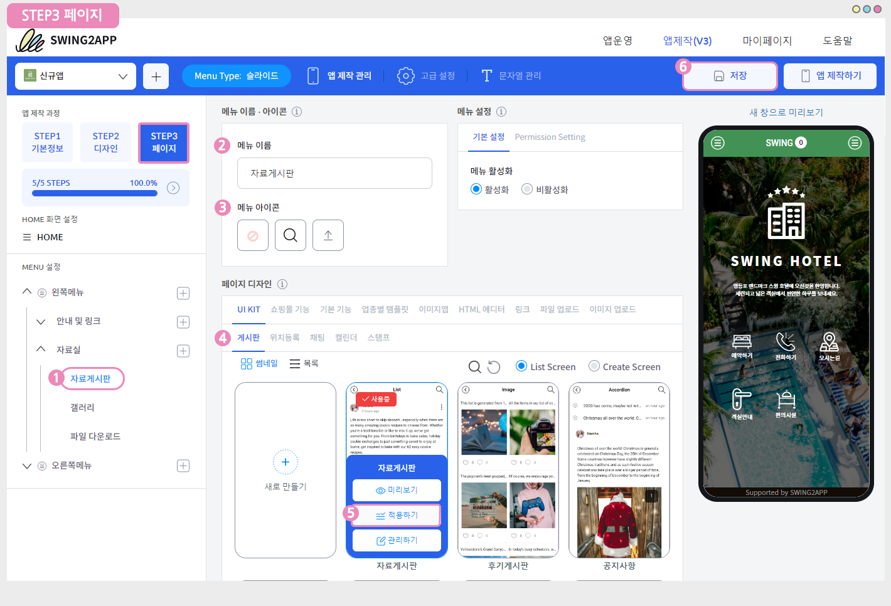

# V3버전 앱제작 방법 매뉴얼

### &#x20; (1).png>)**STEP1. 기본정보**

**1단계\[기본정보]는 앱제작에 필요한 기본 정보를 입력하는 단계로 앱이름, 아이콘 이미지, 대기화면 이미지 등을 등록하는 단계입니다.**

앱제작으로 들어오면 아래와 같은 페이지가 열립니다.

1\. 앱 이름: 앱 이름을 기재합니다 .

2\. 앱 아이디 : 제작한 앱에 고유 아이디를 적용합니다. 입력 후 중복확인 체크!!

3\. 앱 아이콘: 앱 아이콘 이미지를 등록합니다.

4\. 대기화면: 앱 실행시 1\~2초 정도 보여지는 대기화면 이미지를 등록합니다.

5\. 저장 : 작업이 완료될 때마다 \[저장] 버튼을 선택해서, 작업 내용을 저장해주세요.

### &#x20;<mark style="color:blue;">**1.앱 아이콘 이미지 등록**</mark>

**\*앱 아이콘, 대기화면 이미지 첨부 버튼을 선택하면 파일 첨부 창이 뜹니다.**

**이미지 업로드 버튼을 선택해서, 원하는 이미지를 등록해주세요.**

**아이콘 이미지 사이즈: 1024px\*1024px**

(1)아이콘 업로드 버튼 선택

(2)파일첨부 창에서 이미지 업로드 버튼을 선택합니다.

(3)아이콘으로 사용할 이미지 등록 후 적용 버튼을 선택합니다.\

### &#x20;<mark style="color:blue;">**2.대기화면 이미지 등록**</mark>

**대기화면 이미지 사이즈 : 2282px\*2282px**

(1)대기화면 업로드 버튼 선택

(2)파일첨부 창에서 이미지 업로드 버튼을 선택합니다.

(3)대기화면으로 사용할 이미지 등록 후 적용 버튼을 선택합니다.

***

아이콘, 대기화면 이미지 제작 가이드를 확인해주세요.

일반 이미지가 아닌 앱 아이콘과 대기화면으로 사용하는 가이드가 따로 있어요!&#x20;

반드시 해당 가이드대로 이미지를 디자인 후 적용해주세요.

[**아이콘 이미지 제작 가이드 보러가기**](../v2/appbasic/appicon.md)

[**대기화면 이미지 제작 가이드 보러가기**](../v2/appbasic/apploading.md)

###  (1).png>)**STEP2.디자인**

**\[STEP2디자인]은 앱의 UI디자인과 컬러 등의 전체적인 디자인 및 스타일을 결정하는 단계입니다.**

**1. 프로토타입 선택: 앱 UI디자인을 결정하는 프로타입을 선택합니다.**

\*스윙투앱에서는 총 7가지의 프로토타입 디자인을 제공하고 있습니다.

**​**

**2. 기본 스타일 및 옵션**

**컬러 셋트 선택: UI디자인의 스킨 컬러를 설정합니다.**

스킨컬러는 메인 배경 색, 글자 색, 테마 색 3세트로 이루어진 색상조합을 제공하고 있어요.

원하는 조합을 선택하시면 가상머신을 통해서 실시간으로 색상이 바뀌는 UI를 확인할 수 있습니다.

​

**3. 고급 스타일 및 옵션**

해당 기능은 프로토타입 UI에 추가할 수 있는 색상 옵션 및 디자인 스타일을 추가로 설정할 수 있는 기능이에요.

필수 기능은 아니며, 옵션을 설정하고자 하는 분들만 입력해주세요.

​

**4. 저장**

**​**

> <mark style="color:red;">**조합된 색상 중에서 마음에 드는 색상이 없다면? = 상세 설정을 이용해주세요.**</mark>

원하는 색상이 없을 경우 \[상세 설정]에서 사용자가 직접 색상을 선택할 수 있어요.

상세색상설정에서는 고정된 색상 조합 외에, 사용자가 직접 색상을 골라서 적용할 수 있는 옵션입니다.

**\*디자인 단계에서 프로토타입과 스킨컬러를 모두 적용했다면 저장하신 뒤 다음단계인 페이지메뉴로 이동합니다.**

###  (1).png>)**STEP3. 페이지**

**\[STEP3 페이지]는 앞서 만들어놓은 전체적인 앱 툴에 카테고리와 메뉴를 만들어서 본격적으로 앱 내용을 구성하는 단계입니다.**

앱 메인 홈화면, 메뉴를 구성하는 단계에요.

왼쪽의 화면 설정 카테고리에서 적용해야 하는 메뉴들을 확인할 수 있구요.

홈화면을 적용하는 방법과 메뉴를 적용하는 방법을 알려드리겠습니다.

### &#x20;**1.홈화면 적용 방법**

**홈화면은 앱을 실행하면 보이는 메인화면으로, 사용자가 직접 메인화면을 어떻게 보여지게 할지 구성할 수 있어요.**

**스윙투앱에서 제공하는 메뉴 – 웹링크, 스윙페이지, 사용자페이지, 게시판, 이미지 등의 메뉴를 적용할 수 있습니다.**

**해당 가이드에서는 업종별 템플릿을 적용해보겠습니다.**

왼쪽 카테고리에서 \<HOME> 선택

1\) 메뉴 이름 입력 화면 상단에 보여질 이름을 입력합니다.

입력 후 커서를 한번 클릭하거나 엔터 버튼을 누르면 가상머신으로 바로 반영됩니다.

2\) 페이지 디자인: 업종별 템플릿 선택 후 \[새로 만들기] 버튼을 선택합니다.

\*만들어놓은 페이지가 없기 때문에 먼저 페이지 템플릿 제작도구로 이동하여, 템플릿 페이지를 제작해야 합니다.

<mark style="color:green;">**\[템플릿 페이지 제작도구 화면]**</mark>

템플릿 페이지 제작방법은 아래 제작 매뉴얼을 확인하여 참고해주세요!

**☞** [**템플릿 페이지 제작 및 운영방법 확인하기**](https://blog.naver.com/swing2app/221640758394)

**템플릿 제작 후 다시 앱제작 화면으로 돌아와주세요.**

3\)새로고침 버튼을 선택하면, 만들어놓은 템플릿이 화면이 뜨게 됩니다.

4\)마우스 커서를 템플릿에 가져다 대면 **<미리보기, 적용하기, 관리하기>** 메뉴가 뜹니다.

앱 적용 전 미리 확인하고 싶다면, '미리보기' 선택, 앱 적용은 '적용하기', 수정 작업은 '관리하기'를 선택해주세요.

'적용하기' 메뉴를 선택합니다.

5\)\[저장] 버튼을 선택하면 홈화면에 적용된 템플릿을 가상머신 화면으로 확인할 수 있습니다.

### &#x20;**2.메뉴 관리**

<mark style="color:green;">**1)메뉴 추가 및 삭제**</mark>

왼쪽 카테고리에 기재된 메뉴들은 스윙투앱에서 초기 셋팅한 메뉴들로 모두 수정하여 사용할 수 있습니다.

따라서 필요 없는 메뉴는 삭제하고, 추가하여 원하는 메뉴들로 구성할 수 있습니다.

메뉴에 마우스를 가져다 되면 휴지통 모양 아이콘, +모양 아이콘이 뜹니다.

<mark style="color:red;">**\*메뉴 삭제: 휴지통 아이콘 선택**</mark>

<mark style="color:red;">**\*메뉴 추가: + 아이콘 선택**</mark>

쉽게 메뉴를 삭제하고, 추가할 수 있습니다.

<mark style="color:green;">**2)메뉴 적용**</mark>

(1)메뉴를 추가해주세요.

(2)메뉴 이름을 입력합니다.

(3)메뉴 아이콘: 선택사항으로 아이콘을 적용하실 경우만 입력해주세요. \*필수 아님

(4)페이지 디자인에서 어떤 메뉴를 적용할 것인지 선택해주세요.

\*해당 가이드에서는 '게시판'을 적용해보았습니다.

UI KIT 선택 게시판 선택 적용하고자 하는 게시판 스타일 선택 후 적용하기 버튼 선택

(5)저장 버튼을 선택합니다.

가상머신을 통해 게시판이 잘 반영되었는지 확인할 수 있습니다.

<mark style="color:green;">**3)메뉴 이동**</mark>

**​**메뉴는 마우스로 끌어서 이동시킬 수 있습니다.

마우스로 메뉴를 선택하고 잡아서, 이동할 위치로 드래그 해주세요.

드래그하는 위치로 메뉴 이동이 완료됩니다. – 하위 혹은 상위 메뉴로 구성 수 있습니다.

###  (1).png>)**STEP4. 앱제작하기**

앱제작이 어느 정도 완료되면, 앱제작하기 버튼을 선택해서 앱을 실제로 제작할 수 있습니다.

<mark style="color:red;">\*STEP단계가 100%가 완료되어야 제작이 가능합니다.</mark>

​

앱 제작 후에도 만들어놓은 앱은 언제든지 자유롭게 수정이 가능해요.

따라서 먼저 앱으로 확인하고 싶다면 대략적으로 제작해놓은 다음 확인 후, 다시 앱제작 마법사에서 수정하고 업데이트 하실 수 있습니다.

1\)저장 버튼 선택

2\)앱제작하기 버튼을 선택해주세요.

3\)업데이트 옵션 창에서 \[제작하기]를 선택해주세요.

<mark style="color:red;">\*업데이트 유형, 표시옵션은 체크가 된 그대로 제작해주시면 됩니다.</mark>

<mark style="color:red;">처음으로 앱을 제작하는 것이기 때문에(업데이트 할 내용이 없음) 어떻게 적용해도, 제작에는 영향을 주지 않습니다.</mark>

이후 앱을 수정 후 업데이트를 진행할 경우 사용자가 원하는 형태로 선택해주세요.

###  (1).png>)**STEP5. 앱제작 완료**

앱제작 페이지에서 앱제작하기를 누르면, 바로 앱운영 페이지의 앱 작업이력 페이지로 이동합니다.

플랫폼별 상태를 확인해보면 아직 ‘제작순서 대기중’으로 표시가 되어 있죠?

해당 화면에서 앱 제작 진행상태를 확인할 수 있구요.

앱제작요청을 누른 뒤 5분 이내로 제작이 되기 때문에 조금만 기다려주세요 \~!

제작을 기다리는 중에 1분도 안되서 \[스윙 미리보기] 팝업창이 뜨는데요.

앱이 제작되기 전 스윙 미리보기를 통해서 앱을 미리볼 수 있는 기능이에요.

\*웹에서 보기: \[웹에서 바로보기] 버튼을 선택하면 웹에서 가상머신으로 제작한 앱을 미리볼 수 있습니다.

\*핸드폰으로 미리보기: 스윙투앱 공식앱을 다운 받은 뒤 – 앱 미리보기 메뉴 – 스윙계정으로 로그인하거나 or 팝업창에 보여지는 QR코드를 스캔하면 핸드폰에서도 앱을 미리보기로 확인할 수 있어요!(다운이 아닌 미리보기입니다)

잠시 뒤 플랫폼별 상태가 ‘앱제작 완료!’라고 바뀐 것을 확인할 수 있어요.

앱 미리보기를 이용하면, 안드로이드폰에서 앱을 다운 받을 수 있습니다.

**혹은 제작이 완료되면 APK파일(앱을 다운 받을 수 있는 파일)이 스윙투앱 가입 메일로 발송됩니다.**

**핸드폰으로 메일함을 열어서 직접 APK파일을 다운받아 설치할 수도 있습니다.**

**​**

\*APK해당 파일은 PC에서 열리지 않으니 꼭 핸드폰에서 확인해주세요.

\*APK파일 설치는 안드로이드폰에서만 설치가 가능합니다. (아이폰은 지원이 안됩니다.)

[**앱 미리보기를 이용하여 제작한 앱을 핸드폰에 설치하는 방법 보러가기**](../swingpreview.md)

