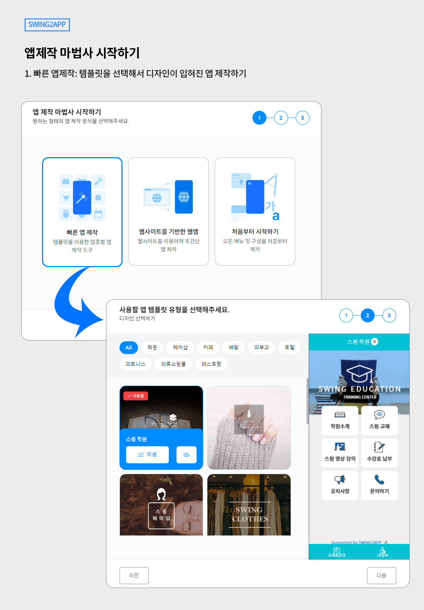
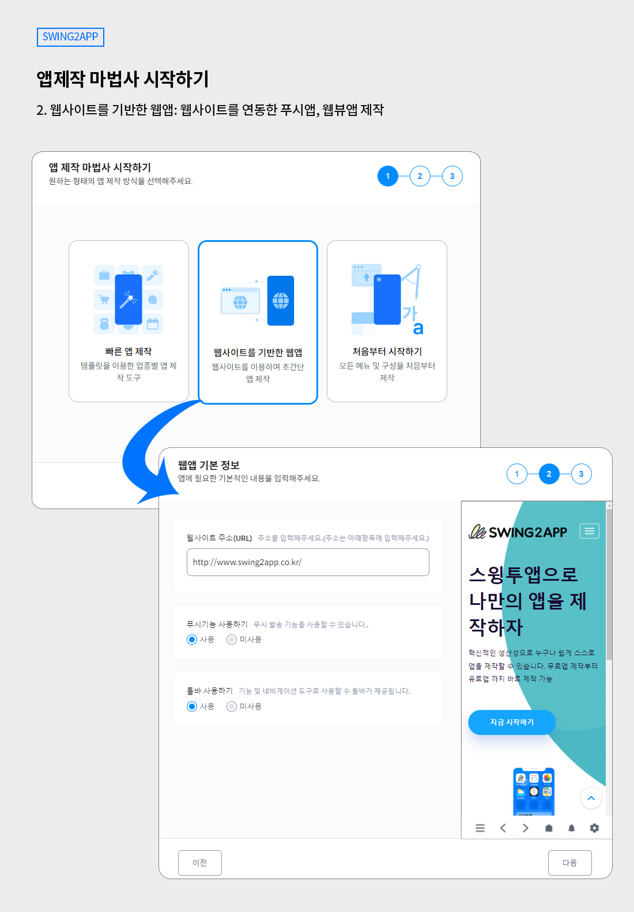
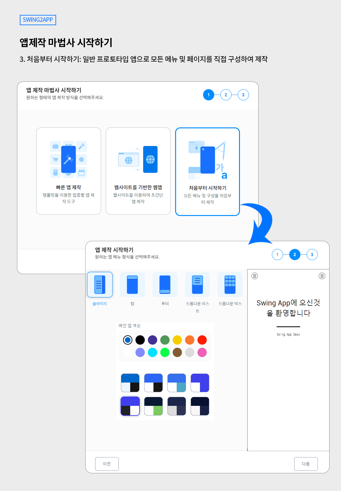

# V3 앱제작 마법사 시작

앱을 제작하기 전 어떤 스타일, 유형의 앱을 제작할지 제작 방식을 먼저 선택하고 앱을 제작하게 됩니다.

앱제작 마법사라고 부르며, 제작방법은 3가지로 제공이 됩니다.

###

##  **앱제작 3가지 방법**

-템플릿을 이용하여 디자인이 모두 입혀진 앱제작(일반 프로토타입)

-웹사이트를 연동한 웹뷰, 푸시앱 제작

-메뉴 및 페이지를 모두 직접 구성하는 앱제작 (일반 프로토타입)

앱제작 마법사는 새 앱을 제작하거나, 앱을 새로 추가 제작할 때 뜨는 화면이에요.

제작 중에는 뜨지 않습니다.

각 방법 중 하나를 선택하고 앱에 들어가는 기초 정보 입력 후 본격적인 앱제작 메이커 화면이 열립니다.

메뉴얼을 통해서 각 유형별 제작방법 특징을 확인해주세요.

##  방법1. 빠른 앱제작

템플릿을 이용한 앱제작 이구요. 일반 프로토타입으로 제작합니다.&#x20;

**<빠른 앱제작>을 선택하면 다음 단계에서 사용할 템플릿 유형을 고르게 되구요.**

**다음 단계에서 앱이름, 아이콘 이미지, 대기화면 이미지를 등록하면 기초 설계 끝!**&#x20;

**앱제작 메이커에서 본격적인 앱제작을 시작합니다.**&#x20;

각 페이지별 디자인 및 메뉴 구성이 어려울 경우 업종별 디자인이 모두 입혀진 템플릿을 선택하여  쉽게 앱을 만들 수 있다는 장점이 있습니다.

디자인이 모두 입혀진 페이지에 이미지, 제목 및 본문 등의 텍스트, 링크/ 배너 연결 등의 기능만 수정하여 제작할 수 있습니다.

만들고자 하는 앱의 스타일을 잘 생각하여 선택해서 제작해주세요.&#x20;

<mark style="color:green;">\*템플릿에 구성된 디자인 UI 툴 자체는 수정이 안되요.</mark>&#x20;

모든 UI화면을 각각 구성하고 싶을 경우 앱제작 메이커에서 페이지에서 제공하는 메뉴들을 확인하여 각각의 메뉴를 구성하여 넣어주세요.&#x20;

<mark style="color:green;">\*다시 앱을 제작하지 않아도 됩니다.</mark>&#x20;

만든 앱 위에 수정하여 업데이트할 수 있기 때문에 템플릿으로 작업했다가 일반 메뉴로 변경하는 등 자유롭게 수정하여 제작해주세요.&#x20;

##  방법2. 웹사이트 기반한 웹

두번째 방법은 웹앱 제작 스타일입니다.

웹사이트를 앱에 바로 적용해서 만드는 웹앱으로 - 웹뷰, 푸시앱을 제작할 수 있는 유형입니다.

웹뷰, 푸시 앱을 제작한다면 두번째 방법을 선택해서 제작해주세요.

**웹앱 선택 후에는 웹앱에 필요한 기본 정보 - 웹사이트 주소, 푸시 사용 여부를 선택해주시구요.**

**마지막 단계에서 앱이름, 아이콘 이미지, 대기화면 이미지를 등록하면 기초 설계 끝!**

**​**

<mark style="color:green;">**\*푸시 기능 사용시 - 푸시앱으로 제작이되며, 미사용으로 체크시 웹뷰앱으로 제작됩니다.**</mark>

<mark style="color:green;">**푸시 사용 여부는 앱제작 메이커에서도 자유롭게 수정 가능합니다.**</mark>

<mark style="color:green;">**\*그 외에 웹앱에 제공되는 메뉴들 역시 제작 메이커에서 선택해서 앱제작을 완료할 수 있습니다.**</mark>

##  방법3. 처음부터 시작하기

세번째 방법은 일반 프로토타입 앱제작으로 모든 메뉴 및 페이지를 직접 구성하여 제작하는 방법입니다.

원하는 디자인이 없거나, UI 구성을 직접 다 꾸미고 싶다면 세번째 방법을 선택해서 제작해주세요!

​

**<처음부터 시작하기>를 선택하면 다음 단계에서 프로토타입 스타일 선택, 앱 색상(컬러)를 선택하게 되구요.**

**다음 단계에서 앱이름, 아이콘 이미지, 대기화면 이미지를 등록하면 기초 설계 끝!**

**앱제작 메이커에서 본격적인 앱제작을 시작합니다.**


<mark style="color:green;">\*앱제작 메이커에서 얼마든지 수정하고, 업데이트할 수 있으니 처음에 고른걸 바꾸고 싶다면 기존 앱에 덮어서 수정해주시면 됩니다.</mark>

<mark style="color:green;">\*<처음부터 시작하기>를 선택해도, 페이지 단계에서 템플릿을 선택할 수 있어요.</mark>

<mark style="color:green;">따라서 일반 앱 제작 스타일 +템플릿 스타일 등 자유롭게 접목하여 제작할 수 있습니다.</mark>


앱제작 마법사에서 원하는 앱제작 유형을 선택하여 앱을 제작해주세요.

일반 앱제작 전체과정 매뉴얼은 아래 링크로 확인해주세요.&#x20;

[V3앱제작 매뉴얼 확인하기](guide.md)

