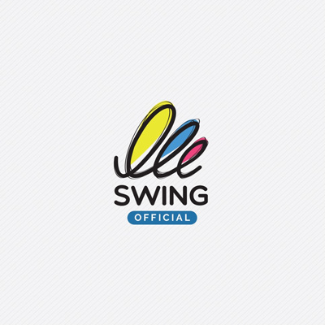
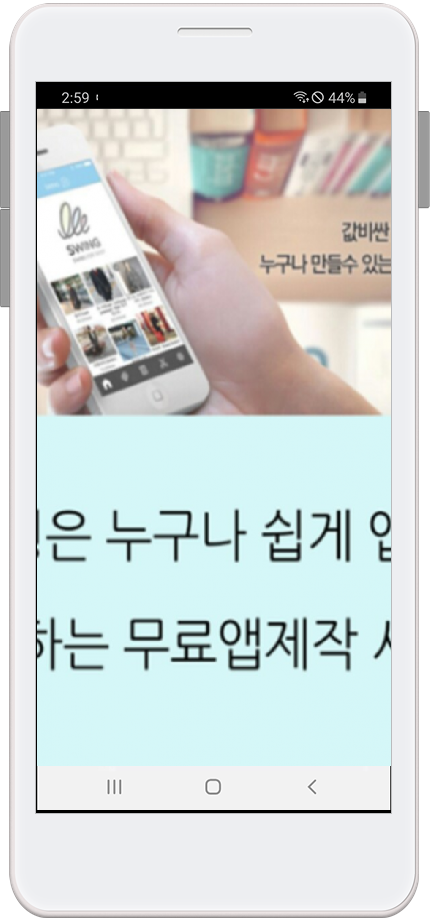

# 대기화면 이미지 제작 가이드

<figure><figcaption></figcaption></figure>

###  (1).png>) 1. 대기화면 이미지란?

대기화면은 앱이 실행되기 전 (앱 로딩 시간 동안 보여지는) 잠깐 1\~2초 정도 보여지는 이미지입니다.&#x20;

대기화면 이미지는 어플에서는 꼭 등록을 해야 하는 필수사항이기 때문에 사용자분들은 어플을 만들면서 대기화면 이미지 제작도 신경을 써주셔야 합니다.

(시중에 있는 어플을 보면 회사를 홍보할 수 있는 이미지를  대기화면에 넣어놓고 있기 때문에 홍보용으로도 꼭 필요하죠^^)


<mark style="color:blue;">**대기화면 이미지 사이즈 중요 안내**</mark>

**대기화면 이미지는 정사각형 사이즈로 (2282\*2282)로 제공하고 있는데요.**

**핸드폰은 보통 세로가 긴 직사각형인데 정사각형 이미지를 넣으면 이미지가 깨지거나 찌그러져 보이지 않나요? 라는 질문을 하십니다.**&#x20;

일단 정사각형으로 사이즈를 제공하는 이유는 핸드폰 종류가 너무나 다양하고 특히 정사각형 사이즈의 핸드폰도 있죠!!

그래서 공식적으로 어플에서 제공하는  대기화면 사이즈가  (2282\*2282)px이 됩니다.

그런데 대기화면을 만들 때는 가이드라인이 있기 때문에\~\~&#x20;

제작방법 가이드라인을 확인한 뒤 가이드에 맞게 제작을 해주셔야 이미지가 잘리거나 찌그러져 보임 없이 아주 깨끗하게 적용할 수 있답니다.&#x20;



 (1).PNG>)

###  (1).png>) **2. 대기화면 가이드라인**

대기화면에 들어갈 이미지는 가이드라인을 참고해서 만들어주세요.

보통 앱 대기화면은 정사각형 비율로 작업을 하게 됩니다. \*대기화면 이미지 사이즈: 2282px\*2282px

<mark style="color:red;">\*배경색은 투명색으로 하지 않도록 하구요. 반드시 색상을 채워주세요</mark>

<mark style="color:red;">중요\*\* 파란색으로 보이는 부분에 배경이미지를 넣고, 가운데 회색 영역이 중요이미지 및 로고가 들어갈 부분입니다.</mark>

즉 전체 이미지는 배경이미지로 지정해놓고, 중요 이미지는 화면 가운데로 배치해놓아야 합니다.

그래야만 핸드폰 기종에 따라서도 잘리거나 찌그러지지 않고 정상적으로 보일 수 있습니다.\

<mark style="color:blue;">**+대기화면 이미지 예시**</mark>

기존의 앱들 역시 **대기화면을 보시면 중요이미지를 가운데에 배치하고 전체 이미지는 배경이미지로 만들어서 제공하고 있어요.**

**아래 내용을 통해서 제작 가이드 방법을 확인해주세요.**

 (1).PNG>)

### &#x20; (1).png>)**3. 제작방법1–포토샵 실행**&#x20;

**먼저 대기화면 이미지를 제작할 수 있도록 포토샵을 열어서 작업해볼게요!!**

**1. 2282\*2282 대기화면 사이즈의 네모 이미지를 먼저 만들어주세요.**

**2. 눈금선을 이용하여 총 9등분을 내구요. (굳이 눈금선을 내지 않아도 되지만 좀 더 정확하게 이미지 작업이 되요)**

**3.  750\*750 px 사이즈의 정사각형 네모 영역을 가운데로 배치합니다.**&#x20;

\= 이해를 좀 더 쉽게 할 수 있도록 영역에 컬러를 넣었는데요.

(이미지 제작이 다 되면 색상은 빼면 되니 일단 색상을 넣어서 만들어보겠습니다)

**\* 회색으로 된 부분은 이미지의 전체 영역으로 배경이 들어가는 부분입니다.**

**\* 그리고 실제로 핸드폰에서 보여지는 이미지는 바로 파란색 영역이 되는데요.**&#x20;

파란색 영역 안으로 만드시고자 하는 이미지 혹은 회사의 로고를 넣어서 이미지를 만들어주십니다. \
\
<mark style="color:red;">**\* 파란색 영역 안으로만 작업해주세요.**</mark>

<mark style="color:red;">**회색은 핸드폰 상에서 잘리는 부분이기 때문에 파란색 영역을 넘어가지 않도록 해주세요.**</mark>&#x20;

***

&#x20; <mark style="color:blue;">**>파란색 영역에 이미지 넣기**</mark>

만들어 놓은 파란색 영역에 로고 혹은 이미지를 넣어줍니다.

따로 이미지를 제작하셔도 좋지만 가장 깔끔한 것은 회사의 로고 정도를 넣어주시는게 가장 좋아요.

만약 별도의 홍보용 이미지를 만들어서 넣고자 하신다면 영역 안으로만 넣어주시면 될 것 같습니다.

회사 로고인 스윙이미지를 넣어주었는데요.

이미지에서 보듯이 이렇게 영역 안으로 깔끔하게 넣어주시면 됩니다. &#x20;

 (1).PNG>)

###  (1).png>) **4. 제작방법2-배경색 삭제하기**

이미지 작업이 다 완료되었으면 아까 넣어둔 배경색과 영역색을 삭제해줍니다.&#x20;

**\*배경색을 아예 없애면 투명하게 지정이 되니깐요. 흰색이나 사용자가 원하는 다른 색상으로 꼭!! 넣어주세요.**

 (1).PNG>)

###  (1).png>) **5. 제작방법3-배경 이미지 업그레이드하기**

그냥 단색으로 배경이미지를 덮어버리기 뭔가 아쉽다면..

좀 더 업그레이드해서 배경이미지에도 효과를 넣어주시면 됩니다.

배경이미지는 핸드폰에서는 잘려서 보이기 때문에  큰 이미지로 하나 넣는 것이 아니라 브러시 효과만 줘도 좋을 것 같아요.

자! 이렇게 대기화면 가이드라인 방법을 보시고 이미지를 제작하시면 절대\~ 핸드폰에서 잘리거나 찌그러져 보이지 않아요 ^^

<mark style="color:blue;">**그림판으로 대기화면 이미지 만들기!!**</mark>

**만약 포토샵이 없어서 대기화면 이미지를 만들기 힘드시다면!! 그림판을 이용해서도 만들 수 있어요!**

1\. 그림판을 실행 한뒤 상단의 \[크기 조정]메뉴에서 2282\*2282 사이즈 크기의 이미지를 만듭니다.

2\. 그리고 \[사각형 도형] 툴팁을 선택해서 중앙에 750\*750 사이즈로 만들어주세요.

(750 사이즈가 아니라 749가 되었네요 ㅠ 이정도 오차는 괜찮아유 ㅎㅎ)

3\. 그러면 포토샵에서 본 것과 동일하게 해당 영역 안으로 이미지를 넣어서 제작할 수 있습니다.

4\. 만든 후 사각형 영역은 삭제해주시면 됩니다.&#x20;

 (1).PNG>)

###  (1).png>) **6. 앱에 대기화면 이미지 등록하기**&#x20;

<mark style="color:orange;">**앱제작 V3버전 이용시)**</mark>

<figure><figcaption></figcaption></figure>

앱제작 → STEP1 기본정보 → 대기화면 업로드를 마우스로 클릭하면 이미지 첨부 창이 뜹니다.

등록 후 저장해주시면 반영됩니다.

<mark style="color:orange;">**앱제작 V2버전 이용시)**</mark>

만들어놓은 대기화면 이미지를 앱제작에서 적용해주세요

**앱제작 → 1.앱기본정보 단계→대기화면 항목** 이미지에 마우스로 클릭하면 이미지 첨부 창이 뜹니다.

등록 후 저장해주시면 반영됩니다.

 (1).PNG>)

###  (1).png>) **7. 앱 실행) 핸드폰에서 대기화면 이미지 확인하기**

어플을 실행 한 후 나타나는 대기화면이미지입니다.

위에서 만든 대기화면 이미지를 등록했는데요.&#x20;

이미지를 정사각형 비율로 만들었지만 직사각형의 핸드폰 화면에 아주 잘 맞게 들어갔죠? ^^

이러한 방법으로 대기화면 이미지를 제작해주세요.

 (1).PNG>)

###  (1).png>) **8. 대기화면 잘못된 예시**

 <mark style="color:blue;">**대기화면 이미지 잘못된 예시1**</mark>

대기화면 이미지를 만들 때 위의 방법처럼 가운데 이미지 영역을 만들어 놓지 않고 **이미지를 전체 배경 사이즈에 꽉 채워서 넣게 되면, 핸드폰 어플 실행시 해당 이미지가 잘리거나 세로로 길게 찌그러져서 보여요!**

절대 이미지는 화면에 가득채워서 제작하지 마세요!

<mark style="color:blue;">**어플실행 화면) 잘못된 방법의 대기화면 이미지 확인**</mark>

 <mark style="color:blue;">**대기화면 이미지 잘못된 예시2**</mark>

그리고 2번째도 역시 비슷한데요.

**화면 전체에 글자(텍스트)를 꽉 채워서 넣는 경우입니다.  이 경우도 글자가 잘리거나 이미지가 길게 늘어나게 보여요.**&#x20;

보통 대기화면 이미지는 글자를 많이 넣지 않는 것을 권장드리고 싶어요. 간단하고 심플한 이미지를 넣는 것을 추천드려요!

<mark style="color:blue;">**어플실행 화면) 잘못된 방법의 대기화면 이미지 확인**</mark>

이미지 글자가 잘려서 보이고 일그러지면서 해상도도 엄청깨집니다**.**

따라서 대기화면 이미지는 꼭!! 가이드라인을 따라서 만들어주세요!!\


<mark style="color:green;"><mark style="color:red;">**잊지 말아야 할 점**<mark style="color:red;"></mark>

대기화면 전체에 이미지를 채우는 것이 아니라 겉의 배경이미지를 남겨두고(잘려도 되는 부분),&#x20;

가운데 정사각형 영역에만 이미지를 적용한다는 것!!(실제로 핸드폰에서 보여지는 이미지) 꼭 잊지 말아주세요


