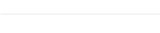

# STEP3 페이지

앱제작 V3 제작 매뉴얼 중 STEP3 페이지 단계 제작 방법을 알려드립니다.

**\[STEP3 페이는] 앞서 만들어놓은 전체적인 앱 툴에 카테고리와 메뉴를 만들어서 본격적으로 앱 내용을 구성하는 단계입니다.**

## **STEP3 페이지**

왼쪽의 화면 설정 카테고리에서 적용해야 하는 메뉴들을 확인할 수 있구요.

홈화면을 적용하는 방법과 메인 메뉴를 적용하는 방법을 알려드리겠습니다.

###  **1.홈화면 적용 방법**

**홈화면은 앱을 실행하면 보이는 메인화면으로, 사용자가 직접 메인화면을 어떻게 보여지게 할지 구성할 수 있어요.**

**스윙투앱에서 제공하는 메뉴 – 웹링크, 스윙페이지, 사용자페이지, 게시판, 이미지 등의 메뉴를 적용할 수 있습니다.**

**해당 가이드에서는 업종별 템플릿을 적용해보겠습니다.**

왼쪽 카테고리에서 \<HOME> 선택

1\) 메뉴 이름 입력 화면 상단에 보여질 이름을 입력합니다.

입력 후 커서를 한번 클릭하거나 엔터 버튼을 누르면 가상머신으로 바로 반영됩니다.

2\) 페이지 디자인: 업종별 템플릿 선택 후 \[새로 만들기] 버튼을 선택합니다.

\*만들어놓은 페이지가 없기 때문에 먼저 페이지 템플릿 제작도구로 이동하여, 템플릿 페이지를 제작해야 합니다.

​

#### **\[템플릿 페이지 제작도구 화면]**

템플릿 페이지 제작방법은 아래 제작 매뉴얼을 확인하여 참고해주세요!

**☞** [**템플릿 페이지 제작 및 운영방법 확인하기**](https://wp.swing2app.co.kr/documentation/maual/pagemenu/template-page/)

**템플릿 제작 후 다시 앱제작 화면으로 돌아와주세요.**

3\)새로고침 버튼을 선택하면, 만들어놓은 템플릿이 화면이 뜨게 됩니다.

4\)마우스 커서를 템플릿에 가져다 대면 **<미리보기, 적용하기, 관리하기>** 메뉴가 뜹니다.

앱 적용 전 미리 확인하고 싶다면, ‘미리보기’ 선택, 앱 적용은 ‘적용하기’, 수정 작업은 ‘관리하기’를 선택해주세요.

‘적용하기’ 메뉴를 선택합니다.

5\)\[저장] 버튼을 선택하면 홈화면에 적용된 템플릿을 가상머신 화면으로 확인할 수 있습니다.

###  **2. 메뉴 관리**

**​**

**1)메뉴 추가 및 삭제**

왼쪽 카테고리에 기재된 메뉴들은 스윙투앱에서 초기 셋팅한 메뉴들로 모두 수정하여 사용할 수 있습니다.

따라서 필요 없는 메뉴는 삭제하고, 추가하여 원하는 메뉴들로 구성할 수 있습니다.

메뉴에 마우스를 가져다 되면 휴지통 모양 아이콘, +모양 아이콘이 뜹니다.

**\*메뉴 삭제: 휴지통 아이콘 선택**

**\*메뉴 추가; + 아이콘 선택**

아주 쉽게 메뉴를 삭제하고, 추가할 수 있습니다.

**​**

**​**

**2)메뉴 적용**

(1)메뉴를 추가해주세요.

(2)메뉴 이름을 입력합니다.

(3)메뉴 아이콘: 선택사항으로 아이콘을 적용하실 경우만 입력해주세요. \*필수 아님

(4)페이지 디자인에서 어떤 메뉴를 적용할 것인지 선택해주세요.

\*해당 가이드에서는 ‘게시판’을 적용해보았습니다.

UI KIT 선택 게시판 선택 적용하고자 하는 게시판 스타일 선택 후 적용하기 버튼 선택

(5)저장 버튼을 선택합니다.

가상머신을 통해 게시판이 잘 반영되었는지 확인할 수 있습니다.

**​**

**3) 메뉴 이동**

**\[움짤 이미지 GIF로 메뉴 이동 확인하기]**

메뉴는 마우스로 끌어서 이동시킬 수 있습니다.

마우스로 메뉴를 선택하고 잡아서, 이동할 위치로 드래그 해주세요.

드래그하는 위치로 메뉴 이동이 완료됩니다. – 하위 혹은 상위 메뉴로 구성할 수 있습니다.

**Related Articles**

* [앱 홈화면 제작방법](https://wp.swing2app.co.kr/documentation/v3manual/home/)
* [STEP2 디자인](https://wp.swing2app.co.kr/documentation/v3manual/step2-design/)
* [STEP1 기본정보](https://wp.swing2app.co.kr/documentation/v3manual/step1-basic/)
* [푸시 아이콘 이미지 등록하기](https://wp.swing2app.co.kr/documentation/appmanage/pushmember/pushicon/)
* [메뉴 권한 설정: 접근 권한 이용방법](https://wp.swing2app.co.kr/documentation/v3manual/permission-setting/)
* [앱 메뉴 비활성화 이용방법](https://wp.swing2app.co.kr/documentation/v3manual/menu-hiding/)
