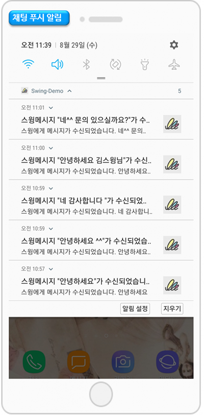

# 페이지 기능 - 관리자 채팅

**관리자와 앱 회원 1:1 채팅 이용방법 \[관리자 채팅]**

운영자가 앱을 이용하는 회원과 대화를 할 수 있는 기능이구요.

카카오톡이나 메신저처럼 실시간으로 대화를 주고 받을 수 있기 때문에 특정 회원과의 커뮤니케이션이 필요한 경우 유용하게 사용할 수 있습니다.

\-앱 관리자가 회원을 선택하여 채팅을 할 수 있구요.

\-앱 회원 역시 앱에 적용된 채팅방 메뉴에서 관리자에게 대화를 걸 수 있어요.

매뉴얼통해서 관리자 채팅(1:1 채팅)을 이용하는 방법을 확인해주세요.

###  **1. 앱에 관리자 채팅 적용하기**

\* 먼저 앱에 \[관리자 채팅] 페이지를 적용해야 사용자와 관리자 모두 채팅을 할 수 있겠죠?

관리자 채팅 기능은 앱제작 – STEP3페이지 단계 – 페이지 기본기능에서 제공하고 있습니다.&#x20;

앱제작 화면 이동

1\)STEP3 페이지 단계로 이동합니다.

2\)새 메뉴를 만들어주세요. (+ 모양 버튼 선택하여 메뉴 추가)

3\) 메뉴 이름 입력

4\) 페이지 디자인에서 \[기본 기능] -\[페이지]를 선택해주세요.&#x20;

5\) ‘관리자 채팅’ 페이지를 찾아서 \[적용하기] 버튼을 선택해주세요.&#x20;

(페이지에 마우스 커서를 가져다 대면 적용하기 버튼이 열립니다)

6\) 화면 상단 \[저장]버튼을 누르면 앱에 적용됩니다.&#x20;


\*미리보기 버튼을 선택하면 해당 페이지가 어떻게 보여지는지 웹 미리보기(가상머신)으로 확인가능하구요.

\*페이지 적용 후에 가상머신을 통해서도 해당 페이지가 어떻게 앱에 적용되는지 확인 가능합니다.

\*제작 단계 중 메뉴 아이콘 , 메뉴 설정은 필수 입력 항목이 아닙니다.

해당 매뉴얼에서는 입력 없이 진행했으며, 앱 제작시 필요할 경우 추가로 적용해주세요.


####  <mark style="color:blue;">**채팅목록  기능도 추가해주세요!**</mark>

채팅목록은 채팅한 내역을 확인할 수 있는 메뉴에요.

채팅목록도 앱에 적용해주셔야 대화가 종료된 후에도 목록창에서 대화 내역을 확인할 수 있습니다.

앱제작 화면 이동

1\)STEP3 페이지 단계로 이동합니다.

2\)새 메뉴를 만들어주세요. (+ 모양 버튼 선택하여 메뉴 추가)

3\) 메뉴 이름 입력

4\) 페이지 디자인에서 \[기본 기능] -\[페이지]를 선택해주세요.&#x20;

5\) ‘채팅목록’ 페이지를 찾아서 \[적용하기] 버튼을 선택해주세요.&#x20;

(페이지에 마우스 커서를 가져다 대면 적용하기 버튼이 열립니다)

6\) 화면 상단 \[저장]버튼을 누르면 앱에 적용됩니다.&#x20;

###  **2. 앱 실행화면: 채팅방 화면**

앱 실행화면을 보시면 채팅방에서 관리자가 입력한 메시지를 받고, 앱 회원이 글을 입력하여 주고 받을 수 있습니다.

***

**앱 사용자(회원)는 어떻게 관리자와 채팅을 할 수 있을까요?**

**사용자는 앱에서 채팅메뉴로 들어가서 대화를 할 수 있고, 대화목록은 채팅목록에서 확인가능합니다.** &#x20;

아래에 채팅을 하는 방법을 확인해주세요!!


**앱 사용자(회원)는 어떻게 관리자와 채팅을 할 수 있을까요?**

사용자는 앱에서 채팅메뉴로 들어가서 대화를 할 수 있고, 대화목록은 채팅목록에서 확인가능합니다.  아래에 채팅을 하는 방법을 확인해주세요!!


###  **3. 사용자가 앱 관리자와 채팅을 하는 방법**

위에서 만들어놓은 채팅방 메뉴로 들어오면 바로 대화창이 열리구요.

사용자가 자유롭게 메시지(글) 입력이 가능합니다.

####  **채팅목록**&#x20;

대화를 한 뒤 다시 해당 관리자와 채팅을 하고 싶을 경우 ‘채팅목록’으로 들어가시면 됩니다.

나의 대화 목록을 확인할 수 있구요.

여기서 대화를 한 관리자 명단을 확인할 수 있습니다.

\*채팅목록 메뉴 역시 스윙페이지에서 이용 가능합니다.

관리자 채팅 기능을 이용하신다면, 메뉴에 채팅목록도 함께 추가해주시기 바랍니다.

☞ [채팅목록 이용방법 보러가기 ](../../v2/pagemenu/chat-list.md)

***

**관리자는 어떻게 앱 회원들과 채팅을 할 수 있을까요?**

**관리자는 스윙 웹(앱운영페이지)에서 제공하는 회원조회 메뉴에서 회원을 선택하여 대화를 할 수 있습니다.**

아래에 관리자가 앱 회원들과 채팅을 하는 방법을 확인해주세요!!


**관리자는 어떻게 앱 회원들과 채팅을 할 수 있을까요?**

관리자는 스윙 웹(앱운영페이지)에서 제공하는 회원조회 메뉴에서 회원을 선택하여 대화를 할 수 있습니다. 아래에 관리자가 앱 회원들과 채팅을 하는 방법을 확인해주세요!!


###  **4. 관리자가 앱 회원과 채팅을 하는 방법**

관리자는 웹(스윙 홈페이지)에서 채팅을 할 수도 있고, 앱에서도 이용할 수 있어요.

**1) 회원조회 페이지 이동**

스윙 홈페이지 [앱운영페이지 → 푸시&회원 → 회원조회](http://www.swing2app.co.kr/view/member\_list) 메뉴로 이동합니다.

**회원조회 페이지에 보시면 \[전용대화하기], \[공용대화하기] 버튼을 확인할 수 있습니다.**

**회원조회 페이지에서 대화를 할 회원을 선택 후 해당 대화하기 버튼을 선택하면 채팅이 시작되요!!**


**전용대화? 공용대화란?**

대화하기 옵션은 앱 회원에게는 크게 상관은 없구요. 관리자들이 선택할 수 있는 채팅 옵션이에요.

**▶ 전용대화하기**

채팅을 하고 있는 관리자만 확인할 수 있어요.

다른 관리자들에게는 채팅 푸시가 들어오지 않습니다.

**▶ 공용대화하기**

관리자가 여러명일 경우 대화 내용을 공유해야 할 때 사용할 수 있어요.

공용대화하기로 채팅을 하면, 앱 회원이 채팅 메시지 입력시 다른 관리자들에게도 채팅 푸시가 들어와요.


대화를 하고자 하는 회원을 선택한 뒤 상단의 \[대화하기] 버튼을 선택합니다.

​

**3) 채팅 목록 페이지 이동: 채팅창 오픈**

대화하기를 선택하면, 채팅 목록 페이지로 이동하구요.

채팅창이 오픈됩니다.

관리자는 해당 채팅방에서 글을 입력하고 회원과 채팅을 할 수 있어요.

​

**\[채팅 목록 페이지]**

채팅 목록 페이지에서는 기존에 채팅을 했던 모든 회원들의 채팅목록을 확인할 수 있어요.

따라서 이전에 채팅을 했던 회원에게 대화를 해야 할 경우 채팅목록 페이지에서 회원을 선택해서 다시 채팅을 이어서 할 수 있습니다.

**\*채팅관리자 페이지 이용방법은 해당 매뉴얼을 참고해주세요**

**☞** [**\[채팅 관리자 페이지 이용방법 보러가기\]**](../../appmanage/service/admin-chat.md)

 (1).PNG>)

###  (1).png>) 5**. 추가안내**&#x20;

앱에서 기존에 채팅을 한 회원과 다시 대화를 하고 싶다면, 채팅 목록을 이용해주세요.

채팅목록은 기존에 채팅을 한 회원 및 대화 목록을 확인할 수 있구요.

다시 대화를 하고자 하는 회원을 선택하여 채팅을 시작할 수 있습니다.

***

**관리자는 웹(스윙 홈페이지)에서 채팅을 할 수도 있고, 앱에서도 이용할 수 있어요.**

앱 관리자 로그인을 이용하면 관리자가 앱에서도 회원에게 대화를 할 수 있어요.

###  **6. 새글알람 푸시 알림 -관리자, 회원**

채팅을 하게 되면 앱 관리자 – 앱 회원 모두 채팅 메시지 알림 푸시를 받을 수 있습니다.


<mark style="color:red;">**안내사항**</mark>

**1) 1:1 채팅은 관리자 채팅으로, 관리자와 앱 회원간의 채팅 기능입니다.**

앱과 스윙투앱 앱운영페이지(웹)에서 사용할 수 있습니다.

\*앱 이용시: \[설정- 앱관리자 메뉴] 로그인 후 \[사용자관리]에서 원하는 사용자 선택 후 채팅

\*홈페이지는 위의 알려드린 방법으로 진행해주세요.

**2) 운영자와 채팅하기 메뉴(1:1 채팅)는 \*앱제작 페이지→ STEP3페이지 →페이지에서 \[관리자 채팅] 으로 적용해주시기 바랍니다.**

**3) 관리자와 여러명의 사용자와 대화할 수 있는 \[그룹채팅]** 도 이용할 수 있습니다.

그룹채팅 이용방법은 아래 매뉴얼을 확인해주세요!

**☞**[ **\[그룹채팅 이용방법 매뉴얼 보기\]**](https://wp.swing2app.co.kr/documentation/appmanage/board/groupchat/)



