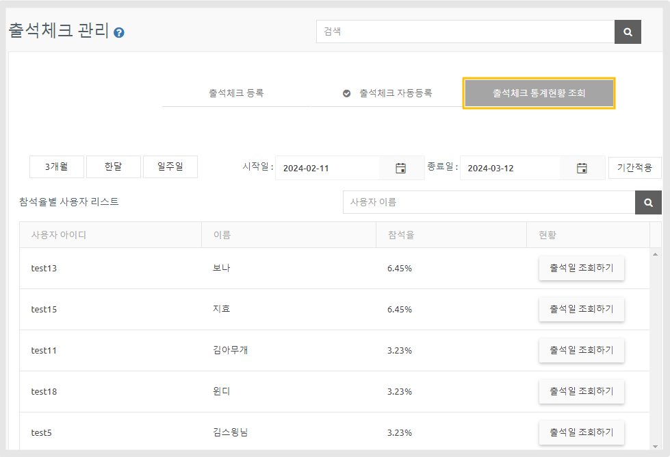
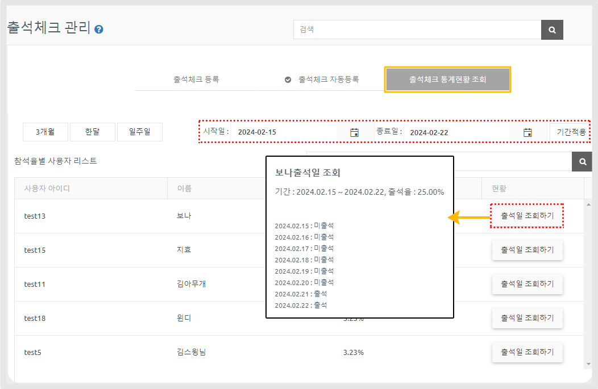

# 페이지 기능 - 출석체크

***

**출석체크란?**

**커뮤니티 및 이벤트로 사용할 수 있는 메뉴로 게시판과 비슷하지만, 출석 댓글 기능 및 마감 기능이 있다는 점에서 차이점이 있어요!**

따라서 출석체크는 게시판이 아닌 서비스관리 메뉴에서 이용할 수 있구요.

다양한  출석체크 이벤트로 앱 회원들의 참여를 이끌어낼 수 있습니다.

매뉴얼을 통해서출석체크 페이지를 앱에 적용하는 방법을 확인해주세요.

## &#x20;**STEP1.출석체크 등록하기**

출석체크 등록방법은 아래 매뉴얼을 통해 확인해주세요.

먼저 출석체크 페이지를  만든 후, 앱에 적용할 수 있습니다.

출석체크 등록은 앱운영 – 서비스관리에서 만들 수 있으며 상세 매뉴얼을 확인해주세요.



[앱운영 페이지 → 서비스관리 → 출석체크 ](http://www.swing2app.co.kr/view/attendance_board)메뉴로 이동합니다.

### <mark style="color:blue;">**1. 출석체크 등록하기**</mark>

**출석체크 관리에서 글을 입력합니다.**

1\) 출석 이벤트 제목을 입력합니다.

2\) 내용을 입력합니다.

3\) 이벤트에 들어갈 이미지를 첨부합니다.

4\) 작성이 완료되면 게시하기를 선택해주세요.

작성이 완료되면 출석체크 이벤트 글이 등록되요.

<mark style="color:purple;">**\*푸시 발송도 가능해요! 출석 이벤트를 앱 회원들에게 알리고자 할때는 푸시설정 버튼을 선택해서 푸시 알림을 보낼 수 있습니다.**</mark>

### <mark style="color:blue;">**2. 출석체크 자동등록**</mark>

**\*설정한 주기에 맞춰 출석체크 게시물을 자동으로 게시되고자 할 때 이용해주세요!!**

출석체크는 자동등록은 설정한 반복주기에 따라 게시물을 자동으로 게시되게 할 수 있습니다.

1\) 출석체크 자동등록하기에 체크해주세요.

2\) 출석 이벤트 제목을 입력합니다.

3\) 이벤트 내용을 입력합니다.

4\) 이벤트에 들어갈 이미지를 첨부합니다.

5\) 반복주기- 매주, 매일, 특정 요일, 시간 대를 선택해서 주기를 설정합니다.

<mark style="color:red;">\*\* 자동 등록 설정 역시 푸시 설정을 등록할 수 있습니다.</mark>

## **STEP2.출석체크 앱에 적용하기**

출석체크 등록이 완료되면, 앱에 적용해야하겠죠?

앱제작 – STEP3 페이지로 이동해서, 출석체크를 앱에 적용해볼게요!

앱제작 화면 이동

1\)STEP3 페이지 단계로 이동합니다.

2\)새 메뉴를 만들어주세요. (+ 모양 버튼 선택하여 메뉴 추가)

3\) 메뉴 이름 입력

4\) 페이지 디자인에서 \[기본 기능] -\[페이지]를 선택해주세요.&#x20;

5\) ‘출석체크’ 페이지를 찾아서 \[적용하기] 버튼을 선택해주세요.&#x20;

(페이지에 마우스 커서를 가져다 대면 적용하기 버튼이 열립니다)

6\) 화면 상단 \[저장]버튼을 누르면 앱에 적용됩니다.&#x20;


\*미리보기 버튼을 선택하면 해당 페이지가 어떻게 보여지는지 웹 미리보기(가상머신)으로 확인가능하구요.

\*페이지 적용 후에 가상머신을 통해서도 해당 페이지가 어떻게 앱에 적용되는지 확인 가능합니다.

\*제작 단계 중 메뉴 아이콘 , 메뉴 설정은 필수 입력 항목이 아닙니다.

해당 매뉴얼에서는 입력 없이 진행했으며, 앱 제작시 필요할 경우 추가로 적용해주세요.


<mark style="color:red;">**\*퀵 메뉴**</mark>

앱제작에서 출석체크 페이지로 바로 이동 가능합니다.

출석체크 페이지 \[관리하기] 버튼 선택 → \[출석체크 관리] 버튼을 선택하면 앱운영 출석체크 페이지로 이동합니다.

새로운 출석체크 등록이나, 수정이 필요할 경우 앱제작 메이커에서 바로 이동하여 관리할 수 있습니다.

## **STEP3.앱 실행화면 – 출석체크 확인**

앱을 실행하여 출석체크가 어떻게 앱에서 실행되는지 확인해볼게요!

출석체크 게시물을 확인하면, 출석체크 등록시 입력했던 게시물 내용과 이미지를 확인할 수 있어요.

게시글 하단에 \[출석체크 이벤트 참여]에 댓글을 달아서 참여할 수 있습니다.&#x20;

**▶출석체크 이벤트 마감**

이벤트를 마감하게 되면, 앱에서도 ‘마감된 이벤트’라고 창이 뜨게 됩니다.

**▶ 앱 운영자 대시보드 확인**

앱 운영자는 앱운영 대시보드 – 출석체크 페이지에서 출석체크 게시물에 달린 댓글을 확인할 수 있구요.

\*어플리케이션 내에서 확인 X, 스윙투앱 홈페이지 내 앱운영 페이지에서 확인 가능합니다.&#x20;

사용자 이름을 선택하면, 해당 회원 정보를 확인할 수 있습니다.

***

## **STEP4. 출석체크 통계 현황 조회**

<figure><figcaption></figcaption></figure>

**\*관리자가 사용자들의 출석체크 현황을 확인하는 메뉴입니다.**&#x20;

출석 체크에 참여한 사용자들의 상세 통계를 확인할 수 있습니다.

사용자들이 출석체크에 참여하면, 관리자는 ‘통계 현황 조회’ 에서 출석 체크 통계를 확인할 수 있습니다.

조회 기간을 설정하면 출석체크에 참여한 사용자(아이디, 이름), 참석율, 출석일을 상세히 조회할 수 있습니다.

<figure><figcaption></figcaption></figure>

1\)기간 적용 탭에서 통계 확인을 원하는 기간을 설정하여 확인할 수 있구요.

2\)사용자별 참석율 확인이 가능합니다.

3\)\[출석일 조회하기] 버튼을 탭하면 조회한 해당 사용자가 특정 기간 동안 출석한 일자를 확인할 수 있습니다.


<mark style="color:green;">**통계 활용 방법**</mark>

1\)사용자들이 얼마나 출석 참여를 했는지 확인 \*전체 통계 확인

2\)사용자별 출석 체크 현황 조회 \*사용자 개별 통계 확인

3\)특정 기간 동안의 사용자 출석일 조회&#x20;

4\)이벤트 진행시, 출석 체크 참여가 가장 많은 사용자를 선별할 때 사용

5\)출석부 기능으로 이용할 때에도, 통계 기능을 100%활용할 수 있습니다.


***

## **STEP5.&#x20;**&#x20;**출석체크 마감**&#x20;

출석체크는 \[마감] 기능이 있어요.

해당 이벤트 기간이 완료되면 출석체크 글을 마감하여 이벤트 종료를 할 수 있답니다.

출석체크 게시판 - 작성된 게시물 오른쪽에 '마감' 버튼이 있습니다.&#x20;

출석 이벤트 진행 후, 기간이 완료되면 \[마감] 버튼을 눌러서 글을 마감시켜주세요.

수정 및 삭제도 가능하니 원하는 기능을 사용해주세&#xC694;**.**

***
