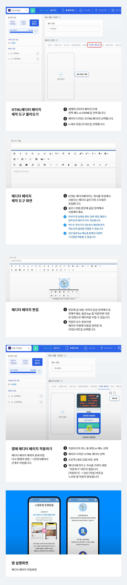

# 페이지 기능 - HTML에디터 페이지

***

  **HTML 에디터페이지란?**

스윙투앱 사용자페이지에서 제공하는 기능 중 하나로 사용자가 직접 웹페이지를 제작할 수 있는 메뉴에요.

블로그나 카페에 포스팅을 입력하듯이 글과 이미지를 자유롭게 배치하여 제작할 수 있구요.

웹링크, 동영상, 텍스트 효과 등을 다양하게 적용할 수 있습니다.

사용자가 원하는 스타일대로 자유롭게 만들 수 있는 점이 가장 큰 특징입니다.

  **에디터 페이지 특이사항**

HTML 에디터페이지는 사용자가 원하는 스타일대로 만들 수 있어요.

1\)이미지를 넣어서 이미지페이지처럼 제작할 수도 있구요.

2\)블로그 포스팅을 작성하는 것처럼 글과 이미지를 자유롭게 배치하고, 동영상이나 웹링크 이동을 적용할 수 있습니다.

따라서 미리 어떻게 제작을 할지 구상을 한 뒤 작업하시면 보다 쉽게 이용이 가능합니다.

3\)HTML 에디터페이지는 갯수 제한없이 무제한으로 만들 수 있어요!

***

##  **에디터 페이지 제작단계**

<figure><figcaption></figcaption></figure>

##  **앱 실행화면) HTML에디터 페이지 적용**

스윙투앱 공식앱에 적용된 HTML에디터 페이지에요.

제작은 위의 에디터 페이지를 참고하여 동일한 스타일로 만들어보겠습니다.

## **STEP1. 시작하기**

에디터 페이지 만들기는 앱제작에서 만들 수 있습니다.

1\)STEP3페이지 단계 이동

2\)페이지 디자인 \[HTML 에디터] 선택

3\)\[+새로만들기]를 선택해주세요.

\[+새로만들기]를 클릭하면 에디터 페이지 제작도구 화면이 열립니다.

아래에서 에디터 페이지를 제작하는 방법과, 제작 후 해당 페이지를 앱에 적용하는 방법을 알려드릴게요.

## **STEP2. 제작하기(HTML 에디터 페이지 제작도)**

### **1.**&#x48;TML 에디터 페이지 제작도구

위의 이미지가 HTML 에디터 페이지 제작도구 화면이에요.

HTML 에디터페이지는 게시물 작성에서 사용되는 에디터 글쓰기와 스타일이 동일합니다.

게시물 작성방법과 동일하니 어렵지 않게 사용하실 수 있습니다!

블로그나 게시판처럼 글을 작성할 수 있는 화면이 있구요.

상단에 보면 제작 및 글 작성에 필요한 다양한 옵션 기능 Bar를 확인할 수 있습니다.

\*페이지 이름이 앱 실행화면에서 페이지 제목으로 표시됩니다.


**이미지 및 동영상 첨부, 일반 파일, 웹링크 입력 등의 첨부가 모두 가능합니다.**

**그리고 텍스트 꾸미기가 가능하기 때문에 글씨폰트, 색상 등의 옵션을 지정할 수 있구요.**

**그 외에도 제작도구 옵션bar 메뉴를 통해서 다양한 스타일을 적용할 수 있습니다.**


&#x20;

그럼 위에서 보여드린 공식앱의 에디터 페이지처럼 작업해볼게요!

### **2.동영상 등록(유튜브 URL 입력)**

1\)동영상은 옵션바의 \[동영상 삽입] 아이콘 버튼을 선택해주시구요.

2\)동영상 URL을 입력해주세요.

이때 유튜브에 등록된 영상 URL을 입력하시면 간편하게 등록이 가능하시구요.

세번째 비디오 업로드 버튼을 누르면 영상 파일로도 첨부가 가능합니다.

3\)삽입 버튼을 누르면 본문에 영상 등록이 완료됩니다!!


**중요!!**

그런데 위의 방법으로 입력을 했는데 앱에서 보실때 영상 화면이 가로, 세로 비율이 맞지 않아 확대되어 보일 수 있어요.


### 앱 실행화면&#x20;

따라서 화면에 맞게 비율을 맞추고 싶다면 아래 방법으로 동영상 크기를 수정할 수 있어요.

영상을 마우스로 선택하면 영상 크기: 가로와 세로 길이를 직접 수정할 수 있습니다.

가로는 380px, 세로 200px로 수정했어요.

​

### **앱 실행화면**

영상 크기를 조율하면 앱 화면에서 영상 섬네일 비율을 좀 더 화면에 맞게 구성할 수 있습니다.

&#x20;

### **3. 이미지 등록**

1\)옵션바의 \[이미지 삽입] 아이콘 버튼을 선택해주시구요.

2\)이미지를 드래그&드롭 하거나, 클릭해서 첨부파일함에서 이미지 파일을 등록해주세요.

등록하면 화면에 바로 이미지가 적용됩니다.

\*이때 이미지는 실제 이미지 사이즈와 관계 없이 자동으로 가로 사이즈 300px로 수정이 됩니다.

​

웹 페이지에 등록되는 이미지는 핸드폰 화면 가로에 맞게 조율이 되기 때문에 가로 300px으로 사이즈를 맞춰 놓았어요.

따라서 이미지 사이즈가 조율이 되구요.

이미지 사이즈는 다시 수정하실 수 있어요!!

1\)이미지를 마우스로 클릭하시면, 아래로 옵션창이 열리구요. 여기서 **\[크기 변경]** 버튼을 선택해주세요.

2\)폭(가로) 입력란에 사이즈를 넣어주세요.

\*가로 길이만 넣으면 높이(세로)는 가로에 맞게 자동 조율됩니다.

3\)업데이트 버튼을 눌러주세요.


**반대로 이미지를 원래 이미지 사이즈대로 크게 수정하셔도되요.**

**실제 앱 화면에서는 가로에 맞게 꽉차게 나오기 때문에 자동 사이즈인 300px으로 쓰시거나, 원래 크기로 쓰셔도 됩니다.**

**대신 이미지가 화면에 작게 나와야 할때는 저처럼 이미지 크기를 작게 수정해주시면 됩니다.**


### **4. 본문 글 등록**

텍스트 입력은 마우스 커서를 본문으로 갖다 놓으면 글 입력이 되구요.

상단 옵션바에서 글꼴, 크기, 색상 등을 선택해서 원하는 스타일로 수정할 수 있습니다.

&#x20;

### **5. 웹링크 삽입**

스윙투앱 공식앱 에디터 페이지를 잠시 보시면 이미지를 터치하면 새로운 페이지로 이동하고 있죠!!

에디터 페이지에서도 각 이미지, 텍스트 등에 웹링크를 삽입할 수 있습니다.

이미지에 웹링크를 연동할 수 있기 때문에 터치하여 원하는 페이지로 이동 가능합니다.

**1)이미지를 마우스로 클릭하시면, 아래로 옵션창이 열리구요. 여기서 \[링크 삽입] 버튼을 선택해주세요.**

**2)URL입력 옵션창이 새로 열리구요. 해당 입력란에 URL(웹링크 주소)을 입력해주세요.**

**\*중요! \[새 탭에서 열기]를 선택해주셔야 조금 더 안정적으로 운영이 가능하니, 꼭 체크해주세요!**

**3)삽입 버튼을 선택하면 이미지에 링크가 연동 완료됩니다.**


**★ 잠깐!**

-저는 웹사이트 링크가 아니라, 이미지를 터치하면 앱에서 만들어놓은 특정 게시판으로 이동하게끔 하고 싶어요!

-이미지 페이지로 이동하고 싶어요!

-쇼핑몰 앱이라서 상품 페이지로 이동하게끔 하고 싶어요!!

이렇게 외부 웹링크가 아닌 앱에서 만들어놓은 페이지로 연동하고 싶으시다면 방법이 있죠!!

아래 내용을 확인해주세요.


 **링크 마법사 이용하기**

1\)이미지를 마우스로 클릭하시면, 아래로 옵션창이 열리구요. 여기서 **\[링크 삽입]** 버튼을 선택해주세요.

2\)URL입력 옵션창이 새로 열리구요.

여기서 2번째 아이콘 \[링크마법사] 버튼을 선택해주세요.

3\)**링크 마법사 팝업 창이 새롭게 열리구요.** 왼쪽 메뉴를 선택해서 원하는 스윙 기능을 넣어주실 수 있습니다.

-이미지 페이지를 넣고 싶다면, 사용자페이지를 선택해서 적용 가능하구요.

-게시판을 넣고 싶다면, 게시판 선택해서 적용해주시구요.

-특정 게시물로 이동하고 싶다면, 게시물 선택 후 – 게시물 검색해서 적용 가능합니다.

이렇게 일반 웹사이트 링크 외에도 \[링크마법사] 를 이용하면 앱 내에 사용된 페이지로의 이동이 가능합니다!!

&#x20;

### **6. 제작 완료시 저장 버튼을 눌러주세요.**

에디터 페이지 제작이 완료되면 저장 버튼을 누르고 나옵니다.

## **STEP3. 앱에 적용하기(HTML에디터 페이지 앱 적용)**

앱제작 화면 이동

1\)STEP3 페이지 단계로 이동합니다.

2\)홈화면 – HOME 선택

3\)메뉴 이름 입력

4\)페이지 디자인에서 \[HTML 에디터]를 선택해주세요.

5\)오른쪽에 있는 ‘새로고침’ 버튼을 선택하면 만들어놓은 페이지를 확인할 수 있습니다.

6\)\[적용하기] 를 선택합니다. (페이지에 마우스 커서를 가져다 대면 적용하기 버튼이 열립니다)

7\)화면 상단 \[저장]버튼을 누르면 앱에 적용됩니다.&#x20;


\*홈화면을 선택해서 페이지를 적용했지만, 홈화면 외에 메뉴에도 적용이 가능해요.&#x20;

메뉴에도  페이지를 적용할 수 있습니다.

\*미리보기 버튼을 선택하면 페이지가 어떻게 보여지는지 웹 미리보기(가상머신)으로 확인가능하구요.

\*페이지 적용 후에 가상머신을 통해서도 페이지가 어떻게 앱에 적용되는지 확인 가능합니다.

\*제작 단계 중 메뉴 아이콘 , 메뉴 설정은 HOME에는 적용 불가하며 필수 입력 항목이 아닙니다.


***

## **STEP4. HTML에디터 페이지 제작 TIP**

제작에 필요한 몇가지 기능들을 더 소개해드리면요!

### **1. 수평선**

글을 작성하다 보면 위의 내용과 아래 내용을 구분할 만한 뭔가가 필요할 때가 있죠!

보통 구분선이라고 하는데요.

옵션 bar에서 \[수평선을 삽입] 버튼을 누르면, 본문에 구분선이 적용됩니다.

&#x20;

### **2. 전체화면**

페이지 작업을 하다보면 내용이 길어져서 페이지가 아래로 내려가는데요.

페이지가 내려가면서 상단 옵션 bar가 작업 시야에서 사라지게 되요. ㅠㅠ

그래서 다시 마우스로 올려서 선택하고,,, 이러한 불편함이 있는데요.

이때! **옵션 bar의 마지막 버튼인 \[전체화면] 버튼을 선택하면 화면이 전체화면으로 옮겨지며 이러한 불편함이 사라집니다.**

옵션 bar가 상단에 딱!! 고정이 되기 때문에 아무리 페이지를 아래로 내려도 작업 시야에서 없어지지 않고 편하게 작업이 가능합니다 ^^

​

### **3. 빠른 삽입**

본문 화면에서 왼쪽에 보시면 +모양 버튼이 있습니다.

빠른 삽입 버튼으로, 해당 버튼을 선택하면 이미지 삽입, 동영상 삽입, 수평선 삽입 등 자주 사용하는 옵션기능을 빠르게 이용할 수 있어요.

## **STEP5. 편집하기(HTML에디터 페이지 수정 방법)**

수정은 동일하게 앱제작 메이커 – HTML 에디터 \[수정하기]로 들어가서 만들어놓은 페이지 위에 덮어서 수정해주시면 됩니다.

에디터 페이지에 마우스 커서를 올리면 \[관리하기]버튼이 있습니다.&#x20;

\[관리하기] 버튼 선택 후 → \[수정하기] 버튼을 선택해주세요.&#x20;

HTML 에디터 페이지 제작도구 화면으로 이동합니다.

에디터 페이지 수정도 별도의 페이지가 따로 있는 것이 아니구요.

제작 페이지와 동일하게 들어가서, 기존에 만들어놓은 페이지 위에 덮어서 수정을 하는 방법으로 업데이트할 수 있어요.

