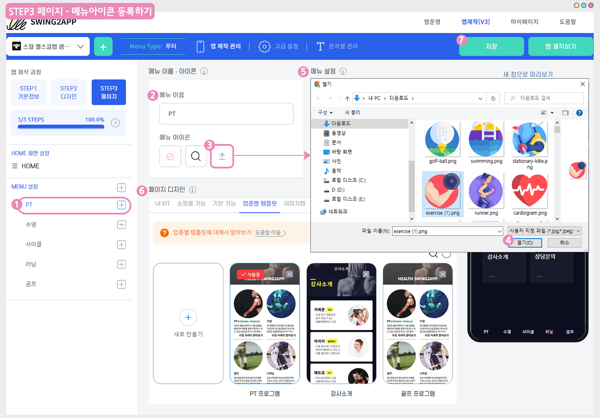

# 메뉴 아이콘 이미지 등록하기

&#x20;**메뉴 아이콘 이미지 등록방법**

일반 프로토타입 앱제작시 메뉴에 아이콘을 등록할 수 있는데요.

(푸시앱 제작시에도 툴바에 아이콘 메뉴가 있으며, 해당 메뉴에서도 이미지를 등록할 수 있습니다.)

앱제작 프로그램에서 기본으로 제공되는 아이콘 이미지 외에, 원하는 이미지를 사용자가 직접 등록해서 사용할 수 있습니다.

해당 매뉴을 통해서 메뉴를 구성하는 방법과 아이콘 이미지를 어떻게 등록할 수 있는지 확인해주세요.

### ****.png>) **앱 실행화면) 아이콘 이미지 등록된 앱 확인하기**

​푸터 프로토타입 앱이구요,

하단 푸터 바에 보시면, **메뉴에 아이콘 이미지가 등록된 것을 확인할 수 있습니다.**

<mark style="color:blue;">**기존 v2버전에서는 아이콘이 스윙투앱에서 제공하는 이미지로만 선택 가능했지만,**</mark>

<mark style="color:blue;">**v3 업데이트 버전에서는 사용자가 추가하고 싶은 아이콘 이미지가 있다면 직접 파일을 업로드하여 사용할 수 있어요.**</mark>

아래에서 메뉴에 아이콘 이미지를 등록하는 방법을 알려드리겠습니다.

### ****.png>) **메뉴 아이콘 이미지 등록하기**

메뉴 아이콘 이미지는 STEP3 페이지 단계에서 적용할 수 있습니다.

1\)메뉴 선택 (+버튼을 선택해서 메뉴를 만들 수 있습니다)

2\)메뉴 이름 입력

3\)메뉴 아이콘에서 세번째 업로드 버튼을 선택해주세요.

4\)파일 첨부창에서 아이콘에 등록할 이미지를 선택해주세요.

5\)메뉴설정은 셋팅된 값 그대로 이용했습니다.

(메뉴 활성화, 권한 설정 등 해당 기능이 필요할 경우 수정 적용해주세요)

6\)페이지디자인에서 메뉴에 연결할 페이지를 적용해주세요.

해당 매뉴얼에서는 업종별 템플릿을 미리 만들어서 해당 템플릿을 적용해보았습니다.

7\)저장 버튼을 선택하면 완료 \*저장시 앱에도 자동으로 반영됩니다. 앱제작 다시 안하셔도 됩니다.

​


**\*아이콘에 등록하는 이미지 권장 사이즈는 없습니다.**

다만 해상도가 높은 핸드폰에 보여지는 이미지이기 때문에 사이즈가 너무 작지 않도록 100px 이상으로 등록하는 것을 권장드립니다.

이미지 해상도가 낮을 경우, 앱에서 이미지 퀄리티가 떨어져 보일 수 있습니다.



**\*아이콘에 등록하는 이미지는 직접 디자인하거나, 아이콘 사이트에서 아이콘용 이미지를 다운받아 사용하셔도 좋습니다.**

단, 외부 사이트에서 가져온 이미지를 사용할 때는 저작권이 있는지 주의하여 이용해주시기 바랍니다.


​

저장 완료된 후, 실시간으로 오른쪽 웹 미리보기(가상머신) 화면을 통해서 아이콘이 반영된 화면을 확인할 수 있어요.

STEP3 페이지 단계는 작업 후 저장만 하면, 앱에 자동 반영되기 때문에 별도 업데이트가 필요 없습니다.

가상머신에서도 확인할 수 있지만, 무엇보다 앱에서 이미지가 잘 보여지는지 확인해야 하기 때문에!!

앱을 실행해서 테스트 하시는 것을 권장드릴게요.

### ****.png>) **앱 실행화면) 아이콘 이미지 확인하기**

.png>)

메뉴에 적용된 아이콘 이미지가 적용된 화면입니다.

각 카테고리에 맞는 이미지로 등록했구요.

해상도 깨짐 없이 화면에서 잘 보여지고 있습니다.

아이콘에 들어가는 이미지 사이즈는 위에서 안내드린대로 권장 사이즈는 없구요,

제가 등록한 이미지 사이즈는 512\*512px입니다.

**​**

그외 슬라이드 프로토타입으로 제작한 앱에서도 메뉴 아이콘 이미지를 등록해보았구요.

프로토타입에 맞게 아이콘 이미지를 넣어주시면 좋을 것 같아요.


<mark style="color:red;">**안내사항**</mark>

아이콘 이미지 등록 기능은 V3 버전에 추가된 기능으로V2 버전에서는 이용하실 수 없습니다.

해당 기능을 이용할 경우 V3버전으로 전환해서 이용할 수 있구요. 전환시 최초 업데이트를 반드시 진행해주셔야 합니다.


