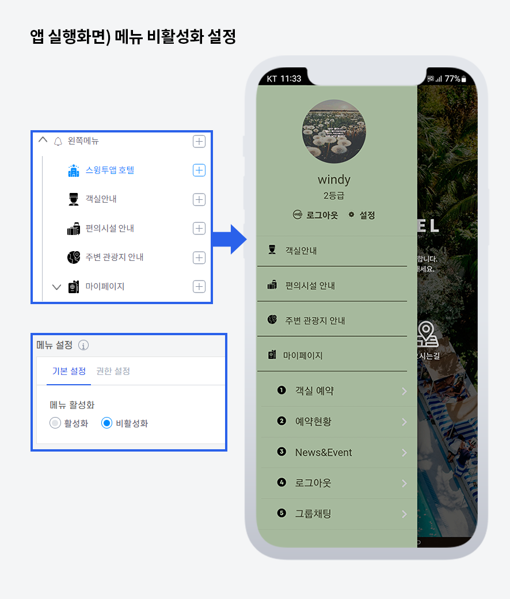

# 앱 메뉴 비활성화 이용방법

메뉴 비활성화는 앱제작 V3에 신규 업데이트된 기능이구요.

**메뉴를 생성하면 무조건 앱에 모두 보여졌던 기존과 달리, 업데이트 버전에서는 메뉴를 활성화 시킬 것인지/ 비활성화 할 것인지를 선택해서 제작할 수 있습니다.**

**즉, 아직 사용자들에게 공개하기 어려운 내용이나 작업이 덜 된 내용이 있다면 해당 메뉴를 비활성화 시킬 수 있습니다.**

비활성화 된 메뉴는 앱에서 보여지지 않게 되며, 다시 활성화로 변경시 앱에 자동으로 해당 메뉴가 보여지게 됩니다.

이용방법은 아주 간단하니, 아래 매뉴얼을 통해서 이용방법을 확인해주세요.

### **** **메뉴설정: 비활성화 기능 이용방법**

메뉴 비활성화 기능은 앱제작V3 - STEP3 페이지 단계에서 이용할 수 있습니다.

메이커 화면 쪽에서 메뉴를 추가한 뒤, **오른쪽 메뉴 설정- 기본설정에서 메뉴를 '비활성화' 로 체크하고 저장해주세요.**

오른쪽 가상머신(미리보기)에서 바로 해당 메뉴가 보이지 않는 것을 확인할 수 있어요.

'비활성화'는 실제로 메뉴를 제작했지만, **앱에 적용을 하지 않게 해서 앱 사용자들에게는 안 보이게 하는 기능이에요.**

따라서 앱 메이커 화면에서 앱을 제작는 관리자만 확인할 수 있구요.

제작이 다 완료되고, 앱에 다시 오픈을 할 경우 메뉴를 '활성화'로 변경하고 저장해주시면 됩니다.

앱은 다시 제작할 필요 없이, 저장만 한 뒤 앱 종료 후 재실행하시면 메뉴가 보이게 됩니다.

### **** (1).png>) **앱 실행화면 - 메뉴 비활성화 확인하기**

앱을 실행하여 실제로 메뉴가 앱에서 보이지 않는지 확인할 수 있습니다.

"스윙투앱 호텔" 메뉴에 '비활성화'로 체크한 뒤, 앱을 실행하면 해당 메뉴는 보이지 않고 활성화된 다른 메뉴들만 보이는 것을 확인할 수 있습니다.

앱에는 보이지 않게 하는 기능이기 때문에 작업이 아직 완료되지 않았을 때 적절히 활용할 수 있습니다 ^^

업데이트가 필요 없기 때문에 언제든지 편하게 수정하고 다시 앱에 반영할 수 있습니다.


<mark style="color:red;">**\[안내사항]**</mark>

메뉴 비활성화 기능은 V3 버전에 추가된 기능으로 V2 버전에서는 이용하실 수 없습니다.

해당 기능을 이용할 경우 V3버전으로 전환해서 이용할 수 있구요. 전환시 최초 업데이트를 반드시 진행해주셔야 합니다.

