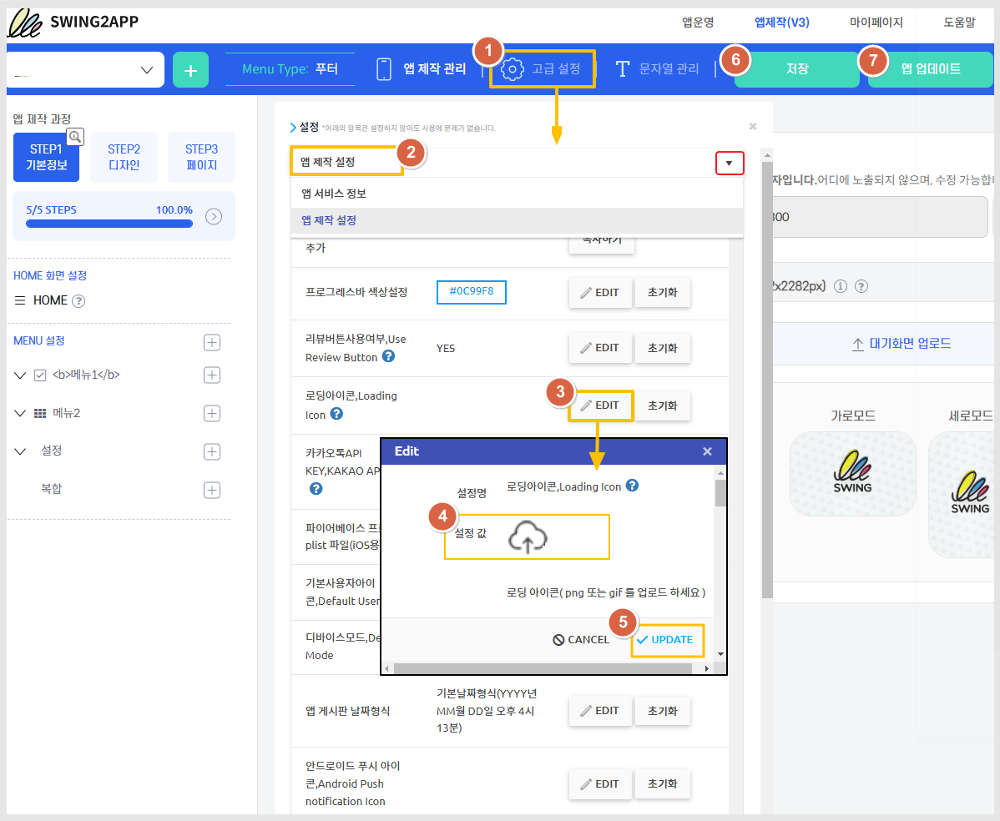

# 앱 로딩 아이콘 변경

***

## **1.로딩 아이콘이란?**

앱 내에서 작업이 실행되기 전, 즉 실행할 프로그램을 준비하는 단계를 로딩이라고 하구요.

로딩이 되는 동안 표시 되는 이미지가 로딩 아이콘이에요.

로딩 아이콘은 서버에서 자동으로 불러오는 기능이기 때문에 스윙 사용자분들이 특별히 작업하셔야 할 내용은 없어요.&#x20;

기본 로딩 아이콘이 제공됩니다.&#x20;

그러나 로딩 아이콘 이미지를 좀 더 앱 스타일에 맞게 수정하고 싶으실 때가 있죠.

&#x20;따라서 매뉴얼을 통해서 기존의 로딩 아이콘 외에 다른 이미지를 넣어서 로딩 아이콘을 변경하는 방법을 확인해주세요.&#x20;

***

## **2.로딩 아이콘 변경 방법**

<figure><figcaption></figcaption></figure>

앱제작 화면 이동

1\) \[고급설정] 버튼 선택

2\) 설정탭에서 \[앱제작 설정] 선택해주세요.&#x20;

3\) 로딩 아이콘 \[EDIT] 버튼을 선택합니다.

4\) EDIT 창에서 설정값에 로딩 아이콘으로 사용할 이미지를 등록해주세요.


\*로딩 이미지는 사용자가 직접 제작하여 넣어주시구요.

\*가로,세로는 정사각형 비율로 작업해주시고, 크기는 500px 이상으로 작업해주세요.

\*GIF 이미지도 첨부 가능합니다.


5\) 이미지 첨부 후 \[업데이트 버튼]을 선택합니다.

6\)\[저장] 버튼 선택

7\)\[앱 업데이트] 버튼을 선택합니다.

이때 업데이트 유형은, 하드업데이트(앱 재설치) 선택 &업데이트 표시옵션: 필수로 선택해주세요.


**안내**

1\)고급설정 메뉴를 수정할 경우 저장만 하시면 안되구요!! 반드시 앱을 업데이트해주셔야 해요.

2\)스토어에 출시된 앱은, 업데이트 버전으로 스토어에도 업데이트 제출하셔서 승인 받아주셔야 합니다.

3\)고급설정 메뉴 수정시 가상머신에서는 수정된 내용이 반영되지 않으니 반드시 핸드폰에서 앱 실행 후 확인해주세요.


***

## **3.변경아이콘1 - 앱 실행화면**

**변경할 로딩 이미지1(png)**

<figure><figcaption></figcaption></figure>

<figure><figcaption></figcaption></figure>

스윙 로고 이미지를 넣어서 변경한 로딩 아이콘입니다.&#x20;

***

## **4.변경아이콘2 - 앱 실행화면**

**변경할 로딩 이미지2(gif)**

위에서 설명드린 것처럼 로딩아이콘은 gif 이미지도 넣을 수 있습니다.&#x20;

로딩아이콘은 변경하지 않아도 기본 셋팅되어 제공이 되기 때문에 그대로 사용하셔도 되구요.

앱에 어울리는 다른 로딩 아이콘 이미지를 넣어서 응용하여 제작이 가능합니다.

