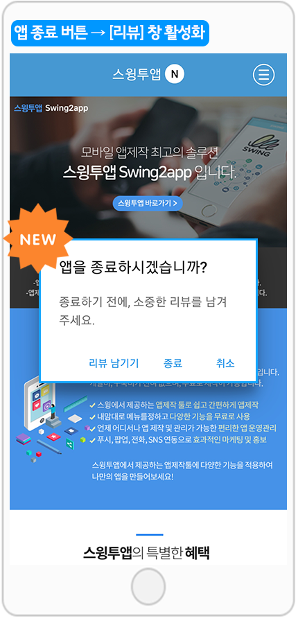
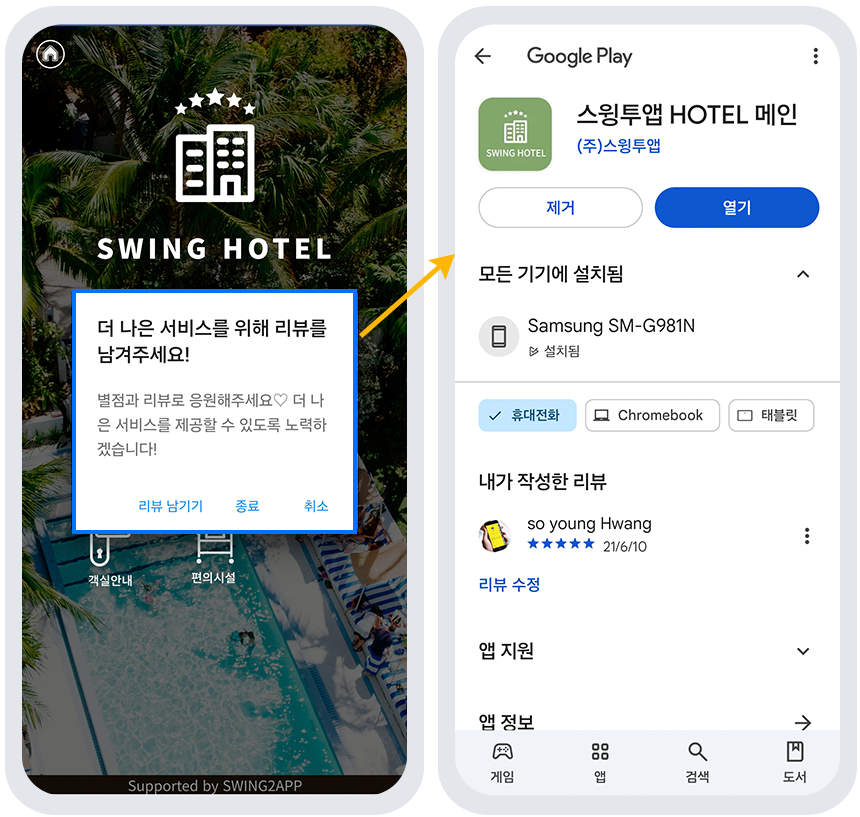
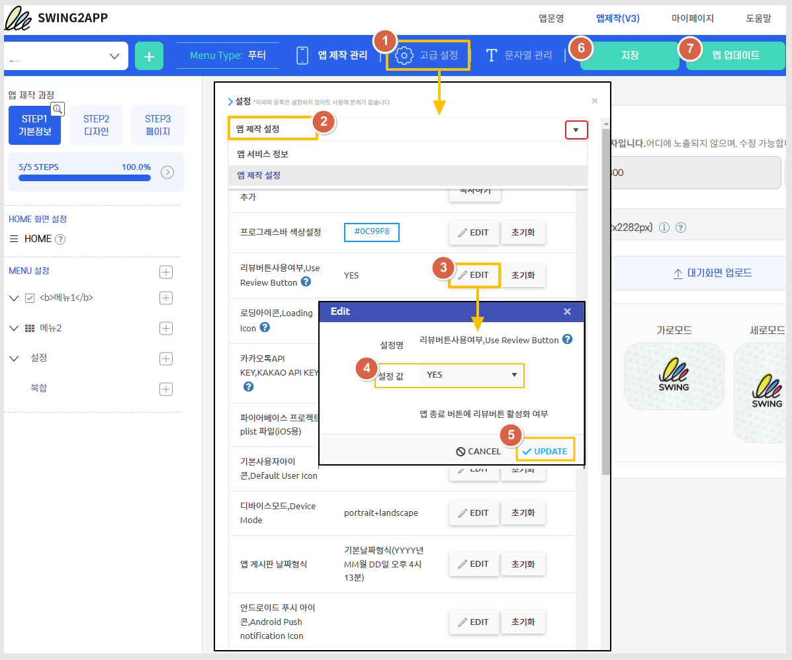
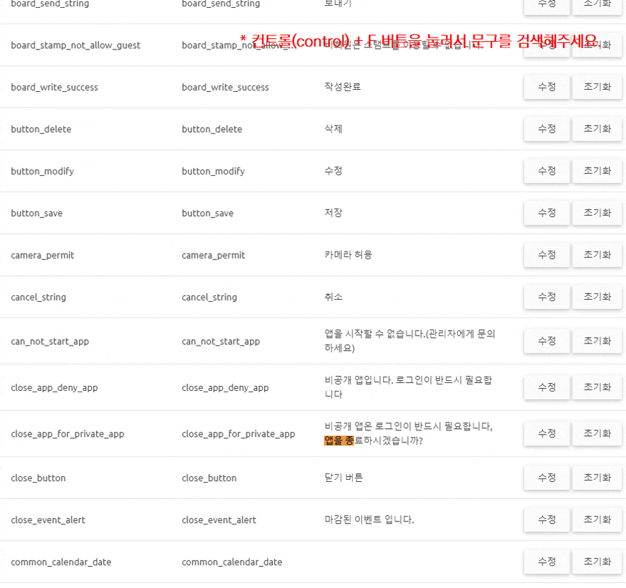
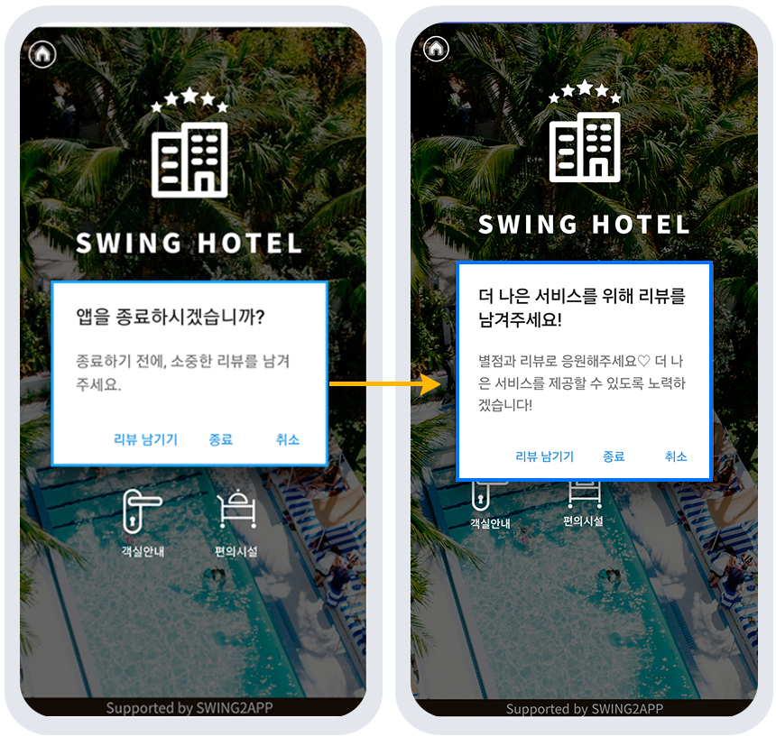

# 앱 리뷰 버튼

***

## **1.리뷰 버튼이란?**

<figure><figcaption></figcaption></figure>

**리뷰 버튼은 앱 사용자들에게 구글 플레이스토어 앱 리뷰를 남기도록 유도할 수 있는 옵션 기능이에요.**

앱을 종료하기 위해 back버튼을 누르면, 종료 팝업이 뜨면서 리뷰를 남길 수 있는 리뷰 활성화 유도창을 띄울 수 있습니다.

안드로이드폰에서는 백(Back)버튼이 있죠. 이 버튼을 눌러서 앱을 종료할 수 있는데요.

리뷰 버튼을 활성화해놓으면, 이렇게 사용자의 폰에서 앱 종료 전에 리뷰 남기기 유도 팝업창이 뜨구요.

\[리뷰 남기기]를 선택하면 구글 플레이스토어 앱 출시 페이지로 이동합니다.

<mark style="color:red;">\*리뷰 버튼은 아이폰은 해당 사항이 없고, 안드로이드폰에서만 적용 가능해요!</mark>

<mark style="color:red;">\*일반 프로토타입 앱제작에서만 이용 가능합니다. (웹뷰, 푸시앱은 이용 불가)</mark>

***

## **2.앱 실행화면 : 리뷰 버튼**

<figure><figcaption></figcaption></figure>

앱을 종료하기 위해 back버튼을 누르면, 종료 팝업이 뜨면서 리뷰를 남길 수 있는 리뷰 활성화 유도창이 뜹니다.

**사용자가 \[리뷰 남기기] 버튼을 선택하면, 출시된 구글 플레이스토어 앱 랜딩 페이지로 이동하게 됩니다.**

**플레이스토어에 앱이 출시된 사용자들은 리뷰 기능 이용시, 자동으로 앱 출시 링크가 연동이 되기 때문에 별도로 링크를 연동할 필요가 없어요!**

리뷰 버튼은 옵션 기능이기 때문에, 이용하고자 하는 분들은 별도로 설정을 해주시면 됩니다.

***

## **3.리뷰 버튼 이용방법**

<figure><figcaption></figcaption></figure>

앱제작 페이지로 이동합니다.

**1)고급설정 선택**

**2)설정에서 '앱제작 설정' 선택**

**3)리뷰버튼 사용 여부 \[EDIT]버튼 선택**

**4)설정값: YES 선택**

**5)UPDATE 버튼 선택**

**6)저장 버튼**

**7)앱 업데이트 버튼 선택**

<mark style="color:red;">이때 업데이트 유형은, 하드업데이트(앱 재설치) 선택 &업데이트 표시옵션: 필수로 선택해주세요.</mark>&#x20;

<mark style="color:red;">플레이스토어에 업데이트 된 앱을 다시 제출(재심사) 하신 뒤, 승인이 완료되어야 이용 가능합니다.</mark>&#x20;

***

## **4.리뷰에 나오는 멘트(메시지) 변경 방법**

#### **\*리뷰에 나오는 멘트(메시지)는 어떻게 변경하나요?**

<figure><figcaption></figcaption></figure>

[앱운영- 서비스관리-앱 문자열 관리](http://www.swing2app.co.kr/view/app_resourecs_manager)에서 해당 메시지를 찾아서 원하는 문구를 변경할 수 있습니다.

문자열 관리 이용방법은 해당 매뉴얼을 참고해주세요.

**☞** [**\[앱에 셋팅된 문구 수정방법\]**](https://wp.swing2app.co.kr/documentation/appmanage/service/edit-text/)

***

## **5.앱 실행화면: 수정된 리뷰 메시지**

<figure><figcaption></figcaption></figure>


**안내사항**

**1) 플레이스토어에 앱이 출시된 사용자만 리뷰 남기기 기능을 이용할 수 있습니다.**

\*플레이스토어에 출시가 안 된 앱도 리뷰 버튼을 이용할 수 있지만, 리뷰 남기기 선택시 페이지를 찾을 수 없다고 뜹니다.

2\)최초 리뷰남기기를 선택한 사용자는 이후에는 리뷰 남기기 창이 뜨지 않습니다.

3\)아이폰에서는 해당 사항 없으며, 안드로이드폰에서만 반영됩니다.

4\)일반프로토타입 앱에서만 이용 가능하며, 웹사이트를 연결한 웹앱-푸시&웹뷰앱은 적용 불가합니다.

5\)리뷰 버튼을 이용할 경우 위의 방법 대로 적용해주시기 바랍니다.

설정 저장 후 앱제작 새로 해주셔야 합니다.&#x20;

(하드 업데이트 후 플레이스토어에도 새 버전 업데이트 필수)

6\)리뷰 버튼을 사용하지 않을때에는 다시 고급설정에서, 리뷰버튼 사용 여부 \[EDIT]버튼: ‘NO’로 체크하신 뒤 앱제작 다시 해주세요.


