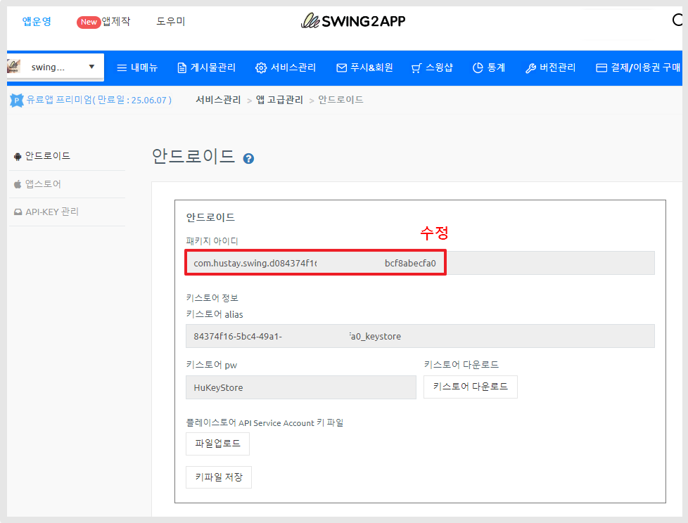
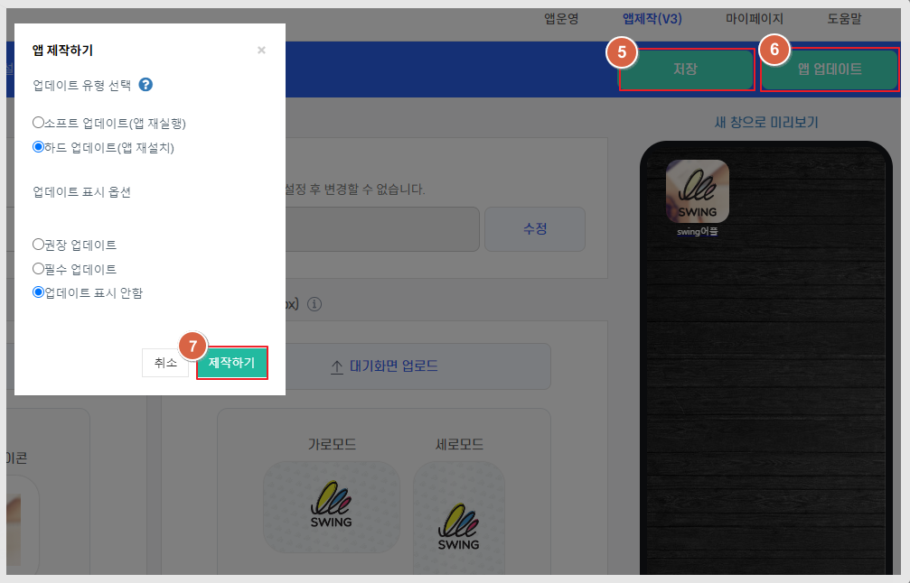

# 안드로이드 앱 패키지 아이디 변경

***

'패키지 아이디'란 앱의 고유 이름과 같습니다.

플레이스토어 등 스토어에 등록을 할 때 패키지명이 등록이 되면, 같은 패키지로는 앱 등록이 되지 않구요.

고유 값으로 저장이 되게 됩니다.

&#x20;패키지명을 변경해야 할 경우는 스윙투앱- 앱 고급관리에서 변경 가능합니다.


스윙투앱 앱 정책에 따라

<mark style="color:red;">안드로이드 패키지 아이디 변경은, 유료앱 이용자만 이용 가능합니다.</mark>

유료앱 이용권 구매 후, 패키지 아이디 변경이 가능하며 고급관리 페이지 역시 유료앱 이용권 구매시에만 활성화됩니다.

무료앱은 패키지 변경이 불가합니다.


***

## 안드로이드 패키지 아이디 변경 방법

<figure><figcaption></figcaption></figure>

1.유료앱 이용권을 구매해주세요.

2.[앱운영-서비스관리-앱 운영관리-앱 고급관리](https://www.swing2app.co.kr/view/app\_advanced\_management\_by\_android)로 이동합니다.

3.안드로이드 화면에서 '패키지 아이디' 항목 탭을 수정해주세요.


패키지명 변경 방법&#x20;

com.swing2app.v3.d656b4c6a-e928-43a8-b25d-58a0ddf5f595

\= <mark style="color:red;">“com.swing2app.v3.” 변경불가</mark>

“d656b4c6a-e928-43a8-b25d-58a0ddf5f595”에서 'd' 를  'a'로 변경

숫자 '6' 제거 등으로 알파벳이나 숫자를 다른 것으로 변경해서 사용해주세요.&#x20;


4.수정 후 다시 '앱제작 화면' 이동&#x20;

<figure><figcaption></figcaption></figure>

5.왼쪽 상단\[저장] 선택

6.\[앱 업데이트] 선택

7.제작하기 선택 완료&#x20;

업데이트 표시옵션은 "업데이트 표시 안함"으로 선택해주세요.

업데이트가 되는 것 기 아닌, 새로 제작하여 설치하는 개념이므로 업데이트 창이 뜨지 않습니다.&#x20;


1\)앱 업데이트를 해야 변경된 패키지명으로 변경됩니다. 수정 후 꼭! 업데이트를 해주세요.&#x20;

2\)패키지명 변경은 이전에 작업된 앱과 업데이트 되지 않고, 새로운 앱으로 다시 제작을 하는 개념입니다.

따라서 업데이트를 하셔도 기존 앱과 연동되지 않으니, 기존앱은 삭제 후 새로 설치를 해주세요.&#x20;


