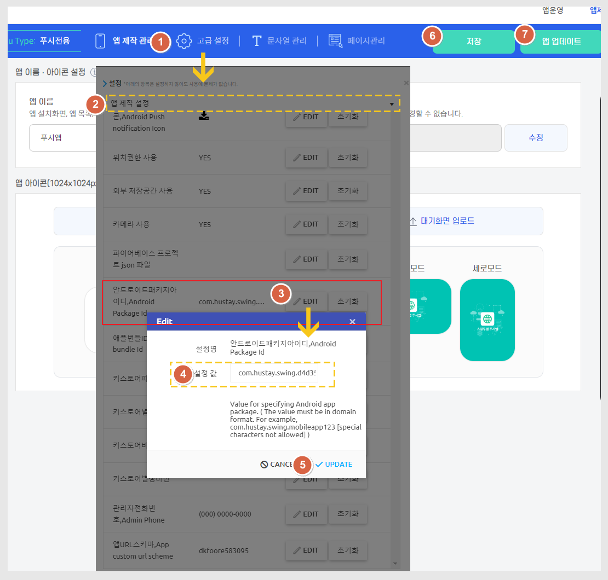

# 안드로이드 앱 패키지 아이디 변경

***

'패키지 아이디'란 앱의 고유 이름과 같습니다.

플레이스토어 등 스토어에 등록을 할 때 패키지명이 등록이 되면, 같은 패키지로는 앱 등록이 되지 않구요.

고유 값으로 저장이 되게 됩니다.

만약 패키지명을 변경해야 할 경우는 스윙투앱 앱제작 - 고급설정에서 직접 변경해서 사용이 가능합니다.&#x20;

## 안드로이드 패키지 아이디 변경

<figure><figcaption></figcaption></figure>

1.앱제작 - 고급설정 선택

2.앱제작 설정 선택

3.안드로이드 패키지 \[EDIT]버튼 선택

4.설정값 선택해서 패키지명 변경&#x20;


패키지명 변경 방법&#x20;

com.swing2app.v3.d656b4c6a-e928-43a8-b25d-58a0ddf5f595

\= <mark style="color:red;">“com.swing2app.v3.” 변경불가</mark>

“d656b4c6a-e928-43a8-b25d-58a0ddf5f595”에서 'd' 를  'a'로 변경

숫자 '6' 제거 등으로 알파벳이나 숫자를 다른 것으로 변경해서 사용해주세요.&#x20;


5.UPDATE 선택

6.왼쪽 상단\[저장] 선택

7.\[앱 업데이트] 선택


앱 업데이트를 해야 변경된 패키지명으로 변경됩니다.

수정 후 꼭! 업데이트까지 해주세요.&#x20;


