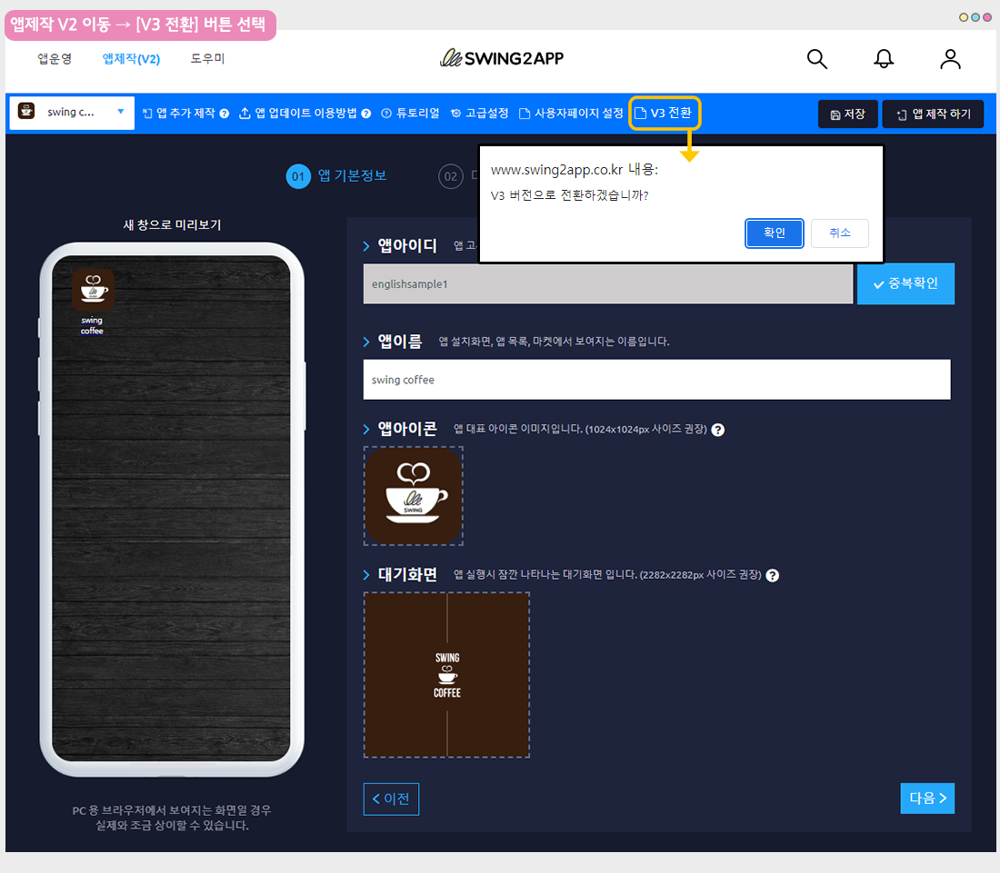
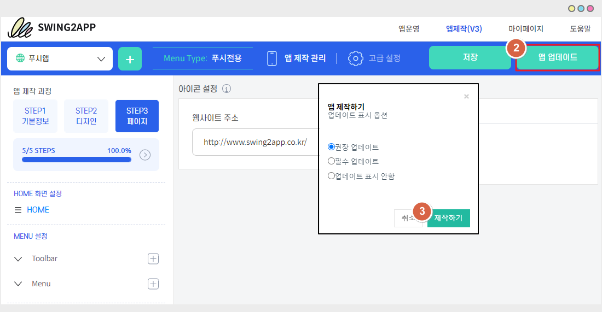
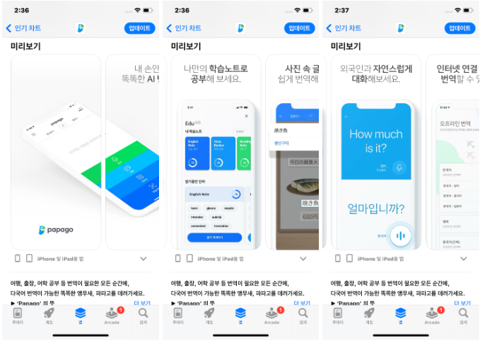
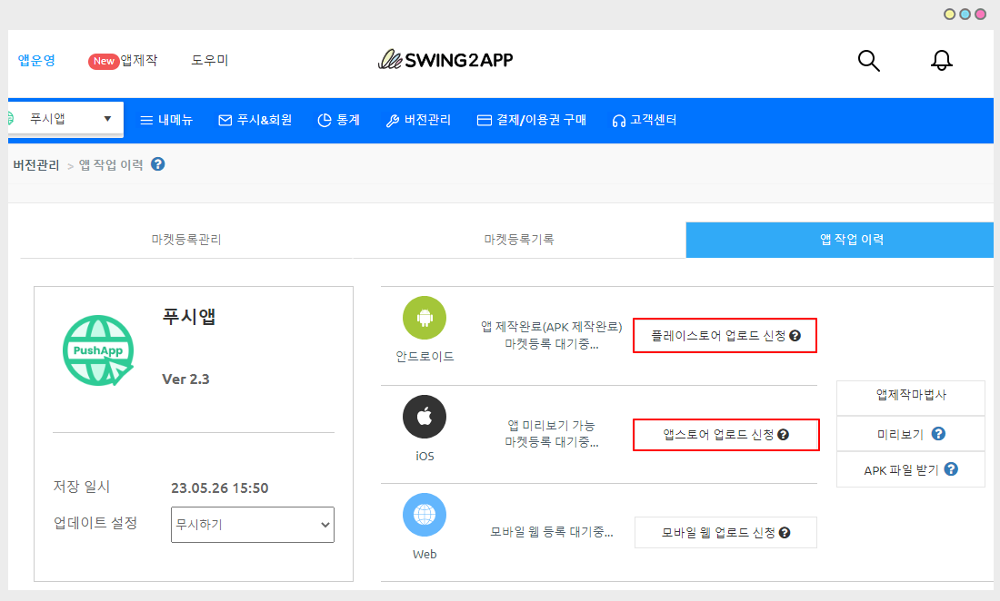

# 앱 업데이트 방법

해당 매뉴얼에 기재된 업데이트 앱 수정 없이, 버전만 업데이트 하는 방법입니다.

구글 플레이스토어 및 애플 앱스토어에 정책상 업데이트 된 버전으로 앱을 다시 제출해야 할 때 이용 할 수 있습니다.

<figure><figcaption></figcaption></figure>

앱제작 화면에 접속 중이면 \[앱 업데이트] 버튼을 바로 선택할 수 있구요.

앱운영 대시보드에 있다면 앱제작 화면으로 이동 후 \[앱 업데이트]를 선택합니다.

<figure><figcaption></figcaption></figure>

1.왼쪽 상단 \[앱제작] 선택&#x20;

<mark style="color:red;">**\*중요: 버전 V2 이용자 분들은 V3로 전환 먼저 해주세요.**</mark>&#x20;

<mark style="color:red;">앱제작 화면으로 이동했는데 아직</mark> <mark style="color:red;">V2 버전을 이용중이라면, 먼저 V3로 버전을 전환해주셔야 합니다.</mark>

\*구글 정책에 맞게 앱 시스템을 업데이트 한 버전이 V3입니다. 따라서 새로 업데이트를 한다면 반드시 V3 버전으로 전환을 해야 출시가 가능합니다.

<figure><figcaption></figcaption></figure>

화면 상단에 있는 \[V3 전환] 버튼을 선택해주시면 됩니다.&#x20;

그 다음 업데이트를 해주시기 바랍니다.&#x20;

<figure><figcaption></figcaption></figure>

2.\[앱 업데이트] 버튼 선택

3.업데이트 표시 옵션 선택 후, \[제작하기] 선택


<mark style="color:blue;">**\[업데이트 표시 옵션]**</mark>

일반 프로토타입 앱 인지 웹뷰/푸시 앱인지에 따라 업데이트 표시창이 다르게 뜹니다.&#x20;

1\)일반 프로토타입 앱 업데이트시

\*업데이트시 업데이트 유형: '하드업데이트(앱 재설치)' 선택해주세요.&#x20;

\*업데이트 표시옵션: ‘업데이트 표시 안함’으로 선택해주세요.&#x20;

2\)웹뷰 혹은 푸시 앱 업데이트시

업데이트 표시 옵션: 업데이트 표시 안함으로 체크하고 제작해주세요.

실제로 앱에서 수정한 내용이 있어서 사용자들에게 업데이트 메시지창을 꼭 띄어야 한다면 ‘필수’ or '권장'으로 선택해주세요.


<figure><figcaption></figcaption></figure>

이렇게 제작하시면 새 버전으로 앱제작이 다시 진행이 되구요.

\-일반 프로토타입 앱: 5분 이내 제작

\-웹뷰 및 푸시 앱: 8분 이내 제작 됩니다.&#x20;

업로드 신청을 하시는 분들은 제작이 완료되면, 업로드 신청 버튼이 활성화 되오니 그때 신청 버튼을 선택해서 신청서 제출해주시기 바랍니다.&#x20;

**\*업로드 신청 화면 경로**

[앱운영 – 버전관리 - 앱제작 이력](http://www.swing2app.co.kr/view/app\_work\_history)

