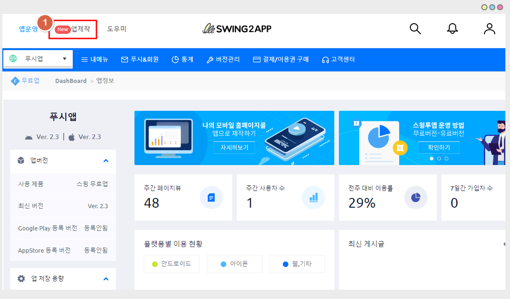
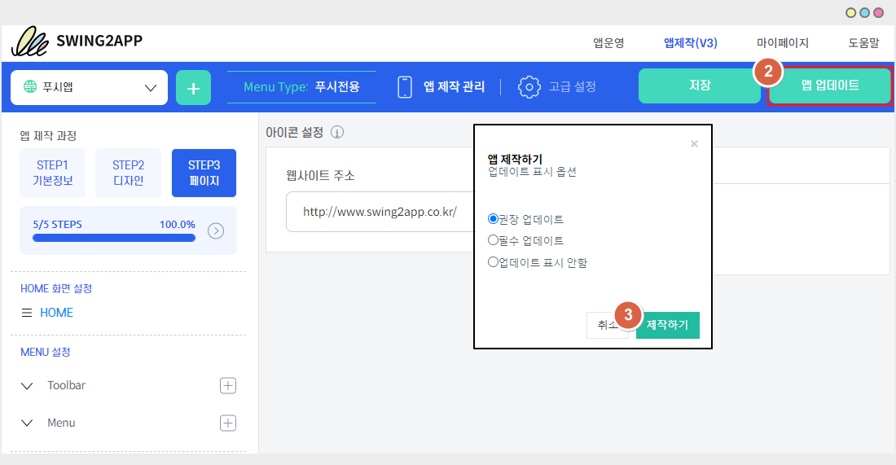
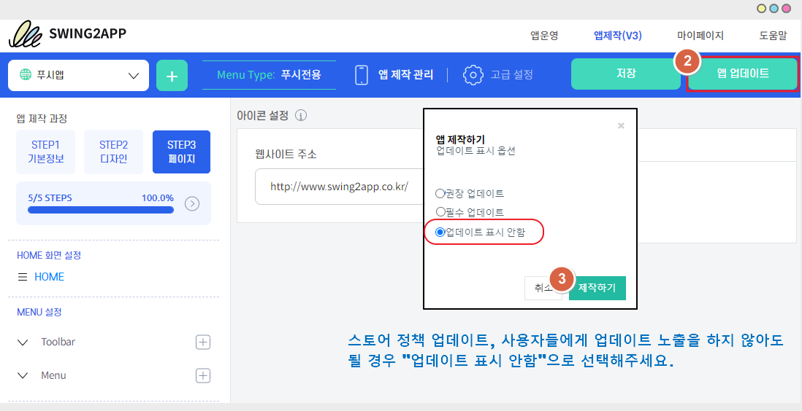
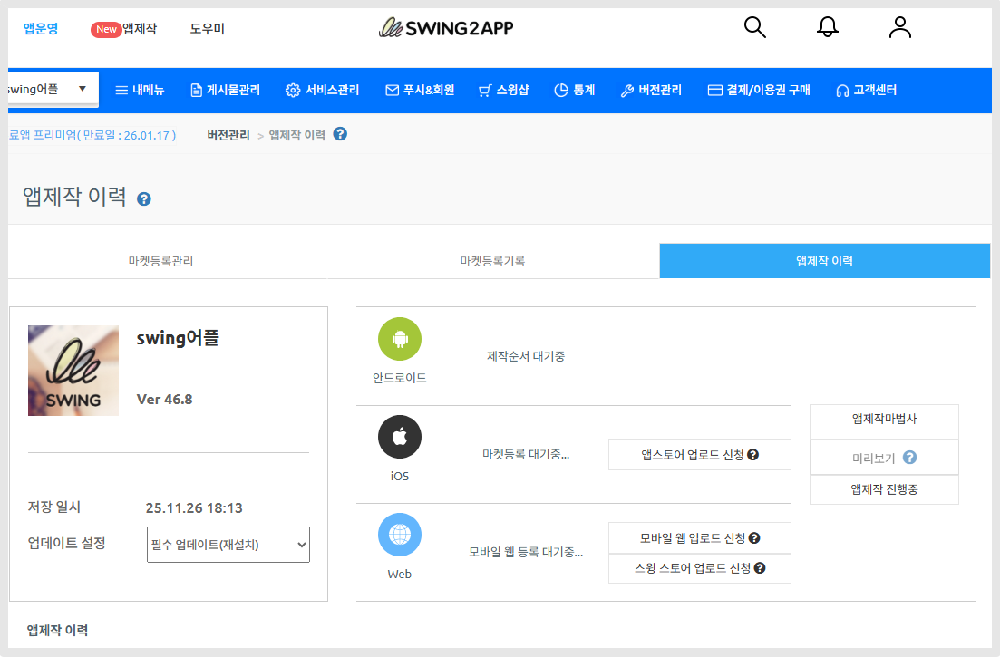
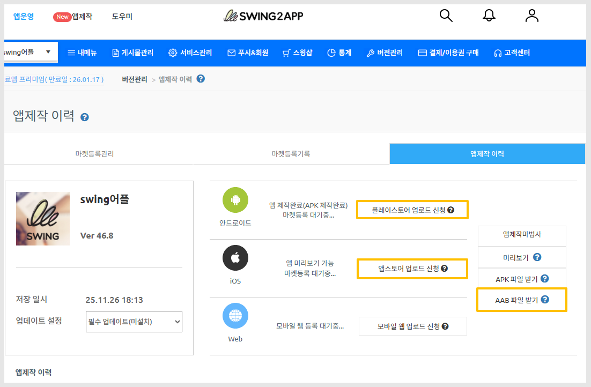
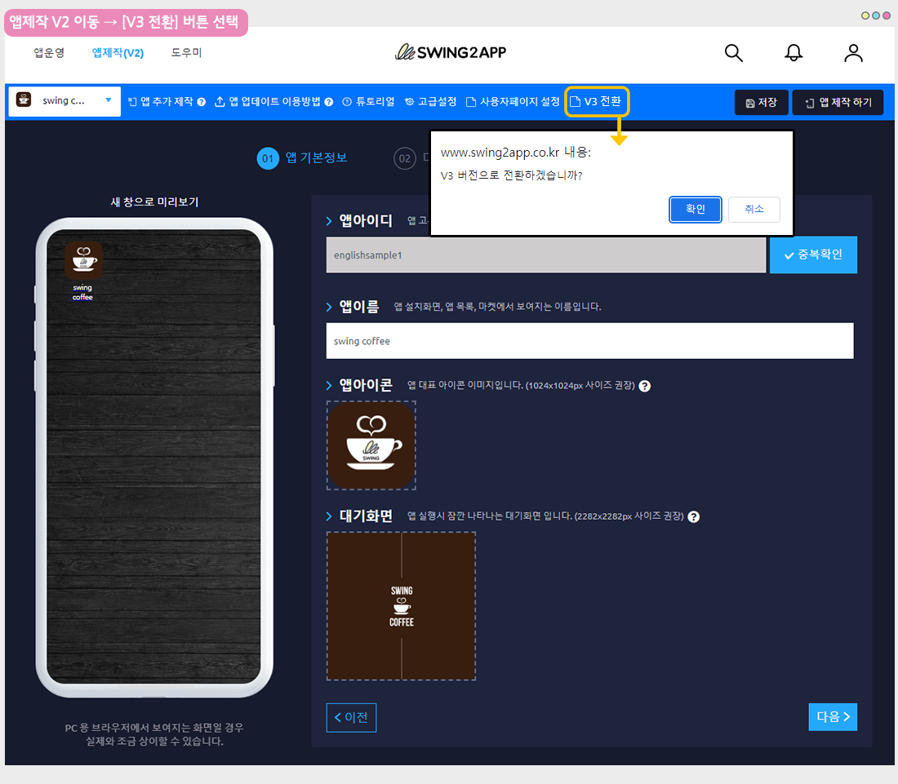

# 앱 업데이트 방법

해당 매뉴얼에 기재된 업데이트 방법은 앱 수정 없이, 앱버전만 업데이트 하는 방법입니다.

구글 플레이스토어 및 애플 앱스토어에 정책상 업데이트 된 버전으로 앱을 다시 제출해야 할 때 이용 할 수 있습니다.

<figure><figcaption></figcaption></figure>

앱제작 화면에 접속 중이면 \[앱 업데이트] 버튼을 바로 선택할 수 있구요.

앱운영 대시보드에 있다면 앱제작 화면으로 이동 후 \[앱 업데이트]를 선택합니다.

### 1.왼쪽 상단 **\[앱제작]** 선택

<figure><figcaption></figcaption></figure>

#### &#x20;\*앱을 다시 수정하고자 할 때에도 해당 경로로 1)앱제작 화면으로 이동해주시기 바랍니다.&#x20;

### 2.\[앱 업데이트] 버튼 선택

<figure><figcaption></figcaption></figure>

2\)오른쪽 상단 \[앱 업데이트] 버튼 선택

3\)업데이트 표시 옵션 체크 후 \[제작하기] 선택

<mark style="color:blue;">**\*스토어 정책 업데이트로 인한 앱 업데이트 이거나 or 이번 업데이트가 사용자들에게 노출하지 않아도 될 경우라면, "업데이트 표시 안함"으로 체크 후 제작해주세요.**</mark>

<figure><figcaption></figcaption></figure>


**웹뷰앱은 업데이트 팝업이 뜨지 않습니다.**

업데이트 버튼 선택시 바로 앱제작이 시작됩니다.

**Q.웹뷰앱은 왜 업데이트 표시 옵션 선택이 안뜨나요?**

웹뷰앱은 업데이트시 앱에서 업데이트 안내 팝업이 뜨지 압습니다.

따라서 업데이트 표시 옵션 자체를 선택할 필요가 없습니다.


### 3.업데이트 표시 옵션 선택 후, \[제작하기] 선택


<mark style="color:blue;">**업데이트 표시 옵션**</mark>

일반 프로토타입 앱 인지 웹뷰/푸시 앱인지에 따라 업데이트 표시창이 다르게 뜹니다.&#x20;

**1)일반 프로토타입 앱 업데이트**

\*업데이트시 업데이트 유형: '하드업데이트(앱 재설치)' 선택해주세요.&#x20;

\*업데이트 표시옵션: 업데이트 내용에 따라 선택해주세요.

<mark style="color:green;">-사용자들이 앱 업데이트를 꼭 받아야 하는 내용이라면 - "필수" 선택</mark>

<mark style="color:green;">-업데이트가 강제가 아닌, 선택으로 진행해도 된다면 -"권장" 선택</mark>

<mark style="color:green;">-업데이트 팝업 노출이 필요 없다면 - "업데이트 표시 안함’"선택</mark>

**2)푸시 앱 업데이트**

업데이트 표시 옵션

<mark style="color:green;">-사용자들이 앱 업데이트를 꼭 받아야 하는 내용이라면 - "필수" 선택</mark>

<mark style="color:green;">-업데이트가 강제가 아닌, 선택으로 진행해도 된다면 -"권장" 선택</mark>

<mark style="color:green;">-업데이트 팝업 노출이 필요 없다면 - "업데이트 표시 안함’"선택</mark>

실제로 앱에서 수정한 내용이 있어서 사용자들에게 업데이트 메시지창을 꼭 띄어야 한다면 ‘필수’ or '권장'으로 선택해주세요.

<mark style="color:green;">**3)웹뷰앱은 업데이트 팝업이 뜨지 않습니다.**</mark>

업데이트 버튼 선택시 바로 앱제작이 시작됩니다. &#x20;

\
**Q.웹뷰앱은 왜 업데이트 표시 옵션 선택이 안뜨나요?**

웹뷰앱은 업데이트시  앱에서 업데이트 안내 팝업이 뜨지 압습니다.&#x20;

따라서 업데이트 표시 옵션 자체를 선택할 필요가 없습니다.&#x20;


### 4.제작완료

앱제작이 시작되면, [앱운영- 버전관리-앱제작이력](https://www.swing2app.co.kr/view/app_work_history) 화면으로 이동합니다.&#x20;

여기서 제작 순서를 확인할 수 있습니다.

<figure><figcaption></figcaption></figure>

이렇게 제작하면 새 버전으로 앱제작이 다시 진행이 되구요.&#x20;

**\*제작순서 대기중 - APK 제작요청 - 앱제작 완료** 순으로 작업이 진행됩니다.&#x20;

<mark style="color:$success;">-일반 프로토타입 앱: 7분 이내 제작</mark>

<mark style="color:$success;">-웹뷰 및 푸시 앱: 10분 이내 제작 됩니다.</mark>&#x20;

<figure><figcaption></figcaption></figure>

제작이 완료되면 위의 화면처럼 앱제작완료로 변경이 됩니다.

업로드 신청을 하시는 분들은 제작이 완료되면, **업로드 신청 버튼이 활성화 되오니 그때 신청 버튼을 선택해서 신청서 제출해주시기 바랍니다.**&#x20;

**\*업로드 신청 화면 경로**

[앱운영 – 버전관리 - 앱제작 이력](http://www.swing2app.co.kr/view/app_work_history)

&#x20;플레이스토어 직접 업데이트 하시는 분들은  &#x20;

\[AAB파일받기] 선택 하여 파일을 다운 받아서 플레이 콘솔에 등록하실 수 있습니다.&#x20;


**유료앱 이용권 결제한(유료앱 이용중) 분들에게만 AAB파일이 제공됩니다.**

무료앱 사용중에는 APK파일만 제공됩니다. (무료앱 버전에서는 AAB파일 제공 안됨)

업로드 신청 역시, 유료앱 이용권+업로드티켓을 구매한 경우만 신청 가능합니다.&#x20;


#### <mark style="color:red;">**중요: 버전 V2 이용자 분들은 V3로 전환 먼저 해주세요.**</mark>&#x20;

> <mark style="color:red;">앱제작 화면으로 이동했는데 아직</mark> <mark style="color:red;">V2 버전을 이용중이라면, 먼저 V3로 버전을 전환해주셔야 합니다.</mark>
>
> \*구글 정책에 맞게 앱 시스템을 업데이트 한 버전이 V3입니다.&#x20;
>
> 따라서 새로 업데이트를 한다면 반드시 V3 버전으로 전환을 해야 출시가 가능합니다.
>
> 
>
> 화면 상단에 있는 \[V3 전환] 버튼을 선택해주시면 됩니다.&#x20;
>
> 그 다음 업데이트를 해주시기 바랍니다.&#x20;

***

### **Q.AAB파일은 어디서 다운받나요??**

<figure><figcaption></figcaption></figure>

&#x20;[앱운영 – 버전관리 - 앱제작 이력](http://www.swing2app.co.kr/view/app_work_history)

유료앱(이용권 적용된 유료버전앱)은 앱제작 이력 페이지에서 AAB파일을 받을 수 있습니다.&#x20;

여기서 \[AAB파일 받기] 버튼을 선택하면 사용자의 PC로 파일이 다운되요.

다운된 AAB파일을 위의 구글 플레이 – 프로덕션 – App Bundle 파일로 업로드 해주시면 됩니다.

