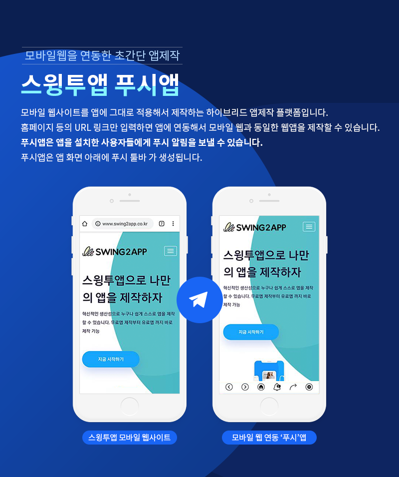
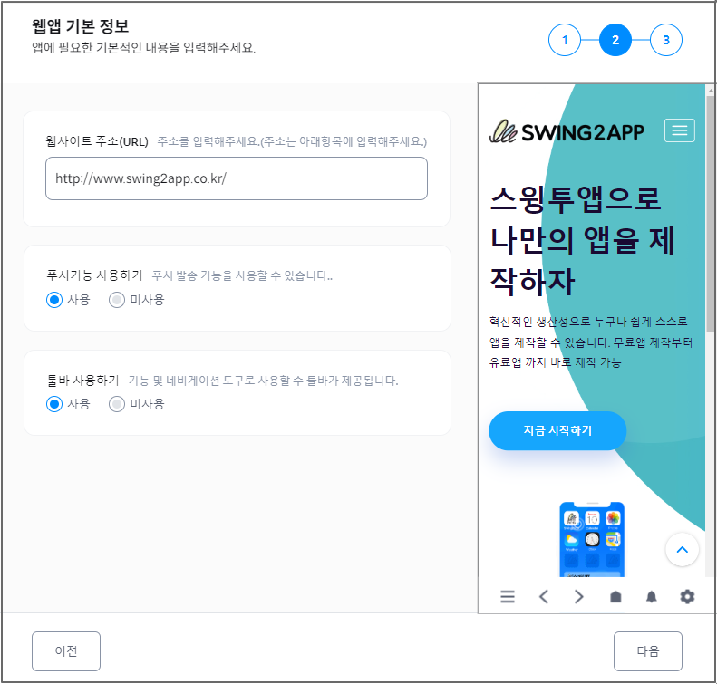
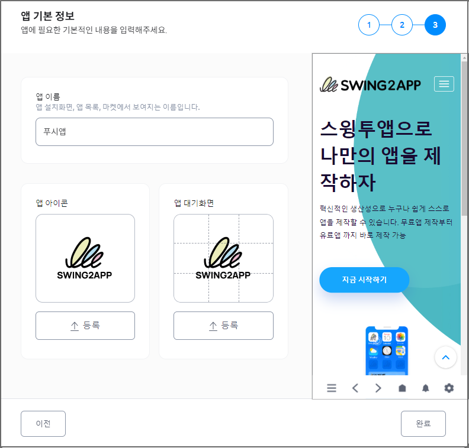
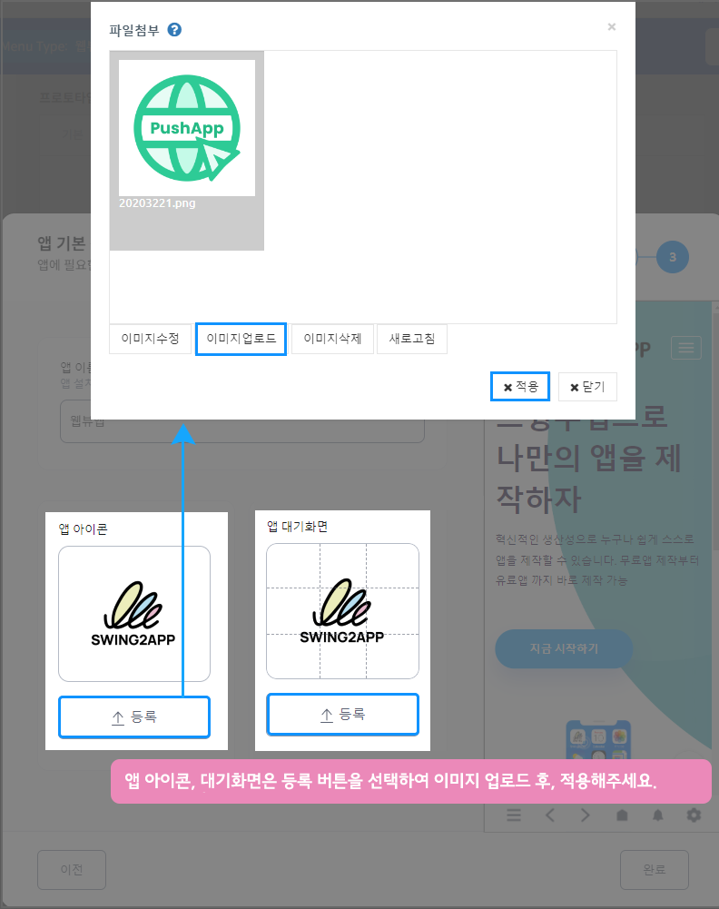
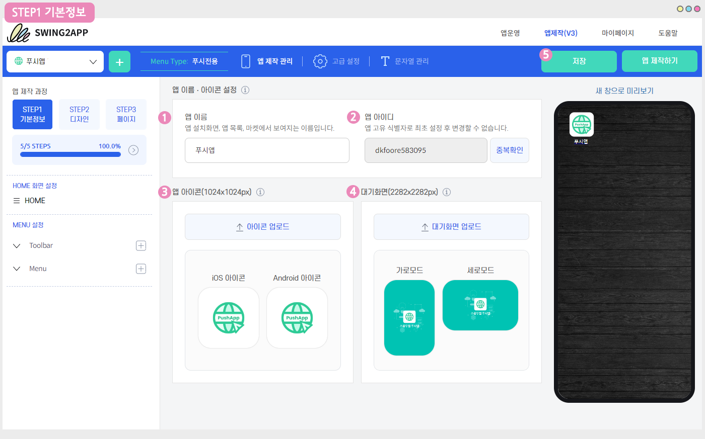
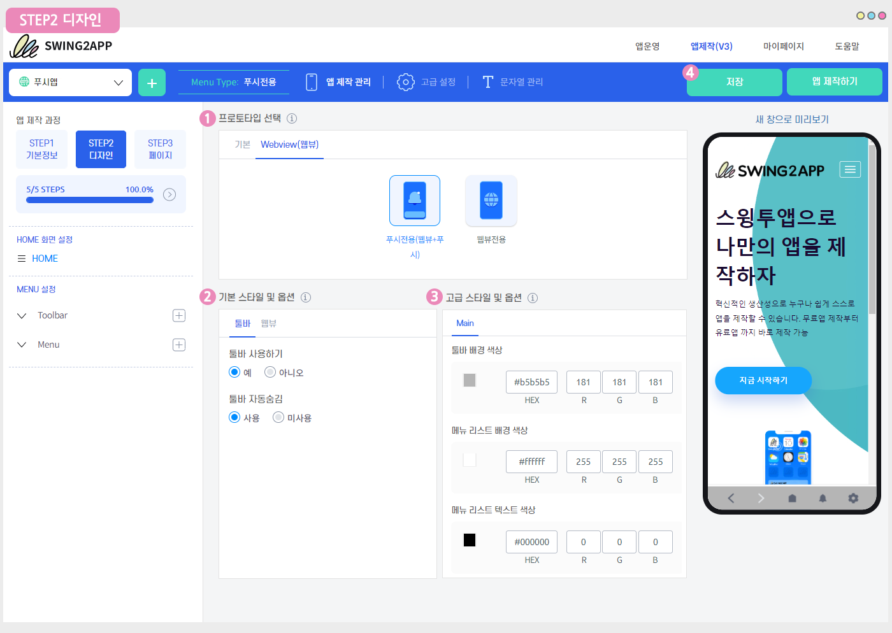
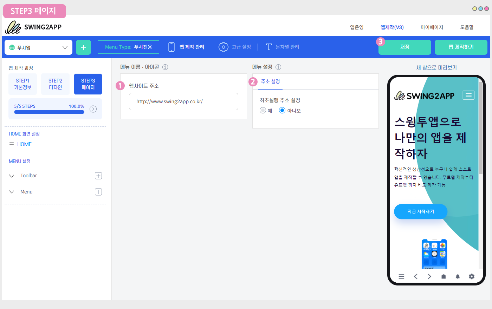
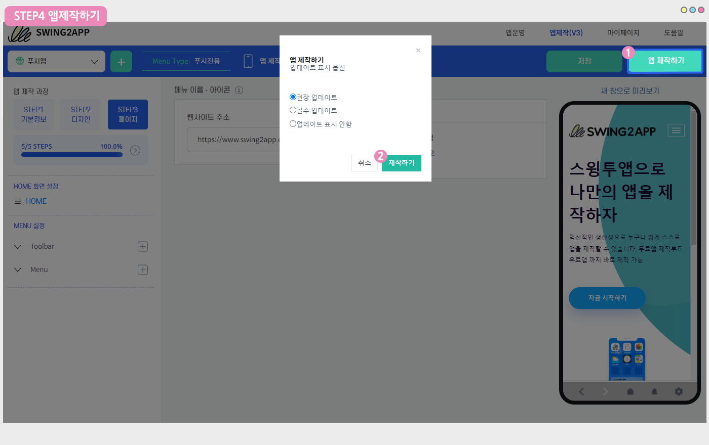
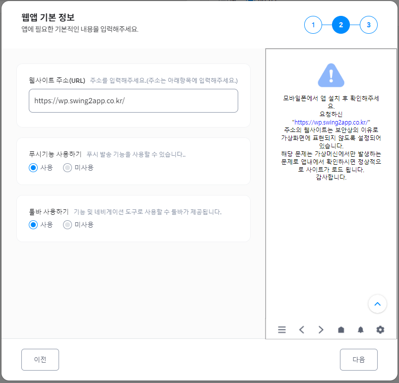

# 푸시앱 제작방법

**푸시앱이란?**

푸시앱은 홈페이지 등의 모바일웹 URL 링크를 걸어서 제작한 웹앱 제작 플랫폼이구요.

웹사이트가 앱에 그대로 연동되기 때문에 웹과 동일한 앱을 제작할 수 있습니다.

웹뷰앱과는 다르게 푸시앱은 앱을 설치한 사용자들에게푸시 알림을 보낼 수 있다는 것이 가장 큰 특징입니다!

### ****.png>) **Start. 앱제작 마법사 시작하기**

**​**스윙투앱에서 처음 앱을 제작하거나, 앱 추가 제작을 시작할 때 앱제작 마법사 시작 화면(팝업창)이 먼저 뜹니다.

여기서 어떤 유형의 앱을 제작할지 선택한 뒤, 기본 정보를 입력하면 제작 메이커로 넘어갑니다.

**​**

<mark style="color:blue;">**1.제작형태: 웹사이트를 기반한 웹앱 선택**</mark>

푸시앱은 2번째 제작방법인 ‘웹사이트를 기반한 웹앱’을 선택해주세요.

웹사이트를 그대로 앱에 적용해서 만드는 스타일입니다.

\[다음] 버튼 선택해주세요.

**​**

<mark style="color:blue;">**2.웹앱 기본 정보 입력**</mark>

다음 단계는 기본 정보 입력단계로 웹앱 제작에 필요한 기본적인 내용을 입력합니다.

**1)웹사이트주소(URL)를 입력해주세요.**

앱에 적용할 사이트 링크이며, http:// 하이퍼링크를 반드시 넣어주세요.

링크 주소 입력 후 마우스 커서를 빈 공간에 한번 클릭하면 반영됩니다.&#x20;

오른쪽 가상머신(미리보기)화면으로 적용된 사이트가 잘 뜨는지 확인할 수 있습니다.

**2)푸시 기능 사용여부 체크**

푸시는 앱을 설치한 사용자들에게 앱에서 알림이나 공지, 홍보 관련 알림 메시지를 보낼 수 있는 기능이에요.

**푸시앱으로 제작할 것이기 때문에 기능 사용은 ‘사용’으로 체크해주시구요.**

툴바 사용 여부는 툴바 ‘사용’으로 체크할 경우 툴바가 앱 화면 하단에 보여지게 되며, ‘미사용’으로 체크할 경우 툴바 영역이 앱에서 보여지지 않게 됩니다.

따라서 앱 스타일에 맞게 설정해주세요.

\[다음] 버튼 선택해주세요.

​

<mark style="color:blue;">**3.앱이름, 아이콘, 대기화면 이미지 입력**</mark>

마지막 단계에서는 **앱이름 입력, 앱 아이콘, 대기화면 이미지를 등록합니다.**

앱이름, 아이콘, 대기화면 이미지 모두 제작 메이커에서 다시 수정이 가능하구요.

아직 이미지가 준비 안되었다면, 앱이름만 입력하고 완료버튼을 눌러도 됩니다.

아이콘과 대기화면에 들어갈 이미지는 제작 메이커에서 다시 적용하실 수 있어요.

​

<mark style="color:green;">**–> 아이콘, 대기화면 이미지 등록방법**</mark>

앱 아이콘, 대기화면은 \[등록] 버튼을 선택하면 파일 첨부 창이 열리구요.

여기서 이미지를 업로드하여 적용해주시면 됩니다.

**-아이콘 이미지 사이즈: 1024px\*1024px**

**-대기화면 이미지 사이즈 : 2282px\*2282px**

등록이 완료되면 \[완료] 버튼을 선택해주세요.

앱제작 마법사 등록이 완료되면, 앱제작 메이커 화면이 열립니다.

왼쪽 앱제작 과정을 보시면 STEP1기본정보, STEP2 디자인, STEP페이지 단계를 확인할 수 있구요.

단계별로 내용을 입력하면 완료됩니다.

\*STEP 진행상태가 100%가 되면 모든 단계 입력이 완료된 것입니다.

.PNG>)

### ****.png>) **STEP1 기본정보**

**STEP1 기본정보에 있는 내용은 앱 아이디를 제외하고 앱제작 마법사에서 이미 다 등록한 내용입니다.**

만약 앱이름을 수정할 때 다시 입력할 수 있구요.

앱 아이콘, 대기화면 이미지를 수정하거나 새로 등록할 경우 해당 화면에서 등록을 완료해주시면 됩니다.

​

1\) 앱 아이디 입력 <mark style="color:red;">\*앱 아이디는 앱의 고유 식별자이며 설정 후에는 변경할 수 없습니다.</mark>

2\) 앱 이름 입력

3\) 앱 아이콘 이미지 (**1024px\*1024px)**

4\) 앱 대기화면 이미지 등록 (**2282px\*2282px)**

5\) \[저장]버튼 선택

**​**

**\*앱 아이콘이미지, 대기화면 이미지는 화면에 기재된 사이즈대로 이미지를 먼저 만들어주신뒤 등록해주세요.**

**아이콘과 대기화면은 먼저 제작 가이드라인 매뉴얼을 보시고 만들어주시기 바랍니다!**

****[**아이콘 이미지 제작 가이드 보러가기**](../../v2/appbasic/appicon.md)****

****[**대기화면 이미지 제작 가이드 보러가기**](../../v2/appbasic/apploading.md)****

**\*앱 아이디를 제외한 앱이름, 아이콘, 대기화면 이미지는 제한없이 수정 가능하며 업데이트가 가능합니다.**

**앱 기본정보 수정시 \[앱 업데이트]버튼을 눌러서 새 버전으로 업데이트 해주셔야 반영됩니다.**


<mark style="color:red;">**안내**</mark>

앱 제작 후, STEP1 기본정보 메뉴를 다시 수정하게 된다면 앱 업데이트를 다시 해주셔야 변경된 내용이 앱에 반영됩니다.

예를들어, 앱 이름을 변경했다면 변경 후 → 저장 → 앱 업데이트 버튼을 눌러서 새 버전으로 재제작해주세요.

앱스토어, 플레이스토어에 출시되었다면 업데이트 버전앱으로 해당 스토어에도 다시 업데이트 제출해주셔야 합니다.


.PNG>)

### ****.png>) **** STEP2 디자인

STEP2 디자인 단계 – 프로토타입 및 기본옵션, 고급 옵션을 설정합니다.

프로토타입도 이미 앱제작 마법사에서 선택했기 때문에 넘어가면 되구요.

푸시에서 – 웹뷰 프로토타입으로 수정한다면 변경해서 업데이트 해주시면 됩니다.

1.프로토타입 선택 : ‘푸시전용’으로 선택되어 있습니다.

2.기본 옵션

1\)툴바 사용하기 : 툴바 사용여부도 앱제작 마법사에서 설정하였습니다. 변경할 경우 다시 체크해주세요.

2\)툴바 자동숨김 : 툴바 자동 숨김을 사용할지, 사용하지 않을지 체크해주세요.

<mark style="color:red;">툴바 자동숨김은 화면에서 스크롤해서 아래로 내려갈 때 화면을 가리지 않도록 툴바 영역이 잠시 사라지는 기능이에요.</mark>

그리고 스크롤을 올리면 숨어있는 툴바가 다시 보여지게 됩니다.

해당 기능을 사용할 경우 ‘사용’, 사용하지 않는다면 ‘미사용’으로 체크해주세요. 미사용시 툴바는 고정으로 셋팅됩니다.

3.고급 옵션

고급 스타일 옵션에서는 툴바 배경 색상, 메뉴 리스트 배경 색상, 메뉴 리스트 텍스트 색상을 설정할 수 있어요.

기본 셋팅대로 사용하길 원하면 따로 변경하지 않아도 되구요.

변경하길 원하면 색상 영역을 선택하면, 다른 색상으로 변경할 수 있습니다.

4\)저장 버튼 선택


<mark style="color:red;">**안내**</mark>

앱 제작 후, STEP2 디자인 메뉴를 다시 수정하게 된다면 앱 업데이트를 다시 해주셔야 변경된 내용이 앱에 반영됩니다.

예를들어, 툴바 배경 색상을 변경했다면 변경 후 → 저장 → 앱 업데이트 버튼을 눌러서 새 버전으로 재제작해주세요.

앱스토어, 플레이스토어에 출시되었다면 업데이트 버전앱으로 해당 스토어에도 다시 업데이트 제출해주셔야 합니다.


### .png>) **** STEP3 페이지

STEP3 페이지 단계는 앱에 적용할 웹사이트 링크를 입력하게 되는데 해당 내용도 이미 앱제작 마법사에서 등록을 했어요.

사이트 주소를 수정을 원한다면 해당 단계에서 다시 입력해주시구요. 수정할 사항이 없다면 저장만 해주세요.

1\)웹사이트 주소 입력

2\)주소설정 : 최초실행 주소 설정 여부 선택

\*최초 실행 주소란 앱에 연결한 웹사이트 외에 앱을 설치하고 처음에만 보여지는 별도 웹페이지를 적용할 수 있습니다.

사용하지 않을 경우 ‘아니오’에 체크, 사용할 경우 ‘예’에 체크해주세요. 사이트 주소 입력시 http:// 포함 입력해주세요.

3\)저장 버튼 선택


<mark style="color:red;">**안내**</mark>

STEP3 페이지 메뉴는 수정 후 저장만 하시면 앱에 자동 반영됩니다.앱 업데이트(앱재제작)을 하지 않아도 됩니다.


.PNG>)

### .png>) **STEP4 앱제작하기**

모든 단계 입력이 완료되었습니다.

1\)앱제작하기 버튼 선택

2\)앱제작 팝업창에서 \[제작하기] 버튼을 선택해주세요.

업데이트 표시 옵션은 어떤 것을 선택해도 제작에 영향을 주지 않구요.**최초 제작시에는 업데이트 창이 뜨지 않습니다.**

따라서 체크된 대로 제작해주시면 됩니다.

\*푸시앱 업데이트는 플레이스토어/ 앱스토어 등에 앱이 출시되어 있다면 새 버전 앱을 올려서 스토어를 통해 앱 업데이트를 받아야 하구요.

출시가 안된 개인 용도의 앱이라면 앱을 실행하면 업데이트 창이 뜹니다. 재 설치를 통해 업데이트 받을 수 있습니다.

푸시앱은 10분 내로 제작이 완료되구요.

제작 완료된 앱은 스윙투앱 공식앱 \[앱미리보기]를 이용하거나 메일로 발송된 APK파일을 안드로이드 폰에서 다운받아 확인할 수 있어요.

**\*웹뷰, 푸시로 제작된 앱은 안드로이드폰에서만 확인 가능합니다. \*아이폰은 확인할 수 없어요**

앱제작은 간단하기 때문에 매뉴얼 보시면 쉽게 따라 하실 수 있구요.

제작은 별도 비용이 없이 무료로 이용이 가능합니다.

.PNG>)

### .png>) **STEP5 핸드폰에 앱 다운받아 확인하기**

\*웹뷰, 푸시로 제작된 앱은 안드로이드폰에서만 확인 가능합니다. (아이폰은 확인할 수 없어요)

스윙투앱 공식앱 – \[앱 미리보기]에서 제작한 앱을 다운받아 확인해주세요.

.png>)

**1) 플레이스토어에서 ‘스윙투앱’ 공식앱을 다운받아주세요. \*앱이 이미 설치가 되어 있다면 최신버전으로 업데이트 받아주세요.**

[**플레이스토어 출시 링크(URL)**](https://play.google.com/store/apps/details?id=com.hustay.swing.n24b9904fe8b52497d87aaa75f795b5f96)

**2) 앱 실행 후 → 카테고리 상단에 \[앱미리보기] 메뉴를 선택한 뒤 스윙투앱 웹사이트 가입 계정(아이디, 비밀번호)으로 로그인해주세요.**

\*간편로그인 사용자: 스윙투앱 가입시 간편로그인으로 진행하셨던 분들은 네이버, 구글, 페이스북 아이콘을 선택해서 로그인을 진행해주세요.

<mark style="color:red;">\*주의: 로그인은 반드시 스윙투앱 홈페이지 http://www.swing2app.co.kr 에서 가입한 계정을 넣어주셔야 합니다.</mark>

<mark style="color:red;">스윙투앱 공식앱에서 가입한 계정이 아니에요\~!</mark>

**3) 로그인이 완료되면 앱 미리보기 페이지가 열리며, 제작한 앱 목록을 확인할 수 있습니다.**

**4) \[앱 다운로드] 버튼을 눌러서 핸드폰으로 앱을 설치할 수 있습니다.**

<mark style="color:red;">\*푸시, 웹뷰앱은 안드로이드폰에서만 이용 가능해요. (아이폰은 이용불가)</mark>

 ** **<mark style="color:green;">**앱 실행화면: 앱 미리보기- 앱 다운받기**</mark>

<mark style="color:green;">****</mark><mark style="color:green;">****</mark>

움짤 이미지를 통해서 앱미리보기에서 앱을 다운받는 과정을 확인해주세요.

**앱 설치시 간혹 구글 플레이 프로텍트 차단 메시지가 뜰 수 있는데요, 무시하고 설치 선택하고 진행해주시면 됩니다.**

이렇게 안드로이드폰에 웹뷰앱을 설치해서 정상적으로 작동이 완료되는지 테스트를 다 하실 수 있구요.

문제가 없으면 스토어 출시를 준비할 수 있습니다.

앱스토어, 플레이스토어 앱 출시를 하실 때는 무료버전앱에서 유료버전으로 전환해주셔야 하는데요.

유료버전 전환은 스윙투앱 유료앱 이용권을 구매해주시면 됩니다.

.PNG>)

### .png>) **푸시앱 제작 안내사항**

웹뷰앱, 푸시앱 제작시 웹사이트주소를 입력한 뒤 **** 가상머신(미리보기 화면)에 ‘모바일폰에서 앱 설치 후 확인해주세요’ or ‘연결을 거부했습니다’ 라는 메시지가 뜨는 것을 확인할 수 있는데요.

**연결한 웹사이트 내에서 외부 연결을 막아놓는 즉, 외부공유 및 퍼가기 금지 보안이 설정되어 있을 경우 해당 메시지가 보여집니다.**

따라서 이렇게 보안설정이 되어 있는 웹사이트 링크를 연결하면 웹 미리보기 화면에서 연결 거부 메시지가 보이게 됩니다.

이러한 메시지가 뜨셔도 **앱제작이 안되는 것은 아니구요.**

**단순히 웹에서만 보안상 화면 표시가 안되는 것으로 앱으로 확인하시면 보다 정확히 확인 가능합니다.**

**따라서 저장 후 \[앱제작하기] 하신 뒤 앱으로 다운받아 확인해주시기 바랍니다.**

앱으로 보시면 사이트가 정상적으로 앱으로 연동되어 작동되는 것을 확인할 수 있습니다.

만약 앱에서도 연결이 거부된다면 문의게시판으로 문의주시기 바랍니다.

\*단, 내부 사용 목적의 URL 및 회사 내부 서버에서 이용하는 사이트 주소는 연결이 불가하며, 웹앱으로 제작이 불가합니다.

### .png>) **주의사항 및 푸시앱 제작 Q\&A**

**​**

<strong>Q.푸시앱은 앱스토어, 플레이스토어에 출시가 어렵다고 하는데 맞나요?</strong>

**–플레이스토어 —**

웹뷰 및 푸시버전앱(웹사이트를 연결한 웹앱)은 구글 웹뷰 정책에 따라 증빙서류(사전고지 문서)를 제출해야 합니다.

앱에 연결한 사이트가 본인 혹은 업체(회사) 소유라는 것을 증명할 수 있도록사업자등록증 혹은 웹사이트 도메인 등록 확인서등의 사전고지 문서 제출해야 합니다.

서류 제출시 플레이스토어에서 웹뷰앱도 문제 없이 출시 가능합니다.

**–앱스토어–**

푸시앱, 웹뷰앱 등의 웹앱은 심사가 들어가봐야 출시 여부를 알 수 있습니다.

웹앱이라고 무조건 출시가 되지 않는 것은 아닙니다. 애플의 다양한 정책상의 이유가 있기 때문에 심사 피드백을 받아야 알 수 있습니다.

최대한 어필하여 앱스토어 출시를 도와드리오나, 저희가 사용자의 앱 출시 여부를 판단해드리지 못하는 점 양해부탁드려요 \~!

스토어 출시가 거절되어도 앱스토어 등록작업을 한 앱에 대해서는 이용권 및 업로드 티켓 비용이 환불이 되지 않으니 반드시 유념해주시기 바랍니다.

–이러한 웹앱은 출시가 어렵습니다.

\*모바일웹이 아닌 PC버전 웹사이트를 연결한 앱은 거절됩니다. 웹사이트는 반드시 모바일웹으로 연결하셔야 합니다.

\*웹에 단순 홍보나 마케팅용 내용만 있거나, 실질적인 컨텐츠가 없거나, 사용자들의 참여가 제한된 웹앱은 거절됩니다.

\*쇼핑몰 웹에서 디지털상품 판매하지만, 애플 인앱(In-app)결제모듈을 사용하지 않은 웹앱은 거절됩니다. (실물상품은 해당 없음)

\*일반 로그인 외에 간편 및 소셜 로그인(카톡, 네이버 등)을 제공하고 있지만, 애플 로그인이 없는 경우 거절됩니다.

외부 로그인, 소셜 로그인 기능을 제공할 경우 애플 로그인 기능도 제공해야 출시 가능합니다.

\* 그외에 웹사이트내 컨텐츠가 애플의 정책에 맞지 않을 경우도 모두 포함됩니다. (금지 컨텐츠: 성적 컨텐츠, 담배, 마약, 과도한 욕설 등)

<strong>Q. 푸시앱 제작시 아무 사이트나 연결해서 제작할 수 있나요?</strong>

푸시앱을 제작할 때 반드시 주의하셔야 하는게 다른 타업체 혹은 유명 브랜드의 사이트를 내가 만든 것처럼 거져다 쓰면 안되요!

우리 회사에서 운영하는 홈페이지, 내가 만든 웹사이트(호스팅 업체를 이용해서) 등만 이용 가능합니다.

자신이 운영하는 네이버 블로그 혹은 다음 카페 등을 웹뷰나 푸시로 연동하려는 사용자분들이 많은데요.

이러한 사이트는 앱에 연동하실 경우 에러가 나거나 제대로 동작이 되지 않습니다.

\* 이러한 앱은 플레이스토어, 앱스토어 출시 안됩니다. (저작권, 브랜드 모방의 이유로 거절됩니다)

그리고 웹링크 중에서 앱과 연동이 되지 않는, 즉 퍼가기를 금지해 놓은 사이트가 있어요.

\*네이버, 다음 등의 포털 사이트와 해당 포털에서 제공하는 사이트(modoo,스토어팜 웹 등), 유튜브, SNS 사이트(인스타그램, 카카오톡, 페이스북) 등이 퍼가기를 금지해놓은 대표적인 사이트에요!

따라서 **도메인 등록 정보로 내가 만든 사이트 임을 입증할 수 있는 홈페이지, 회사에서 만든다면 사업자등록증으로 증명할 수 있는 웹사이트(홈페이지)를 적용해주셔야 합니다.**

<strong>Q. 직접 만드는게 어려운데 개발비를 낸다면, 위의 과정을 스윙투앱에서 다 대행해줄 수 있나요?</strong>

네 제작 의뢰 해주시면 저희가 모두 제작 대행해드립니다.

아이콘, 대기화면 이미지 디자인부터 앱제작 및 스토어 업로드까지 모두 진행해드립니다.

\*스윙투앱 커스텀 패키지 상품 페이지에서 제작대행비를 확인할 수 있습니다.

[http://www.swing2app.co.kr/view/payment\_list\_by\_recommend\_custom](http://www.swing2app.co.kr/view/payment\_list\_by\_recommend\_custom)

단, 플레이스토어에 올릴 구글 개발자 계정은 직접 만들어서 계정을 알려주셔야 하구요.

앱스토어는 애플 개발자 계정은 선택사항이오나 사용자분의 계정을 쓸 경우도 마찬가지로 직접 만들어서 계정 알려주셔야 합니다.

계정은 스윙투앱에서 만들어드리지 않습니다.

<strong>Q. 푸시앱에 뜨는 툴바를 제거하거나, 툴바 디자인을 변경할 수 있나요?</strong>

네, 툴바 제거 및 툴바 디자인 수정 모두 가능합니다.

\[툴바 제거 방법]

\*앱제작→STEP2 디자인 단계에 보시면 기본 스타일 옵션 항목에 ‘툴바 사용하기’ 체크란이 있습니다.

툴바 사용하기 ‘아니오‘에 체크한 뒤 저장해주시구요. \[앱 업데이트] 버튼 눌러주세요.

앱제작 후 새 버전으로 앱 업데이트 받아주시면 툴바가 제거된 버전으로 이용가능합니다.

\[툴바 디자인 변경 방법]

\*앱제작→STEP2 디자인 단계 고급 스타일 옵션 항목에서 툴바 배경 색상, 메뉴 리스트 배경 색상, 메뉴 리스트 텍스트 색상을 변경할 수 있구요.

툴바에 보여지는 메뉴와 아이콘 변경을 원하면, STEP3 페이지 단계 -MENU 설정에서 툴바 메뉴를 선택해서 수정할 수 있습니다.

아이콘 역시 메뉴를 수정하면서 변경할 수 있습니다.

수정 후 저장해주시구요. \[앱 업데이트] 버튼 눌러주세요.

앱제작 후 새 버전으로 앱 업데이트 받아주시면 툴바가 제거된 버전으로 이용가능합니다.

\*단, 툴바 디자인은 2022년 6월 7일 업데이트된 기능이기 때문에 이전 버전인 v2에서 보이지 않습니다.

v3로 전환하여 v3버전에서 작업해주셔야 합니다.

<strong>Q. 푸시앱에서 웹뷰버전으로 전환하거나, 웹뷰앱에서 푸시앱으로 업데이트 할 수 있나요?</strong>

네 가능합니다.&#x20;

\*앱제작→STEP2 디자인 단계에서 프로토타입을 ‘웹뷰’로 변경하신 뒤 저장 및 앱 업데이트 다시 해주시구요.

새 버전으로 업데이트 받으시면 프로토타입 변경되어 확인 가능합니다.

플레이스토어, 앱스토어 등에 앱이 출시되어 있다면 새로 제작된 버전으로 해당 스토어에도 업데이트 해주시면 됩니다.

\*단, 푸시 무제한 상품을 이용하는 사용자분은 변경이 안됩니다.

<strong>Q. 푸시앱 제작 후 웹링크 주소는 어떻게 변경하나요?</strong>

앱에 적용된 웹링크 주소를 변경하는 것도 동일합니다.

**앱제작→ STEP3 페이지 메뉴 1)웹사이트 주소란에 URL주소 입력 → 2)저장 버튼 선택**

\*웹링크 주소 수정은 저장 버튼만 누르면 앱에 자동 반영됩니다.

\*앱 종료후 재실행하시면 바뀐 웹사이트로 적용됩니다.

\*단, 푸시 무제한 유료앱 이용권 사용자분들은 저장 후 앱제작 다시 해주셔야 합니다. 새 버전으로 업데이트해야 반영됩니다.

<strong>Q. 푸시앱에서 일반 프로토타입으로는 변경되나요?</strong>

푸시 전용 프로토타입으로 제작 후 → 일반 프로토타입(슬라이드, 탑, 푸터, 드롭다운 리스트, 드롭다운 박스)으로는 변경할 수 없습니다.

\*푸시 기반에서 다른 프로토타입으로 변경해야 할 경우는 앱을 새로 제작해서 만들어주셔야 합니다.

<strong>Q. 푸시앱은 웹사이트에서 수정되거나 업데이트 되는 사항이 앱에도 바로 반영되나요?</strong>

네 웹앱은 웹사이트로 구동이 되는 어플리케이션이기 때문에 웹사이트에서 보이는 화면이 앱에서도 동일하게 반영됩니다.

앱에서 별도 작업을 하지 않아도 웹에서 업데이트 된 내용은 앱에도 자동으로 반영됩니다.

<strong>Q. 모바일웹에서는 정상 운영되는 기능이 앱에서는 안될 수 있나요?</strong>

웹에서 문제가 없다면 앱에서도 문제는 발생되지는 않습니다.&#x20;

그러나 기술적인 에러 사항이 언제든지 발생될 수는 있습니다.

따라서 앱 출시 전 테스트 하면서 문제가 되는 내용이 있다면 문의게시판으로 남겨주세요.

증상을 확인하여 도움을 드리고 있습니다.

​
