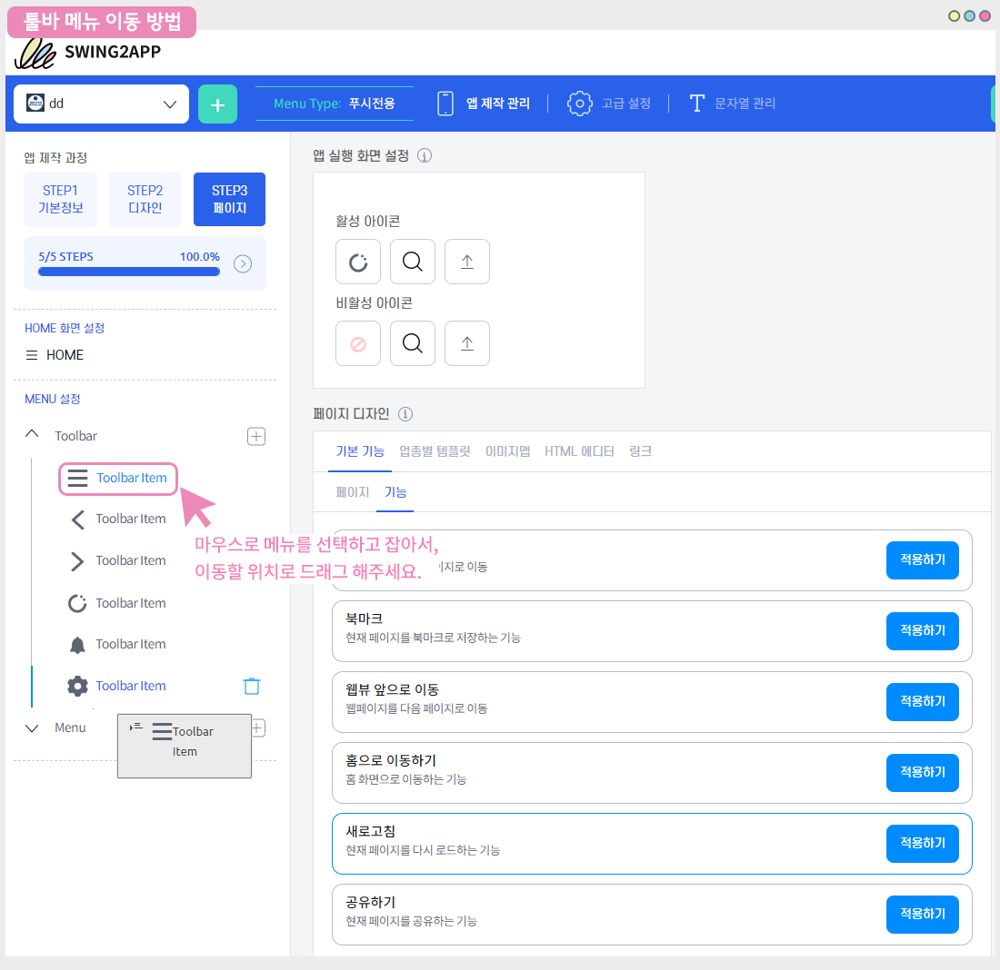
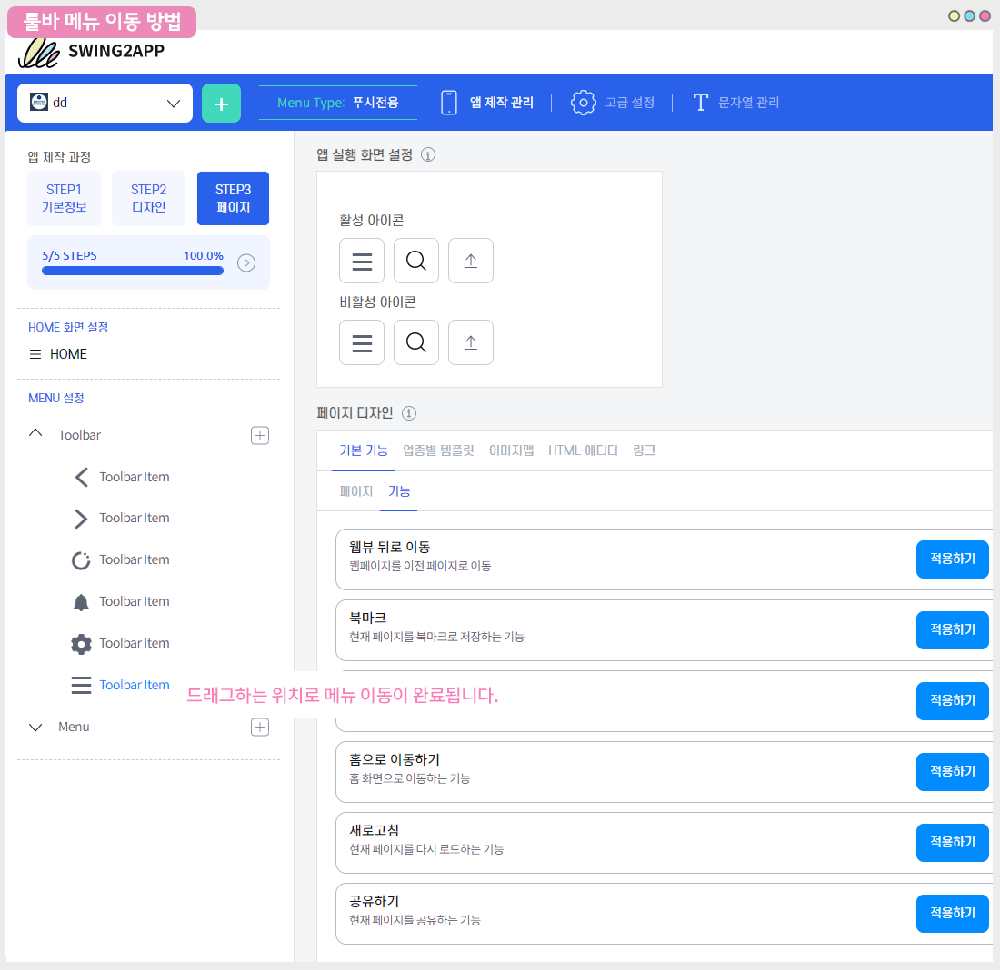

# 푸시앱 툴바-이용방법 및 기능 소개

푸시 툴바 기능 매뉴얼을 알려드립니다.

푸시전용으로 앱제작시 ‘툴바’ 기능을 이용할 수 있는데요. (웹뷰앱에서는 제공되지 않습니다.)

앱 화면 하단에 툴바 영역이 생성되어 다양한 기능을 이용할 수 있습니다.

툴바는 푸시앱에서만 제공하는 기능으로, v3버전에서는 툴바 기능이 다수 업데이트 되었어요.

기존에는 제공되는 툴바로만 이용해야 했다면,

V3에서는 툴바를 원하는 메뉴들로 직접 구성할 수 있고, 아이콘 수정, 디자인 수정이 가능하여 툴바 영역을 직접 꾸밀 수 있습니다.

매뉴얼을 통해서 툴바를 이용하는 방법과 기능들을 어떻게 앱에 적용할 수 있는 지 확인해주세요.


<mark style="color:red;">**안내사항**</mark>

1\)툴바는 푸시앱에서만 제공하는 메뉴이며, 웹뷰앱 및 일반 프로토타입에서는 제공되지 않습니다.

푸시앱에서 이용해주세요!

2\)기존 v2 앱 이용자 분들은 v3으로 전환한 뒤, 업데이트 해주세요!

기능을 적용하고 앱을 업데이트 해주셔야 변경된 기능 및 디자인으로 앱에 반영됩니다.

앱스토어, 플레이스토어 출시된 경우도 업데이트 된 버전으로 다시 심사 진행해주세요.

3\)툴바 기능은 STEP3 페이지 단계에서 이용할 수 있습니다. 해당 단계는 업데이트가 필요없습니다.

최초 앱 제작 후, 툴바를 수정할 경우 업데이트를 하지 않아도 저장만 하면 앱에 바로 반영됩니다.

단, STEP2 디자인 단계에서 툴바 디자인을 수정할 경우 앱 업데이트 필요합니다.


**푸시앱 제작 매뉴얼은 아래 매뉴얼로 이동해주세요.**

[**\[푸시앱제작 매뉴얼 보러가기\]**](push.md)

 (1) (1).PNG>)

### **​****1. 툴바(Toolbar)이용방법**

푸시앱 STEP3 페이지 단계

MENU설정 – Toolbar 왼쪽의 화살표 부분을 마우스로 클릭하면 아래로 툴바 메뉴들이 열립니다.

해당 메뉴는 기본 셋팅된 메뉴이므로, 메뉴를 제거하거나 원하는 메뉴를 추가해서 이용할 수 있어요.

툴바 메뉴를 이용할 경우, 원하는 메뉴를 카테고리에서 선택해서 페이지 디자인을 적용할 수 있습니다.

1\)Toolbar 선택

2\)수정할 메뉴 선택

3\)활성아이콘에서 툴바 메뉴에 적용할 아이콘 선택

4\)페이지 디자인에서 각 툴바 영역에 들어갈 메뉴를 선택할 수 있습니다.

페이지 디자인은 툴바 기본 기능 외에 템플릿, 이미지맵, 에디터페이지, 링크를 추가로 적용할 수 있습니다.

​

 <mark style="color:blue;">**새로고침 툴바 메뉴 적용하기**</mark>

1\)툴바 메뉴 추가 +아이콘 선택해서 추가

2\)활성 아이콘: 돋보기 모양 아이콘을 선택해서 적용하고자 하는 아이콘을 선택합니다.

3\)페이지 디자인: 기본기능에서 \[기능]을 선택해주세요.

4\)새로고침 기능 \[적용하기] 버튼을 선택합니다.

5\)저장 버튼을 선택하면 앱에 반영됩니다.

변경된 내용은 실시간으로 오른쪽 가상머신으로 확인가능하며, 앱을 실행해서도 확인 가능합니다.

​

 <mark style="color:blue;">**툴바에서 제공되는 기본 기능**</mark>

> <mark style="color:blue;">페이지: 북마크 리스트, 메뉴, 알림목록, 설정</mark>
>
> <mark style="color:blue;">기능: 웹뷰 뒤로 이동, 앞으로 이동, 북마크, 홈으로 이동, 새로고침, 공유하기</mark>

위의 기능들을 기본적으로 제공하고 있습니다.

해당 기능은 푸시앱 툴바에서 가장 많이 이용하는 기능들이구요.

기본 셋팅으로 툴바에 제공되고 있으니 필요 없는 메뉴는 제거, 필요한 메뉴는 추가 하여 툴바를 직접 꾸밀 수 있습니다.

####  <mark style="color:blue;">**메뉴 리스트 수정방법**</mark>

툴바에서 제공되는 메뉴 리스트는 Toolbar 메뉴 아래 ‘Menu’에서 리스트를 확인할 수 있습니다.

가상머신으로 메뉴 리스트가 어떻게 보여지는지 확인할 수 있습니다.

메뉴 리스트에 등록된 메뉴 역시 사용자가 자유롭게 수정할 수 있습니다.

\-메뉴 추가, 제거 가능 / 아이콘 설정 가능 -디자인 단계에서 리스트 배경색, 리스트 글자 색 수정 가능

**메뉴 리스트 수정 상세 방법은 아래 매뉴얼로 확인해주세요.**



 (1) (1).PNG>)

###  **2. 툴바 메뉴 추가, 제거**

툴바 메뉴 추가는 toolbar 오른쪽에 있는 **+ 아이콘을 선택하면 새로운 메뉴가 추가됩니다.**

툴바 메뉴 제거는 **휴지통 모양 아이콘을 선택하면 삭제됩니다.**

​

 (1) (1).PNG>)

###  **3. 툴바 메뉴 이동**

툴바 메뉴 순서를 변경할 수 있습니다.

마우스로 메뉴를 선택하고 잡아서, 이동할 위치로 드래그 해주세요.

드래그하는 위치로 메뉴 이동이 완료됩니다.

 (1) (1).PNG>)

###  **4. 툴바 아이콘 이미지 등록하기**

​

v3버전의 툴바 신규 기능 중, 툴바 아이콘을 다른 이미지로 변경하여 적용할 수 있습니다.

아이콘에 이미지를 등록하는 방법을 알려드릴게요.

​

####  <mark style="color:blue;">**앱 실행화면**</mark>

툴바 영역에서 보듯이 앱제작시 제공되는 기본 아이콘 외에, 다른 이미지를 업로드하여 툴바 아이콘을 꾸밀 수 있습니다.

​

####  <mark style="color:blue;">툴바 아이콘 이미지 등록하기</mark>

1\)아이콘을 적용할 툴바 메뉴 선택

2\)활성아이콘에서 세번째 업로드 버튼을 선택해주세요.

3\)파일 첨부창에서 등록하고자하는 이미지를 선택해주세요.

4\)페이지 디자인: 기본 기능 – 기능에서 “홈으로 이동하기” 메뉴 선택 후 \[적용하기] 버튼을 선택합니다.

5\)\[저장] 버튼을 선택하면 완료됩니다.


**아이콘 이미지 사이즈**

최소 사이즈 51px \~ 최대 사이즈 512px 사이의 정사각형 이미지를 등록해주세요.

반드시 가로\*세로 길이가 동일한 정사각형으로 넣어주셔야 합니다.

예시) 512px \* 512px


아이콘 적용이 완료되었습니다.

실시간으로 반영되는 가상머신을 통해 적용된 아이콘을 확인할 수 있구요.

앱을 완전히 종료 후, 재실행하면 변경된 툴바를 확인할 수 있습니다.

\*해당 기능은 저장만 하면 반영되어, 업데이트가 필요 없습니다.

​

 (1) (1).PNG>)

###  **5. 툴바 기본 옵션, 고급 옵션**

툴바 사용여부 및 스타일을 설정하는 메뉴는 STEP2 디자인 단계에서 확인할 수 있습니다.

기본 스타일 옵션, 고급 스타일 옵션을 확인해주세요.

​

#### <mark style="color:blue;">**1)기본옵션 – 툴바 사용여부, 자동 숨김 기능**</mark>

STEP2 디자인 단계

기본 스타일 옵션에서 툴바 사용여부, 툴바 자동숨김 기능을 설정해주세요.

*   툴바 사용으로 체크시, 앱 화면 하단에 푸시가 고정되어 생성되구요.

    사용을 안할 경우 앱에서 툴바는 보이지 않습니다.
*   자동숨김은 스크롤하여 화면 아래로 이동할 경우 툴바가 잠시 사라지는 기능을 말해요.

    화면을 가릴 수 있기 때문에 잠시 숨김으로 해놓다가 다시 화면을 위 아래로 스크롤할 경우 툴바가 생성됩니다.

    툴바 자동숨김 미사용으로 체크할 경우 툴바 영역은 고정되어 보여집니다.

#### <mark style="color:blue;">**2)고급 옵션**</mark>

고급 스타일 옵션에서는 툴바 관련 색상을 설정할 수 있습니다.

**(1)툴바 배경 색상**

툴바 배경 색을 선택하여, 원하는 색상으로 적용할 수 있습니다. (기본: 흰색으로 셋팅)

​

**(2)메뉴 리스트 배경 색상**

메뉴 리스트 배경에 들어가는 색상을 적용할 수 있습니다. (기본: 흰색으로 셋팅)

​

**(3)메뉴 리스트 글자 색상**

메뉴 리스트 글자 색을 적용할 수 있습니다. (기본: 검은색으로 셋팅)

​

STEP디자인 단계 메뉴는 수정이 되면, 앱 업데이트가 필요합니다.

(\*예\_ 툴바 사용여부를 ‘예’로 체크했다가 ‘아니오’로 변경할 경우/ 툴바 배경 색상을 변경할 경우)

따라서 최초 앱 제작 후, 디자인 단계 수정을 했다면 저장 후 \[앱 업데이트] 버튼을 눌러서 업데이트 해주세요.

앱스토어, 플레이스토어 출시된 경우도 업데이트 된 버전으로 다시 심사 진행해주세요.


<mark style="color:red;">**안내사항**</mark>

1\)툴바는 푸시앱에서만 제공하는 메뉴이며, 웹뷰앱 및 일반 프로토타입에서는 제공되지 않습니다.

푸시앱에서 이용해주세요!

​

2\)기존 v2 앱 이용자 분들은 v3으로 전환한 뒤, 업데이트 해주세요!

기능을 적용하고 앱을 업데이트 해주셔야 변경된 기능 및 디자인으로 앱에 반영됩니다.

앱스토어, 플레이스토어 출시된 경우도 업데이트 된 버전으로 다시 심사 진행해주세요.

​

3\)툴바 기능은 STEP3 페이지 단계에서 이용할 수 있습니다. 해당 단계는 업데이트가 필요없습니다.

최초 앱 제작 후, 툴바를 수정할 경우 업데이트를 하지 않아도 저장만 하면 앱에 바로 반영됩니다.

단, STEP2 디자인 단계에서 툴바 디자인을 수정할 경우 앱 업데이트 필요합니다.



**Related Articles**

* [웹뷰앱 – 기본 설정, 고급 설정 옵션](https://wp.swing2app.co.kr/documentation/v3manual/webviewapp-options/)
* [웹뷰,푸시앱-최초 실행 주소 이용방법](https://wp.swing2app.co.kr/documentation/v3manual/firstrun-url/)
* [푸시앱 제작방법](https://wp.swing2app.co.kr/documentation/v3manual/push/)
* [웹뷰앱 제작방법](https://wp.swing2app.co.kr/documentation/v3manual/webview/)
* [앱제작 방법-전체과정 매뉴얼](https://wp.swing2app.co.kr/documentation/v3manual/guide/)
* [앱제작 V3 이용방법](https://wp.swing2app.co.kr/documentation/v3manual/use/)
