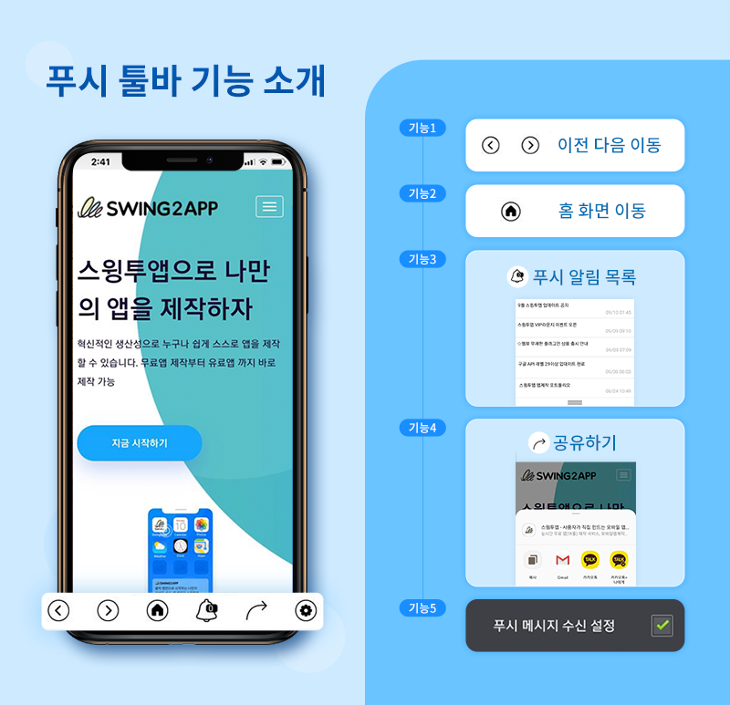
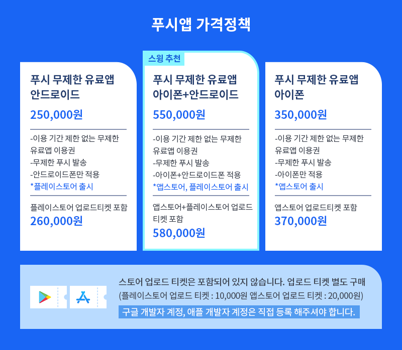

# 스윙투앱 푸시앱

<figure><figcaption></figcaption></figure>

## 푸시앱 소개

<figure><figcaption></figcaption></figure>

## 푸시앱을 이용하는 이유

<figure><figcaption></figcaption></figure>

## 푸시앱 특징

<figure><figcaption></figcaption></figure>

## 푸시앱 - 푸시 툴바 기능 소개

<figure><figcaption></figcaption></figure>

## 푸시앱 제작방법

<figure><figcaption></figcaption></figure>

## 푸시앱 가격정책

<figure><figcaption></figcaption></figure>

<figure><figcaption></figcaption></figure>


**푸시앱 제작 및 스토어 출시 과정을 한 눈에 보고 싶다면?**

스윙투앱 푸시앱 제작방법은 아래 매뉴얼을 보시면 보다 상세하게 확인 가능합니다.

****[**푸시앱 제작 전체 매뉴얼**](https://help-7.gitbook.io/undefined/manual/v3/webapp/push)****



**푸시앱을 스토어에 출시한다면 ‘푸시 무제한 유료앱’을 구매해서 출시할 수 있어요.**

상품 상세 내용을 확인해주세요!

****[**푸시 무제한 유료앱 이용권 보러가기**](https://help-7.gitbook.io/undefined/manual/appmanage/pay/push-unlimited)****


****

