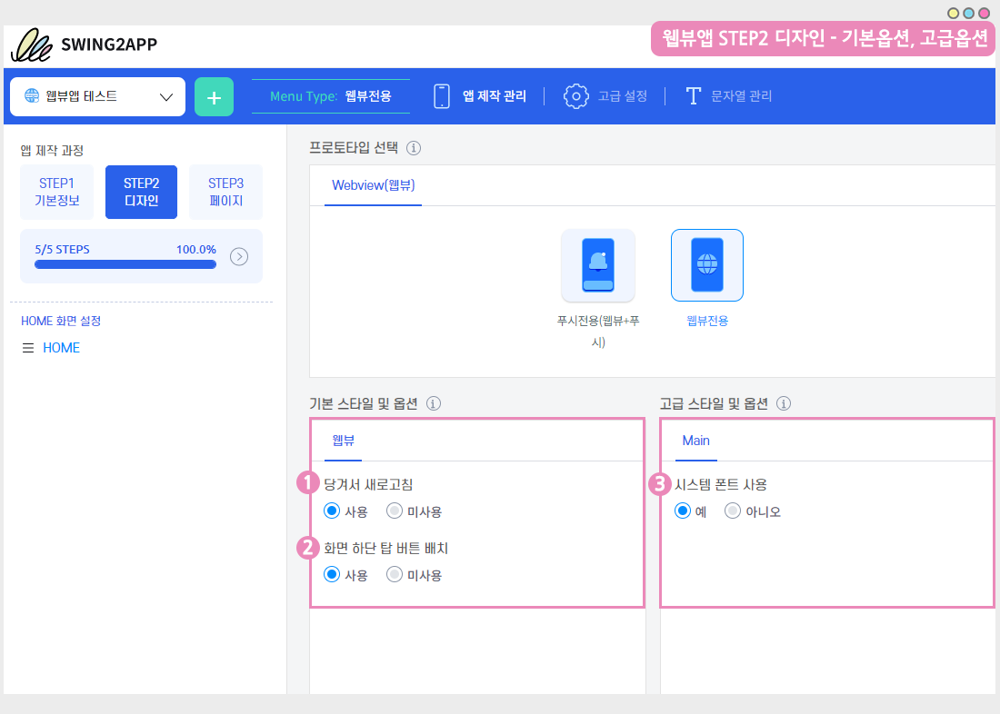
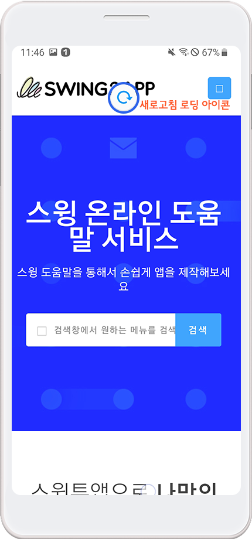
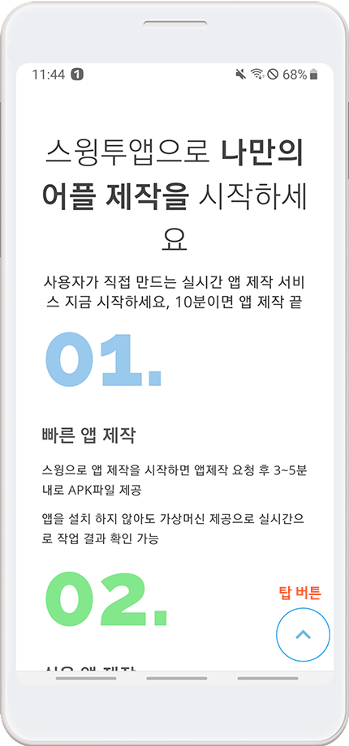
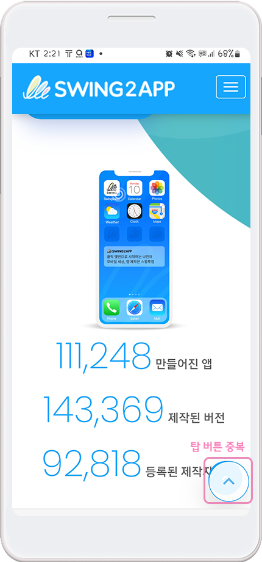
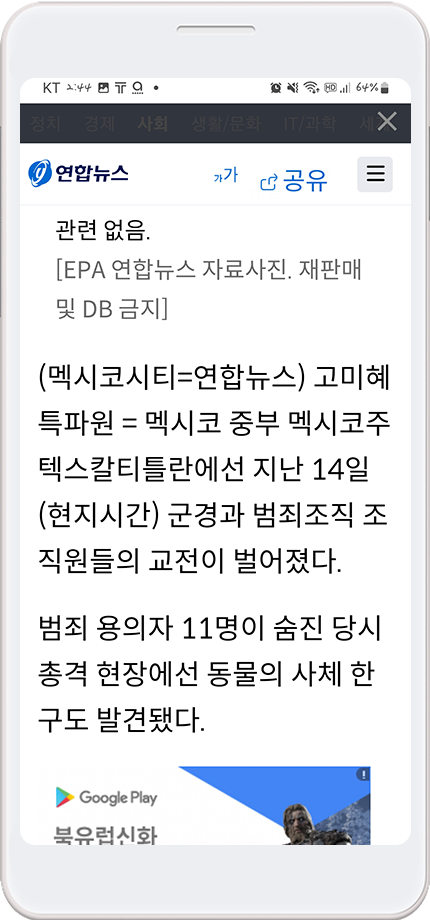

# 웹뷰앱 기본 설정, 고급 설정 옵션

#### **웹뷰앱 - 당겨서 새로고침, 화면 하단 탑버튼, 시스템 폰트 사용**

웹뷰앱 제작시 설정할 수 있는 기본 스타일 옵션, 고급 스타일 옵션에 대해 안내드리겠습니다.

프로토타입: 웹뷰전용 선택, STEP2 디자인 단계에서 기본 스타일 옵션과 고급 스타일 옵션을 확인할 수 있습니다.


**-기본 스타일 옵션: 당겨서 새로고침, 화면 하단 탑 버튼 배치**

**-고급 스타일 옵션: 시스템 폰트 사용**


​기능들을 '사용'으로 체크하고 저장, 앱제작을 진행해주시면 해당 기능이 앱에 셋팅되어 제작됩니다.

해당 기능을 사용한 앱 적용 화면을 아래에서 소개해드릴게요.

.PNG>)

### 1. 당겨서 새로고침

#### **-움짤 이미지로 확인하기**

움짤 이미지에서 보듯이 손가락으로 터치한 화면을 당겼다 올리면 새고로침 로딩 아이콘이 뜨며, 화면이 새로 전환되는 것을 확인할 수 있습니다.

<당겨서 새로고침> 기능은 웹뷰앱 제작시 '사용'으로 체크하고 제작해주세요.

푸시앱과 다르게 웹뷰앱은 '새로고침' 기능이 들어간 툴바를 만들 수 없기 때문에 화면에서 새로고침이 가능한 기능을 넣어주는 것을 권장드립니다.

미사용으로 체크시 앱에서 새로고침을 이용할 수 없습니다.

.PNG>)

### 2. 탑 버튼

#### -움짤 이미지로 확인하기

​움짤 이미지에서 보듯이 아래로 스크롤을 진행시, 화면 하단에 탑 버튼이 생성되는 것을 확인할 수 있습니다.

탑 버튼을 선택하면, 다시 화면 위로 이동하게 됩니다.

​

<mark style="color:red;">**\*이용시 주의사항**</mark>

웹사이트 내 이미 탑버튼이 셋팅되어 내장되어 있다면, 앱에서도 탑 버튼은 동일하게 보여집니다.

따라서 탑버튼이 이미 웹사이트에 적용되어 있다면, 웹뷰앱 제작시에는 탑 버튼 배치를 "미사용"으로 체크하고 제작해주세요.

사용으로 체크하게 되면, 탑 버튼이 중복해서 보여지게 됩니다.

​

**참고 이미지)**

이미지에서 보듯이 웹사이트내 탑버튼과 웹뷰앱 탑버튼이 함께 보이는 문제가 발생합니다.

따라서 해당 기능은 웹사이트 내 탑버튼이 없을 경우 이용해주시기 바랍니다.

.PNG>)

### **3. 시스템 폰트 사용**

시스템 폰트는 핸드폰에 설정된 글자 스타일(글자 크기, 글꼴 등)을 말합니다.

<mark style="color:green;">사용자 폰에서 글자 크기를 크게 키워놨다면→ 앱에 보여지는 글자도 핸드폰에 설정된 글자 크기대로 보이게 됩니다.</mark>

시스템 폰트를 사용하지 않는다면, 앱 내 기본 폰트로 자동 셋팅되기 때문에 사용자 핸드폰 설정과는 무관하게 보여집니다.

​

**참고 이미지)**

사용자의 폰에서 글자 크기를 크게 설정했을 경우, 앱에서 보여지는 본문 글자도 동일하게 보여집니다.

\*글자 크기는 모든 웹에 반영되는 것이 아니며 내장 브라우저로 글자 HTML 페이지에 반영되어 보여집니다.

​

특별한 이유를 제외하고는 기본설정(시스템 폰트 사용 :예)대로 사용하시는 것을 권장드립니다.

시스템 폰트 사용은 크게 이용빈도가 높은 기능은 아니에요.

옵션에서 기본 설정은 "예"에 체크되어 있으므로 별도 수정 없이 그대로 제작해주세요.

.PNG>)

### 4.안내사항

웹뷰앱 제작 후 STEP2디자인 메뉴를 수정할 경우 앱 업데이트가 필요합니다.

(저장시 앱에 자동 반영 되지 않고, 앱을 새 버전으로 재제작해야 반영됩니다)

따라서 앱 제작 후, 위에서 소개해드린 기능 중 하나를 수정할 경우 \[저장] 버튼 선택 -\[앱 업데이트] 버튼을 선택해주세요.

플레이스토어, 앱스토어에 앱이 출시된 경우 업데이트 된 앱으로 다시 심사를 제출해주시구요.

스토어 출시 없이 개인적으로 이용한다면, 앱 삭제 후 새로 제작된 버전의 앱으로 다시 설치해주시면 됩니다.

<mark style="color:red;">**\*\***</mark><mark style="color:red;">앱제작 V2에서 제작한 웹뷰앱을 V3로 전환 하신 분들도! 동일하게 앱 업데이트 다시 해주셔야 합니다.</mark>

