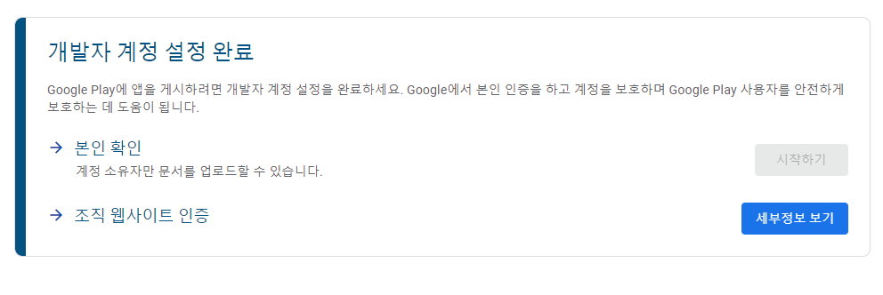

# 구글 개발자 - 조직 웹사이트 인증

***

조직 웹사이트 인증

<figure><figcaption></figcaption></figure>

## 개요

도메인 제공업체의 레코드 목록에 DNS 레코드를 추가하여 소유권을 증명합니다.&#x20;

이 속성은 [URL 접두사 속성](https://support.google.com/webmasters/answer/10432366)(https://example.com)이 아닌 [도메인 속성](https://support.google.com/webmasters/answer/10431861)(example.com)에만 필요합니다. URL 접두사 속성에서 이 방법을 사용하면 소유권이 도메인 속성에서도 자동으로 확인됩니다.

일부 도메인은 Google에서 레코드를 대신 추가할 수 있지만, 다른 도메인에는 레코드를 직접 삽입해야 합니다.

루트 도메인(example.com) 또는 하위 도메인(m.example.com)의 소유권을 확인할 수 있습니다. 루트 도메인의 소유권을 확인하면 모든 하위 도메인의 소유권도 자동으로 확인되지만, 하위 도메인의 소유권을 확인한다고 해서 상위 도메인의 소유권도 확인되는 것은 아닙니다. 예를 들어 m.example.com의 소유권을 확인하면 pets.m.example.com의 소유권도 확인되지만 example.com의 소유권은 확인되지 않습니다.

#### **⚠️** 요구사항

* 맞춤 도메인 이름이 있거나 도메인 이름을 관리해야 합니다.
* 도메인 이름 제공업체의 관리 페이지에 로그인할 수 있어야 합니다.

## 단계

**도메인 이름 공급업체를 통해 소유권을 확인**하려면 다음 단계를 따르세요(공급업체: 도메인 이름을 구매한 회사)**.**

1. **웹사이트 호스팅 플랫폼을 사용하는 경우** [서비스 도움말 페이지를 검색](https://support.google.com/webmasters/answer/9008080#cms)하여 Search Console에서 사이트를 확인하는 방법을 알아보세요. DNS 제공업체를 모르는 경우 [DNS 제공업체 찾기 도움말](https://support.google.com/a/answer/48323)을 참고하세요. 제공업체의 페이지에서 맞춤 해결책을 찾지 못한 경우 다음 단계로 이동합니다.
2. Search Console에서 속성의 [소유권 확인 페이지](https://search.google.com/search-console/ownership)에 있는 **도메인 이름 제공업체 방법을 선택**합니다. 도메인 속성을 만들면 이 방법이 자동으로 선택됩니다.
3.
   * **Search Console에서 TXT 레코드를 제공하는 경우** 아래의 _수동 도메인 이름 제공업체 안내 > TXT DNS 레코드 안&#xB0B4;_&#xB97C; 따릅니다.
   * **Search Console에서 도메인 이름 제공업체가 목록에 표시되면** 제공업체를 선택하고 **확인 시작**을 클릭한 다음 제공되는 안내를 따릅니다. 도메인 이름 제공업체에 로그인해야 하며, 로그인 후 즉시 확인이 진행됩니다.
   * **Search Console에 내가 소유하지 않은 도메인 이름 제공업체가 표시되면** 목록에서 **DNS 제공업체**를 선택하고 아래의 _수동 도메인 이름 제공업체_ 안내를 따릅니다.수동 도메인 이름 제공업체 안내
4. Search Console 확인 세부정보 페이지에서 **확인**을 클릭하여 **소유권 확인을 완료**합니다. **중요:** 수동으로 설치된 레코드의 경우 제공업체에서 레코드를 제공하기 시작할 때까지 최대 2\~3일이 걸릴 수 있습니다. 위의 수동 도메인 이름 제공업체 안내를 따랐으나 확인하는 데 실패했다면 1\~2일 후 다시 시도하시기 바랍니다. 문제를 해결하거나 도메인 이름 제공업체의 레코드 제공 여부를 확인하는 방법은 [발생할 수 있는 오류 섹션](https://support.google.com/webmasters/answer/9008080#dns_troubleshooting)을 참고하세요.

## 소유권 확인 방법 선택

Search Console에서는 여러 가지 확인 방법을 지원합니다. 아래 표에서 가장 적합한 방법을 선택하세요.

<table><thead><tr><th width="342">방법</th><th>참고</th></tr></thead><tbody><tr><td><a href="https://support.google.com/webmasters/answer/9008080#html_verification">HTML 파일 업로드</a></td><td>비교적 간단하지만 특정 URL에서 파일을 업로드하고 사이트에 게시할 수 있어야 합니다. <a href="https://support.google.com/webmasters/answer/9008080#cms">사이트 호스팅 플랫폼</a>에서는 사용할 수 없는 경우도 있습니다.</td></tr><tr><td><a href="https://support.google.com/webmasters/answer/9008080#meta_tag_verification">HTML 태그</a></td><td>비교적 간단하지만 사이트 홈페이지의 HTML 소스 코드를 수정할 수 있어야 합니다. <a href="https://support.google.com/webmasters/answer/9008080#cms">사이트 호스팅 플랫폼</a>에서는 사용할 수 없는 경우도 있습니다.</td></tr><tr><td><a href="https://support.google.com/webmasters/answer/9008080#google_analytics_verification">Google 애널리틱스 추적 코드</a></td><td>이미 페이지에 내가 액세스할 수 있는 Google 애널리틱스 계정에 대한 Google 애널리틱스 추적 코드가 있다면 간단한 방법입니다. 페이지에 추적 코드가 없는 경우 만들어야 하며, 그렇게 하려면 Google 애널리틱스 계정이 없는 경우 만들어야 할 수 있습니다.</td></tr><tr><td><a href="https://support.google.com/webmasters/answer/9008080#google_tag_manager_verification">Google 태그 관리자</a></td><td>이미 페이지에 내가 액세스할 수 있는 Google 태그 관리자 계정에 대한 Google 태그 관리자 스니펫이 있다면 간단한 방법입니다. 페이지에 스니펫이 없는 경우 추가해야 하며, 그렇게 하려면 태그 관리자 계정이 없는 경우 만들어야 할 수 있습니다.</td></tr><tr><td>Google <a href="https://support.google.com/webmasters/answer/9008080#google_sites_verification">Sites</a> 또는 <a href="https://support.google.com/webmasters/answer/9008080#blogger_verification">Blogger</a> 계정</td><td>각 플랫폼에 권장되는 방법을 사용합니다.</td></tr><tr><td><a href="https://support.google.com/webmasters/answer/9008080#domain_name_verification">도메인 이름 공급업체</a></td><td>더 복잡하지만 <a href="https://support.google.com/webmasters/answer/10431861">도메인 속성</a>의 소유권을 확인할 수 있는 유일한 방법입니다. 도메인 공급업체가 확인 마법사에 표시된다면 간단한 절차입니다. 도메인 속성은 모든 프로토콜(http/https) 및 속성의 하위 도메인 변형 데이터를 포함하므로 유용합니다.</td></tr></tbody></table>
