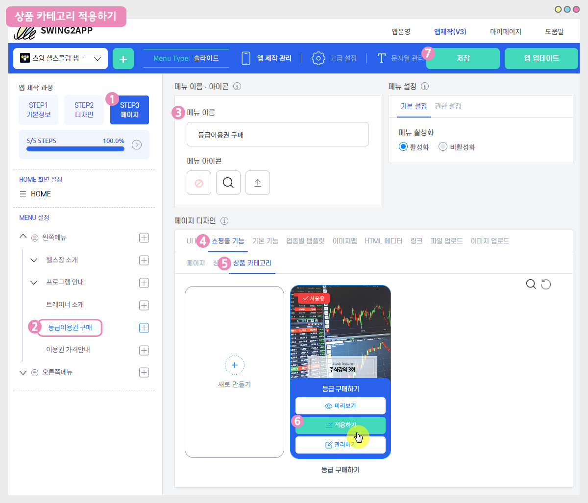
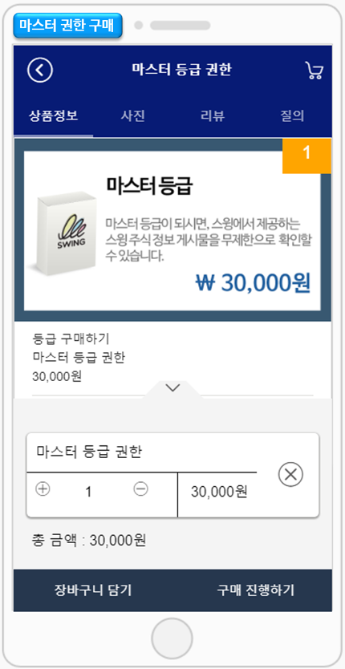
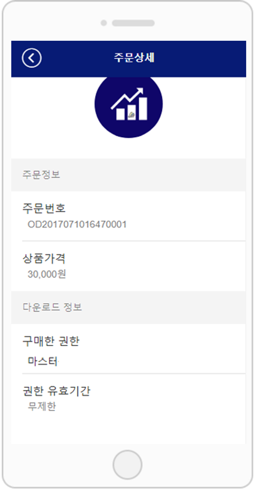

# 상품등록-디지털제품: 권한 변경 상품

디지털판매 제품에는- 권한변경, PDF, 영상 및 파일, 쿠폰 유형을 선택할 수 있습니다.

**해당 매뉴얼에서는 권한 변경 상품: 권한 등록하는 방법, 판매하는 방법, 앱 실행화면, 해당 상품을 어떻게 이용할 수 있는지 알려드리겠습니다.**

***

<mark style="color:blue;">**디지털 제품 ‘권한 변경’ 이란?**</mark>

등급을 부여해서, 앱에서 제공하는 등급을 구매하여 컨텐츠를 열람할 수 있도록 만드는 쇼핑몰 상품 유형이에요.

예를 들어 vip고객, 프리미엄 고객, 우수 고객 이렇게 등급을 나누어서 각 등급별로 상품을 만들구요.

각 등급별로 열람 가능한 컨텐츠를 적용하는 것이죠!

\***vip 권한 구매시 ☞ 모든 게시판 열람 가능**

**\*프리미엄 권한 구매시 ☞ vip 게시판을 제외한 일반 게시판 열람 가능**

**\*우수 권한 구매시 ☞ 기본 정보 게시판만 열람 가능**


<mark style="color:blue;">**스윙샵에서 권한을 판매하기 위해서는 먼저 2가지가 진행되어야 합니다.**</mark>

**1. 앱 이용 권한 설정하기**&#x20;

권한을 판매하기 전에 먼저!! 앱에 어떤 권한을 둘지 등급을 설정해야 하겠죠?

앱의 모든 게시물을 볼 수 있는 마스터 권한, 특정 게시판만 볼 수 있는 그 밑의 등급…. 이렇게 앱에서 이용할 권한 등급을 먼저 만들어야 합니다.

**2. 게시판 권한 설정하기**

권한이 만들어졌다면, 게시판에 권한을 설정해야 하겠죠?

A 게시판은 모든 등급이 다 볼 수 있도록 하고, B 게시판은 1등급 회원만 볼 수 있도록 하고, C 게시판은 1등급\~3등급까지의 회원이 볼 수 있도록 하는 등.. 게시판 마다 게시판을 접근할 수 있는 등급을 적용해야 합니다.


 (1) (1).PNG>)

###  **STEP1.** **권한 그룹 만들기**

먼저 판매할 권한(그룹)을 만들어볼게요!

스윙 앱운영페이지 → 푸시&회원 → 권한 그룹설정 메뉴로 이동합니다.

**\[권한그룹 생성하기]** 버튼을 선택한 뒤 그룹을 설정해주세요.

1\)그룹등급 선택

\*그룹은 총 9등급 까지 만들 수 있어요. (운영 등급, 손님 등급 제외)

2\)그룹명 입력

\*해당 그룹에서 사용할 그룹명을 입력합니다.

3\)그룹설명 입력 (관리자만 보는 내용이기 때문에 일반 사용자들은 볼 수 없어요)

4\)저장 버튼을 누르면 완료됩니다.

새로운 권한 그룹이 생성되었습니다. (권한은 추가적으로 수정 및 삭제가 가능합니다.)

 (1) (1).PNG>)

###  **STEP2. 게시판 관리 – 권한 설정하기**

서비스관리 → 게시판 관리로 이동한 뒤 <mark style="color:blue;">**\[게시판 생성]**</mark> 버튼을 선택해주세요.

원하는 게시판을 만들 되 하단의 <mark style="color:blue;">**\[상세설정]**</mark>만 잘 입력해주시면 됩니다.

**=글쓰기 권한, 글 상세 보기 권한, 목록 보기 권한에 앞서 만들어놓은 권한을 적용해주시면 됩니다.**

그리고 <mark style="color:red;">**★\[지정 권한 사용기능 허용]에 ‘사용’으로 꼭 체크해주세요\~!!​**</mark>

**지정 권한은 해당 권한만 게시판에 접근할 수 있는 기능이구요.**

**만약 1등급\~3등급까지 모두 이용하게끔 하고 싶다면, 지정권한 사용에 ‘사용안함’에 체크해주시면 됩니다.**

여기까지 권한 판매를 위해서 먼저 작업해주셔야 하는 내용이구요.

이제부터는 스윙샵 메뉴에서 본격적으로 카테고리를 만든 뒤 권한 상품을 등록해보겠습니다.

 (1) (1).PNG>)

###  **STEP3. 스윙샵 신청 후 상품 카테고리 등록**

**먼저 스윙샵을 신청해주세요. 스윙샵이 신청되어야 메뉴를 이용할 수 있어요!**

**☞** [**스윙샵 신청방법 보러가기**](broken-reference)

스윙샵을 신청해야 앱운영페이지 상단에 \[스윙샵] 메뉴가 생성이 됩니다.

\[스윙샵]이 생성되었다면, 먼저 상품 카테고리를 등록해야 합니다.

<mark style="color:red;">**\*상품을 등록하는 것이 아니라 상품을 포함하는 상단 메뉴인 카테고리를 먼저 만들어주셔야 합니다\~!**</mark>

**스윙샵 → 상품관리→ 상품카테고리 등록관리 메뉴로 이동합니다.**

상품카테고리 등록관리 화면에 있는 1)\[등록하기] 버튼을 선택해주세요.

카테고리 관리 창에서 2)카테고리명 2) 대표이미지 3)카테고리 설명 5)우선순위 6)표시여부 체크 7) 저장하기 버튼을 선택합니다.

<mark style="color:red;">\*우선순위는 숫자가 높을 수록 상단에 배치되며, 우선순위가 다 동일할 경우 상품등록일에 따라 먼저 등록된 카테고리가 상단에 배치됩니다.</mark>

<mark style="color:red;">\*카테고리는 상품을 포함하는 이름을 기재해야 합니다. 예시) 상의, 하의, 악세사리… 이렇게 표시합니다.</mark>

카테고리 등록이 완료되었습니다.

카테고리는 갯수 제한 없이 해당 메뉴에서 계속 추가할 수 있구요.

해당 카테고리를 선택하여 내용을 수정 할 수 있고, \[삭제하기] 버튼으로 카테고리를 삭제할 수 있습니다.

 (1) (1).PNG>)

###  **STEP4. 디지털 – 권한 변경 상품 등록하기**

카테고리 등록이 끝났다면! 본격적으로 디지털 상품 중에서 ‘권한변경’ 상품을 적용하고 등록해볼게요.

스윙샵 → 상품관리 → 상품등록 화면으로 이동해주세요.

1\. 상품유형: ‘디지털’을 선택합니다.

2\. 디지털 상품 유형 선택: <mark style="color:blue;">**\[권한변경, PDF보기, 영상 및 파일 판매, 쿠폰]**</mark> 중에서 선택할 수 있습니다.

<mark style="color:red;">해당 매뉴에서는 ‘권한 변경’을 선택해서 등록할게요!</mark>

3\. 권한 등록 : 위에서 권한 등급을 만들었죠. 필요한 권한을 선택해주세요.

4\. 권한 기간: 권한이 유지되는 기간을 입력합니다.

<mark style="color:red;">-기간 제한이 없다면, ‘무제한’으로 체크하여 선택하구요.</mark>

<mark style="color:red;">-기간 제한을 둘 경우 유효기간(일) 단위로 입력해주세요.</mark>

예시) 10,000원에 무제한으로 음료를 드실 수 있는 무제한 음료 쿠폰 3장을 드립니다! =>이러한 이벤트에 활용할 수 있어요.

5\. 상품명 : 상품 이름을 입력해주세요.

6\. 상품 대표 이미지 : 상품 구매페이지에서 보여지는 대표 이미지를 등록합니다.

7\. 등록상태: 판매가능, 품절, 판매중지, 임시등록 상태를 선택할 수 있습니다.

8\. 상품 가격: 판매할 가격을 입력합니다.

9\. 배치순서:해당 카테고리에서 상품이 보여지는 순서를 기재합니다. <mark style="color:red;">\*순서가 높을 수록 위에 배치, 낮을수록 아래로 내려갑니다</mark>

10\. 상품 카테고리: 상품 카테고리를 선택해주세요.

<mark style="color:red;">\*위에서 알려드린 것처럼 상품카테고리는 먼저 만들어주셔야 상품등록에서 카테고리를 선택할 수 있으니! 잊지말고 카테고리를 먼저 만들어주세요^^</mark>

11\. 상품별 결제수단: PAY APP(페이앱)카드결제를 체크해주세요.

<mark style="color:red;">\*디지털 제품은 무통장입금 사용할 수 없으며 반드시 전자결제모듈이 적용되어야 합니다.</mark>

12: 상품 할인 제공: 상품이 원가격 그대로 보이게 할지, 할인을 적용할 것인지 선택합니다.

<mark style="color:red;">**\*할인을 “예”로 체크할 경우, 할인금액 및 할인기간을 정하는 옵션창이 뜹니다.**</mark>

<mark style="color:red;">**\*할인금액은 할인이 된 최종 금액을 입력해주셔야 합니다.**</mark>

13\. 재고 관리 사용: 상품 재고관리를 사용할 것인지 체크합니다. / 수량 체크를 한다면, 판매할 수량을 입력해주세요.

14\. 옵션 사용 여부: 상품에 추가로 옵션상품을 기재할 경우 사용하실 수 있어요.

디지털 제품에서는 따로 옵션을 설정하지는 않았는데요. 만약 옵션을 설정한다면 아래 gif이미지로 확인해주시기 바랍니다!

**예시)의류 쇼핑몰: 사이즈 추가, 색상 추가 등을 기재해서 옵션을 설정하고 옵션금액을 설정할 수 있습니다.**

**​**

<mark style="color:blue;">**옵션 추가 방법은 아래 움짤 이미지로 확인해주세요!**</mark>

15\. 상품간단설명: 상품을 소개하는 간단한 한 줄 설명을 입력합니다.

16\. 상품 상세 설명: 상품 이미지, 설명, 상품정보, 환불 및 교환 등 상세 정보를 에디터 프로그램을 이용해서 작성해주세요.

​

17\. 상품 상세 이미지: 상품 이미지를 등록합니다. 여러장의 이미지 등록이 가능하고 순서 변경이 가능합니다.

18\. 주문양식 항목: 주문양식은 특별히 더 받아야 할 정보가 있다면 입력을 해주시고, 그렇지 않으면 작성하지 않아도 됩니다.

19\. 주문완료 메시지 : 메시지 내용이 특별히 없을 경우 작성하지 않아도 됩니다.

20\. \[저장하기] 버튼을 누르면 상품 등록이 완료됩니다.

​

**—상품 등록이 완료되었구요. 등록된 상품은 상품 조회에서 확인할 수 있어요.—**

상품조회 메뉴에서 등록한 상품 목록을 모두 확인할 수 있구요.

등록한 상품 내용 수정이 필요할 경우, 수정을 원하는 상품을 마우스로 선택해주세요.

해당 상품 등록 수정 화면으로 이동합니다.

 (1) (1).PNG>)

###  **STEP5. 앱에 상품 카테고리 적용하기**

위에서 디지털제품 등록이 완료되었다면, 앱에서 실제 상품을 구매할 수 있는 페이지를 적용해볼게요.

**앱제작 V3버전 이용시 - 상품 카테고리 적용하기**

<figure><figcaption></figcaption></figure>

1\)앱제작 - STEP3 페이지 선택

2\)메뉴 선택 – 새 메뉴를 만들어주세요. (+ 모양 버튼 선택하여 메뉴 추가)

3\)메뉴 이름 입력

4\)페이지 디자인에서 \[쇼핑몰 기능] 선택

5\)\[상품 카테고리]를 선택해주세요.&#x20;

\*카테고리는 스윙샵 상품등록시 미리 만들어주셔야 합니다. 상품 카테고리가 없을 경우 적용이 불가합니다.

6\) 적용할 카테고리를 찾아서 \[적용하기] 버튼을 선택해주세요.&#x20;

(페이지에 마우스 커서를 가져다 대면 적용하기 버튼이 열립니다)

7\) 화면 상단 \[저장]버튼을 누르면 앱에 적용됩니다.

**앱제작 V2버전 이용시 - 상품 카테고리 적용하기**

**앱제작 – 페이지 메뉴 단계로 이동합니다.**

1\. \[카테고리 추가] 버튼을 선택해서 적용할 메뉴를 추가합니다.&#x20;

2\. 메뉴 이름을 입력해주세요.

3\. 메뉴 유형: \[상품카테고리]를 선택해주세요.

4\. \[링크마법사] 버튼을 선택해주세요.

5\. 카테고리 검색에서 적용할 카테고리 이름으로 검색 후 선택합니다.  &#x20;

6\. \[반영] 버튼 선택

7\. \[적용] 버튼

8\. \[저장] 버튼을 누르면 완료됩니다.

\*아이콘은 선택사항이며, 메뉴 앞에 아이콘을 적용할 경우만 선택해주세요.&#x20;

**\[앱 실행화면]**

상품 카테고리는 해당 카테고리가 메뉴에 구성이 되는 스타일이구요.

**‘등급 구매하기’ 카테고리를 앱에 적용시, 카테고리 목록이 표시되고 해당 카테고리에 등록된 상품들을 확인할 수 있습니다.**

따라서 카테고리별로 상품을 보여주고자 할 때 적용할 수 있구요.

상품 선택시 구매 페이지로 이동합니다.

 (1) (1).PNG>)

###  STEP6. 스윙 주식 샘플앱) 권한변경 상품 구매 확인하기

스윙 주식 샘플앱을 통해서 앱에 권한변경 상품이 어떻게 등록되었는지 확인해주세요.

그리고 샘플앱을 통해서 권한 변경 상품을 구매하고, 이용하는 방법도 확인할 수 있습니다. ^^

마스터 권한 구매가 완료되었습니다.

구매가 완료된 동시에 권한이 ‘마스터’로 변경이 됩니다.

**\*권한 변경이 앱 이용에 어떤 영향을 미치는지, 마스터 권한을 이용하는 방법을 확인해볼게요.**

<mark style="color:blue;">**\[권한 구매 전]**</mark>

권한 구매 전 일반 회원 등급으로 \[주가지수-국내증시] 게시판에 접근하면 권한이 없다는 메시지창이 뜨면서 접근이 되지 않습니다.

<mark style="color:blue;">**\[마스터 권한 구매 완료 후 접근]**</mark>

마스터로 권한을 구매한 뒤 다시 해당 게시판에 접근하면 게시판 글 상세내용을 모두 확인할 수 있습니다.

