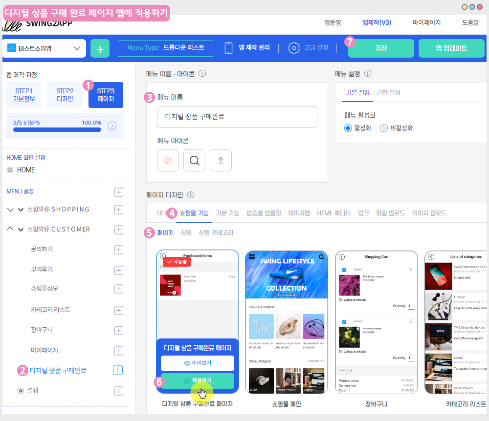

# 스윙페이지-디지털상품 구매완료 페이지

**디지털 상품 구매 완료 페이지는, 구매한 컨텐츠 상품을 확인하는 페이지 입니다.**

따라서 디지털 상품을 판매하는 쇼핑몰 앱에서는 반드시 꼭\~ 적용해주셔야 하는 페이지입니다.&#x20;

\*디지털 상품 판매 예) 이용권, 쿠폰, PDF보기, 영상 및 파일, 권한변경(이용자 등급)

메뉴얼을 통해 디지털상품 구매 완료 페이지를 앱에 적용하는 방법을 확인해주세요.&#x20;

***

 <mark style="color:blue;">**디지털상품 구매완료 페이지 앱 실행화면**</mark>

스윙 학원 샘플앱을 실행한 화면이구요.

매뉴얼 df와 영상파일을 판매하고 있습니다.

사용자가 해당 상품을 구매하면 디지털상품 구매완료 페이지에서 구매한 컨텐츠를 확인할 수 있습니다.


<mark style="color:red;">**\*주의\***</mark>

**디지털 상품 구매완료 페이지는 스윙샵 상품 유형 – 디지털 제품 판매시에만 적용이 가능합니다.**

실물상품, 예약상품은 ‘마이페이지’를 통해서 구매 내역을 확인할 수 있구요.

디지털 상품의 경우 상품 특성상 컨텐츠를 열어서 봐야 하기 때문에 디지털상품에 한해 구매 완료 페이지를 제공해드리고 있습니다.

이점 참고하여서 운영해주세요.


 (1) (1).PNG>)

###  **STEP1. 앱에 디지털상품 구매완료 페이지 적용하기**

#### **-앱제작 V3 버전 이용시 적용방법**

<figure><figcaption></figcaption></figure>

1\)앱제작 - STEP3 페이지 선택

2\)메뉴 선택 – 새 메뉴를 만들어주세요. (+ 모양 버튼 선택하여 메뉴 추가)

3\)메뉴 이름 입력

4\)페이지 디자인에서 \[쇼핑몰 기능] 선택

5\)\[페이지]를 선택해주세요.&#x20;

6\)디지털상품 구매완료 페이지확인 후, \[적용하기] 버튼을 선택해주세요.&#x20;

(페이지에 마우스 커서를 가져다 대면 적용하기 버튼이 열립니다)

7\) 화면 상단 \[저장]버튼을 누르면 앱에 적용됩니다.

#### &#x20;**-앱제작 V2버전 이용시 적용방법**

**앱제작  → 페이지메뉴 단계로 이동합니다.**

1\. \[카테고리 추가] 버튼을 눌러서 메뉴를 추가해주세요.&#x20;

2\. 메뉴명: 메뉴 이름을 입력합니다.

3\. 스윙페이지 메뉴 선택한 뒤

4\. \[링크마법사] 버튼을 선택합니다.

5\. 링크마법사 창에서 <mark style="color:blue;">**\[디지털상품 구매완료 페이지]**</mark> 메뉴 선택, \[반영]버튼 선택

6\. \[적용] 버튼 선택

7\. \[저장] 버튼 누르면 앱에 반영됩니다.

 (1) (1).PNG>)

###  **STEP2. 디지털상품 구매완료 페이지 앱 실행화면**

디지털상품 구매완료 페이지로 이동하면 사용자가 구매 완료한 상품을 모두 확인할 수 있구요.

**\[보기]** 버튼을 선택하면 컨텐츠 열람 페이지로 이동하구요.

PDF 보기를 선택하면 컨텐츠 내용을 확인할 수 있습니다.&#x20;


<mark style="color:green;">**디지털상품 구매완료 페이지 이용 TIP**</mark>

\*적용한 디지털제품 유형에 따라 페이지는 다르게 이동합니다.

쿠폰을 구매했는지, 이용권한을 구매했는지, 영상파일을 구매했는지에 따라 해당 상품에 맞는 페이지로 이동합니다.&#x20;

**\[보기]** 버튼을 선택하면 컨텐츠 열람 혹은 쿠폰보기, 주문상세 페이지 등으로 이동합니다.&#x20;


**이용권한 상품 구매시 앱 실행화면**

**이용권한은 \[보기]** 버튼을 누르면 권한 이용기한 등 내용을 확인해주는 용도의 주문상세 페이지로 이동합니다.

이용권한은 컨텐츠처럼 파일을 보거나, 쿠폰처럼 실물이 있는 상품이 아니기 때문에 주문 상세 화면으로 이동하게 됩니다.

&#x20;**따라서 디지털 상품을 판매하는 쇼핑몰 앱에서 반드시 꼭\~ 적용해주시기 바랍니다.**&#x20;

