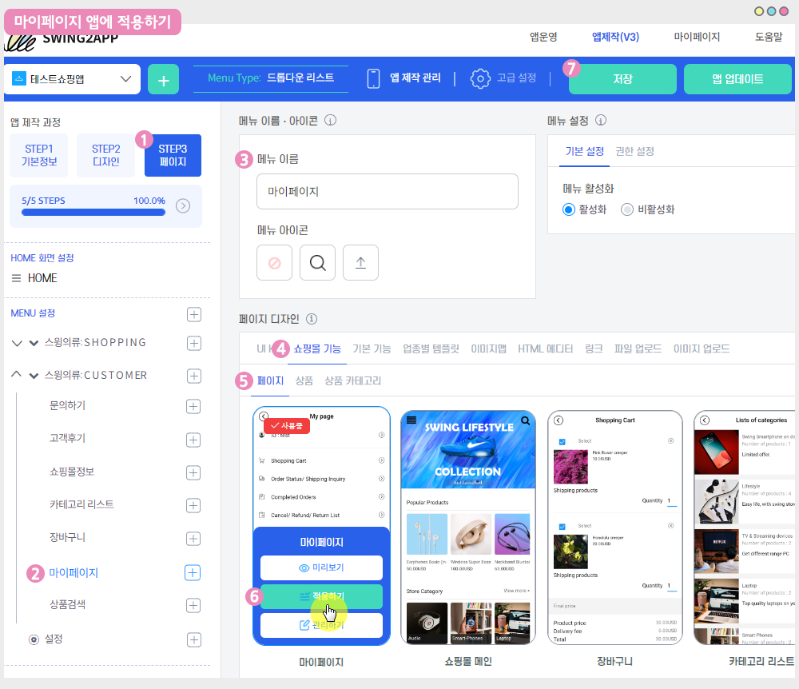

# 스윙페이지-마이페이지

마이페이지는 **사용자 구매 정보부터 결제, 배송에 관련된 모든 내역을 확인할 수 있는 페이지에요.**

따라서 쇼핑몰 앱에서는 반드시 꼭\~ 적용해주셔야 하는 페이지입니다.&#x20;

***

<mark style="color:blue;">**마이페이지 앱 실행화면**</mark>

마이페이지 역시 스윙샵 기능 이용시 이용가능하오니, **스윙샵 서비스 신청 후 적용해주세요.**&#x20;

☞ [**\[스윙샵 신청방법\]**](broken-reference)

 (1) (1).PNG>)

###  **STEP1. 앱에 마이페이지 메뉴 적용하기**&#x20;

#### &#x20;**-앱제작 V3 버전 이용시 적용방법**

<figure><figcaption></figcaption></figure>

1\)앱제작 - STEP3 페이지 선택

2\)메뉴 선택 – 새 메뉴를 만들어주세요. (+ 모양 버튼 선택하여 메뉴 추가)

3\)메뉴 이름 입력

4\)페이지 디자인에서 \[쇼핑몰 기능] 선택

5\)\[페이지]를 선택해주세요.&#x20;

6\)마이페이지 확인 후, \[적용하기] 버튼을 선택해주세요.&#x20;

(페이지에 마우스 커서를 가져다 대면 적용하기 버튼이 열립니다)

7\) 화면 상단 \[저장]버튼을 누르면 앱에 적용됩니다.

#### **-앱제작 V2버전 이용시 적용방법**

**앱제작  → 페이지메뉴 단계로 이동합니다.**

1\. \[카테고리 추가] 버튼을 눌러서 메뉴를 추가해주세요.&#x20;

2\. 메뉴명: 메뉴 이름을 입력합니다.

3\. 스윙페이지 메뉴 선택한 뒤

4\. \[링크마법사] 버튼을 선택합니다.

5\. 링크마법사 창에서 <mark style="color:blue;">**\[마이페이지]**</mark> 메뉴 선택, \[반영]버튼 선택

6\. \[적용] 버튼 선택

7\. \[저장] 버튼 누르면 앱에 반영됩니다.

 (1) (1).PNG>)

###  **STEP2. 마이페이지 앱 실행화면**

\[마이페이지]는 사용자 구매 정보부터 결제, 배송에 관련된 모든 내역을 확인할 수 있습니다.&#x20;

장바구니, 주문현황, 배송조회, 배송완료, 구매완료 , 교환 조회 / 고객센터 이용 기능을 제공합니다.

따라서 쇼핑몰 앱에서는 꼭!! 넣어주셔야 합니다.&#x20;

