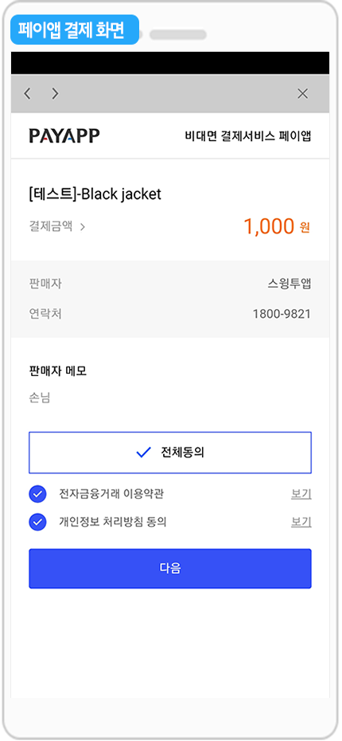
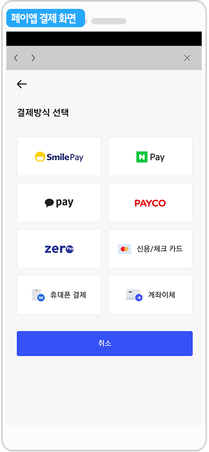

# 상점관리-결제모듈관리

스윙샵을 신청하면, 스윙샵 메뉴가 생성되고, 스윙샵에서 제공하는 다양한 메뉴들을 사용할 수 있어요.

**스윙샵 – 상점관리에서 결제모듈을 설정할 수 있는 결제모듈관리 페이지에 대해서 알려드리겠습니다.**

스윙샵은 앱에서 직접 결제를 할 수 있는 만큼 **결제수단을 사용자가 직접 설정하여 앱에 적용할 수 있습니다.**

기본으로 페이앱(카드결제, 핸드폰소액결제, 실시간계좌이체), 무통장입금, 현장결제 결제수단을 기본으로 제공하고 있습니다.&#x20;

결제모듈을 설정하는 방법, 앱을 실행했을 때 나타나는 결제페이지를 확인해보도록 하겠습니다.

 (1) (1).PNG>)

**결제모듈관리 페이지 이동**

**스윙샵 – 상점관리 메뉴에서 – \[결제모듈관리]**로 이동합니다.

결제모듈 페이지는 스윙샵에서 제공하는 결제수단을 설정할 수 있는 페이지입니다.

페이앱(카드결제, 핸드폰소액결제, 실시간계좌이체), 무통장입금 결제모듈을 기본으로 제공하고 있구요.

\+대면결제(현금)도 새롭게 추가되었습니다.

​

**확장형 상품 이상부터 카카오페이 결제모듈도 사용할 수 있습니다.**

필요없는 결제모듈이 있으면, 박스에 체크를 풀어서 사용하지 않음으로 저장해주시면 됩니다.

<mark style="color:red;">\*카카오페이는 스윙유료앱-확장형 이용권 상품이상부터 적용되며, 사용자분께서 직접 카카오페이 가맹점 신청을 하여 승인받아야 합니다.</mark>

<mark style="color:red;">\*인앱은 별도 커스터마이징으로만 적용이 가능합니다. (비용 발생)</mark>

 (1) (1).PNG>)

###  (1).png>) **1. 페이앱**

페이앱은 가입을 하지 않아도 테스트로 결제가 가능합니다.

페이앱 계정에 보시면 ‘hustayshop’ 이라고 기재되어 있죠. 해당 계정이 테스트용 계정이구요.

나중에 페이앱 가입 후 판매점으로 승인을 받으시면 해당 사용자별로 계정은 연결하여 앱에 셋팅할 수 있어요.


테스트 중에는 실제 결제가 되지 않습니다. 1,000원으로 결제되며 바로 취소처리됩니다.

따라서 테스트 중에는 자유롭게 결제 테스트해보시구요, 페이앱 계정 셋팅이 완료되면 그때부터 실제 전자결제가 가능해집니다.


<mark style="color:green;">\*페이앱은 일반 카드결제, 휴대폰 결제, 실시간 계좌이체를 제공하는 PG사 전자결제모듈이에요.</mark>

스윙투앱에서는 페이앱 결제모듈과 연동하여 사용중에 있구요.

스윙샵 신청하여 상품을 모두 등록한 뒤 최종적으로 페이앱 가입을 진행해주시면 됩니다.

**페이앱 가입은 사용자분이 직접 페이앱 공식 홈페이지에서 판매점으로 가입해주시면 됩니다.**&#x20;

**☞**[**\[스윙샵 서비스 신청방법 보러가기\]**](broken-reference)

&#x20;판매점 승인이 완료되면 페이앱 계정을 앱에 연결할 수 있구요.&#x20;

실제 결제가 가능해집니다. \*페이앱 API적용 완료

**앱 실행화면: 페이앱 결제화면**

**페이앱 결제수단을 선택하면 페이앱에서 제공하는 결제모듈을 선택할 수 있어요.**

스마일페이, 네이버페이, 카카오페이, 페이코, 제로페이, 신용/체크카드 결제, 휴대폰 결제, 계좌 이체 중에서 원하는 결제방식을 선택해서 결제할 수 있습니다.

 (1) (1).PNG>)

###  (1).png>) **2. 무통장 입금**

**무통장입금은 실물 상품, 예약시스템 상품에서만 적용 가능하구요.**

**\*디지털상품은 반드시 페이앱 등의 전자결제모듈이 적용되어야 합니다.**

쇼핑몰 업체의 계좌번호를 입력하여, 사용자가 무통장입금할 수 있는 결제수단이에요.

1\) PG상세 설정은 ‘무통장입금’으로 선택합니다.

2\) 무통장번호-계좌번호를 입력합니다.

3\) 예금주 입력

4\) 은행명 입력

5\) 저장하기를 누르면 완료됩니다.

**앱 실행화면: 무통장입금 결제화면**

결제수단 – 무통장입금을 선택 후, \[결제하기] 버튼을 선택하면 아래로 입금 계좌 정보가 나옵니다.

사용자는 해당 계좌로 입금한 뒤\[입금확인요청] 버튼을 눌러주시면 완료됩니다.

 (1) (1).PNG>)

###  (1).png>) **3. 대면결제(현금)**&#x20;

스윙샵 결제모듈에서 대면결제(현장결제) 결제모듈이 추가되었습니다.

**+현장결제는 실물 상품 배송 및 배달 업체 등에서 사용할 수 있는 결제수단이에요.**

**+사용자가 상품 구매하기에서 ‘현장결제’를 선택하면, 배달원 등이 구매자와 만나서(직접 대면하여) 결제를 하는 방법이에요.**

앱 내에서 결제가 완료되는 페이앱 전자결제, 무통장입금 결제수단 외에대면결제는 앱내에서 결제가 진행되지 않고 현장에서 직접 만나서 결제를 하는 시스템입니다.

<mark style="color:red;">\*대면결제(해외)는 현재 공식 오픈된 기능이 아닙니다. (이용 불가)</mark>

​

**앱 실행화면: 현장결제 화면**

상품 선택 후 구매하기 결제수단: \[현장결제]를 선택합니다.

결제하기 화면이 뜨며, 금액 확인 후 \[결제하기] 버튼을 선택하면 주문이 완료됩니다.

사용자에게는 주문완료 및 주문 상세페이지가 뜨면서 결제가 완료되구요.

앱 운영자(관리자)에게 현장구매 푸시 알림, 메일이 발송되요.

따라서 구매 예약건 확인을 한 뒤 상품 준비 및 배송 등의 다음 절차를 진행할 수 있습니다.

 (1) (1).PNG>)

###  (1).png>) **4. 카카오페이 설정**

**그 외 확장형 이용권 사용중인 분들은 카카오페이를 적용할 수 있습니다.**

<mark style="color:red;">\*페이앱을 이용하시는 분들은 페이앱 서비스 내에 '카카오페이' 결제 서비스를 제공하고 있습니다.</mark>

&#x20;<mark style="color:red;">따라서 별도로 카카오페이 가맹점을 신청하지 않아도 되구요.</mark>

<mark style="color:red;">페이앱 결제모듈에 앱에서 카카오페이 결제를 이용할 수 있습니다.</mark>

**카카오페이 설정시 필요한 정보들을 입력합니다.**

1\) PG상세 설정은 카카오페이로 설정합니다.

2\) 카카오 가맹점 ID를 입력합니다.

3\) 카카오세션 ID를 입력합니다.

4\) 카카오 TXN\_ID호출값을 입력합니다.

5\) 카카오 TXN\_ID호출값을 입력합니다.

6\) 저장하기를 눌러서 해당 설정값을 저장해주세요.

**\* 카카오페이 서비스 신청 후 해당 정보들을 입력해주세요.**

​

[**\[카카오페이 가맹점 신청\]**](http://with.kakao.com/kakaopay/index)

스윙 결제모듈에서 카카오페이를 이용할 때는 먼저 카카오페이 공식 홈페이지에서 가맹신청을 해주세요.

신청 후 가맹점 ID 등의 정보를 입력해주시면 됩니다.

 (1) (1).PNG>)

**결제모듈이 적용된 스윙샵 앱을 실행하면, 위에서 적용한** 페이앱, 무통장입금, 대면결제 결제모듈을 확인할 수 있습니다.

원하는 결제방법을 선택해서 결제를 진행할 수 있구요.

**스윙샵에서 원하는 결제수단을 선택해서 이용할 때는 결제모듈 페이지에서 설정해주시기 바랍니다.**

**\*결제수단별 앱 실행화면 상세 내용은 아래 매뉴을 참고해주세요!**

☞ [결제수단별 앱 실행화면 보러가기](broken-reference)

