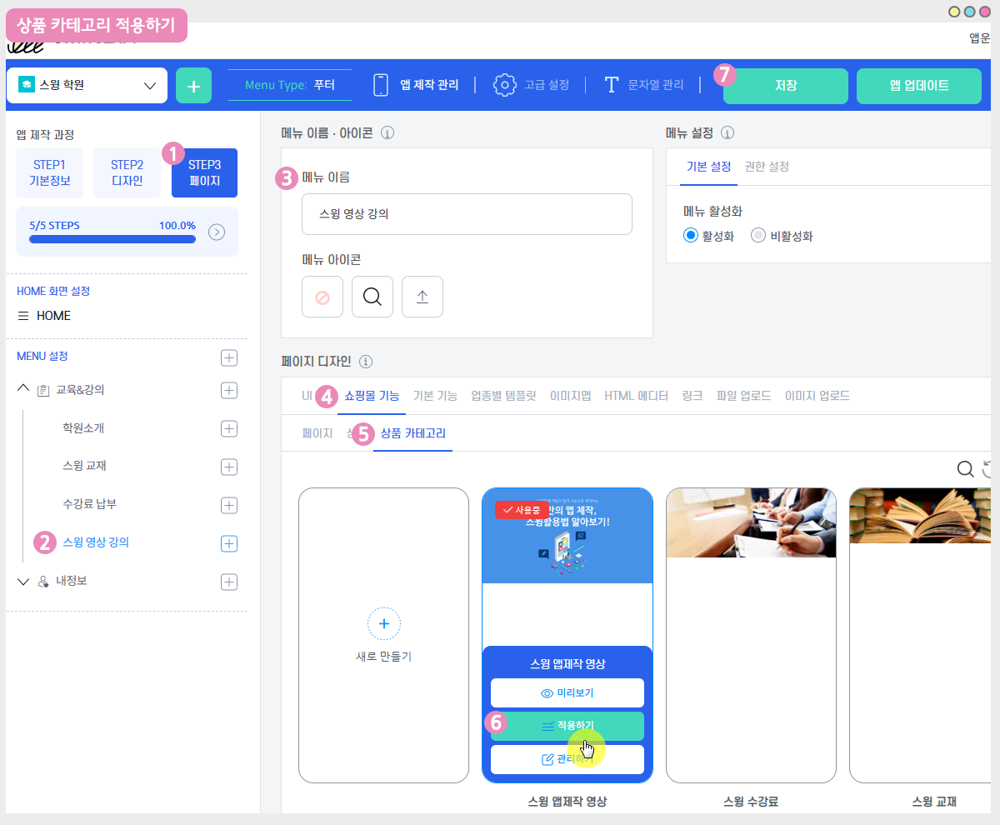

# 상품등록-디지털제품: 영상파일 등록

디지털 제품은 무형의 컨텐츠를 판매하는 상품 유형이구요.

디지털판매 제품에는- 권한변경, PDF, 영상 및 파일, 쿠폰 유형을 선택할 수 있습니다.

해당 매뉴얼에서는 디지털제품 – 영상 및 파일 등록방법 및 앱 적용방법 등을 알려드리겠습니다.

 (1) (1).PNG>)

##  **STEP1. 스윙샵 신청 후 상품 카테고리 등록**

먼저 스윙샵을 신청해주세요. 스윙샵이 신청되어야 메뉴를 이용할 수 있어요!

스윙샵을 신청해야 앱운영페이지 상단에 \[스윙샵] 메뉴가 생성이 됩니다.

**☞** [**스윙샵 신청방법 보러가기**](broken-reference)

\[스윙샵]이 생성되었다면, 먼저 상품 카테고리를 등록해야 합니다.

<mark style="color:red;">\*상품을 등록하는 것이 아니라 상품을 포함하는 상단 메뉴인 카테고리를 먼저 만들어주셔야 합니다\~!</mark>

[스윙샵 → 상품관리→ 상품카테고리 등록관리](http://www.swing2app.co.kr/view/store_product_category) 메뉴로 이동합니다.

**​**

상품카테고리 등록관리 화면에 있는 1)\[등록하기] 버튼을 선택해주세요.

카테고리 관리 창에서 2)카테고리명 2) 대표이미지 3)카테고리 설명 5)우선순위 6)표시여부 체크 7) 저장하기 버튼을 선택합니다.

<mark style="color:red;">\*우선순위는 숫자가 높을 수록 상단에 배치되며, 우선순위가 다 동일할 경우 상품등록일에 따라 먼저 등록된 카테고리가 상단에 배치됩니다.</mark>

<mark style="color:red;">\*카테고리는 상품을 포함하는 이름을 기재해야 합니다. 예시) 상의, 하의, 악세사리… 이렇게 표시합니다.</mark>

카테고리 등록이 완료되었습니다.

카테고리는 갯수 제한 없이 해당 메뉴에서 계속 추가할 수 있구요.

해당 카테고리를 선택하여 내용을 수정 할 수 있고, \[삭제하기] 버튼으로 카테고리를 삭제할 수 있습니다.

 (1) (1).PNG>)

##  **STEP2. 디지털제품 \[영상 및 파일 판매] 선택**

카테고리 등록이 끝났다면! 본격적으로 디지털 상품중에서 – 영상 및 파일 판매 상품을 등록해볼게요

스윙샵 → 상품관리 → 상품등록 화면으로 이동해주세요.

​

1\. 상품유형: ‘디지털’을 선택합니다.

2\. 디지털 상품 유형 선택: <mark style="color:blue;">**\[권한변경, PDF보기, 영상 및 파일 판매, 쿠폰]**</mark> 중에서 선택할 수 있습니다.

해당 포스팅에서는 **‘영상 및 파일판매’**&#xB97C; 선택해서 등록할게요!

3\. 영상 및 파일 업로드: 등록하고자 하는 파일을 업로드 해주세요&#x20;

4\. 외부 공유 및 연동 금지

<mark style="color:red;">-구매한 영상 및 파일을 공유할 수 없고, 앱에서만 확인하도록 설정하고 싶다면 ‘외부 공유 및 연동 금지’ 체크해주세요</mark>

<mark style="color:red;">-외부 공유 및 연동이 되어도 괜찮다면 체크를 풀어주세요.</mark>

5\. 상품명 : 상품 이름을 입력해주세요.

6\. 상품 대표 이미지 : 상품 구매페이지에서 보여지는 대표 이미지를 등록합니다.

7\. 등록상태: 판매가능, 품절, 판매중지, 임시등록 상태를 선택할 수 있습니다.

8\. 상품 가격: 판매할 가격을 입력합니다.

9\. 배치순서:해당 카테고리에서 상품이 보여지는 순서를 기재합니다.

10\. 상품 카테고리: 상품 카테고리를 선택해주세요.

<mark style="color:red;">**\*위에서 알려드린 것처럼 상품카테고리는 먼저 만들어주셔야 상품등록에서 카테고리를 선택할 수 있으니! 잊지말고 카테고리를 먼저 만들어주세요^^**</mark>

11\. 상품별 결제수단: PAY APP(페이앱)카드결제를 체크해주세요.

<mark style="color:red;">\*디지털 제품은 무통장입금 사용할 수 없으며 반드시 전자결제모듈이 적용되어야 합니다.</mark>

12: 상품 할인 제공: 상품이 원가격 그대로 보이게 할지, 할인을 적용할 것인지 선택합니다.

<mark style="color:red;">**\*할인을 “예”로 체크할 경우, 할인금액 및 할인기간을 정하는 옵션창이 뜹니다.**</mark>

<mark style="color:red;">**\*할인금액은 할인이 된 최종 금액을 입력해주셔야 합니다.**</mark>

13\. 재고 관리 사용: 상품 재고관리를 사용할 것인지 체크합니다. / 수량 체크를 한다면, 판매할 수량을 입력해주세요.

14\. 옵션 사용 여부: 상품에 추가로 옵션상품을 기재할 경우 사용하실 수 있어요.

디지털 제품에서는 따로 옵션을 설정하지는 않았는데요. 만약 옵션을 설정한다면 아래 gif이미지로 확인해주시기 바랍니다!

**예시)의류 쇼핑몰: 사이즈 추가, 색상 추가 등을 기재해서 옵션을 설정하고 옵션금액을 설정할 수 있습니다.**

**​**

**옵션 추가 방법은 아래 움짤 이미지로 확인인해주세요!**

15\. 상품간단설명: 상품을 소개하는 간단한 한 줄 설명을 입력합니다.

16\. 상품 상세 설명: 상품 이미지, 설명, 상품정보, 환불 및 교환 등 상세 정보를 에디터 프로그램을 이용해서 작성해주세요.

17\. 상품 상세 이미지: 상품 이미지를 등록합니다. 여러장의 이미지 등록이 가능하고 순서 변경이 가능합니다.

18\. 주문양식 항목: 주문양식은 특별히 더 받아야 할 정보가 있다면 입력을 해주시고, 그렇지 않으면 작성하지 않아도 됩니다.

19\. 주문완료 메시지 : 메시지 내용이 특별히 없을 경우 작성하지 않아도 됩니다.

20\. \[저장하기] 버튼을 누르면 상품 등록이 완료됩니다.

​

**—상품 등록이 완료되었구요. 등록된 상품은 상품 조회에서 확인할 수 있어요.—**

상품조회 메뉴에서 등록한 상품 목록을 모두 확인할 수 있구요.

등록한 상품 내용 수정이 필요할 경우, 수정을 원하는 상품을 마우스로 선택해주세요.

해당 상품 등록 수정 화면으로 이동합니다.

 (1) (1).PNG>)

##  **STEP3. 앱에 상품 카테고리 적용하기**

위에서 디지털제품 등록이 완료되었다면, 앱에서 실제 상품을 구매할 수 있는 페이지를 적용해볼게요.

### **1.앱제작 V3버전 이용시**

<figure><figcaption></figcaption></figure>

1\)앱제작 - STEP3 페이지 선택

2\)메뉴 선택 – 새 메뉴를 만들어주세요. (+ 모양 버튼 선택하여 메뉴 추가)

3\)메뉴 이름 입력

4\)페이지 디자인에서 \[쇼핑몰 기능] 선택

5\)\[페이지]를 선택해주세요.&#x20;

6\)상품카테고리 리스트 확인 후, \[적용하기] 버튼을 선택해주세요.&#x20;

(페이지에 마우스 커서를 가져다 대면 적용하기 버튼이 열립니다)

7\) 화면 상단 \[저장]버튼을 누르면 앱에 적용됩니다.

### **2.앱제작 V2버전 이용시**

**앱제작 – 페이지 메뉴 단계로 이동합니다.**

1\. \[카테고리 추가] 버튼을 선택해서 적용할 메뉴를 추가합니다.&#x20;

2\. 메뉴명: 메뉴 이름을 입력해주세요.

3\. 메뉴 유형: \[상품카테고리]를 선택해주세요.

4\. \[링크마법사] 버튼을 선택해주세요.

5\. 카테고리 검색에서 적용할 카테고리 이름으로 검색 후 선택합니다.  &#x20;

6\. \[반영] 버튼 선택

7\. \[적용] 버튼 선택

8\. \[저장] 버튼을 누르면 완료됩니다.

\*아이콘은 선택사항이며, 메뉴 앞에 아이콘을 적용할 경우만 선택해주세요.&#x20;

 (1) (1).PNG>)

##  **STEP4. 앱 실행화면) 디지털-영상 파일 판매 앱**

앱에 적용된 영상 파일을 구매할 수 있구요.

마이페이지에서 구매한 영상을 확인할 수 있습니다.

