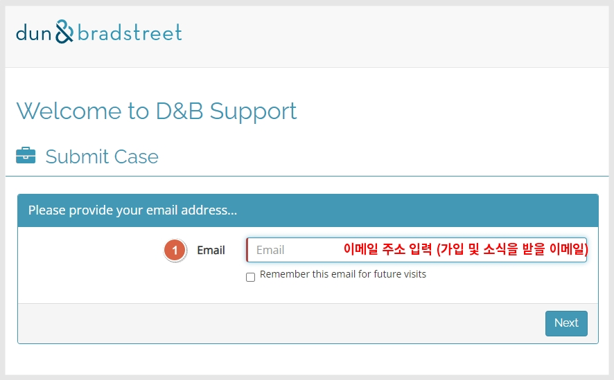
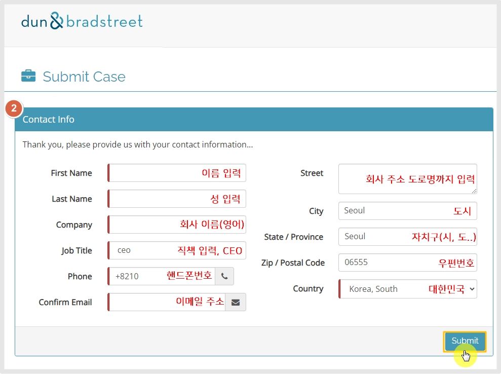
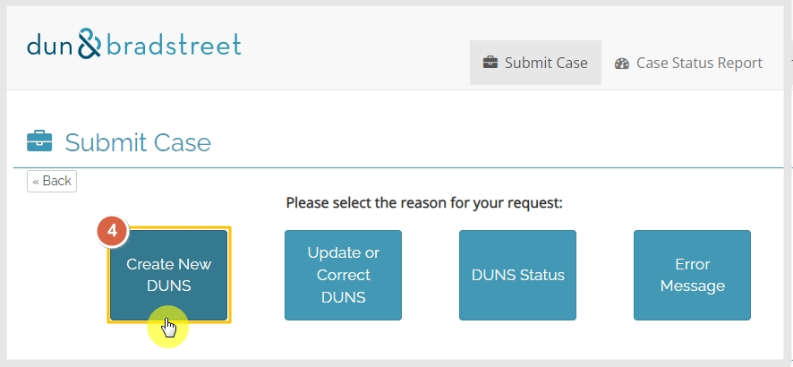
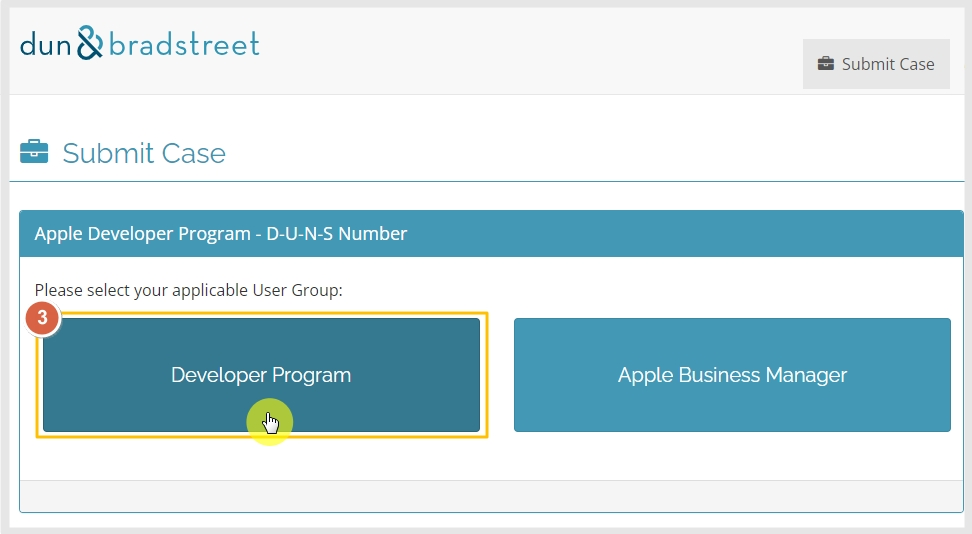
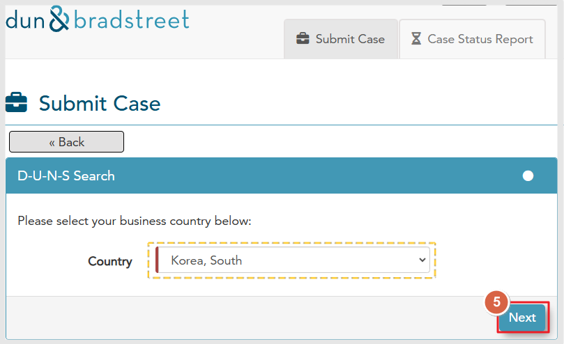
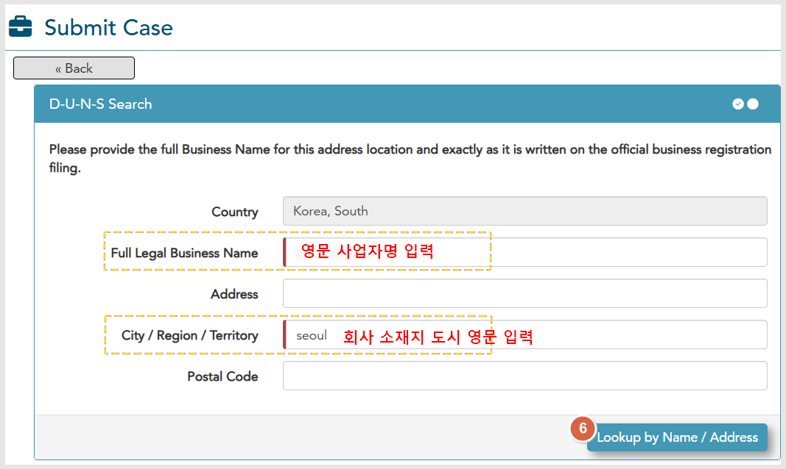
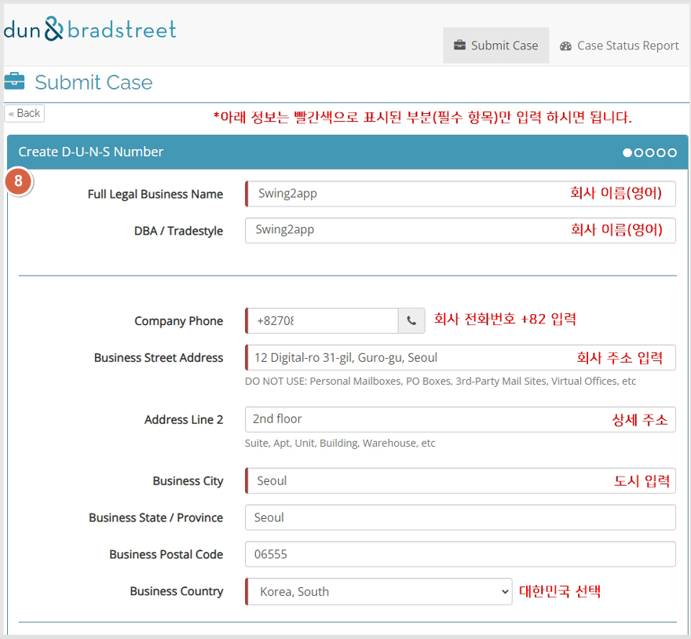
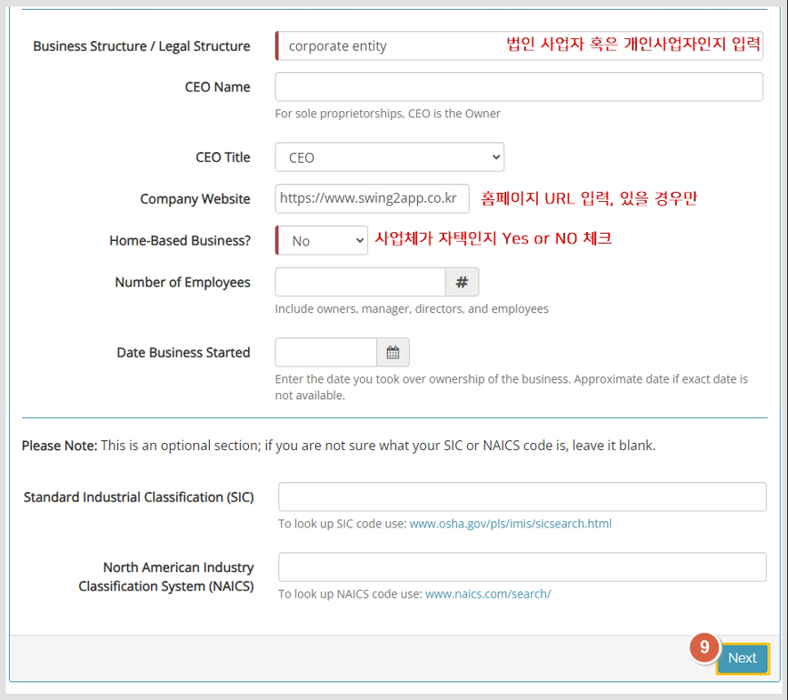
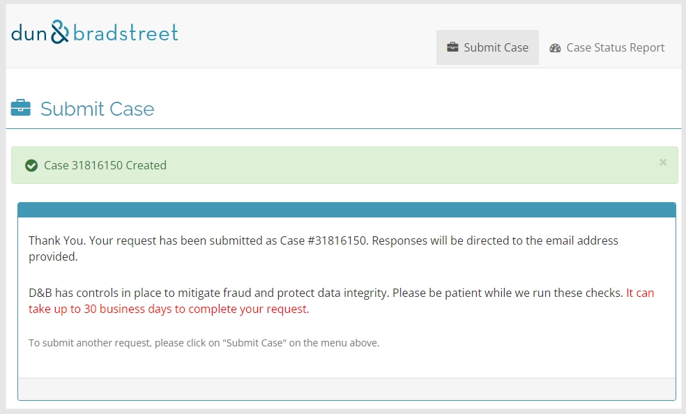
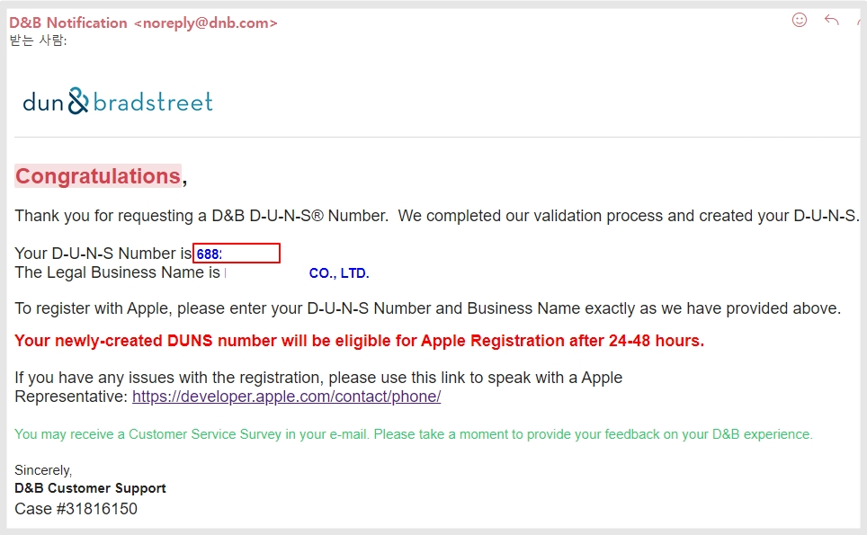

# DUNS 번호 발행 방법

***

애플 개발자 비즈니스 계정, 구글 개발자 조직 계정을 만들 때 DUNS 넘버가 필요합니다.

애플에서 제공하는 대행 발급사를 통해서 직접 번호를 발급받을 수 있습니다.


\*던스 번호 발행이 어렵다면 알려주세요!

스윙투앱에서는 모든 사업자 던스 번호 발행 대행 작업도 해드리고 있습니다.

또한 구글 및 애플 개발자 계정 대행 작업도 해드리고 있습니다.

필요하실 경우 스윙투앱 [실시간 채팅](https://direct.lc.chat/12036120/) 혹은 [문의게시판](https://www.swing2app.co.kr/view/service_qa)으로 문의 남겨주세요. 안내 도와드리겠습니다.&#x20;


***


D-U-N-S Number란?

D-U-N-S Number(The Data Universal Numbering System)는 “국제사업자등록번호” 통용되는, 전 세계 표준 기업식별코드로, 9자리의 숫자로 구성됩니다.

사업자등록체계가 잘 갖춰진 대한민국과는 달리, 사업자등록체계가 없는 국가도 존재합니다.

사업자등록체계가 있다해도 국가별로 상이한 사업자 식별 코드로 인한 관리의 어려움이 크므로, 이를 해결하기 위해 D\&B가 개발하여 전 세계가 사용하는 기업식별코드입니다.


일반적으로 외국계 기업에서는 DUNS 넘버를 많이 이용하고 있구요.

애플 개발자 등록시 필요하며, 구글에서도 이제 조직 개발자들에게도 DUNS 넘버를 받겠다는 공지를 발표했습니다.

따라서 애플, 구글 개발자 계정을 등록할 때 이제 D-U-N-S Number를 필수 발급받아야 합니다.

***

## STEP1.사이트 접속&#x20;

Dun & Bradstreet 사이트 [D\&B 지원 사이트 접속](https://support.dnb.com/?CUST=APPLEDEV)

모든 내용은 영어로 입력해주세요!

### 1.이메일 주소 입력

<figure><figcaption>
Duns number 신청 페이지
</figcaption></figure>

&#x20;가입 및 DUNS 넘버 등록완료 등 소식을 받을 이메일입니다.  입력 후 Next 선택

### 2.기본정보 입력

<figure><figcaption></figcaption></figure>

가입자의 기본정보를 가입합니다.

사업체의 정보를 바탕으록 입력해주셔야 합니다.

<mark style="color:red;">모든 내용은 영어로 입력해주셔야 합니다.</mark>

1\)회사 대표자 이름 , 성 입력 \*영어 입력

2\)회사 이름 입력 \*회사명을 영어로 입력해주세요.

\*주의) 회사명을 기재할 때는 반드시 사업자등록증에 등록된 회사 이름을 영어로 직역하여 등록해주셔야 합니다.

구글 및 애플 계정 등록시 계정에 등록된 사업자명, 사업자등록증에 기재된 사업자명, DUNS에 등록된 사업자명 3개 정보가 모두 일치해야 합니다.

따라서 사업자등록증에 기재된 명칭과 다른 이름으로 등록하실 경우 번호는 발행될 수 있으나 애플이나 구글 개발자 계정 가입시 조직명이 일치 하지 않는다는 이유로 가입이 안되는 난처한 상황이 발생될 수 있어요.

3\)직책 입력 -> CEO로 입력합니다.

4\)핸드폰 번호 입력, 국가번호 +82 입력 꼭 해주세요 예시) +821077778888

5\)이메일주소 입력 (대표자 혹은 가입자 본인 번호 입력하셔도 됩니다)

6\)회사 주소 도로명 까지 입력 \*영어로 입력

7\)도시 입력 (서울, 인천, 부산....)

8\)자치구 입력 (서울, 경기도, 제주도, 부산...)

9\)우편번호 입력

10\)대한민국 Korea, South 선택 (아래 화살표 버튼 선택하여 국가 선택)

입력 완료되면 \[Submit] 제출 버튼 선택합니다.

### 3.Developer Program 선택

<figure><figcaption></figcaption></figure>

### 4.Create New DUNS 선택

<figure><figcaption></figcaption></figure>

### 5.DUNS Search

<figure><figcaption></figcaption></figure>

Country에서 비지니스 국가를 선택하고 'Next'를 클릭하세요.

### 6.DUNS Search

<figure><figcaption></figcaption></figure>

영문 사업자 등록증에 기재된 영문 법인명 및 회사가 위치한 도시의 영문을 입력하고 'Lookup by Name / Address' 를 클릭하세요.

* D-U-N-S Search

-Full Legal Business Name: 영문 사업자등록증에 기재된 영문 법인명 입력

-City / Region / Territory: 회사가 위치한 도시의 영문 입력 ex) Seoul

### 7.Click here 선택

<figure><figcaption></figcaption></figure>

일반적으로 처음 DUNS 번호를 만드는 것이기 때문에, 조회되는 정보가 없을 것입니다.

따라서 상단에 '<mark style="color:blue;">**click here**</mark>'을 클릭해주세요.

해당 버튼을 누르면 이제 본격적인 사업자 등록 화면으로 이동 합니다.

***

## STEP2.회사 상세 정보 입력

### 8.사업자 정보 입력

-항목은 빨간색으로 표시된 부분만 필수 항목이므로, 해당 영역만 입력을 해주셔도 됩니다.

-모든 답변은 영어로 입력해주셔야 합니다.

<figure><figcaption></figcaption></figure>

1\)회사이름 입력


<mark style="color:red;">\*주의) 회사명을 기재할 때는 반드시 사업자등록증에 등록된 회사 이름을 영어로 직역하여 등록해주셔야 합니다.</mark>

구글 및 애플 계정 등록시 계정에 등록된 사업자명, 사업자등록증에 기재된 사업자명, DUNS에 등록된 사업자명 3개 정보가 모두 일치해야 합니다.&#x20;

따라서 사업자등록증에 기재된 명칭과 다른 이름으로 등록하실 경우 DUNS는 발행될 수 있으나 애플이나 구글 개발자 계정 가입시 조직명이 일치 하지 않는다는 이유로 가입이 안되는 난처한 상황이 발생될 수 있어요.


2\)회사 전화번호 입력 국가번호 +82 기재해주세요.

3\)회사 주소 입력, 상세 주소는 선택사항입니다.

4\)사업체가 위치한 도시를 입력합니다.

5\)국가 선택: 대한민국 선택

<figure><figcaption></figcaption></figure>

6\)사업체 구분: 법인 인지 개인사업자인지 기재합니다.

<mark style="color:blue;">-법인: corporate entity or corporation</mark>

<mark style="color:blue;">-개인: Sole proprietor or Single Person Business</mark>

7\)Home-Based Business? : 사업체가 위치한 곳이 자택(본인의 집)인지를 묻는 질문입니다.

사업체가 자택이 아니면 "NO" , 사업체가 집이라면 "Yes"를 선택합니다.

그 외 정보는 선택사항이므로 입력하지 않아도 가입이 가능하구요.

홈페이지 URL 입력, 사업체 근무인원 수, 개업일 등 입력 가능한 내용이 있을 경우 함께 입력해주셔도 됩니다.

### 9.Next 버튼 선택

***

## STEP3.사업자등록증 제출

<figure><figcaption></figcaption></figure>

\[파일 선택]선택, 사업자등록증을 등록해주세요.

추가 입력하실 내용이 있다면 기재해주셔도 되고(선택), 사업자등록증 파일만 제출하셔도 됩니다.

\[Submit] 제출 버튼 선택합니다.

​

***

## STEP4.제출 완료

<figure><figcaption></figcaption></figure>

모든 내용 제출이 완료되었습니다.

DUNS 넘버를 발행하는데는 30일이 걸리 수 있다고 나와 있으나, 실제로 발행되기 까지는 보다 빨리 완료됩니다.

***

​

## STEP5.발행 완료

<figure><figcaption></figcaption></figure>

발급이 완료되었습니다.

메일 본문에 던스 넘버 9자리 확인할 수 있구요,

기업 이름도 잘 등록되었는지 확인할 수 있습니다.

<mark style="color:purple;">번호가 발급되어도 번호 유효 시간이 존재합니다 \*구글 및 애플에 번호를 반영하기 까지 시간이 소요됩니다.</mark>

<mark style="color:purple;">2-3일이 지난 후 애플 개발자 계정이나 구글 개발자 계정을 등록해주시기 바랍니다.</mark>

***


스윙투앱은 스토어 유지보수 서비스를 진행하고 있습니다.&#x20;


다양한 문의 및 스토어 관련 문제로 스윙투앱으로 작업 요청을 주고 있습니다.&#x20;

"DUNS 번호 발행이 어려워요"

"DUNS번호 발행을 받았는데 개발자 계정 생성이 되지 않아요 "

"DUNS번호 발행을 받았는데, 구글 개발자 계정 조직 인증이 되지 않아요, 곧 계정 해지가 될 것 같아요"

"회사 주소가 변경되었는데 DUNS번호 업데이트 하는 방법을모르겠어요."&#x20;

어려움이 있다면 스윙투앱으로 알려주세요. 상세하고 친절히 안내 도와드리겠습니다.

**스윙투앱** [**실시간 채팅**](https://direct.lc.chat/12036120/) **혹은** [**문의게시판**](https://www.swing2app.co.kr/view/service_qa)**으로 문의 남겨주세요.**

감사합니다.&#x20;

***

​

