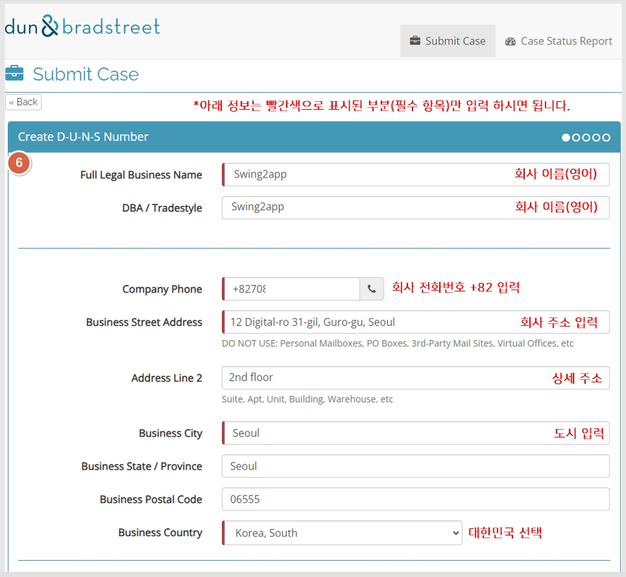
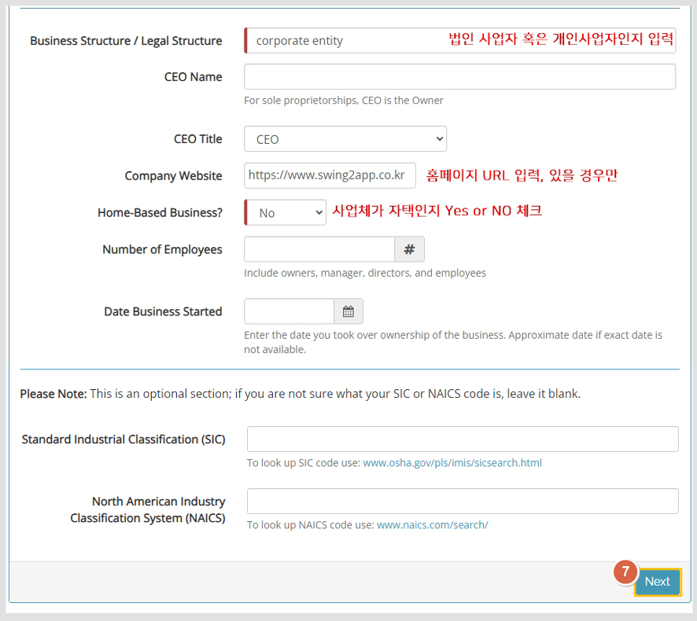
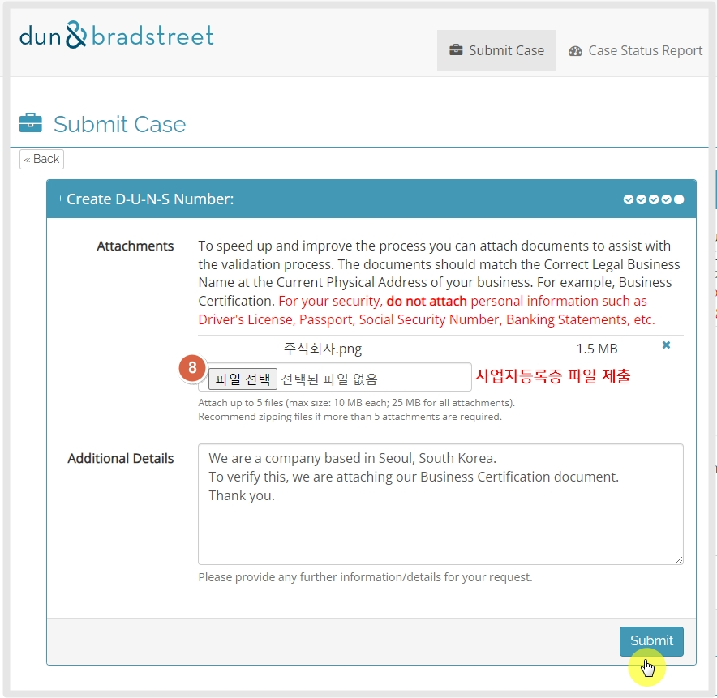

# DUNS 넘버 발행 방법

***


D-U-N-S Number란?

D-U-N-S Number(The Data Universal Numbering System)는 “국제사업자등록번호” 통용되는, 전 세계 표준 기업식별코드로, 9자리의 숫자로 구성됩니다.

사업자등록체계가 잘 갖춰진 대한민국과는 달리, 사업자등록체계가 없는 국가도 존재합니다.

사업자등록체계가 있다해도 국가별로 상이한 사업자 식별 코드로 인한 관리의 어려움이 크므로, 이를 해결하기 위해 D\&B가 개발하여 전 세계가 사용하는 기업식별코드입니다.


일반적으로 외국계 기업에서는 DUNS 넘버를 많이 이용하고 있구요.

애플 개발자 등록시 필요하며, 구글에서도 이제 조직 개발자들에게도 DUNS 넘버를 받겠다는 공지를 발표했습니다.

따라서 애플, 구글 개발자 계정을 등록할 때 이제 D-U-N-S Number를 필수 발급받아야 합니다.

​

***

## 1.사이트 접속 및 이메일 주소 입력

Dun & Bradstreet 사이트 [D\&B 지원 사이트 접속](https://support.dnb.com/?CUST=APPLEDEV)

<figure><figcaption>
Duns number 신청 페이지
</figcaption></figure>

이메일주소를 입력합니다. 가입 및 DUNS 넘버 등록완료 등 소식을 받을 이메일입니다.&#x20;

***

## 2.회사 상세 정보 입력

\-항목은 빨간색으로 표시된 부분만 필수 항목이므로, 해당 영역만 입력을 해주셔도 됩니다.

\-모든 답변은 영어로 입력해주셔야 합니다.

<figure><figcaption></figcaption></figure>

1\)회사이름 입력


<mark style="color:red;">\*주의) 회사명을 기재할 때는 반드시 사업자등록증에 등록된 회사 이름을 영어로 직역하여 등록해주셔야 합니다.</mark>

구글 및 애플 계정 등록시 계정에 등록된 사업자명, 사업자등록증에 기재된 사업자명, DUNS에 등록된 사업자명 3개 정보가 모두 일치해야 합니다.&#x20;

따라서 사업자등록증에 기재된 명칭과 다른 이름으로 등록하실 경우 DUNS는 발행될 수 있으나 애플이나 구글 개발자 계정 가입시 조직명이 일치 하지 않는다는 이유로 가입이 안되는 난처한 상황이 발생될 수 있어요.


2\)회사 전화번호 입력 국가번호 +82 기재해주세요.

3\)회사 주소 입력, 상세 주소는 선택사항입니다.

4\)사업체가 위치한 도시를 입력합니다.

5\)국가 선택: 대한민국 선택

​

<figure><figcaption></figcaption></figure>

6\)사업체 구분: 법인 인지 개인사업자인지 기재합니다.

<mark style="color:blue;">-법인: corporate entity or corporation</mark>

<mark style="color:blue;">-개인: Sole proprietor or Single Person Business</mark>

7\)Home-Based Business? : 사업체가 위치한 곳이 자택(본인의 집)인지를 묻는 질문입니다.

사업체가 자택이 아니면 "NO" , 사업체가 집이라면 "Yes"를 선택합니다.

그 외 정보는 선택사항이므로 입력하지 않아도 가입이 가능하구요.

홈페이지 URL 입력, 사업체 근무인원 수, 개업일 등 입력 가능한 내용이 있을 경우 함께 입력해주셔도 됩니다.

***

## 3.사업자등록증 제출

<figure><figcaption></figcaption></figure>

\[파일 선택]선택, 사업자등록증을 등록해주세요.

추가 입력하실 내용이 있다면 기재해주셔도 되고(선택), 사업자등록증 파일만 제출하셔도 됩니다.

\[Submit] 제출 버튼 선택합니다.

​

***

## 4.제출 완료

<figure><figcaption></figcaption></figure>

모든 내용 제출이 완료되었습니다.

DUNS 넘버를 발행하는데는 30일이 걸리 수 있다고 나와 있으나, 실제로 발행되기 까지는 보다 빨리 완료됩니다.

***

​

## 5.발행 완료

<figure><figcaption></figcaption></figure>

발급이 완료되었습니다.

메일 본문에 던스 넘버 9자리 확인할 수 있구요,

기업 이름도 잘 등록되었는지 확인할 수 있습니다.

번호가 발급되어도 번호 유효 시간이 존재합니다.

2-3일이 지난 후 애플 개발자 계정이나 구글 개발자 계정을 등록해주시기 바랍니다.

***

​

