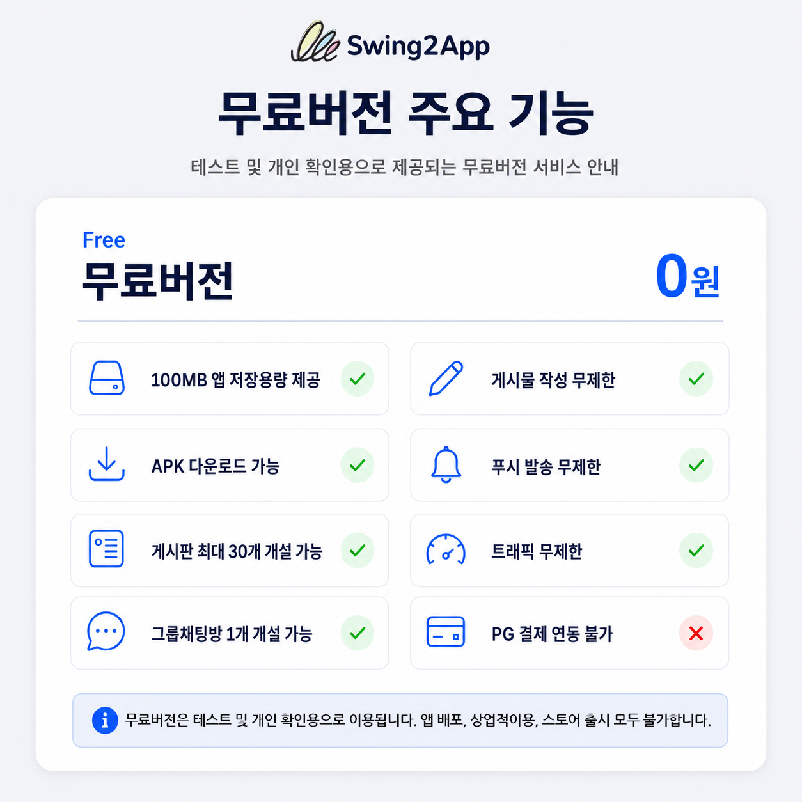
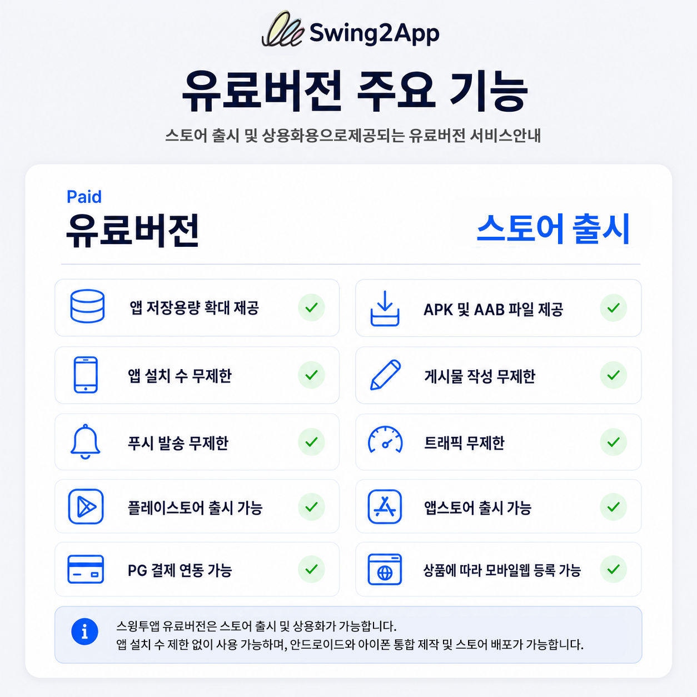

# 스윙투앱 무료버전과 유료버전 차이

***

스윙투앱은 앱을 직접 제작해보고 테스트할 수 있는 **무료버전**과, 제작한 앱을 실제로 배포하고 운영할 수 있는 **유료버전**을 제공합니다.

무료버전은 테스트 및 개인 확인용으로 적합하며, 플레이스토어·앱스토어 출시 등 상용화를 목적으로 사용할 경우에는 유료버전을 이용해야 합니다.

***

## **1.무료버전 사용 용도**

무료버전은 앱을 상용화하지 않고, 개인적인 용도 또는 테스트용으로 사용하는 상품입니다.

| 항목     | 내용                 |
| ------ | ------------------ |
| 사용 목적  | 개인 테스트용            |
| 제공 파일  | APK 파일 제공          |
| 앱 설치 수 | 최대 10개 기기까지 설치 가능  |
| 스토어 출시 | 플레이스토어, 앱스토어 출시 불가 |
| 상업적 사용 | 상업적·배포용 사용 불가      |

### **무료버전에서 제공되는 주요 기능**

* 100MB 앱 저장용량 제공
* APK 다운로드 가능
* 게시판 최대 30개 개설 가능
* 그룹채팅방 1개 개설 가능
* 게시물 작성 무제한
* 푸시 발송 무제한
* 트래픽 무제한
* PG 결제 연동 불가
* 모바일웹 등록 불가

👉무료버전은 제작한 앱을 실제 사용자에게 배포하기 전, 앱 화면과 기능을 미리 확인해보는 용도로 이용할 수 있습니다.

<figure><figcaption></figcaption></figure>

***

## **2.유료버전 사용 용도**

유료버전은 앱을 플레이스토어, 앱스토어 등에 출시하여 실제로 운영하고자 할 때 이용하는 상품입니다.

| 항목     | 내용                   |
| ------ | -------------------- |
| 사용 목적  | 스토어 출시 및 상용화         |
| 제공 파일  | APK, AAB 파일 제공       |
| 앱 설치 수 | 제한 없이 이용 가능          |
| 스토어 출시 | 플레이스토어, 앱스토어 출시 가능   |
| 제작 방식  | 안드로이드 + 아이폰 통합 제작 가능 |

### **유료버전에서 제공되는 주요 기능**

* 앱 저장용량 확대 제공
* APK 및 AAB 파일 제공
* 앱 설치 수 무제한
* 게시물 작성 무제한
* 푸시 발송 무제한
* 트래픽 무제한
* 플레이스토어 출시 가능
* 앱스토어 출시 가능
* PG 결제 연동 가능
* 상품에 따라 모바일웹 등록 가능

👉유료버전은 앱을 플레이스토어, 앱스토어에 출시하고 사용자들에게 배포할 경우 이용권 구매 후 이용 가능합니다.&#x20;

<figure><figcaption></figcaption></figure>

***

## **3.무료버전과 유료버전 비교**

| 구분        | 무료버전      | 유료버전                            |
| --------- | --------- | ------------------------------- |
| 이용 목적     | 개인 테스트용   | 스토어 출시 및 운영용                    |
| 앱 설치 수    | 최대 10개 기기 | 무제한                             |
| APK 파일    | 제공        | 제공                              |
| AAB 파일    | 미제공       | 제공                              |
| 플레이스토어 출시 | 불가        | 가능                              |
| 앱스토어 출시   | 불가        | 가능                              |
| 상업적 사용    | 불가        | 가능                              |
| PG 결제 연동  | 불가        | 가능                              |
| 모바일웹 등록   | 불가        | 상품에 따라 가능(확장형, 프리미엄 이용권 구매시 가능) |

무료버전은 앱 제작 기능을 확인하고 테스트하기 위한 용도입니다.\
앱을 실제 사용자에게 배포하거나 플레이스토어, 앱스토어에 출시하려면 유료버전을 이용해야 합니다.

즉,&#x20;

**-테스트용은 무료버전**

**-스토어 출시 및 상용화는 유료버전**을 선택하시면 됩니다.

***

