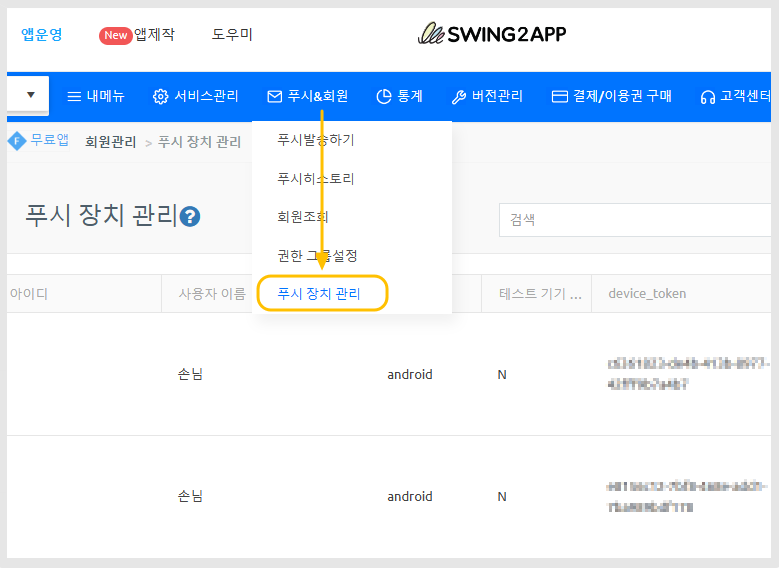
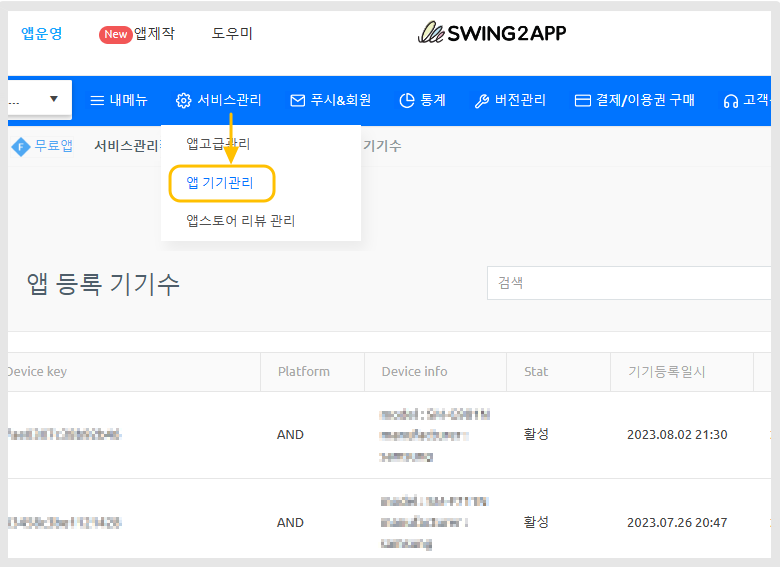
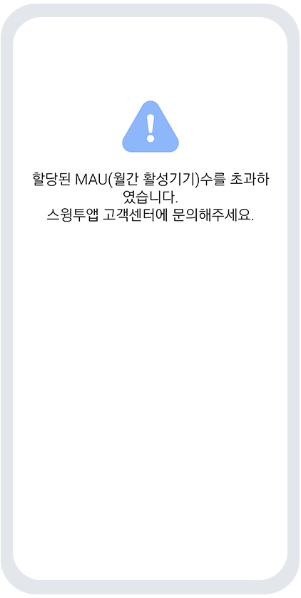
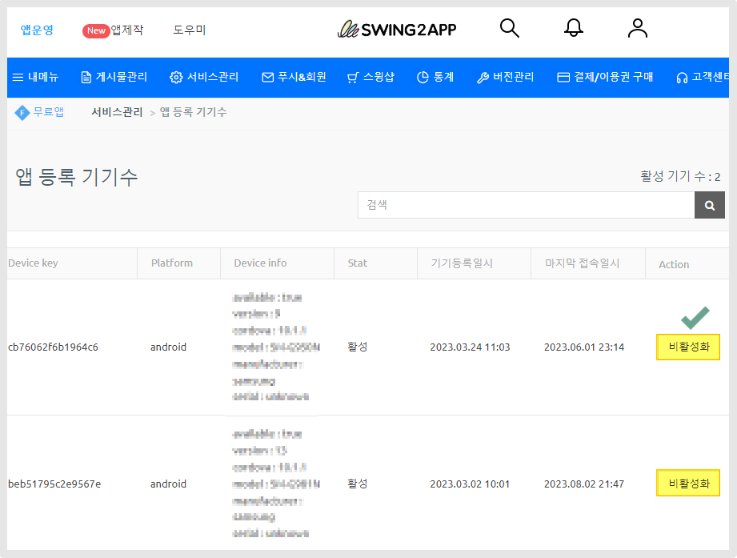

# 무료앱 설치 기기수 제한

<figure><figcaption></figcaption></figure>

## **1.스윙투앱 무료버전앱 이용범위**

\-개인적 이용 용도(비상업적) 및 테스트 용도로만 이용 가능합니다.

\-앱을 설치할 수 있는 기기 수는 10개까지입니다.&#x20;

\-기기수가 10개 이상이 될 경우 이용 제한 및 이용 정지 등의 조치가 취해집니다.&#x20;

\-무료버전앱은 상업적, 배포용도로 사용할 수 없습니다.

## 2.앱 설치 기기수 확인 방법

1\)일반 프로토타입 앱, 푸시앱 사용자분들은 푸시 장치 관리에서 기기수 확인 가능합니다.

[앱운영-푸시&회원-푸시 장치 관리](http://www.swing2app.co.kr/view/push\_device\_management) 이동&#x20;

<figure><figcaption></figcaption></figure>

2\)웹뷰앱 사용자분들은 [앱 기기관리](http://www.swing2app.co.kr/view/app\_device\_management)[앱운영-서비스관리-앱 기기관리](http://www.swing2app.co.kr/view/app\_device\_management) 메뉴에서 확인 가능합니다.

<figure><figcaption></figcaption></figure>

## 3.무료버전앱에서 설치 기기수가 10개가 넘을 경우

앱 이용이 정지되며, 앱 실행시 아래와 같은 페이지가 뜨며 앱 이용이 불가해집니다.&#x20;

<figure><figcaption>
무료앱 기기수 초과시 뜨는 메시지
</figcaption></figure>

앱이 삭제되는 것은 아니기 때문에 조치방법을 확인하여 해결할 수 있습니다.&#x20;

## **4.조치 방법**

### **1)사용자를 유지하여 앱을 이용해야 한다면**

유료앱 이용권을 구매해주세요.&#x20;

이용권 구매 페이지 이동시, 제작하신 앱에 맞는 이용권 구매할 수 있습니다.&#x20;

[스윙투앱 유료앱 이용권 구매 페이지](http://www.swing2app.co.kr/view/new\_product\_list\_by\_use\_term)

\*웹뷰앱, 푸시앱 사용자분들은 '무제한' 유료앱 이용권으로 구매 가능합니다.&#x20;

[웹앱 전용 무제한 이용권 구매 페이지](http://www.swing2app.co.kr/view/new\_product\_list\_by\_use\_term)

<mark style="color:orange;">**\*유료앱 이용권만 구매하시면, 정지되었던 앱은 정상 복원 됩니다.**</mark>

앱 종료 후, 재실행하면 정상 실행됩니다.

\-이용권을 구매하면 앱 설치 수 제한 없이 다운 받을 수 있습니다.

\-유료앱은 플레이스토어와 앱스토어에도 출시하여 배포할 수 있습니다. &#x20;


유료앱 이용권을 구매한 앱을 스토어에 출시하여 이용하시는 것이 일반적인 방법입니다.

앱 파일로 설치를 하는 것보다, 플레이스토어 및 앱스토어에 출시하여 사용하시는 것을 권장드립니다.&#x20;

앱스토어 출시할 경우 아이폰에서도 앱 이용이 가능합니다.&#x20;

\*업로드티켓 별도 구매 (플레이스토어 업로드티켓 10,000원, 앱스토어 업로드티켓 20,000원)

[플레이스토어 업로드 신청 방법 바로가기](https://documentation.swing2app.co.kr/manual/appmanage/version/playstore-upload)

[앱스토어 업로드 신청 방법 바로가기](https://documentation.swing2app.co.kr/manual/appmanage/version/appstore-upload)



\*유료앱 이용권 구매 후, 앱 업데이트를 하면 이전 버전과 호환되지 않습니다.&#x20;

업데이트 안내 창이 뜨지 않습니다.&#x20;

(이전 버전은 무료앱 상태였기 때문에, 유료앱과 연동 불가)

업데이트를 하면 기존 앱 삭제 후 해당 버전으로 다시 설치해서 이용하거나, 안내드린 것처럼 스토어(플레이스토어, 앱스토어)에 출시해서 이용해주시기 바랍니다.&#x20;


### **2)무료앱 이용을 유지한다면**

**유료앱 이용권을 구매하지 않고, 무료앱으로만 이용을 유지한다면 설치 기기수를 10개로 맞춰주세요.**&#x20;

[앱운영-서비스관리-앱 기기관리](http://www.swing2app.co.kr/view/app\_device\_management)메뉴에 이동하여 등록된 사용자 기기를 '비활성화' 할 수 있습니다.&#x20;

<figure><figcaption></figcaption></figure>

\***\[비활성화] 버튼 선택**

<mark style="color:red;">단, 해당 방법은 권장하지 않습니다.</mark>&#x20;

<mark style="color:red;">임시적으로 해당 기기의 앱을 비활성화 하는 것이기 때문에해당 사용자가 다시 앱을 실행하면 활성 상태로 변경됩니다.</mark>&#x20;

강제 삭제하는 방법은 없습니다.&#x20;

### **3)미사용 앱**

이미 사용하지 않는 앱이거나, 사용하지 않을 예정이면 아무런 조치를 취하지 않아도 괜찮습니다.

단, 해당 앱은 계속 이용이 안되기 때문에 다시 무료앱으로 이용하신다면, 앱을 새로 만들어서 이용해주셔야 합니다.&#x20;

<figure><figcaption></figcaption></figure>

무료버전앱은 배포용이 아니기 때문에 테스트로만 앱을 설치하여 이용할 수 있습니다.(개인적인 이용)

따라서 많은 사용자들에게 배포하는 용도로 이용하신다면 유료버전으로 이용 부탁드립니다.&#x20;

