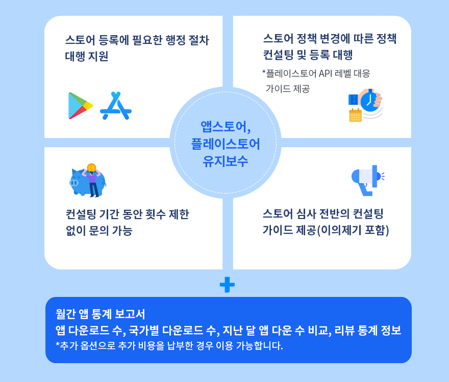

# 스토어 유지보수 컨설팅

***

## 1.스토어 유지 보수 컨설팅이란?

플레이스토어와 앱스토어 관리 및 유지가 어렵다면, 스윙투앱 컨설팅 서비스를 통해 운영을 맡길 수 있습니다.

플레이스토어는 매달 정책이 새롭게 업데이트 되고, 그에 따라 시스템에 맞춘 앱 업데이트를 요구합니다.

앱스토어는 앱 초기 등록이 어렵고 모든 내용을 영어로 응대해야 하기 때문에 출시 과정에서 전문가의 도움이 절실합니다.

이러한 스토어 운영 관리에 대한 컨설팅을 이제 스윙투앱에서 제공합니다.

스윙투앱에서 앱을 제작한 사용자분이 아니라도 괜찮습니다.

앱을 스토어에 배포하고 운영중인 모든 개발자분들이 신청할 수 있습니다.

***

## 2.서비스 내용

<figure><figcaption></figcaption></figure>



***

## 3.서비스 상세 내용 및 가격정책

### 1.1 플레이스토어 등록 및 유지보수 관리

| 1)플레이스토어 등록에 필요한 행정 절차 대행 지원                                                                                                                                                   |
| ------------------------------------------------------------------------------------------------------------------------------------------------------------------------------ |
| 2)플레이스토어 정책 변경에 따른 정책 컨설팅 및 등록 대행                                                                                                                                              |
| 3)플레이스토어 API 레벨 대응 가이드 제공                                                                                                                                                      |
| 4)플레이스토어 심사 전반의 컨설팅 및 가이드 제공(이의제기포함)                                                                                                                                           |
| 5)컨설팅 기간 동안 횟수 제한 없이 문의 가능                                                                                                                                                     |
| 
<strong>= 월 110,000원</strong> *최소 3개월 이상 사용해야 합니다.

*1년 결제 시 할인적용1,100,000원
                                                                                        |
| 
<strong>추가 옵션</strong>

월간 통계 보고서 발송(추가 비용: 월 50,000원)

월간 통계 보고서를 받으실 경우 50,000원 추가 납부 시 이용 가능합니다.

(다운로드 수, 국가별 다운로드 수, 지난 달 앱 다운 수 비교, 리뷰 통계 등 정보 제공)
 |

### 1.2 앱스토어 등록 및 유지보수 관리

| 1) 앱스토어 등록에 필요한 행정 절차 대행 지원                                                                                                                                                     |
| ------------------------------------------------------------------------------------------------------------------------------------------------------------------------------- |
| 2) 앱스토어 정책 변경에 따른 정책 컨설팅 및 등록 대행                                                                                                                                                |
| 3) 앱스토어 심사 전반의 컨설팅 및 가이드 제공(이의제기포함)                                                                                                                                             |
| 4)컨설팅 기간 동안 횟수 제한 없이 문의 가능                                                                                                                                                      |
| 
= 월 165,000원 *최소 3개월 이상 사용해야 합니다.

*1년 결제 시 할인적용1,800,000원
                                                                                                          |
| 
<strong>*추가 옵션</strong>

월간 통계 보고서 발송(추가 비용: 월 50,000원)

월간 통계 보고서를 받으실 경우 50,000원 추가 납부 시 이용 가능합니다.

(다운로드 수, 국가별 다운로드 수, 지난 달 앱 다운 수 비교, 리뷰 통계 등 정보 제공)
 |

### 1.3 플레이스토어&앱스토어 통합 관리

| 1)플레이스토어, 앱스토어 등록에 필요한 행정 절차 대행 지원                                                                                                                                              |
| ------------------------------------------------------------------------------------------------------------------------------------------------------------------------------- |
| 2)플레이스토어, 앱스토어 정책 변경에 따른 정책 컨설팅 및 등록 대행                                                                                                                                         |
| 3)플레이스토어 API 레벨 대응 가이드 제공                                                                                                                                                       |
| 4)플레이스토어, 앱스토어 심사 전반의 컨설팅 및 가이드 제공(이의제기포함)                                                                                                                                      |
| 5)컨설팅 기간 동안 횟수 제한 없이 문의 가능                                                                                                                                                      |
| 
= 월 275,000원 *최소 3개월 이상 사용해야 합니다.

*1년 결제 시 할인적용2,900,000원
                                                                                                          |
| 
<strong>*추가 옵션</strong>

월간 통계 보고서 발송(추가 비용: 월 50,000원)

월간 통계 보고서를 받으실 경우 50,000원 추가 납부 시 이용 가능합니다.

(다운로드 수, 국가별 다운로드 수, 지난 달 앱 다운 수 비교, 리뷰 통계 등 정보 제공)
 |

## 4.스토어 유지보수 컨설팅 신청방법

메일로 문의 및 신청을 주시면 연락드리고 있습니다.

\*스토어 컨설팅 신청: market@swing2app.co.kr&#x20;

\-담당자 연락처 기재하여 메일 주세요.&#x20;

\-스윙투앱 앱 이용자가 아니더라도 신청이 가능합니다.

\-스윙투앱 이용자라면, 스윙투앱 계정(이메일주소), 앱 이름 함께 남겨주세요.

## 5. 컨설팅 안내사항

1\)기재된 모든 금액은 부가세 포함 금액입니다.

2\) 구글 개발자 계정, 애플 개발자 계정 등록은 대행해드리지 않습니다.

각 개발자 계정은 직접 만들어서 주셔야 하며 계정 등록 방법에 대한 가이드를 제공합니다.

3\) 플레이스토어, 앱스토어 심사 가이드라인에 따라 등록 및 업데이트에 관련한 내용에 대해서만 유지보수 컨설팅을 수행합니다.

4\)키워드별 검색 순위 및 노출도, 광고, 다운로드 수치, 검색 순위를 올리는 등의 마케팅 관련 내용은 제공하지 않습니다.

5\)앱 리뷰 운영(답글 작성), 버그 리포트(ANR) 등은 제공하지 않습니다.

6\)앱에서 발생된 버그 및 가이드라인에 벗어난 개발로 인한 앱 삭제 또는 모든 불이익에 대해서는 책임지지 않습니다.



***

