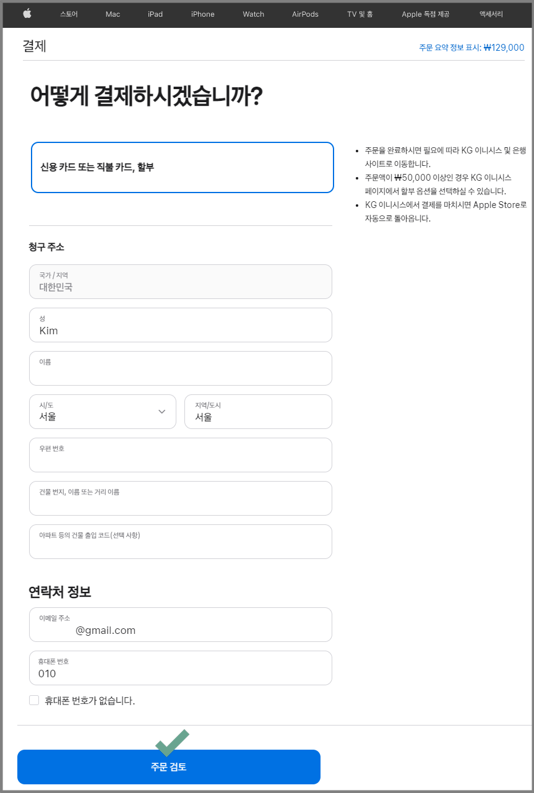

# 애플 개발자 계정 멤버십 연장(갱신)방법

<figure><figcaption></figcaption></figure>

앱스토어 애플 개발자 계정 멤버십을 갱신하는 방법을 알려드립니다.&#x20;

애플 개발자 계정 멤버십은 1년 이용 기간이구요.

1년마다 멤버십을 갱신해주셔야 앱스토어에 출시된 앱을 계속해서 이용할 수 있습니다.


&#x20;<mark style="color:blue;">**안내**</mark>

\-애플 개발자 계정 1년 이용료는 129,000원입니다.

\-갱신이 되지 않을 경우(이용료 미결제)앱이 앱스토어에서 삭제됩니다.

\-멤버십 결제는 Mac OS기기가 아니더라도 결제 가능합니다. (윈도우에서 이용 가능)

\-자동갱신은 대한민국에서는 아직 지원되는 서비스가 아니라서 애플 멤버십 이용기간을 확인하여 결제를 다시 해주셔야 합니다.

\-만료일이 지나,멤버십 결제를 할 경우 앱스토어에서 삭제된 앱은 24시간 후 다시 복구가 됩니다.


<figure><figcaption></figcaption></figure>

### **1. 애플 개발자 멤버십 만료일 메시지 확인**

<figure><figcaption></figcaption></figure>

애플 개발자 계정 멤버십 만료일은 [Appstore Connect 사이트](https://appstoreconnect.apple.com/)에 접속하시면 확인이 가능합니다.

멤버십 만료일이 임박했을 경우(통상적으로 만료일 한달 전 표시), 위의 이미지처럼 노란색 박스로 만료일 안내 메시지가 떠있구요.

Apple Developer 웹사이트로 이동하여 멤버십 구입이 가능합니다.

파란색으로 된 \[[Apple Developer 웹사이트](https://developer.apple.com/)] 를 클릭해주세요.

### **2. Apple Developer 사이트 – Renew membership 선택**

<figure><figcaption></figcaption></figure>

Apple Developer 웹사이트 이동 후, 화면에 표시된 <mark style="color:blue;">Renew membership</mark> 파란색 버튼을 선택해주세요.

****

### **3. 앱스토어 개발자 계정 로그인**

<figure><figcaption></figcaption></figure>

앱스토어 개발자 계정으로 로그인 해주세요.

### **4. 결제 페이지**

<figure><figcaption></figcaption></figure>

로그인이 완료되면, 결제 페이지가 뜹니다.

결제에 필요한 정보는 모두 기재를 해주셔야 합니다.

청구주소는 처음 결제시 입력된 사항이라 기본정보로 다 기재가 되어 있구요.

휴대폰 번호 등 그 외 누락된 정보가 있다면 모두 입력해주세요.

\[주문검토] 버튼을 선택합니다.

<mark style="color:red;">\*애플 멤버십 결제는 카드 결제만 가능합니다.</mark>

### **5. 결제 진행**

<figure><figcaption></figcaption></figure>

결제 진행할 카드 정보를 입력하고 결제 완료해주세요.

\*국내 발급카드는 대한민국에서 발급받은 모든 카드가 포함됩니다.

\*해외 발급카드는 대한민국 외 다른 나라에서 발급받은 카드를 말합니다.

### **6. 결제 완료**

<figure><figcaption></figcaption></figure>

결제가 완료되었구요.

이메일로 결제 완료 및 멤버십 갱신 관련 정보를 보내줍니다.

### **7. 메일 확인**

<figure><figcaption></figcaption></figure>

애플에서 발송된 메일 내용입니다.

애플 개발자 멤버십이 갱신되었다는 내용이구요. 다음 멤버십 만료일이 함께 기재되어 있습니다.

### **8. 멤버십 상세 내용**

<figure><figcaption></figcaption></figure>

Apple Developer 사이트에서도 멤버십 이용내역을 확인할 수 있습니다.

애플 멤버십은 이렇게 간단하게 결제만 하여 바로 갱신할 수 있습니다.

<figure><figcaption></figcaption></figure>


&#x20;<mark style="color:blue;">**안내**</mark>

\-애플 개발자 계정 1년 이용료는 129,000원입니다.

\-갱신이 되지 않을 경우(이용료 미결제)앱이 앱스토어에서 삭제됩니다.

\-멤버십 결제는 Mac OS기기가 아니더라도 결제 가능합니다. (윈도우에서 이용 가능)

\-자동갱신은 대한민국에서는 아직 지원되는 서비스가 아니라서 애플 멤버십 이용기간을 확인하여 결제를 다시 해주셔야 합니다.

\-만료일이 지나,멤버십 결제를 할 경우 앱스토어에서 삭제된 앱은 24시간 후 다시 복구가 됩니다.


