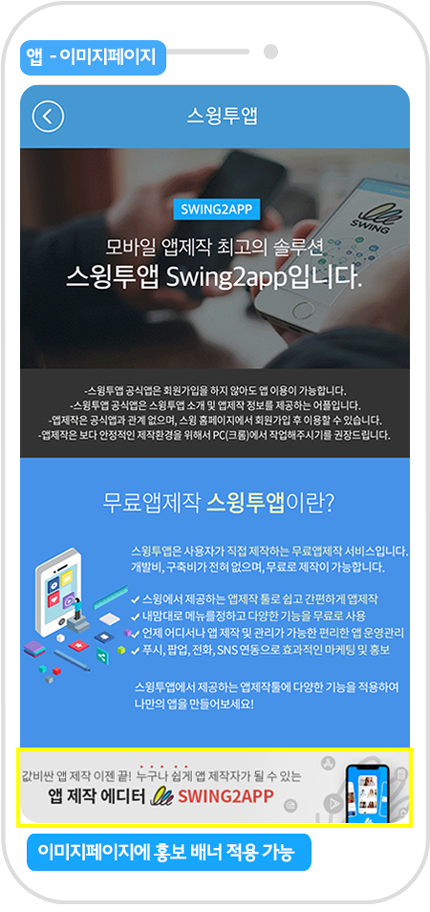

# 제휴프로그램 홍보방법

 **제휴 프로그램이란?**

스윙투앱을 사용자들에게 홍보하고, 해당 사용자가 이용료를 결제하면 해당 이용료의 일정 수수료를 수익료(커미션)로 지급받는 프로그램입니다.

[**☞ 스윙투앱 제휴프로그램 상세보기**](https://wp.swing2app.co.kr/aff-program/)

 **어떻게 수익료를 받을 수 있나요?**

**스윙투앱 제휴를 신청하고, 승인을 받으시면 접속할 수 있는 제휴 URL을 발행해드립니다.**

이 제휴 URL을 사용자에게 공유하거나 홍보해주시구요.

이렇게 나의 광고로 접속한 사용자들이 스윙투앱에서 회원가입을 한 뒤 이용권을 구매하면, 해당 이용권의 일정 금액이 수익료로 지급 됩니다.

제휴 승인이 완료되면 제공된 제휴 URL을 받아서 나의 홈페이지, 블로그, 앱 등에서 홍보를 할 수 있구요.

홍보를 할 수 있도록 스윙투앱 홍보 배너 이미지를 보내드립니다. (디자인과 사이즈가 다른 7종의 배너 이미지)

사용자는 배너이미지에 제휴로 생성된 URL을 입력하고, 해당 배너를 홈페이지에 게시하는 방법으로 스윙을 홍보할 수 있습니다.

홈페이지가 아니더라도 운영하고 있는 블로그, 카페에도 등록이 가능하구요.

사이트에 기재한 후 카카오톡, 인스타그램, 페이스북 등을 통해서도 링크를 공유하여 홍보할 수 있습니다.

더욱 많이 홍보할 수록 그만큼 제휴로 들어오는 회원들이 많아지니깐 여러 매체로 다양하게 운영하는게 좋겠죠?&#x20;

제휴프로그램 신청 후 승인을 받았다면!! 본격적으로 홍보할 수 있는 방법에 대해서 확인해주세&#xC694;**.**

 (1) (1).PNG>)

###  (1) (1).png>) 1.제휴 URL은 어디서 발행이 되나요?&#x20;

제휴프로그램은 [앱운영 → 내메뉴 → 제휴관리](http://www.swing2app.co.kr/swing_affilate_view/dashboard)에서 신청할 수 있구요.

신청을 하고 승인이 완료되면 **제휴관리 페이지에서 나의 제휴 URL이 발행이 됩니다.**

사용자들이 해당 URL로 접속할 수 있도록 홍보를 진행해주시면 됩니다.&#x20;

홍보 배너 이미지는 사용자의 메일로 보내드립니다.&#x20;

<mark style="color:red;">\*제휴프로그램 신청은 신청만 한다고 바로 이용할 수 있는 것이 아니며, 심사 후 승인이 됩니다.</mark>

<mark style="color:red;">첨부 서류 등 필요한 내용을 꼭 기재해서 신청해주시기 바랍니다.</mark>

 (1) (1).PNG>)

###  (1) (1).png>) **2.배너 스타일**

제휴 승인이 완료되면 이렇게 홍보용 배너이미지를 메일로 함께 보내드려요.

원하는 스타일별로 사용자가 선택해서 사용하면 되겠습니다.&#x20;

<mark style="color:red;">\*제휴 승인이 완료되면 담당자가 사용자의 메일로 제휴 URL(링크)과 배너 이미지, 제휴 이용안내에 대해서 보내드려요.</mark>

<mark style="color:red;">따라서 메일 확인하시고 운영방법을 숙지해주시면 되겠습니다.\~!</mark>

 (1) (1).PNG>)

###  (1) (1).png>) **3.배너를 이용한 홍보방법**

<mark style="color:blue;">**홍보예시1. 홈페이지에 제휴 배너 등록하기**</mark>

**사용자분의 홈페이지가 있을 경우, 홈페이지에 스윙에서 제공하는 배너 이미지를 등록하여 홍보할 수 있습니다.**

스윙투앱에서 제공하는 7가지 배너 중 원하는 스타일을 골라서 배너 이미지를 홈페이지에 등록하구요.

배너 이미지에 사이트 접속 링크(URL)을 입력해주시면 됩니다.

그럼 사용자들은 해당 배너를 선택하여 스윙 홈페이지에 오게 되구요.

해당 링크로 넘어온 사용자들이 모두 집계됩니다.

홈페이지가 없다면 블로그나 카페 등 웹사이트의 다른 경로로도 홍보가 가능합니다\~

***

<mark style="color:blue;">**홍보예시2. 앱에 제휴 배너 등록하기**</mark>

스윙투앱으로 제작한 앱에도 배너 이미지를 적용할 수 있죠\~!

스윙투앱에서 제공하는 7가지 배너 중 원하는 스타일을 골라서 배너 이미지를 홈페이지에 등록하구요.

배너 이미지에 사이트 접속 링크(URL)을 입력해주시면 됩니다.

사용자들은 해당 배너를 선택하여 스윙 홈페이지에 오게 되구요.

해당 링크로 넘어온 사용자들이 모두 집계됩니다.

***

<mark style="color:blue;">**홍보예시3. 카카오톡으로 링크 보내기**</mark>

**카톡으로도 링크 보내기가 가능합니다.**

제휴 URL 링크를 복사해서 사용자에게 카톡으로 링크를 보낼 수도 있습니다.

다른 사용자들에게 해당 링크를 보내면 해당 링크로 사용자가 접속하여 가입을 바로 할 수 있겠죠?^^

***

홍보를 할 때에는 스윙투앱에서 제공하는 배너 이미지를 꼭 사용하지 않아도 괜찮습니다.

더욱 다양한 방법으로 홍보를 진행하셔도 되구요.

다른 사용자들을 유입할 수 있는 나만의 홍보 노하우가 있다면 더욱 좋습니다\~!

스윙투앱 제휴프로그램을 신청하셔서 더욱 많은 사용자들을 유입하고, 수익을 얻어 가세요 ^^
