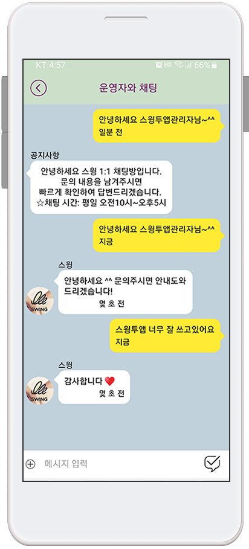

# 앱 관리자메뉴:채팅

***

앱 관리자메뉴 – 관리자와 사용자의 1:1 채팅기능에 대해서 알려드리겠습니다.

앱에서도 1:1 채팅이 가능하며, 채팅방 메시지 발송시 실시간으로 푸시 알림이 발송됩니다.

***

## **1. 앱 관리자메뉴 이동**

앱 실행 후 설정 → 관리자 로그인→스윙계정 로그인 후→ 관리자메뉴 생성됩니다.

***

## **2.관리자메뉴: 사용자 관리**

**관리자 메뉴에서→ 사용자 관리를  선택하면→ ‘사용자 리스트’가 열립니다.**

사용자 리스트는 해당 앱에 가입하여 이용중인 사용자들의 이용명단을 확인할 수 있어요.

(가입이 안된 손님은 로그인 정보가 없으므로, 목록에 표시 되지 않아요!)

***

## **3. 1:1 채팅 실행**

**사용자를 선택해서 앱에서 채팅을 해볼게요!**

사용자를 선택하면 사용자 아이디, 권한 등의 기본 정보가 표시됩니다.

그리고 \[채팅], \[권한 변경하기], \[푸시 발송하기], \[회원 메모 수정] 메뉴를 확인할 수 있습니다.

채팅을 선택하면 하단에 \[관리자 공용 채팅], \[1:1 채팅] 옵션을 선택할 수 있어요.

<mark style="color:blue;">**1) 관리자 공용 채팅은 부관리자도 함께 채팅을 할 수 있는 기능이에요.**</mark>&#x20;

따라서 부관리자로 로그인된 회원도 채팅창에 함께 접속할 수 있습니다.

<mark style="color:blue;">**2) 1:1 채팅은 오직 관리자와만 채팅을 할 수 있습니다.**</mark>

1:1 채팅을 선택하면 바로 채팅창이 열리면서 실행되구요.

\*\*윈디 사용자에게 메시지를 입력해보겠습니다.

***

## **4.사용자 앱 실행화면**

&#x20;**사용자로 로그인을 해볼게요.**

관리자가 채팅 메시지를 보내면, 사용자에게 푸시 알림이 발송됩니다.

<figure><figcaption></figcaption></figure>

**푸시를 선택하면, 바로 채팅방으로 이동합니다.**

<figure><figcaption></figcaption></figure>

사용자도 채팅창에서 관리자에게 메시지를 보내면서 실시간으로 메시지를 주고 받을 수 있어요.

**\*관리자 역시!! 사용자가 메시지를 보내면 실시간으로 푸시 알림이 발송됩니다.**

**채팅방 적용, 채팅목록 적용 등 채팅 기능 상세 적용방법은 아래 가이드로 확인해주세요.**



