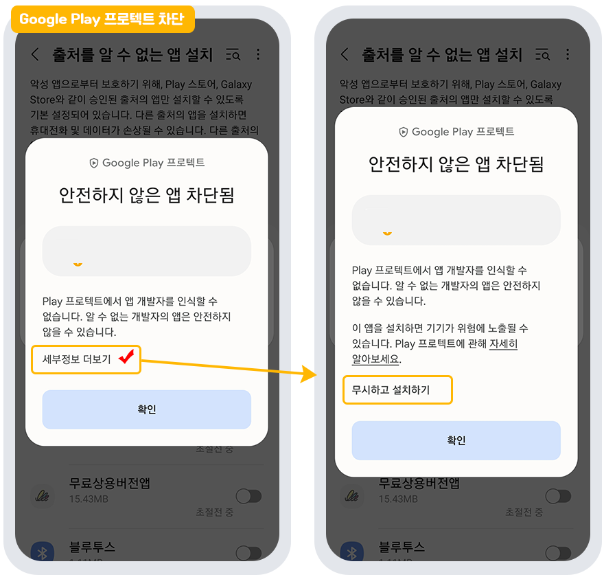
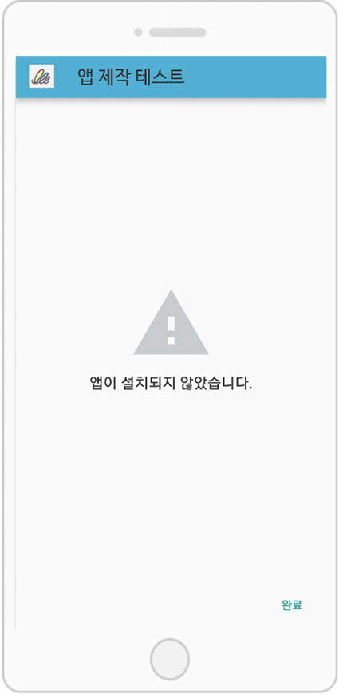

# 유료버전앱(APK파일) 설치가 안된다면 확인해주세요!

<figure><figcaption></figcaption></figure>

스윙투앱에서 제작한 유료버전 앱을 안드로이드폰에 다운받으려고 하면(플레이스토어 출시 전) 아래와 같이 메시지가 뜰 수 있습니다.&#x20;

##  **case1. Play 프로텍트 차단**

<figure><figcaption></figcaption></figure>

유료로 전환된 앱을 설치받으려고 할 때 위의 이미지처럼 ‘Play 프로텍트-안전하지 않은 앱 차단됨' 메시지가 뜰 수 있습니다.

플레이스토어 출시하지 않은 앱 설치시, 구글에서 자체 보안으로 알림 창을 띄우는 것이구요.

이때는 '세부정보 더보기란을 터치 → \[무시하고 설치하기] 탭해주시면 됩니다.&#x20;

&#x20;정상적으로 설치가 가능합니다.&#x20;

그냥  확인을 누르면 설치가 되지 않으니, 반드시 위의 방법으로 '무시하고 설치하기'를 반드시 선택해주세요.&#x20;

\*플레이스토어 앱 출시 후, 다운시에는 해당 메시지는 뜨지 않습니다.&#x20;

##  **case2. 앱이 설치되지 않았습니다.**&#x20;

**↑↑ 이렇게  앱이 설치되지 않았다는 메시지를 확인할 수 있습니다.**&#x20;

**그 이유는?**

유료버전으로 앱을 이용하고 계신 분들 중 플레이스토어 출시를 하지 않는 경우 구글에서는 이를  알 수 없는 경로로 인식하여 설치를 임의적으로 막아놓았기 때문에 제대로 설치가 안되는 사례가 발생이 됩니다!


**구글 정책 변경 내용: 왜 APK파일이 설치안되나요?**

APK가 Google Play에서 배포되었는지를 먼저 확인하여, 그렇지 않은 앱들은 보안상 설치가 되지 않도록 정책이 업데이트 되었습니다.

따라서 스윙으로 제작한 유료앱 중 플레이스토어에 출시가 되지 않는 앱들은 안드로이드폰에서 미인증 경로로 파악하여 설치를 차단해놓았습니다.


따라서 이렇게 !!  앱(APK파일)이 정상적으로 안드로이드폰에 설치가 안된다면!!

아래 방법을 확인하시어 프로텍트 설정을 수정해주시기 바랍니다.&#x20;

### <mark style="color:blue;">**-플레이스토어 프로텍트 보안설정 해제하기**</mark>

먼저 구글 플레이스토어 앱을 실행해주세요.

**1. 플레이스토어 어플 화면의 오른쪽 상단 프로필 버튼을 선택합니다.**

&#x20;메뉴 창에서 \[Play 프로텍트] 메뉴를 선택해주세요.

&#x20;

**2.Play 프로텍트 화면 오른쪽 상단의 설정(톱니바퀴 모양) 버튼을 선택해주세요.**&#x20;

&#x20;

**3. Play 프로텍트 창에서 체크되어 있는 항목을 모두 풀어주세요.**&#x20;

“play프로텍트로 앱 검사”, “유해한 앱을 감지하는 기능 보완” 2가지 항목에 체크를 풀어서 완료해주시면 됩니다.

&#x20;

\*\* 이렇게 플레이스토어 어플에서 보안 정책을 해지해주시구요.

기존에 설치된 앱이 있다면 삭제한 뒤, 다시 앱을 설치해주시기 바랍니다.

&#x20;

그런데 이 경우외에 사용자가 설정한 안드로이드폰 보안때문에 설치가 안되는 경우도 있어요.

안드로이드폰 보안 설정 내용은 해당 매뉴얼 링크를 확인해주세요.

**☞** [**\[무료버전 앱 다운이 안된다면 확인해주세요\]**](https://documentation.swing2app.co.kr/manual/appoperation/not-installed1)

