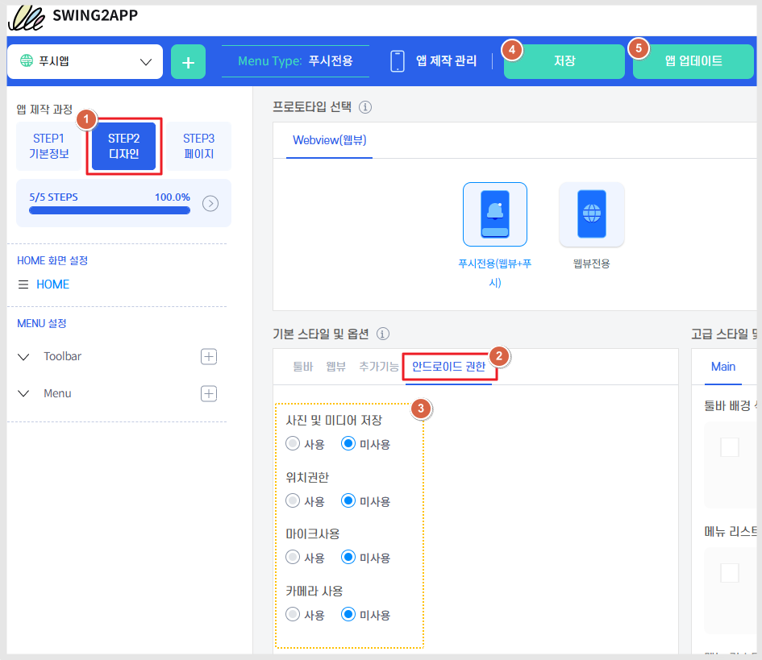
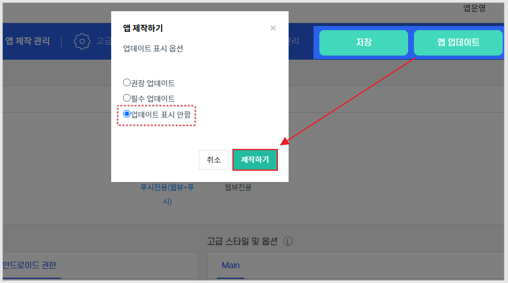

# 안드로이드 권한 셋팅

***

안드로이드에서는 앱 이용시, 앱에서 어떤 권한이 필요한지를 체크하게 되는데요.

일반적으로 아래의 권한이 앱에서 셋팅이 되어 제공되고 있습니다.


-사진 및 미디어 (읽기/저장)

-위치 권한 (지도, 내 위치 허용)

-마이크 사용 (파일 첨부 - 영상 녹화시 이용)

-카메라 사용(파일 첨부- 사진 촬영시 이용)


위의 권한은 웹뷰, 푸시앱제작시 필수로 제공되어 제작되고 있습니다. \*일반 프로토타입앱은 해당 없습니다.

앱 마다 사용하는 권한이 다른 만큼 사용자분들은 직접 앱제작 화면에서 내 앱에 맞는 권한을 체크하여 제작할 수 있습니다.

***

## 1.권한 셋팅 방법

<figure><figcaption></figcaption></figure>


앱제작 **STEP2디자인**&#x20;

기본 스타일 및 옵션: 안드로이드 권한 선택 → 각 권한별 사용 or 미사용으로 체크 → 저장 → 앱 업데이트 버튼 선택


<figure><figcaption></figcaption></figure>

사용자들에게는 업데이트 된 기능이 없으므로, 업데이트 유형은 "업데이트 표시 안함"으로 체크해고 제작해주세요.

\*반드시 업데이트를 해주셔야 반영됩니다.

\*플레이스토어에 출시된 분들은, 새로 제작된 버전으로 플레이 콘솔 프로덕션에도 앱을 제출해주셔야 합니다. (업데이트 제출)

***

## **2.앱 실행화면 – 설정값 적용한 화면**


데이터 유형 허용 여부 메시지는 앱 최초 실행(앱 다운 후 최초 실행하였을 때)시에만 뜨게 되구요.

앱을 다운받은 사용자는 허용여부를 선택하여 앱을 이용할 수 있게 됩니다.


### **1)카메라 사용여부 – YES로 체크한 경우**

위와 같은 허용 여부 메시지 팝업이 뜹니다.

### **2)사진 및 미디어 저장공간 사용 – YES로 체크한 경우**

### **3)위치 권한 사용 – YES로 체크한 경우**

-설정값을 사용하지 않을 경우 위의 메시지 창은 뜨지 않구요.

-해당 기능에 대한 허용 여부는 앱을 설치한 사용자가 선택할 수 있습니다.

-표시되는 팝업창(메시지 창)은 안드로이드, 아이폰 기기에 따라 스타일이 다릅니다.

### **4)추가 안내) 푸시 알림 허용**

‘푸시 알림 허용’은 푸시앱에서 필수로 뜨는 메시지창입니다.&#x20;

<mark style="color:red;">\*설정값과는 무관하며, 푸시앱에서만 뜨는 내용입니다.</mark>

푸시를 이용하지 않는 웹뷰앱에는 뜨지 않으며, 푸시앱에서만 뜹니다.


**중요 안내**

1\)해당 기능은 일반 프로토타입 앱에서는 이용이 불가합니다. \*푸시앱, 웹뷰앱과 같은 웹앱에서만 사용 가능합니다.

2\)일반 프로토타입앱은 제작 시스템에 따라 권한이 꼭 제공이 되어야 합니다. \*사용자가 임의적으로 권한을 삭제하거나 변경할 수 없습니다.

3\)아이폰은 해당 없으며, 권한은 안드로이드폰에서만 해당됩니다.&#x20;

이용에 참고 부탁드립니다.

