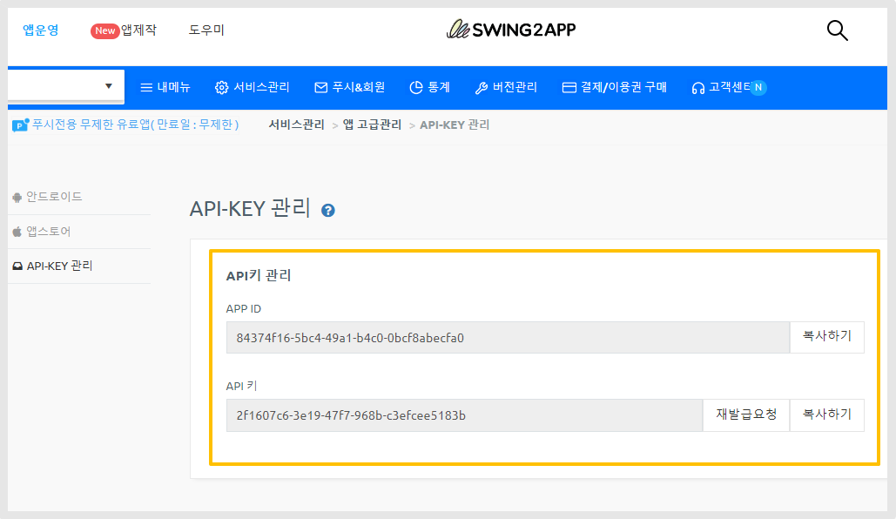

# \[푸시앱] App Id, App Key

***

**API-KEY 관리 페이지  -  App ID, API 키 확인**


해당 화면은 유료 사용자에게만 제공되는 화면입니다.

\-유료앱 이용권(기본형 및 무제한 이용권 모두 포함) 구매한 사용자에 한해서 제공됩니다.&#x20;

\-유료사용자일반 프로토타입 앱, 푸시앱에서 확인 가능

<mark style="color:red;">\*웹뷰앱은 API 키를 제공하지 않으므로 유료앱 이용권 구매하셔도, 이용이 불가합니다.</mark>


## **API KEY  관리 페이지**

<figure><figcaption></figcaption></figure>

[앱운영-서비스관리-앱 운영관리-앱 고급관리 - API KEY관리](https://www.swing2app.co.kr/view/app\_advanced\_management\_by\_api\_key)&#x20;

<figure><figcaption></figcaption></figure>

APP ID,   API 키 확인이 가능합니다.

\[복사하기] 버튼을 선택해서 이용해주세요.&#x20;

<mark style="color:red;">그런데, App ID는  확인 가능한데 API 키 값이 입력되어 있지 않다면?</mark>

<mark style="color:red;">\[발급 요청] 버튼을 선택해서 키 값을 발급 받아주세요!</mark>

<figure><figcaption></figcaption></figure>

<figure><figcaption></figcaption></figure>

API키 등록이 안되어 있을 경우 \[발급요청] 버튼을 선택해주세요.&#x20;

API 키  발급이  바로 되며, 복사하여 사용 가능합니다.

***

\*푸시 발송에 필요한 API 정보가 필요하다면, 위의 가이드를 통해서 ID와 Key 값을 확인할 수 있습니다.

\*안드로이드 키파일, 앱스토어 API정보 등이 필요하다면 앱 고급 관리 페이지에서 확인 가능합니다.&#x20;

아래 가이드를 확인해주세요.&#x20;



