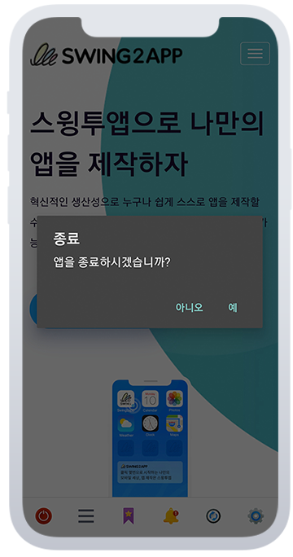

# 웹뷰, 푸시앱 - 앱 종료 알림 메시지

<figure><figcaption></figcaption></figure>

## **1.앱 종료 알림 메시지란?**

**웹뷰앱과 푸시앱 앱 종료시 종료 여부를 묻는 메시지 팝업 창을 말합니다.**

앱 종료 알림 메시지를 사용하지 않을 경우 별도 메시지가 뜨지 않고, 더이상 돌아갈 이전 페이지가 없으면 앱이 자동 종료되구요.&#x20;

앱 종료 메시지 표시를 사용할 경우, 안드로이드 기기 Back 버튼 선택시 “앱을 종료하시겠습니까” 안내 메시지가 뜹니다.

**웹뷰앱, 푸시앱 제작시 알림 메시지 표시 사용 여부를 선택할 수 있도록 옵션에서 설정 가능합니다.**&#x20;

<figure><figcaption></figcaption></figure>

## **2.이용방법**

<figure><figcaption></figcaption></figure>

앱제작 화면 이동 합니다.

1\)STEP2디자인 선택

2\)기본 스타일 및 옵션에서 \[웹뷰] 선택

3\)앱 종료 알림 메시지 표시 선택&#x20;

사용(알림 메시지 띄움) or 미사용(메시지 없이 바로 종료됨)&#x20;

4\)상단 \[저장] 버튼 선택

5\)\[앱 업데이트] 버튼을 선택합니다.&#x20;

<figure><figcaption></figcaption></figure>

## **3.**앱 적용 화면

<figure><figcaption></figcaption></figure>

앱 종료 메시지 표시를 사용할 경우,&#x20;

안드로이드 기기 Back 버튼 선택시 “앱을 종료하시겠습니까” 안내 메시지가 뜹니다.

앱 종료 알림 메시지를 사용하지 않을 경우&#x20;

Back 버튼 선택시, 더이상 돌아갈 이전 페이지가 없으면 앱이 자동 종료됩니다.&#x20;

<figure><figcaption></figcaption></figure>

## 4.안내사항

1\)**해당 기능은 앱 업데이트가 필요합니다.**

업데이트 후 새로 제작된 버전으로 확인시 반영된 내용으로 확인 가능합니다.

플레이스토어, 앱스토어 등에 출시된 앱은 해당 스토어별로 새로 제작된 버전으로 앱 업데이트를 해주셔야 합니다.

2\)사용으로 이용하다 다시 미사용으로 변경할 때에도 업데이트를 해야 합니다.

반대(미사용→사용)의 경우도 동일합니다.&#x20;

3\)**앱 종료 알림 메시지는 안드로이드폰에서만 이용 가능합니다.**

아이폰은 기기 특성상 앱에서 별도 종료를 할 수 없기 때문에, 안드로이드폰에서만 이용이 가능합니다.

4\)기본 셋팅은 ‘미사용’으로 되어 있으며, 미사용으로 이용시 종료 메시지는 뜨지 않고 앱은 바로 종료됩니다.&#x20;

종료 메시지를 사용할 경우 반드시 '사용'으로 체크한 뒤 이용해주시기 바랍니다.

5\)웹뷰앱, 푸시앱에서 모두 이용 가능합니다.&#x20;

일반 프로토타입으로 제작한 앱은 앱 종료 알림 메시지가 제공이 되고 있으므로 별도 업데이트가 필요 없습니다.&#x20;

