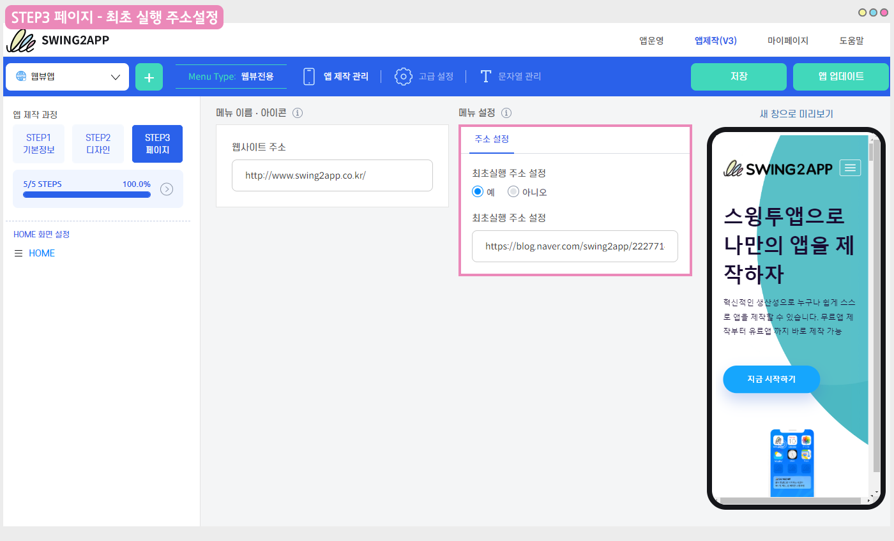

# 웹뷰,푸시앱-최초 실행 주소 이용방법

### **최초 실행 주소란?**

최초 실행 주소란, 앱에 연결한 웹사이트 외에 앱을 설치하고 처음에만 보여지는 웹페이지를 별도 적용하는 것을 말합니다.

웹뷰, 푸시앱 등 웹사이트를 연결한 웹앱에 적용할 수 있구요.

해당 페이지는 앱을 실행한 최초에만 보여지고, 앱 종료 후 이후 앱을 다시 실행할 때는 보여지지 않습니다. (원래 연결된 웹사이트로 보여짐)

​

최초 실행 주소는 일반적으로 웹앱에서 많이 사용되는 기능이구요.

본 앱을 시작하기 전 안내 문구, 앱을 많이 사용해달라는 홍보용으로 페이지를 별도 구성하여 이용할 수 있습니다.

혹은 앱 설치시 중요 안내 및 꼭 봐야할 내용 등이 있다면 링크 등을 연결하여 사용자들에게 보여줄 수 있습니다.

​

<mark style="color:red;">\*해당 기능은 앱제작v3 버전에서 이용 가능합니다.</mark>

<mark style="color:red;">이전 버전을 사용하고 있다면 v3 버전 전환 후 이용해주시기 바랍니다.</mark>

 (1) (1).PNG>)

### **최초 실행 주소 이용방법**

최초 실행 주소는 웹뷰앱, 푸시앱에서만 이용 가능하구요**.**

**STEP3 페이지 단계에서 최초 실행 주소 설정 옵션을 확인할 수 있습니다.**

**“예”로 체크 후, 주소란에 웹사이트 링크 주소(URL)를 입력해주세요.**

해당 메뉴 까지 입력 후 \[저장] – \[앱제작하기] 선택해주세요.

​

최초 실행 주소란에 스윙투앱 블로그 ‘앱제작 매뉴얼 가이드’ URL을 적용해서 제작했습니다.

[https://blog.naver.com/swing2app/222771424263](https://blog.naver.com/swing2app/222771424263)

​


<mark style="color:orange;">**중요 안내**</mark>

**설치 후 처음에만 보여지는 화면이기 때문에 앱을 이미 제작한 사용자분들 중 새로 최초 실행 주소를 넣거나, 주소를 변경하는 경우 반드시 앱제작을 다시 해주셔야 합니다. \_ 업데이트 필수!!**

저장만 하면 반영이 되지 않아요.

새 버전으로 앱을 재설치(업데이트)한 뒤 앱을 실행해야, 최초 실행 주소로 넣은 웹사이트(웹페이지)로 변경되어 보여집니다.


 (1) (1).PNG>)

### **앱 확인\_ 최초 실행 주소 움짤 영상 확인하기**

&#x20;

최초 실행 주소를 적용한 뒤 앱을 설치 후 실행한 화면입니다.

앱 실행시 주소란에 입력했던 스윙투앱 블로그 – v3앱제작 매뉴얼 포스팅 링크 화면이 열리는 것을 확인할 수 있습니다.

​

#### <mark style="color:blue;">**앱 종료 후, 재실행한 화면**</mark>

그리고 앱 종료 후 다시 앱을 실행하면, 원래 웹뷰앱에 적용한 웹사이트이죠,

스윙투앱 홈페이지로 바로 연결되어 보여집니다.

​


소개해드린 매뉴얼에서는 블로그 링크를 넣었지만 소개용 페이지를 별도 제작했다면 해당 페이지 링크를 입력해주시는 것이 좋습니다.

최초 실행 주소를 사용하지 않거나, 링크 주소를 변경할 경우는 수정 후 반드시 앱 업데이트를 해주셔야 합니다.

스토어에 출시하지 않은 분들은 앱 삭제 후 다시 앱을 설치받아 확인해주시구요.

앱스토어, 플레이스토어에 출시된 앱은 새로 제작된 버전의 앱으로 업데이트 제출해주셔야 합니다.


​

**Related Articles**

* [푸시앱 툴바-이용방법 및 기능 소개](https://wp.swing2app.co.kr/documentation/v3manual/pushapp-toolbar/)
* [웹뷰앱 – 기본 설정, 고급 설정 옵션](https://wp.swing2app.co.kr/documentation/v3manual/webviewapp-options/)
* [푸시앱 제작방법](https://wp.swing2app.co.kr/documentation/v3manual/push/)
* [웹뷰앱 제작방법](https://wp.swing2app.co.kr/documentation/v3manual/webview/)
* [앱제작 방법-전체과정 매뉴얼](https://wp.swing2app.co.kr/documentation/v3manual/guide/)
* [앱제작 V3 이용방법](https://wp.swing2app.co.kr/documentation/v3manual/use/)
