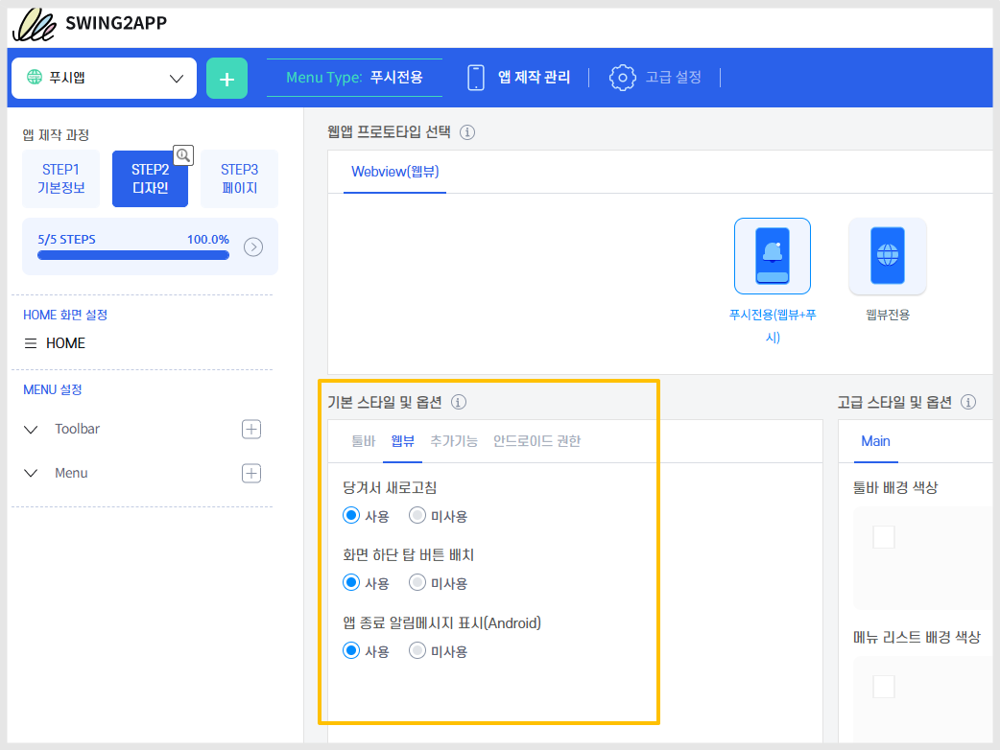
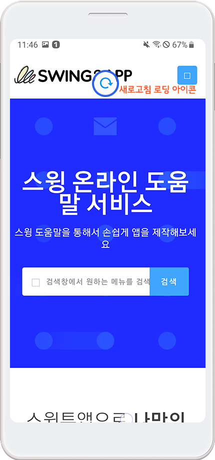
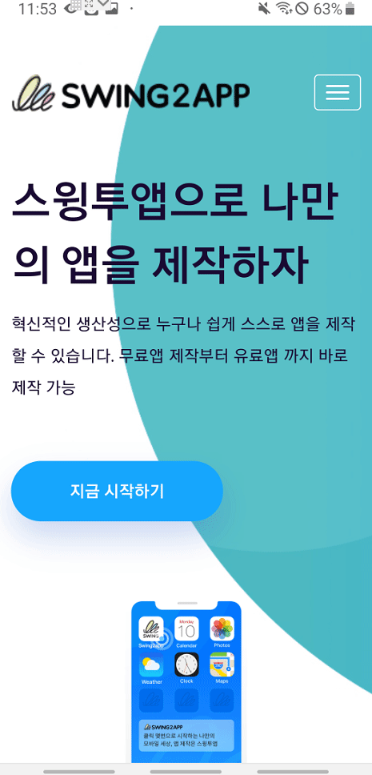
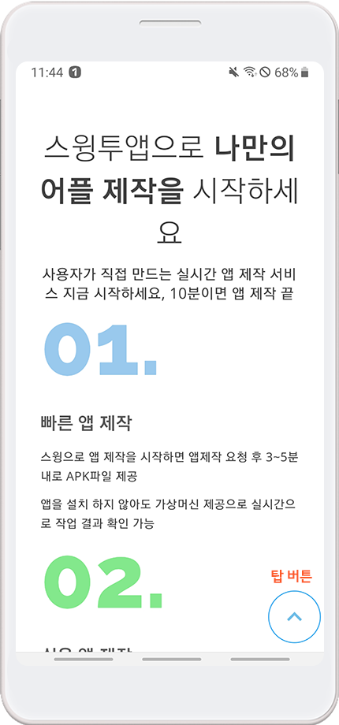

# 기본스타일:웹앱 기능 옵션

***

웹앱제작시 설정할 수 있는 기본 스타일 옵션:

**당겨서 새로고침, 화면 하단 탑버튼, 앱 종료 알림 메시지**&#x20;

<figure><figcaption></figcaption></figure>

웹앱 기본 기능으로 - 웹뷰전용 앱,  푸시전용 앱에서 셋팅할 수 있습니다.

앱 이용에 꼭 필요한 필수 기능이 아니므로, 사용자가 필요한 기능으로 선택해서 적용을 해주시면 되겠습니다.


프로토타입: 웹뷰전용 혹은 푸시전용 선택

<mark style="color:green;">**STEP2 디자인 단계 -  기본 스타일 및 옵션 메뉴 - 웹뷰 탭에서 확인할 수 있습니다.**</mark>&#x20;



기본 스타일 옵션 수정시 앱 업데이트가 필요합니다.&#x20;

수정한 뒤 저장 및 앱 업데이트 버튼을 꼭 선택해주세요

플레이스토어, 앱스토어에 출시된 앱은 새로 제작된 버전으로 해당 스토어에도 업데이트 제출해주세요.&#x20;


***


기능은  '사용'으로 체크하고 앱제작시, 아래 설명해드리는 스샷 이미지로 앱화면에서 어떻게 나타나는지 확인할 수 있습니다.&#x20;

기능 '미사용'으로 체크시 앱 화면에서는 아무런 옵션 기능 보여지지 않습니다.&#x20;


## 1.당겨서 새로고침&#x20;

#### <mark style="color:blue;">**-움짤 이미지로 확인하기**</mark>

움짤 이미지에서 보듯이 손가락으로 터치한 화면을 당겼다 올리면 새고로침 로딩 아이콘이 뜨며, 화면이 새로 전환되는 것을 확인할 수 있습니다.


<mark style="color:blue;">**권장사항**</mark>

<당겨서 새로고침> 기능은 웹뷰앱 제작시 '사용'으로 체크하고 제작해주세요.

푸시앱과 다르게 웹뷰앱은 '새로고침' 기능이 들어간 툴바를 만들 수 없기 때문에 화면에서 새로고침이 가능한 기능을 넣어주는 것을 권장드립니다.

미사용으로 체크시 앱에서 새로고침을 이용할 수 없습니다.


 (1) (1).PNG>)

## 2.탑 버튼

#### <mark style="color:blue;">-움짤 이미지로 확인하기</mark>

​움짤 이미지에서 보듯이 아래로 스크롤을 진행시, 화면 하단에 탑 버튼이 생성되는 것을 확인할 수 있습니다.

탑 버튼을 선택하면, 다시 화면 위로 이동하게 됩니다.

​

<mark style="color:red;">**\*이용시 주의사항**</mark>

웹사이트 내 이미 탑버튼이 셋팅되어 내장되어 있다면, 앱에서도 탑 버튼은 동일하게 보여집니다.

따라서 탑버튼이 이미 웹사이트에 적용되어 있다면, 웹뷰앱 제작시에는 탑 버튼 배치를 "미사용"으로 체크하고 제작해주세요.

사용으로 체크하게 되면, 탑 버튼이 중복해서 보여지게 됩니다.

​

**참고 이미지)**

이미지에서 보듯이 웹사이트내 탑버튼과 웹뷰앱 탑버튼이 함께 보이는 문제가 발생합니다.

따라서 해당 기능은 웹사이트 내 탑버튼이 없을 경우 이용해주시기 바랍니다.

 (1) (1).PNG>)

## **3.앱 종료 알림 메시지**

<figure><figcaption></figcaption></figure>

​**앱 종료 메시지 표시를 사용할 경우,**

**안드로이드 기기 Back 버튼 선택시 “앱을 종료하시겠습니까” 안내 메시지가 뜹니다.**

앱 종료 알림 메시지를 사용하지 않을 경우,

Back 버튼 선택시, 더이상 돌아갈 이전 페이지가 없으면 앱이 자동 종료됩니다

 (1) (1).PNG>)

## 4.안내사항


1\)기본스타일 옵션의 모든 기능들 사용시, **앱 업데이트가 필요합니다.**

**새로 적용 , 수정 모두 업데이트 필요합니다.**&#x20;

업데이트 후 새로 제작된 버전으로 확인시 반영된 내용으로 확인 가능합니다.

플레이스토어, 앱스토어 등에 출시된 앱은 해당 스토어별로 새로 제작된 버전으로 앱 업데이트를 해주셔야 합니다.

2\)사용으로 이용하다 다시 미사용으로 변경할 때에도 업데이트를 해야 합니다.

반대(미사용→사용)의 경우도 동일합니다.

3\)**앱 종료 알림 메시지는 안드로이드폰에서만 이용 가능합니다.**

아이폰은 기기 특성상 앱에서 별도 종료를 할 수 없기 때문에, 안드로이드폰에서만 이용이 가능합니다.

4\)최초 앱 셋팅은 '당겨서 새로고침'만 \[사용]으로 체크되어 있습니다.&#x20;

&#x20;화면 하단 탑버튼, 종료 알림 메시지는 \[미사용]으로 체크되어 있습니다.&#x20;

5\)웹뷰앱, 푸시앱에서 모두 이용 가능합니다.

일반 프로토타입으로 제작한 앱은 앱 종료 알림 메시지가 제공이 되고 있으므로 별도 업데이트가 필요 없습니다.


