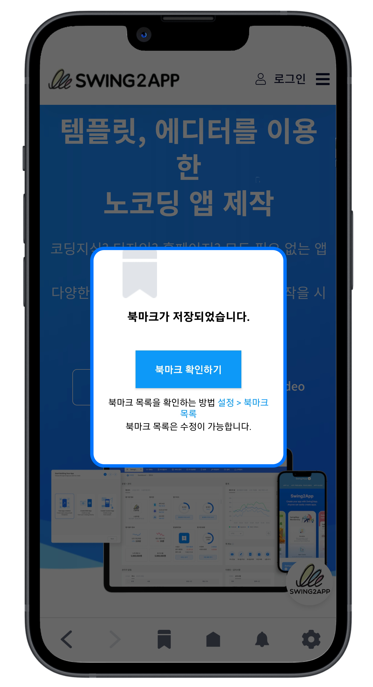

# 스윙투앱 푸시앱

<figure><figcaption></figcaption></figure>

## 1.푸시앱 소개

<figure><figcaption></figcaption></figure>

모바일 웹사이트를 앱에 적용해서 제작하능 웹앱 제작 플랫폼입니다.

홈페이지 URL 링크만 입력하면 앱에 연동되며 모바일웹과 동일한 웹앱을 제작할 수 있습니다.

푸시 앱은 푸시 알림 기능을 이용할 수 있기 때문에 앱을 설치한 사용자들에게 푸시 알림을 보낼 수 있습니다.

푸시 기능을 이용할 수 있으며 사용자들에게 이벤트, 광고, 홍보성 메시지를 보낼 수 있습니다.

***

## 2.푸시앱을 이용하는 이유

<figure><figcaption></figcaption></figure>

푸시 발송(알림 메시지)을 통해 사용자들의 앱 방문을 유도하고 홍보를 할 수 있습니다.

\+앱 설치를 통한 사용자 이탈 감소

\+재방문율 증대

\+앱을 통한 사이트 유입의 접근성 증가

\+앱 관리의 편리함과 간편함을 이용할 수 있습니다.

***



## 3.푸시앱 특징

<figure><figcaption></figcaption></figure>

-푸시로 앱 제작시 웹링크 URL주소만 넣으면 앱을 제작할 수 있어요.

\-초간단 앱제작으로 10분 내로 앱이 제작 됩니다.

\-스윙투앱에서 제공하는 푸시 발송 기능을 이용할 수 있어요.

\-앱 제작시 앱 화면 하단에 푸시툴바가 생성됩니다.

\-다양한 스타일의 툴바를 직접 구성할 수 있습니다.

\-안드로이드+아이폰 통합 제작되며 제작한 앱은 유료앱 이용권 구매시, 플레이스토어와 앱스토어에 출시해서 이용할 수 있습니다.

\-스윙투앱에서 제공하는 푸시는 무제한으로 제공되며, 회원 수 제한 없이 보낼 수 있습니다.

***

## 4.푸시앱 기능 소개

### <mark style="color:blue;">1)푸시 알림</mark>&#x20;

<figure><figcaption></figcaption></figure>

푸시앱의 가장 강력하고, 사용도가 높은 기능인 '푸시' 알림 발송 기능을 이용할 수 있습니다.

앱을 설치한 사용자들에게 푸시 알림을 전송할 수 있구요.

앱이 설치된 핸드폰으로 푸시 알림이 들어오며, 사용자는 푸시를 선택하여 연결된 페이지를 확인할 수 있습니다.&#x20;

사용자의 참여도와 관심을 높이기 위해 실시간으로 정보나 이벤트를 전달하는 기능입니다.&#x20;

목표 사용자와의 소통을 강화하여 앱 이용률을 향상시킵니다.


<mark style="color:blue;">**푸시 기능 활용**</mark>

**언론사/뉴스 앱은,**

&#x20;주요 뉴스 및 기사를 실시간으로사용자들에게 신속하고 정확하게 전달할 수 있습니다.

**쇼핑몰 앱은,**&#x20;

매일 업데이트 되는 신상 의류 소식을 빠르게 전달할 수 있습니다.

**커뮤니티 앱은,**&#x20;

사용자들의 소통, 정보 알림을 발송하여 앱 참여를 유도할 수 있습니다.

그 외에도 각종 정보 및 공지를 보다 빠르게 전달할 수 있는 측면에서 푸시 기능의 쓰임이 더욱 많아지고 있습니다.&#x20;



<mark style="color:green;">**푸시 알림의 장점**</mark>

1\)앱 설치를 통한 사용자 이탈 감소

2\)모바일 기기 사용자들의 방문율 증대

3\)앱을 통한 사이트 유입의 접근성 증가

4\)프로모션, 홍보의 최대 효율(비용 없이 진행되는 고효율 마케팅 수단)

5\)앱 관리의 편리성 : 푸시 API 연동시 원하는 액션에 푸시 발송 가능


### <mark style="color:blue;">2)툴바</mark>&#x20;

<figure><figcaption></figcaption></figure>

<figure><figcaption></figcaption></figure>

앱 화면 하단에 툴바 영역이 생성되어 사용자가 하단 메뉴 구성을 할 수 있으며, 원하는 링크를 넣을 수도 있습니다.&#x20;


툴바에서 제공되는 기능

페이지: 북마크 리스트, 메뉴, 알림목록, 설정

기능: 웹뷰 뒤로 이동, 앞으로 이동, 북마크, 홈으로 이동, 새로고침, 공유하기


### <mark style="color:blue;">3)애드몹 광고  \*푸시앱, 웹뷰앱 공통 기능</mark>

<figure><figcaption></figcaption></figure>

앱 내에서 광고를 통한 수익화를 가능하게 하는 기능입니다.&#x20;

사용자 대상으로 타겟팅된 광고를 효과적으로 전달하여 수익을 창출합니다.

\*푸시앱 뿐만 아니라 웹뷰앱에서도 공통 제공하는 기능입니다.&#x20;

### <mark style="color:blue;">4)메뉴 편집 기능</mark>

<figure><figcaption></figcaption></figure>

앱의 구조와 네비게이션을 사용자 친화적으로 조정하는 기능입니다.&#x20;

유동적인 메뉴 편집을 통해 사용자의 경험을 최적화합니다.

### <mark style="color:blue;">**5)북마크 기능**</mark>

<figure><figcaption></figcaption></figure>

푸시 툴바 기능 중 하나로,&#x20;

사용자가 웹페이지 중 다시 보고 싶은 페이지를 저장할 수 있는 북마크 기능을 제공합니다.&#x20;

### <mark style="color:blue;">6)푸시발송 히스토리</mark>

<figure><figcaption></figcaption></figure>

푸시 알림 내역 확인 가능

푸시 발송 이력 화면을 제공하여, 사용자들은 지난 푸시 알림이력을 확인할 수 있습니다.

### <mark style="color:blue;">7)실시간 업데이트 기능</mark>

<figure><figcaption></figcaption></figure>

앱의 새로운 버전이나 기능을 손쉽게 제공하는 기능입니다.&#x20;

사용자에게 항상 최신의 앱 경험을 제공하며, 보안 및 성능 개선을 지속적으로 진행합니다.

### <mark style="color:blue;">8)API 도구 +푸시 API연동</mark>&#x20;

Javascript Front API 와 Back-end API 를 통해서 네이티브 도구를 웹에서 직접 컨트롤하고 다양한 기능을 제공할 수 있습니다.

### <mark style="color:blue;">**9)회원 연동**</mark>&#x20;

홈페이지(웹사이트) 회원을 연동하여, 앱에서 정보를 관리할 수 있습니다.&#x20;

회원별 맞춤 푸시 발송 역시 가능합니다.&#x20;

***

## 5.푸시앱 제작방법

<figure><figcaption></figcaption></figure>

**STEP1기본정보**

1\) 앱 아이디 입력 \*앱 아이디는 앱의 고유 식별자이며 설정 후에는 변경할 수 없습니다.

2\) 앱 이름 입력

3\) 앱 아이콘 이미지 (1024px\*1024px)

4\) 앱 대기화면 이미지 등록 (2282px\*2282px)

5\) \[저장]버튼 선택

**STEP2 디자인**

1.프로토타입 선택 : 푸시전용으로 선택

2.기본 옵션: 툴바 사용 여부, 툴바 숨김 여부 선택

3.고급 옵션: 툴바 배경색상, 메뉴 리스크 배경 색상, 메뉴 리스트 텍스트 색상 설정

\*기본옵션과 고급옵션 아무것도 수정하지 않을 경우 기본 셋팅된 스타일로 제작됩니다.

4\)저장 버튼 선택

**STEP3 페이지**

1\)웹사이트 주소 입력

2\)주소설정 : 최초실행 주소 설정 여부 선택

\*최초 실행 주소란 앱에 연결한 웹사이트 외에 앱을 설치하고 처음에만 보여지는 별도 웹페이지를 적용할 수 있습니다.

3\)저장 버튼 선택

**STEP4 앱제작하기**

1\)앱제작하기 버튼 선택

2\)앱제작 팝업창에서 \[제작하기] 버튼을 선택해주세요.

업데이트 표시 옵션은 어떤 것을 선택해도 상관없습니다.

최초 제작시에는 업데이트 창이 뜨지 않기 때문에 어떤 것을 선택해도 무관합니다.&#x20;

***

## 6.푸시앱 가격정책

<figure><figcaption></figcaption></figure>

무제한 상품은 총 3가지이며, 출시하고자 하는 플랫폼에 따라 상품 구매가 가능해요

<mark style="color:red;">**\*업로드 티켓 금액 포함**</mark>

**(1)앱스토어, 플레이스토어 모두 출시한다면**

→ 푸시전용 무제한 유료앱(아이폰+안드로이드)550,000원+플레이스토어 업로드티켓20,000원+앱스토어 업로드티켓20,000원 = 590,000원

**(2)플레이스토어만 출시한다면**

→ 푸시전용 무제한 유료앱(안드로이드)250,000원+플레이스토어 업로드티켓20,000원=270,000원

**(3)앱스토어만 출시한다면**

→ 푸시전용 무제한 유료앱(아이폰)350,000원+앱스토어 업로드티켓20,000원=370,000원


앱을 장기간 운영할 예정이며, 이용기간 제한 없이 운영하신다면 ‘푸시전용 무제한 유료앱’ 상품을 구매하시기를 권장드립니다.

플레이스토어, 앱스토어 출시 여부에 따라 각각의 플랫폼별 상품 구매가 가능하오니 합리적으로 이용할 수 있습니다.


<figure><figcaption></figcaption></figure>


**★ 웹뷰앱과 푸시앱의 차이??**

웹뷰앱, 푸시앱 모두 모바일웹(URL)링크를 걸어서 제작하는 웹앱으로 제작 플랫폼은 동일합니다.

그러나 푸시앱은 푸시발송(푸시메시지) 기능을 이용할 수 있다는 점에서 웹뷰앱과 달라요!

​

\-웹뷰앱은 웹링크를 앱에 거는 것 외에 다른 앱기능들은 모두 사용하지 않구요.

\-푸시앱은 웹뷰앱 +푸시 알림, 툴바, 메뉴추가, API연동, 업데이트 등 다수 앱기능이 추가된 앱입니다.

따라서 웹앱의 사용 목적에 따라 다른 앱 기능은 전혀 필요가 없다면 -> 웹뷰앱이 적합하며,

푸시 발송, API연동, 회원 연동 등 앱에서 다양한 마케팅 및 홍보 활동을 진행한다면 ->푸시앱으로 이용하는 것이 적합 합니다.&#x20;



**푸시앱 제작 및 스토어 출시 과정을 한 눈에 보고 싶다면?**

스윙투앱 푸시앱 제작방법은 아래 매뉴얼을 보시면 보다 상세하게 확인 가능합니다.

[**푸시앱 제작 전체 매뉴얼**](https://help-7.gitbook.io/undefined/manual/v3/webapp/push)



**푸시앱을 스토어에 출시한다면 ‘푸시 무제한 유료앱’을 구매해서 출시할 수 있어요.**

상품 상세 내용을 확인해주세요!

[**푸시 무제한 유료앱 이용권 보러가기**](https://help-7.gitbook.io/undefined/manual/appmanage/pay/push-unlimited)


